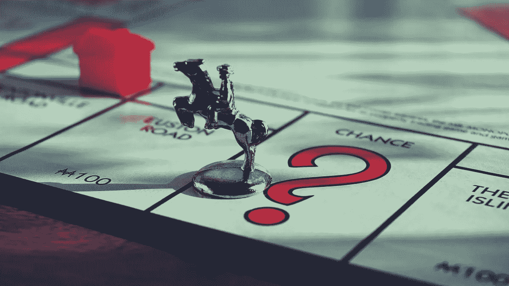
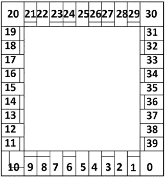
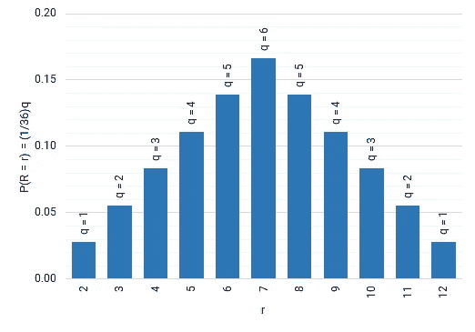
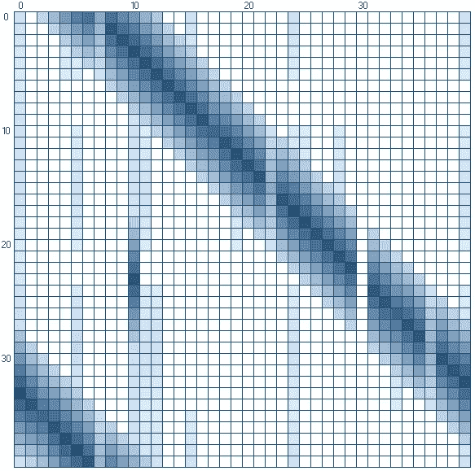
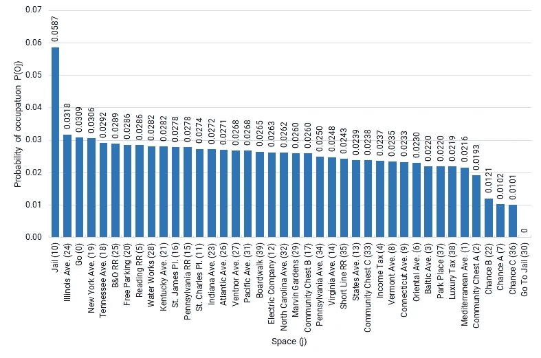
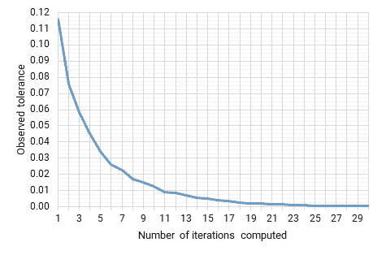
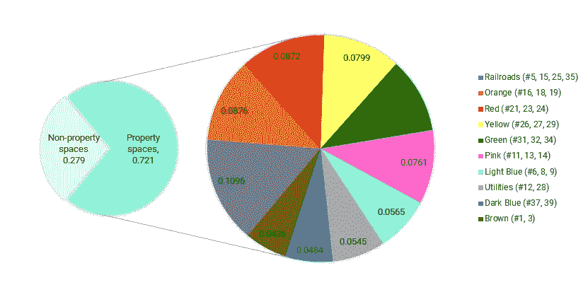

# 哦，你会去垄断的地方

> 原文：<https://towardsdatascience.com/oh-the-places-youll-go-in-monopoly-96abf70cdbd7?source=collection_archive---------33----------------------->

(照片由来自 [PxHere](https://pxhere.com/en/photo/1452219) 的[苏西·黑兹尔伍德](https://pxhere.com/en/photographer/1558091)拍摄)

## 用马尔可夫链探索稳态概率

*桌游*和*概率分析—* 有没有更具标志性的二人组？我认为我的想法是如此新颖，将这两种兴趣结合到一个小的研究中，但是一个简单的网络搜索“马尔科夫垄断”显示了这个主题已经被覆盖的广泛程度。然而，有各种不同的方法可以产生不同的结果，这就是美妙之处。这一个更倾向于理论而不是实践，但是也许有一天我会在兔子洞的更深处寻找一个更深的范围。

在上个世纪的大部分时间里,“大富翁”是世界上玩得最广泛的棋盘游戏之一，要成为一名成功的玩家，需要在谈判和资源管理方面深思熟虑的策略。虽然这种人类控制的技能至关重要，但由于游戏是由掷骰子和经常抽牌来控制的，因此对机会的依赖很大。大富翁因在游戏中激起残酷的竞争而臭名昭著，所以关于棋盘上最有可能着陆区域的知识使玩家能够做出更明智的决定，如何实现令人垂涎的最终目标*让他们的朋友和家人破产*。

在垄断游戏中，财务是玩家进步的主要指标，玩家做出的每一个决定都应该最终提高他们的相对净值。话虽如此，分析游戏的财务方面已经超出了本次调查的范围，它只关注玩家在棋盘上的移动。这里的目标是当掷骰数接近无穷大时，确定落在棋盘上 40 个空格中任何一个的概率。这些被称为*稳态概率*，将通过采用全概率法则和执行马尔可夫链来计算。

# 游戏概述和分析假设

今天有数百个从最初的垄断衍生出来的游戏，每个都有自己的主题和游戏变化。这项调查是参照游戏的原始版本[标准规则](https://www.hasbro.com/common/instruct/monins.pdf)进行的，目前由 Hasbro Inc .制作。

**图一。**棋盘的指定编号规则。

## 游戏板

大富翁棋盘是正方形的，它的边上排列着 40 个游戏位置，我们称之为*空格*。游戏从棋盘右下角的空格开始，称为*围棋*。大多数空间代表玩家可以选择购买的财产，尽管一些空间有其他功能，稍后讨论。如前所述，这项调查只涉及棋盘上标记的移动，因此不考虑游戏的货币含义的任何细节。上面的图 1 显示了游戏棋盘的轮廓，其空格用数字从#0 到#39 标记。该编号惯例将在整个调查中使用。

## 制图卡

三个空间标记为“公益金”(#2、#17、#33，从这里分别称为 CC1、CC2 和 CC3)，三个标记为“机会”(分别为#7、#22、#36 或 CH1、CH2 和 CH3)。落在任何一个上面都会提示玩家从棋盘中央相应的牌组中取出一张*抽牌*，并按照其指示进行货币交易，或者将代币移动到其他空间；如前所述，这项调查只涉及后者。官方规则要求将抽中的牌放回牌组底部(即抽中的牌的顺序在整个游戏中保持不变)，但在本次调查中，我们将把抽中的牌重新洗牌放回牌组，以确保所有的抽牌事件都是*随机*和*统计独立的。*

## 监狱

*监狱*空间(#10)有两个功能。如果一个玩家仅仅通过推进骰子显示的数字而入狱，他们被称为*拜访*。所有其他的进入监狱的方式都需要*逮捕*，比如被抽牌指示，或者进入*坐牢* (#30)空间(我们称之为 GTJ)。要被释放，玩家必须支付罚款，使用“免费出狱”卡，或者在他们的回合中掷出双倍，否则他们将被拘留。如前所述，我们忽略了游戏中关于滚动双打的方面，所以我们可以假设玩家在被捕后立即支付罚款并在下一轮离开；为了这次调查的目的，在监狱里作为一个访问者和被拘留者是没有区别的。

# 分析

使用上面建立的约定，我们可以开始计算占据每个板空间的稳态概率的过程。

## 掷骰子事件

设`m`和`n`表示掷出的两个骰子上显示的数值，其中`[m, n∈ 1,6]`。由于骰子是公平的，并且它们的结果在统计上是独立的，所以掷出`m`和`n`的每个组合的概率是`1/6 ∙ 1/6 = 1/36`。设`r`表示一次掷骰的总值，即`r = m + n`(因此`[r∈ 2,12]`)，而`q`表示产生`r`的`m`和`n`的组合数。比如`r = 12` 就是由`q = 1`组合产生的(其中`m = 6`和`n = 6`)，而 `r = 3`是由`q = 2`组合产生的(其中`m = 2`和`n = 1`，或者`m = 1`和`n = 2`)。`P(R)`的概率分布如下图 2 所示。

**图二。**从两个骰子中掷出总值 **r** 的概率。

## 活动和非活动空间

偶尔，在六个 CH 或 CC 格(#2、#7、#17、#22、#33、#36)中的任何一个格落地时抽一张牌，或者 GTJ (#30)来命令移动。这七个空格是棋盘上唯一的空格，如果落在上面，可能会将玩家作为同一掷骰子的一部分发送到其他空格，所以我们将它们称为*活动空格*。剩余的 33 个空格在任何涉及它们的掷骰中完全肯定是最终目的地，因此被称为*非活动* *空格*。

当登陆 CH3 (#36)的玩家抽取指示他们“后退 3 格”从而登陆 CC3 (#33)的牌时，出现了一个值得注意的现象。这在 CH3 内为可能由 CC3 指引的目的地创建了嵌套概率分布。我已经将这些合并到下面表 1 中呈现的总概率分布中，该表显示了被每个活动空间移动到空间`j`的个体概率。

**表 1。**被七个活动空间中的每一个移动空间 **j** 的概率。[如果您看到的是 502 错误而不是表格，几分钟后刷新页面通常可以解决问题]

注意*进监狱* (#30)有一个非常简单的分布:被转移到*监狱* (#10)的概率为 1，在其他地方的概率为 0。在这里着陆，你肯定会被送进监狱。

## 在任意两个空间之间移动的概率

让`M_{i,j}`表示令牌将从空间`i`移动到空间`j`的事件。为了计算其概率，必须考虑移动的每个潜在因素，包括除了被七个活动空间中的每一个移动之外，仅被骰子的滚动移动的概率。这八个事件总共是互斥的，并且集合起来是穷举的，如根据全概率定律的以下等式所示，其中`[a∈ CC1 CC2 CC3 CH1 CH2 CH3 GTJ]`。将这些活动空间描述符替换为它们相应的索引号，就得到`[a∈ 2 7 17 22 30 33 36]`。

[等式可能被夹在手机上。别担心——没那么重要:)]

这是一个好的开始，但它有一些漏洞；我们需要做一些调整来解释活动空间的行为。如果`j`是活动空间，则等式中的第一项必须从计算中排除，以避免重复计算概率。在这种情况下，`P(M)`成为七个概率的和，而不是八个。

否则，当`j`为非活动空间时，掷骰子事件*肯定是运动*的唯一发起者。数学上，这被描述为“从`i`移动到`j`，*的概率，假设*掷骰子是`j-i`，是 100%”，或者`P(M|R) = 1`。

考虑到这些因素后，我们能够更新初始公式，并根据作为活动空间的`j`的状态将其拆分成不同的情况。

[等式可能被夹在手机上。]

这个更新的等式完全描述了在棋盘上任意两个空格之间移动的概率，很容易求解，因为`P(R)`和`P(M|R)`的所有项都已经在前面确定了(如图 2 和表 1 所示)。

## 跃迁矩阵

对于任何给定的空间`i`，总共有 40 个不同的目的地`j`，理论上一次滚动可以在这里结束。由于`i`也可以取 40 个值，所以`i`和`j`总共有 1600 种不同的组合，因此`P(M)`的 1600 个值完全描述了在任意两个空间之间移动的概率。通过一点单元格引用的魔力，我在 Excel 电子表格中将它们枚举成一个 40x40 的数组。这被称为*转移矩阵*，因为它代表了跨越状态对的转移概率。然后，通过一点点条件格式的魔力，我将它们可视化为下面的图 3，其中`i`和`j`的每个组合的`P(M)`基于最低非零概率(0.001532)和最高概率(0.173611)之间的从浅到深的线性梯度进行着色；零概率的情况用白色表示。

**图三。**转换矩阵，说明在空格' **i** '(行)和' **j** '(列)之间移动的概率

注意，转移矩阵描述了着陆在`j`上的概率，假设滚转从`i`开始，不管它最初是如何到达`i`的。这就是为什么第 30 行(描述了一个从 GTJ 开始的转折)包含了所有的概率，即使我们知道一个玩家如果没有被立即送进监狱，他根本不可能真正到达那个地方。

## 稳态概率

让`T`表示上面计算的 40×40 转换矩阵。由于给定`i`的所有概率`P(M)`的总和为 1，因此`T`的每一行的总和为 1。

设`O_j`表示空间`j`被占据的事件，设`U_i`表示 1x40 *初始状态向量*，包含游戏开始时(即第一次掷骰子之前)占据棋盘上每个空间的概率。规则规定每个玩家在 *Go* 开始游戏，因此`U_i`的第一个条目(即索引#0)为 1，所有其他条目为 0。

当掷骰子的数量接近无穷大时，`O_j`的概率分布应该收敛到一个恒定的 40 个值的集合，该集合包括占据棋盘上每个空间的稳态概率。

所有这些都是通过应用马尔可夫链理论联系在一起的。我们首先将初始状态向量设置为*当前状态向量* `U_c`，然后将其乘以转移矩阵`T`以获得*更新后的当前状态向量* `U_cu`。这个过程一直持续到当前状态向量停止改变值，此时它被称为*稳态向量*。将当前状态向量乘以转移矩阵的每一次迭代模拟一次掷骰子事件。下面的 Python 脚本遵循这个过程，通过从我存储在`“Monopoly.xlsx”`中的转移矩阵中提取概率来计算稳态向量。

**剧本 1。**用于计算稳态向量的 Python 输入。“Monopoly.xlsx”的表 3 包含转换矩阵。

得到的向量就是`O_j`的稳态概率分布。根据该程序，总共进行了 284 次马尔可夫链迭代(即 284 次理论掷骰子)以使解收敛。

# 结果

让我们绘制新的稳态分布图，按照概率从高到低排序。

**图 4。**占据垄断板上任何空间的稳态概率分布

监狱(排名第 10)是最常见的着陆空间，稳态概率为 0.0587。这意味着当掷骰数接近无穷大时，或者更确切地说，当迭代次数达到 284 时，玩家有 5.87%的机会出现在那里。考虑到所有活跃空间送代币坐牢的综合影响，这么高的相对概率并不奇怪。

这种现象的结果是，*监狱*在某种程度上充当了代币的磁铁，从而增加了代币落在紧随其后的空间中的概率。我们从以下事实中看到了这一点:在监狱之后的 12 个最常去的地方中，有 7 个就在一次掷骰子之内。

概率最高的属性是 *Illinois Ave.* (#24)，它比 *Jail* 领先 14 个空格，因此相当于两次掷出 7，这当然是骰子显示的最有可能的值(根据图 2)。这一事实，除了 CH2 (#22)给出“前进到伊利诺伊大道”的指令的可能性之外，还使其具有甚至比 *Go* 更高的稳态概率，其受到 7 个活动空间中的 6 个的影响。

## 稳态概率的含义

因此，我们知道我们在董事会的最终位置，但这对我们改进战略有多大帮助呢？不提出一些新的问题很难说。首先，什么大富翁游戏持续 284 轮？！我是说，世界上有没有足够多的桌子可以在游戏中翻转到那么远？

由于一个典型的游戏只持续大约每个玩家 30 回合，所以在更少的迭代之后，知道我们的稳态分布有多可靠是很重要的。量 284 本身有些随意，因为它取决于程序用来确定浮点值之间相等的容差。让我们通过向脚本 1 中的 Python 代码添加一个函数来进一步探讨这个问题，该函数将一组迭代次数`i_max`作为参数。

**剧本 2。**添加到脚本 1 的 Python 函数，用于计算指定次数迭代后当前状态向量和稳态向量之间的最大差值列表。

不停地提到“稳态向量和当前状态向量中相应元素之间观察到的概率的最大差异”是相当拗口的，所以让单词 *tolerance* 在这里定义它。上面的函数计算 1 和`i_max = 30`之间每次迭代次数的公差。还是满嘴？那就尽情享受这个吧:

**图五。**计算的迭代次数和矢量公差之间的关系。

从图中可以清楚地看到，在大约 11 次滚动后，公差下降到 1%以下，并且在大约 25 次滚动后几乎完全检测不到。因此，我们可以确信，没有必要等待荒谬的大量掷骰来相信稳态概率，但也应该记住，它们直到游戏中的几次掷骰才真正开始成形。

## 利用群体优化财产所有权

虽然游戏的财务方面超出了本次调查的范围，但还是有必要看一看我们的稳态结果如何进行有意义的聚集。“大富翁”奖励在棋盘上预先定义的类别中拥有和开发 28 个地产空间的玩家，无论是通过*铁路*、*公用事业*还是*八个颜色组*中的房地产。下面显示了它们的组合概率。

**图 6。**群体占有财产的组合稳态概率。

从高层次来看，铁路是赢家。这是很直观的，因为他们的团体比任何其他团体都有更多的成员——董事会上 40 个铁路空间中的 4 个等于 10%,加上一些变化以说明活跃空间的影响。亚军是橙色/红色组，这也与我们之前观察到的距离*监狱*几个高概率骰子滚动的空间一致。

# 我们现在去哪里？

我们可以整天继续挑选这样的观察，但这些不是特别有用，因为它们忽略了并非所有的属性都是一样的。

[我们现在去哪里？](https://youtu.be/1w7OgIMMRc4?t=213)嗯，5.87%的人说坐牢……(照片由[伊万·蒙卡达](https://unsplash.com/@ivamoncada?utm_source=unsplash&utm_medium=referral&utm_content=creditCopyText)在 [Unsplash](https://unsplash.com/s/photos/axl?utm_source=unsplash&utm_medium=referral&utm_content=creditCopyText) 上拍摄)

如果不考虑房地产的成本和预期回报率，只有部分情况是由它们的稳态概率描绘的。毕竟，游戏的目标是货币目标，所以我们不能制定一个稳健的战略计划，除非我们将货币纳入我们的分析。

其他人也对这些财务影响进行了广泛的探索，虽然我现在对垄断有点厌倦，但我完全希望在未来的某个时候尝试一下。不过，就目前而言，我对迄今为止从调查中得到的主要收获感到满意:分析这个游戏比实际玩这个游戏有趣得多。