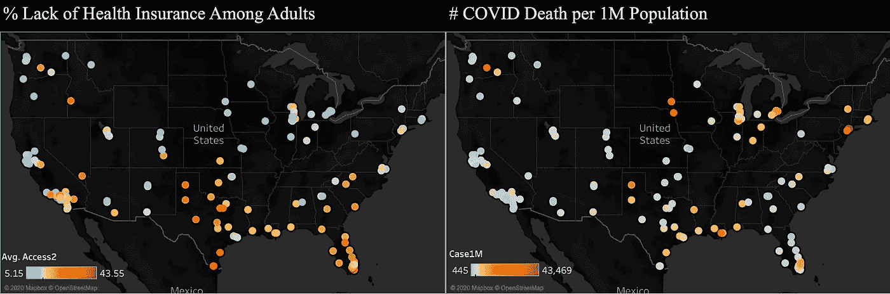
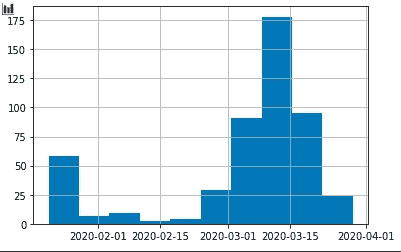
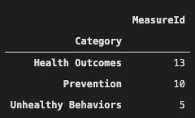
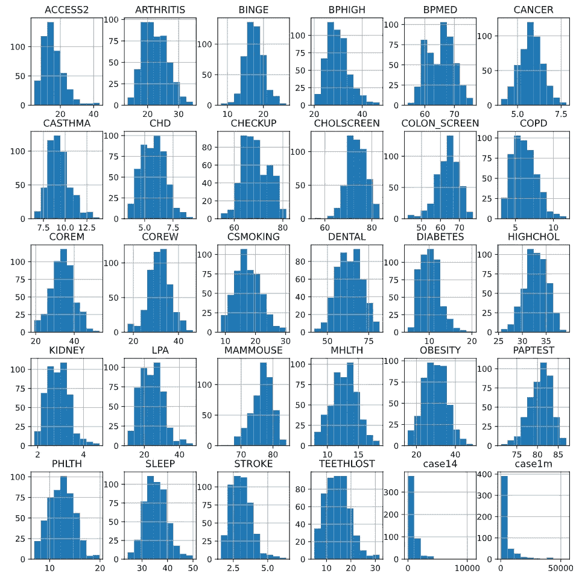
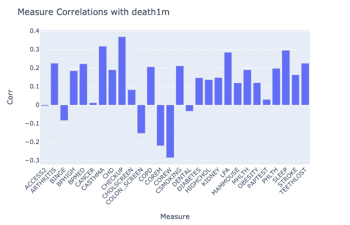
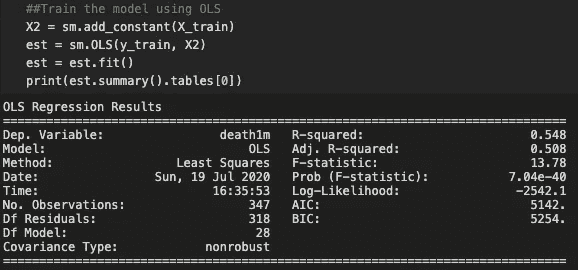
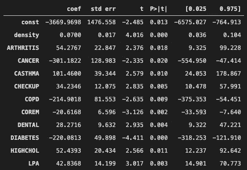
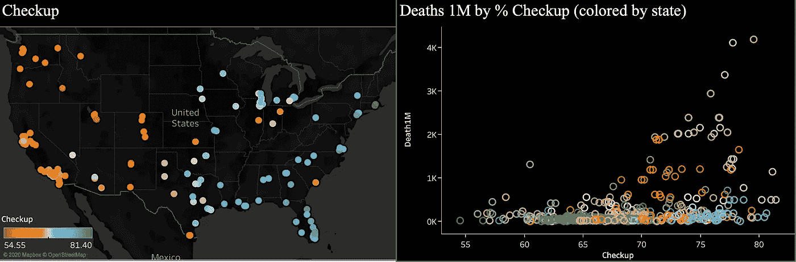
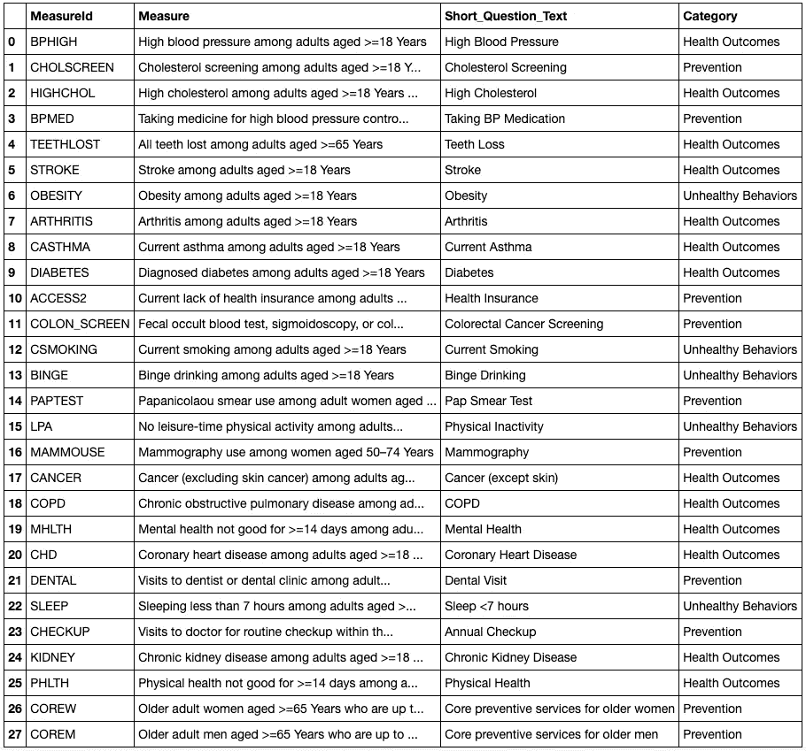

# 旧的健康行为正在塑造我们的“新常态”

> 原文：<https://towardsdatascience.com/old-health-behaviors-are-shaping-our-new-normal-fbe6b6c072dd?source=collection_archive---------58----------------------->

## 利用 CDC 普查数据了解人口健康史如何影响新冠肺炎传播

***编者按:*** [*走向数据科学*](http://towardsdatascience.com/) *是一份以数据科学和机器学习研究为主的中型刊物。我们不是健康专家或流行病学家，本文的观点不应被解释为专业建议。想了解更多关于疫情冠状病毒的信息，可以点击* [*这里*](https://www.who.int/emergencies/diseases/novel-coronavirus-2019/situation-reports) *。*

* COVID 死亡数据基于该市出现首例确诊病例后的第 100 天。

> 2020 年已经过去 200 天了，“新常态”仍然每天都在制造恐慌。曲线仍然没有变平，我们开始问自己:什么是新常态？更重要的是，我们能做些什么来帮助自己和他人度过难关？

在新冠肺炎有成百上千的谣言:仅仅是流感吗？年轻人对它免疫吗？是不是只对有潜在病症的人有危险？简答:**没有，没有，也没有**。然而，从公共卫生数据中，我们也许能够了解谁更容易受到病毒的攻击，以及社区应该做些什么来保护你和你所爱的人。

## 数据概述

为了了解人口健康历史如何影响新冠肺炎的传播，我们结合了来自 [data.world](https://data.world/covid-19-data-resource-hub/covid-19-case-counts/workspace/file?filename=COVID-19+Activity.csv) 、 *500 个城市:改善健康的本地数据、来自 [CDC](https://catalog.data.gov/dataset/500-cities-local-data-for-better-health-2018-release-7203f) 的 2018 年发布*以及来自 [simplemaps](https://simplemaps.com/data/us-cities) 的制图数据的每日 COVID 活动数据。

**COVID 措施:**由于首例确诊病例日期在 2 月至 4 月，我们使用该地区首例病例发生后第**100 天的数据，以减少病毒传播时间造成的差异。**

按城市分列的首例确诊 COVID 病例的日期

*   死亡人数 100 万——各县每 100 万人的死亡人数

**人口健康指标:**该数据包括与美国 500 个城市的不健康行为、健康结果和预防服务使用情况相关的 27 项慢性病指标。这些值以百分比显示。更多详情，请访问 [CDC 项目页面](https://catalog.data.gov/dataset/500-cities-local-data-for-better-health-2018-release-7203f)。

按类别衡量

**市/县制图:**市/县制图数据用于合并上述两个数据集。如果一个县包括多个城市，我们假设所有城市的 COVID 死亡率相同。

在合并和清理数据后，我们有 497 个城市的 COVID 指标、27 个健康指标和人口密度。

数据摘要—直方图

## 什么因素影响着一个地区的 COVID 死亡人数？

我们知道什么:

*   早期首次确诊新冠肺炎病例的地区更有可能一开始准备不足，遭受更严重的打击。
*   如果没有疫苗，从长远来看，确诊病例总数可能就不那么重要了。合理安排资源以降低死亡率对“新常态”至关重要。

假设 100 天对于大多数地区来说足以稳定局势并宣布安全条例，我们将从分析我们的健康措施和自第一例病例以来第 100 天死亡 1 百万人之间的系数开始。

**让 a̶w̶a̶y̶医生保持亲密**

这张图表可能会压倒我们所有的措施，但快速看一下下面 0 的部分:根据**皮尔逊系数**，与死亡病例负相关的 6 项措施中有 5 项是预防服务*。这可能表明**更好的健康意识**，以及**更好的医疗保健系统体验**。

**哪些群体更容易受到新冠肺炎病毒的攻击？**

为了更好地理解这个问题，我们使用 OLS 回归模型来调查在某一地区哪些措施对新冠肺炎的死亡率有更强的影响。

从拟合的模型中，我们在训练集上获得了一个 **0.508 的调整后 r 平方得分**，这意味着**我们在模型中使用的健康指标解释了一个地区**50.8%的 COVID 死亡率。如果我们使用这个模型来预测测试数据，r 平方得分是 **0.236** ，这是合理的，因为病毒造成的损害还受到许多其他因素的影响，例如采取了哪些安全法规，人们在社交距离方面做得如何，以及我们对病毒本身还不了解的其他 100 件事情。

现在来看看模型中具有统计显著性(p ≤ 0.05)的测量值:

在 27 项措施中，6 项健康状况、3 项预防服务和 1 项不健康行为对每百万人的 COVID 死亡率有显著影响。**关节炎、哮喘、高胆固醇和缺乏闲暇时间的体力活动**与 COVID 死亡病例有很强的正相关性。

**等等，看起来有些不对劲**

看看这个结果，它是否告诉我癌症和糖尿病降低了 COVID 死亡风险，而做牙科和常规检查使我们更容易受到伤害？

这些“奇怪的结果”背后有很多潜在的原因。例如，在我们的数据中，成年人的癌症发病率在 4%到 7%之间，这比大多数其他指标低得多。在这种情况下，即使在人群中患癌症和 COVID 死亡之间没有因果关系，如果某些地区碰巧有高癌症率和高 COVID 死亡，它也可能导致模型中的强正相关。

另一个例子是常规检查。如果我们绘制死亡率和常规检查，我们可以看到:

*   东海岸和西海岸的常规体检率差别很大
*   大多数既有高体检率又有高 COVID 死亡率的地区都来自少数几个州(马萨诸塞州、新泽西州。纽约)

每 100 万人中常规检查和 COVID 死亡的百分比

在美国 COVID 爆发的开始阶段，所有这些州都受到了严重打击，这可能是巧合吗？这么高的死亡人数会不会是医院在第一次增兵时压力过大的结果？根据我们有限的数据，很难得出进一步的结论。但随着病毒传播速度继续稳定，我们预计会有更清晰的前景。

## **结论**

1.  高关节炎、哮喘、高胆固醇和缺乏闲暇时间体育活动率与高新冠肺炎死亡率密切相关。
2.  而人口健康指标可以解释 50%的新冠肺炎死亡率。目前还不足以预测病毒的传播，因为有太多的不确定因素。
3.  从长远来看，卫生措施将更有价值，有助于社区采取行动保护更易受病毒感染的人。

你是如何适应“新常态”的？你有什么想法可以让这项研究更好吗？在下面留下评论，让我知道你的想法！所有数据和模型都可以在[项目 git repo](https://github.com/estella-zzz/data-science-projects/tree/master/Covid19_vs_Population_Health) 中找到。

## **资源:**

**Git Repo:**[https://github . com/Estella-zzz/data-science-projects/tree/master/covid 19 _ vs _ Population _ Health](https://github.com/estella-zzz/data-science-projects/tree/master/Covid19_vs_Population_Health)

把它形象化成画面:【https://public.tableau.com/profile/estella.zhang#! /viz home/covid 19 vspopulationhealth/CovidPopulationHealth

***所有健康措施列表:**

