# OLS 回归、高斯-马尔可夫、蓝色和理解数学

> 原文：<https://towardsdatascience.com/ols-linear-regression-gauss-markov-blue-and-understanding-the-math-453d7cc630a5?source=collection_archive---------2----------------------->

## 弄清楚 OLS 假设(它们可能不是你想的那样……)

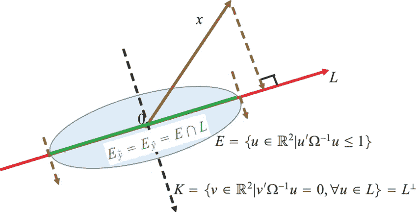

照片来自[researchgate.net](https://www.researchgate.net/figure/Geometry-of-the-Gauss-Markov-theorem_fig1_276081257)

# 背景和动机

对于任何从事统计学或机器学习研究的人来说，普通最小二乘(OLS)线性回归是第一个也是最“简单”的方法之一。虽然我已经注意到，在这个领域，在这个平台上，对 OLS 估计量有很多困惑。对有效的 OLS 估计“需要”什么样的假设，以及它与其他估计量的关系的困惑。我写这篇文章是为了从数学角度对 OLS、高斯-马尔科夫定理以及满足不同条件所需的假设进行深入的解释。请注意，在本文中，我是从频率主义范式(与贝叶斯范式相反)出发的，主要是为了方便起见。所以，让我们开始吧:

你可能在某个时候被问过以下问题:

我现在要做一个评论，有些人(起初)可能会觉得有争议或违背直觉。我的评论是:

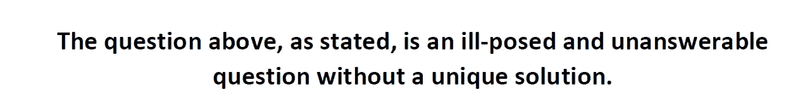

这个问题无法回答，主要有两个原因:

1.  术语“线性回归”没有很好的定义，并且没有指定唯一的目标函数。诚然，我通常让这个问题滑一点；当人们通俗地说“线性回归”时，我想他们指的是 OLS 线性回归。然而，为了在我们的语言中更加明确，我们应该明确提到 OLS 的名字。
2.  “OLS 线性回归需要什么假设”这个问题仍然是一个不适定且无法回答的问题。为什么？因为我们还没有明确说明我们要用 OLS 线性回归做什么，也没有明确说明我们对它有什么要求？例如:

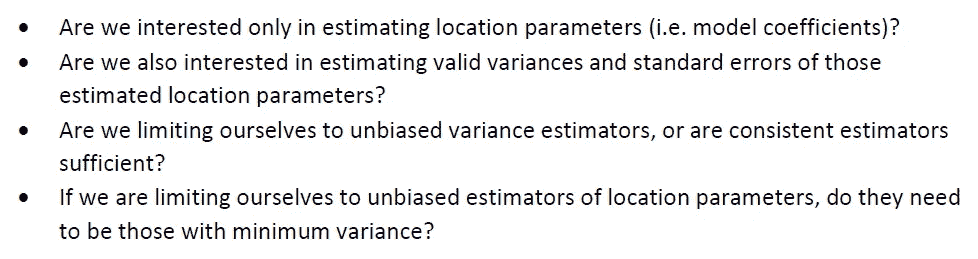

上述期望的属性都是不同的，并且需要不同的假设来满足它们。这些只是我们可能感兴趣的一些期望的属性和场景，当然还有更多。因此，当指定一个统计模型并问自己“需要什么假设”时，我们需要首先回答“我们要用这个统计模型做什么，我需要从中获得什么？”。在没有这种背景的情况下，质疑统计模型的“必要假设”将永远是一个根本不适定的问题。

我们将花大量时间深入研究 OLS 估计量，了解它在不同条件下的性质，以及它与其他估计量的关系。大纲如下:

1.  高斯-马尔可夫定理和“标准”假设
2.  恢复 OLS 估计量
3.  OLS 估计量在什么条件下是无偏的证明
4.  不同条件下 OLS 估计量的无偏和一致方差估计
5.  标准 GM 假设下的证明 OLS 估计量是蓝估计量
6.  与最大似然估计的联系
7.  总结和最后的想法

# 1.高斯-马尔可夫定理和“标准”假设

在开始恢复 OLS 估计量本身之前，让我们先谈谈高斯-马尔可夫定理。

高斯-马尔可夫(GM)定理指出，对于一个加性线性模型，在“标准”GM 假设误差不相关且同方差且期望值为零的情况下，普通最小二乘(OLS)估计器在线性无偏估计器类中具有最低的抽样方差。这似乎有点拗口。下面开始更具体地梳理一下上面的内容。

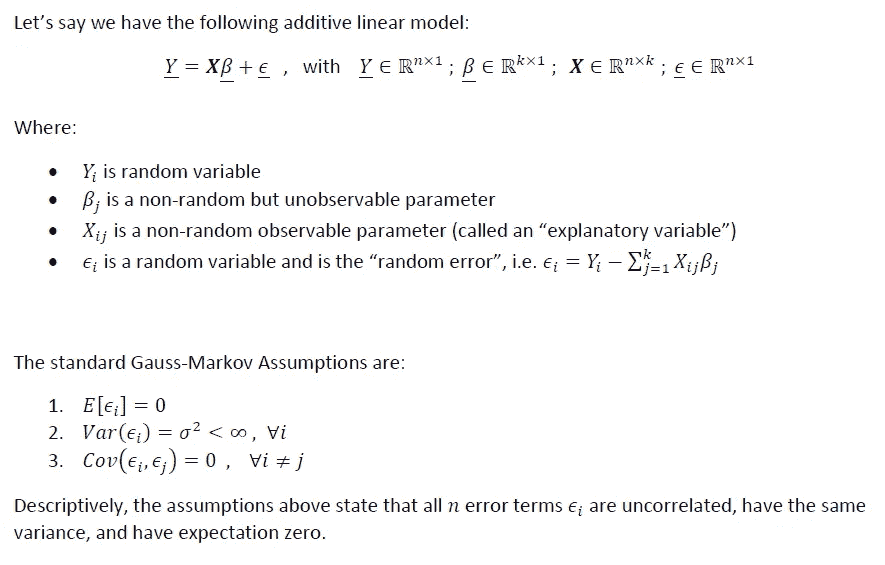

## 关于符号的快速迂回:

关于记谱法，我想做两点说明:

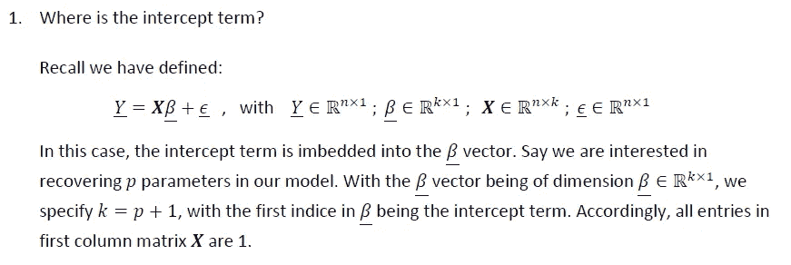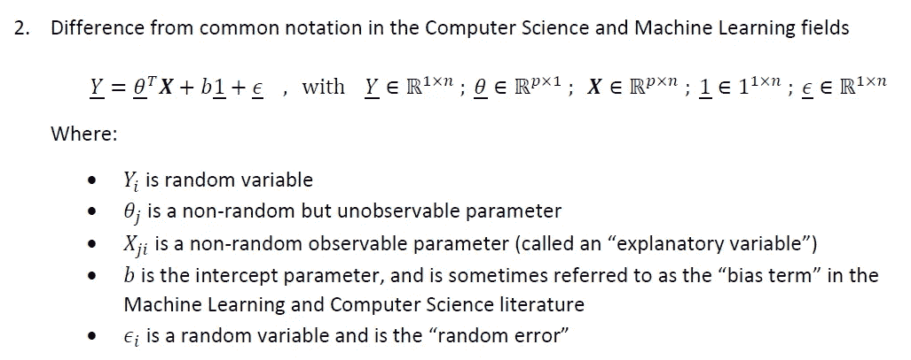

到目前为止，我们已经使用的符号，以及除了这一小段之外，将在本文的其余部分使用的符号，是来自概率论和数理统计领域的“经典”符号。然而，关于 OLS 估计的相同材料通常在计算机科学系的机器学习(ML)入门课程中讲授，并且通常使用上面注#2 中直接显示的替代符号来呈现。对这种替代符号的仔细研究揭示，与“经典”符号相比，矩阵和向量的几个维度被调换，截距项位于参数向量之外，并且参数向量和数据矩阵按照它们的内积的顺序被交换。

作为一名训练有素的统计学家，我并不特别喜欢这种替代符号，也从来没有完全理解它为什么存在？检查这种材料的历史，我不清楚为什么 ML 社区的计算机科学分支建立了一种“镜像的”和稍微向后的符号，这种符号已经在统计社区中存在了几十年了？在 ML 成为一个领域之前，已经有大量的工作(证明、定理等)用“经典”符号解决了；在人工智能和人工智能中非常有用和有价值的定理。转换所述证明和定理以匹配上面的替代符号是(我觉得)很多额外的工作和不必要的混乱。

总之，我的咆哮到此为止。我希望读者至少意识到这种替代符号，因为那些对人工智能和 ML 感兴趣的人肯定会遇到它。但是，在本文的其余部分，我们将使用“经典”符号。

# 2.恢复 OLS 估计量

既然我们已经讨论了高斯-马尔可夫定理，让我们恢复 OLS 估计量。

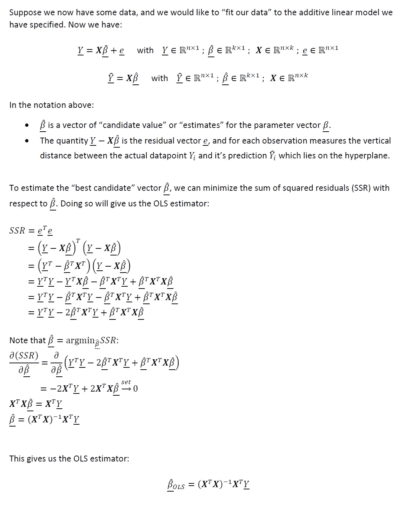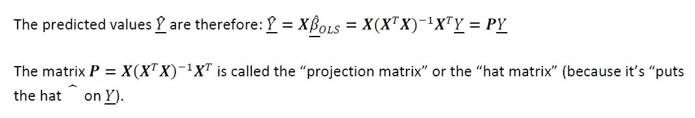

## 关于恢复 OLS 估计量的方法的说明:

请注意，我们解析地求解了上述 OLS 估计量，假设 OLS 估计量恰好具有封闭形式的解。然而，当将我们的模型拟合到实际数据时，我们可以使用迭代数值技术(如梯度下降或牛顿-拉夫森)来恢复我们指定的模型参数的经验估计值。如果我们正确地实现这些数值技术并使它们收敛，它们将恢复与我们上面求解的闭合形式解相同的参数估计。在未来的一篇文章中，我将深入概述拟合统计模型的迭代数值技术，敬请关注。

# 3.OLS 估计量在什么条件下是无偏的证明

接下来让我们证明在什么条件下 OLS 估计量是无偏估计量:

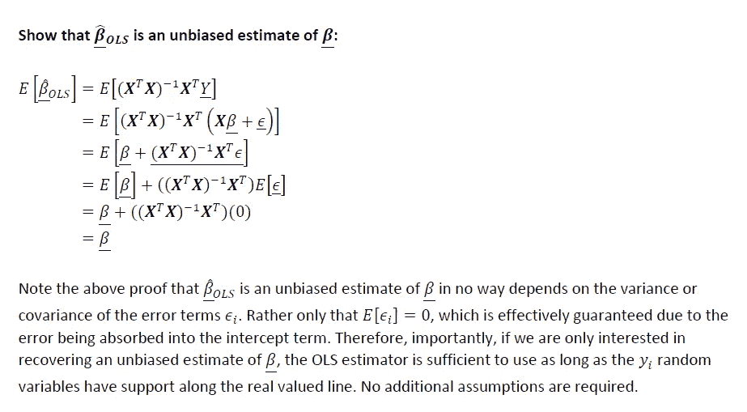

正如我们在上面看到的，OLS 估计量要成为无偏估计量，并不需要所有的“标准”高斯-马尔可夫假设。误差项不必是同方差的，也不必是不相关的。现在，在所有无偏线性估计量中，OLS 估计量会是方差最小的无偏估计量吗？不一定。这是我们在第 5 节讨论的内容。

# 4.不同条件下 OLS 估计量方差的无偏和一致估计

接下来，让我们在“标准”GM 假设下恢复 OLS 估计量的方差:

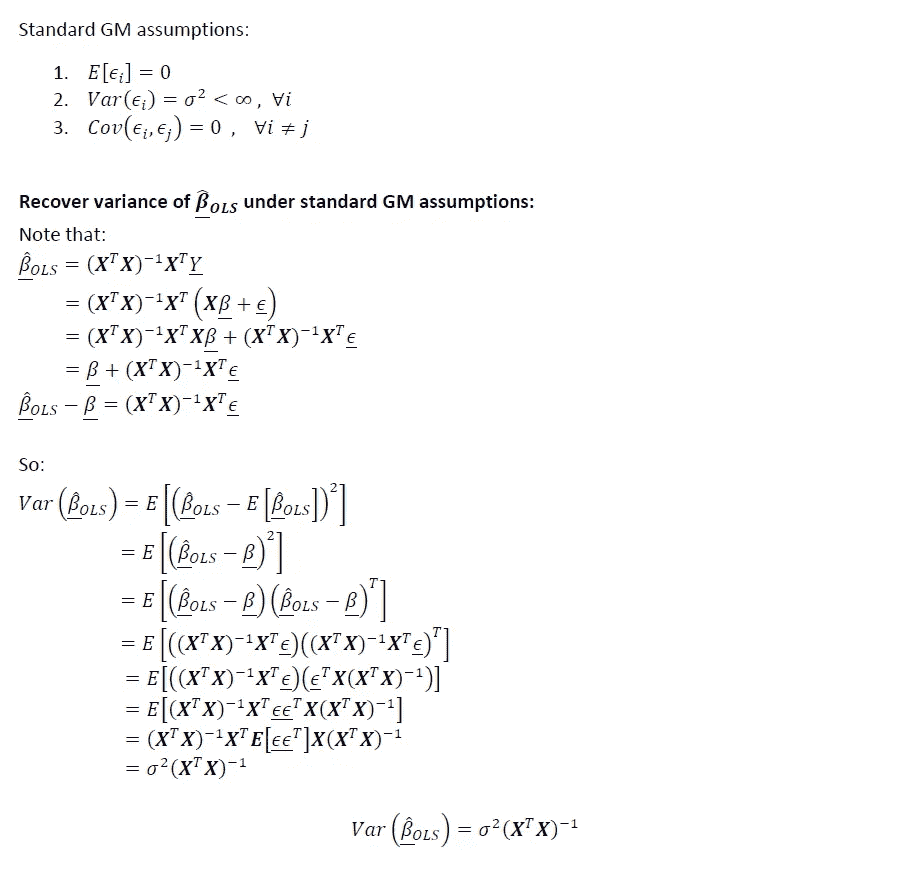

现在，如果不是所有标准的 GM 假设都成立呢？如果唯一成立的假设是所有误差项的期望值为零，那会怎样？

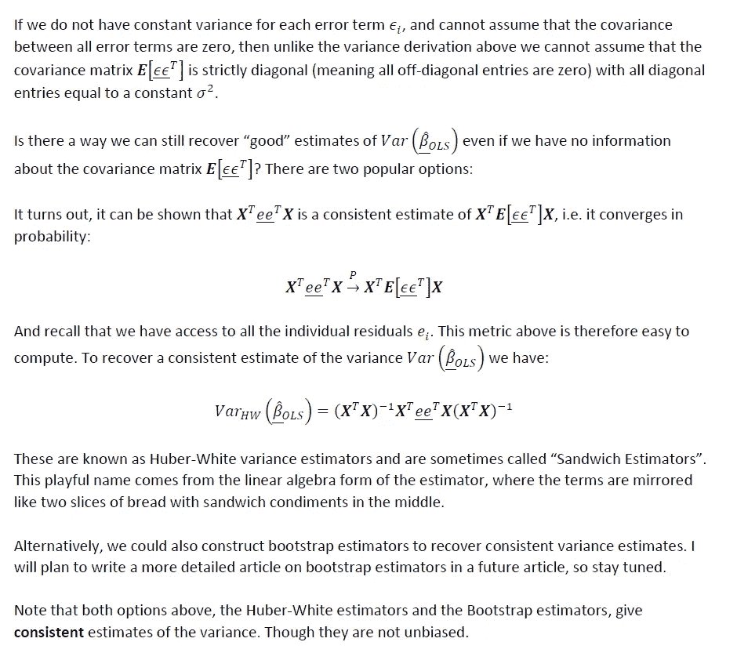

# 5.标准 GM 假设下的证明 OLS 估计量是蓝估计量

在 GM 假设下，OLS 估计量是 BLUE(最佳线性无偏估计量)。这意味着，如果标准的 GM 假设成立，在所有可能的线性无偏估计量中，OLS 估计量是方差最小的，因此是最有效的。让我们证明这一点:

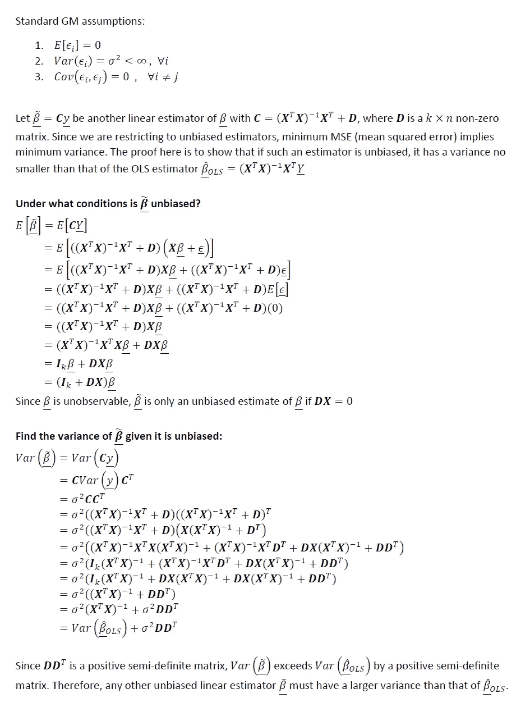

# 6.OLS 和最大似然估计之间的联系

在许多统计学入门课程中，经常(很少)教授 OLS 线性回归所需的硬性假设是误差项必须是正态分布且同分布和独立分布。然而，正如我们在本文的大部分内容中所看到的，我们设法为 OLS 推导出了相当多的理论和证明，而没有做出任何明确的正态性或同分布假设？那么这些额外的假设在哪里发挥作用呢？

这些正态性和独立同分布假设是 OLS 和最大似然估计(MLE)之间的“桥梁”。如果我们有一个线性加性模型，并且我们的 **n** 误差项都是正态分布的并且是同分布的，那么最大似然估计在数学上就简化为 OLS 估计。换句话说，这些是最大似然估计和 OLS 成为同一事物的唯一条件。我不打算在这里给出证明，但是在以后的文章中，我计划深入研究最大似然估计，所以请继续关注。

# 7.总结和最后的想法

作为一个快速总结，下表提供了我们在本文中讨论的关于可加线性估计的一些内容的概述(期望的性质，以及满足它们的必要要求)。

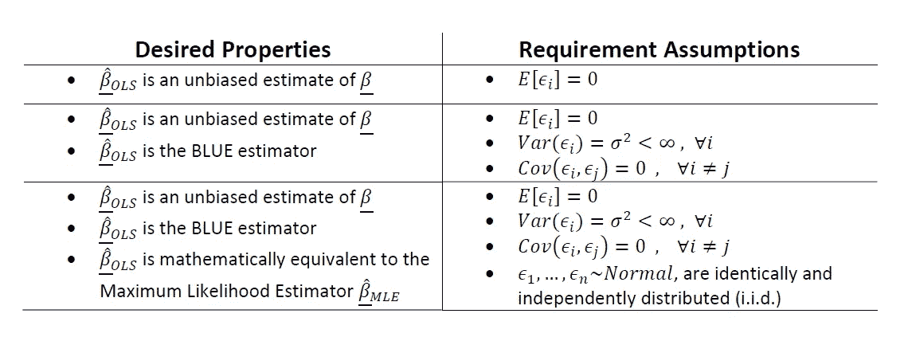

关于放松一些经典高斯-马尔科夫假设的方法和分析的入门，请参见我的文章**。**

**我希望这篇文章有助于澄清关于 OLS 线性回归的误解，并在更高的层次上，为为什么在进入“必需的假设”之前，考虑您正在处理的问题的背景以及您需要模型的什么类型的属性是至关重要的提供背景。总是问自己“所需假设 ***做什么*？”**。如果你不能清楚地回答“ ***做什么*** ”部分的问题，那么你就没有准备好列出任何所需的假设。**

**希望以上有见地。正如我在以前的一些文章中提到的，我认为没有足够的人花时间去做这些类型的练习。对我来说，这种基于理论的洞察力让我在实践中更容易使用方法。我个人的目标是鼓励该领域的其他人采取类似的方法。我打算在未来写一些基础作品，所以请随时在 [**LinkedIn**](http://www.linkedin.com/in/andrew-rothman-49739630) 上与我联系，并在 [**上关注我在**](https://anr248.medium.com/) 上的更新！**