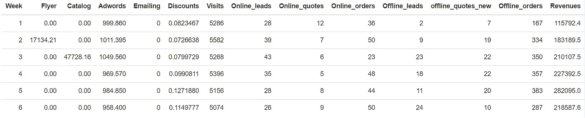
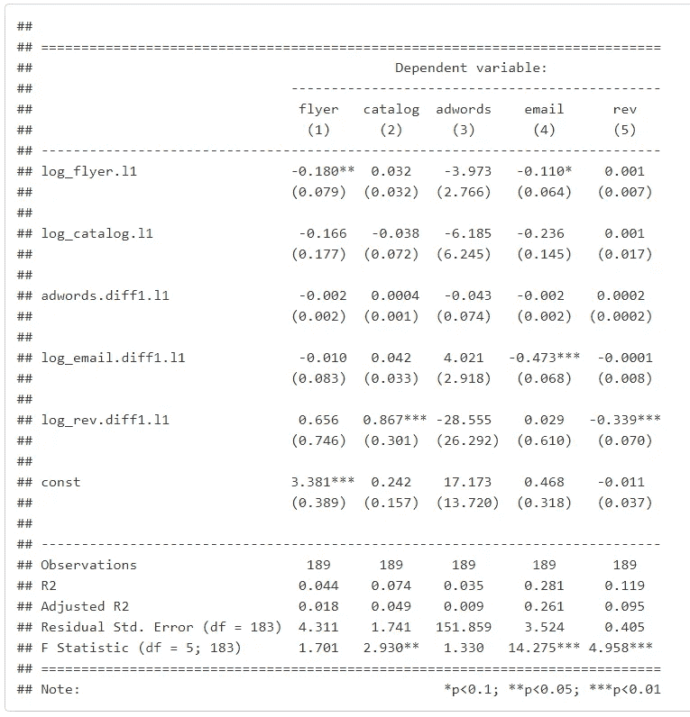
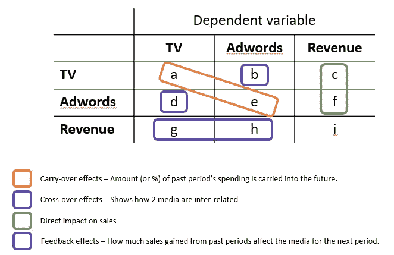
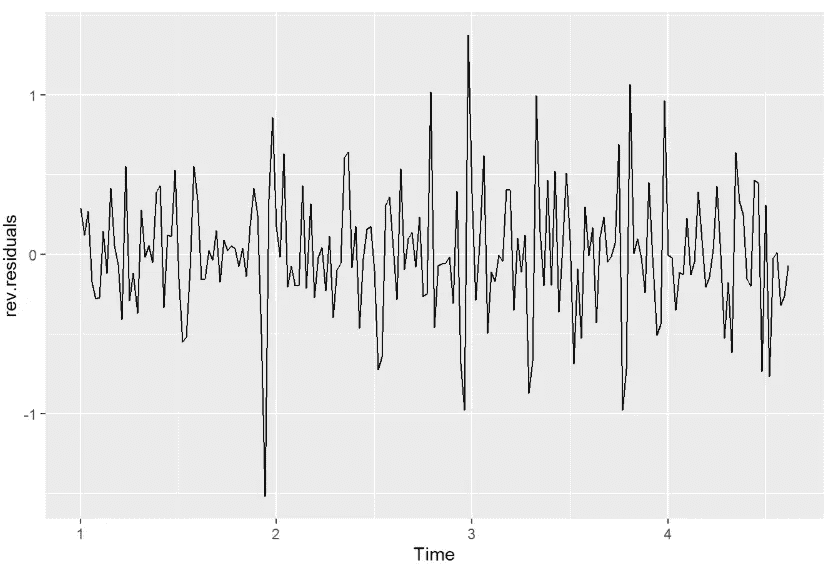

# 全渠道营销:我们如何评估其影响？

> 原文：<https://towardsdatascience.com/omni-channel-marketing-how-can-we-evaluate-its-impact-922949458682?source=collection_archive---------57----------------------->


亚伦·塞巴斯蒂安在 [Unsplash](https://unsplash.com?utm_source=medium&utm_medium=referral) 上拍摄的照片

## 应用向量自回归(VAR)模型，利用 R

营销不像过去那么简单了。在这个数字时代，我们接触到许多不同的渠道和媒体平台，典型的客户旅程不再遵循简单的线性路线。对于营销人员来说，这是一个问题。我们如何知道哪种营销媒介是销售的结果？每种营销媒介的效果如何？这些营销媒体是如何相互作用的？

我们可以通过使用向量自回归(VAR)模型来回答上述问题，该模型可以捕捉时间序列中不同营销支出之间的不同相互依赖关系。下面可以看到一个例子。

使用的数据集是一个时间序列，包含 14 个属性和 191 周的数据，涵盖营销媒体的每周营销支出、根据在线和离线营销漏斗阶段的指标以及收入。但是，出于此目的，我们将只使用营销支出属性和收入。

要使用时间序列和 VAR 模型，我们需要安装下面的库。

```
library(tseries)
library(vars)
```

然后我们读取数据。

```
*# View data*
data <- read_excel("dataset_var.xls")
kable(head(data))%>%
  kable_styling()
```



作者图片

首先，我们将数据设置为时间序列对象。因为有 191 周，这将超过 3.5 年的数据。因此，我将频率设置为 52，代表一年中的 52 周。

```
*# Time series for all attributes*

flyer <- ts(data[,2], frequency=52)
catalog <- ts(data[,3], frequency=52)
adwords <- ts(data[,4], frequency=52)
email <- ts(data[,5], frequency=52)
rev <- ts(data[,14], frequency=52)
```

在我们可以估计和运行风险值模型之前，重要的是序列是平稳的。这里不包括时间序列的准备和检验，因此下面假设该序列没有季节性和趋势性。

# 构建风险值模型

我们用传单、目录、广告词、电子邮件和收入作为变量来估计模型。在此之前，传单、目录、电子邮件和收入系列已经进行了日志转换，而 adwords、电子邮件和收入系列则首次实现了差异化。

现在我们的时间序列是平稳的，我们从所有的序列中构建一个数据框架，并估计 VAR 模型。

```
*# Build a data frame*
data.ts <- window(cbind( log_flyer, log_catalog, adwords.diff1, log_email.diff1, log_rev.diff1))# Remove rows with nulls
data.ts1 <- na.omit(data.ts)# Estimate VAR model
var.m1 <- VAR(data.ts1, ic="AIC", lag.max=1, type="const")

df <- var.m1$varresult# Display using stargazer
stargazer(df$log_flyer, df$log_catalog, df$adwords.diff1,
          df$log_email.diff1, df$log_rev.diff1,
          column.labels = c('flyer', 'catalog', 'adwords', 'email',
                            'rev'),
          type = "text", 
          dep.var.labels.include = FALSE)
```



作者图片

# 解释结果

下面的示例说明了读取结果的简化方法:



作者图片

示例:

**结转效应**:电视过去一段时间的支出有 1%被结转到未来。

交叉效应:广告词每增加 1%，电视消费效应增加 d%

**对销售的直接影响**:电视支出每增加 1%，收入就会增加 c%

**反馈效应**:过去销售增长 1%会对下一期电视产生 g%的影响。

请注意，这些是弹性，所以如果变量是对数转换，他们解释为百分比(%)。否则，其值保持原样。另一方面，如果变量已经差分，那么它们可以用增长来解释。

现在回到我们的结果表。

**结转效应** :
一般来说，所有过去的营销支出都不会结转到未来。事实上，所有这些都产生了负面影响，其中传单增长了 0.18%，目录增长了 0.038%，广告词增长了 0.043%，电子邮件增长了 0.473%。

**交叉效应** :
传单对目录有积极的交叉效应，传单支出每增加 1%，目录的支出效应就会增加 0.032%。但是，flyer 对 Adwords 和 email 没有正面作用。传单支出每增加 1%，Adwords 支出效应就会减少 3.97 美元，电子邮件增长支出效应就会减少 0.11%。

另一方面，目录对传单、Adwords 和电子邮件没有正面的支出效应，目录支出每增加 1%，传单的支出效应就会降低 0.166%，Adwords 的支出效应会降低 6.185 美元，电子邮件的增长支出效应会降低 0.236%。

Adwords 仅对目录有正面影响，但几乎可以忽略不计。在 Adwords 上增加 1 美元的支出，会对目录产生 0.04%的正支出效应。对传单的支出效应和对电子邮件增长的支出效应受到负面影响，但也可以忽略不计，均为-0.2%。

电子邮件增长的支出效应对目录和 adwords 有积极的支出效应，但对传单有消极的支出效应。发出的电子邮件数量增加 1%会使传单支出的有效性降低 0.01%，目录支出的有效性增加 0.042%。然而，对于 Adwords 而言，电子邮件增长支出每增加 1%，Adwords 支出的有效性就会增加 0.04 美元。

**反馈效应** :
除了 Adwords 之外，营收通常对所有业务都有正反馈效应。过去销售增长 1%会对下一期 Adwords 产生 0.29 美元的负面影响，而对传单、目录和电子邮件增长产生 0.656%、0.867%和 0.029%的正面影响。

**对销售的直接影响** :
传单、目录和广告词对销售有积极影响。传单支出增加 10%会影响销售增长 0.01%，目录支出增加 10%会增加销售增长 0.01%，Adwords 支出增加 1 美元会增加销售增长 0.02%。然而，发送的电子邮件数量增长 10%会使收入增长降低 0.001%。

然而，值得注意的是，这些系数中没有多少是重要的。根据该表，只有传单和电子邮件的遗留效应、传单对电子邮件的交叉效应、目录的反馈效应和购买强化效应(-0.339)具有统计显著性。表中的星号(*)表示重要性。

# 剩余检查

最后，我们应该检查模型的残差，以确保它没有被错误指定。这可以通过确保平均残差为零且没有异常值来实现。

```
*# Check mean residuals of Sales*
rev.residuals <- data.frame(residuals(var.m1))$log_rev.diff1
rev.residuals <- ts(rev.residuals, frequency = 52, start = c(1, 1))
round(mean(rev.residuals),52)
```

给定的值是-2.272712e-17，实际上是 0。我们也可以画出残差图来直观地检查它。残差应围绕值为 0 的 y 轴均匀“反弹”。

```
*# check residual plots*
autoplot(rev.residuals)
```



作者图片

从残差检验中，我们看到该模型是合适的，因此可以接受。

# 营销人员的关键点

当计划营销组合策略时，从估计的风险值模型中解释的影响可以是有用的信息来源。媒体之间以及与销售之间的互动现在可以很容易地被隔离。

通过对销售效果的直接影响，营销人员可以将销售归因于每种媒体，同时消除每种媒体可能从其他媒体建立的影响。

另一方面，交叉效应可以让营销人员一瞥哪种媒体互相影响，哪种媒体不影响，哪种媒体互相蚕食。

因此，下次营销主管、首席财务官甚至首席执行官询问上个季度的活动对正常销售之外的销售额有多大贡献时，请尝试使用 VAR 模型！

**亚兹林 YR**

创新|战略|分析|设计思维

在 [LinkedIn](http://www.linkedin.com/in/yazlinyangrazlan) 上关注我