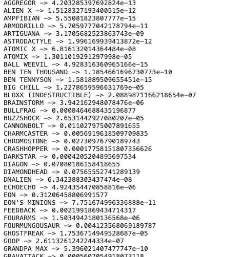

# OmniNet:如果本的 Omnitrix 内置了更好的机器学习/人工智能系统？

> 原文：<https://towardsdatascience.com/omninet-if-bens-omnitrix-had-a-better-machine-learning-artificial-intelligence-inbuilt-70dcb321be79?source=collection_archive---------45----------------------->

## OmniNet:如果本的 Omnitrix 内置了更好的机器学习/人工智能系统？

我是 Ben 10 系列的忠实粉丝，我一直想知道为什么 Ben 的 Omnitrix 没有变成 Ben 选择成为的外星人[(这很大程度上是因为手表中已经内置了一个弱人工智能系统)](https://5yl.fandom.com/wiki/Omnimatrix_Devices)。为了帮助本，我们将设计**“OmniNet”，一种能够根据给定情况预测合适外星人的神经网络。**

正如节目中所讨论的，Omnitrix 基本上是一个连接到行星 **Primus** 的服务器，用来控制大约 10000 个外星人的 DNA！如果我是这款设备的工程师，我肯定会给手表增加一个或多个功能。


普里默斯位于太空深处。([https://unsplash.com/photos/E0AHdsENmDg](https://unsplash.com/photos/E0AHdsENmDg))

# 为什么和如何？

Why:Omnitrix/ulti matrix 是一个特例，因为它不知道周围的环境。根据 Azmuth 和其他人的说法，Omnitrix 有时会给出错误的转换，因为它自己的人工智能系统会得到错误的分类。让我们想象一下，造物主阿兹慕雇佣我们来建造一个新的人工智能/ML 系统。

H ow:为了建立我们的系统，我们需要某种形式的初始数据，感谢我们的地球同胞，我们有了 [Kaggle](https://www.kaggle.com/shiddharthsaran/ben-10-dataset) 的 Ben 10 数据集。

# 要求

对于任何项目，我们都需要一个良好的需求列表，对于这个项目，我们需要:

*   Python 3.8:编程语言
*   Scikit-Learn:通用机器学习
*   熊猫:用于数据分析
*   Numpy:用于数值计算
*   张量流:构建我们的深层神经网络
*   Matplotlib:绘制我们的进度

# 数据预处理

T21 的数据集由 3 列 97 行组成。这些列是不言自明的，在分析数据时，我们立即将所有的分类表示转化为数字表示。

*   **角色**:本 10 系列角色
*   **异能等级**:角色的异能等级
*   **本 10 系列**:与角色相关的系列


资料组

```
lr = LabelEncoder()def convert_id_to_category(index, mapping=None):
    """
        Convert the id into the label
        Arguments:
            mappping: The Mapping built by the LabelEncoder
            id: id corresponding to the label
        Returns:
            str: the label
    """
    return mapping.get(index, False)def convert_to_mapping(lr:LabelEncoder):
    """
        Extract the mapping from the LabelEncoder

        Returns:
            Dict: key/value for the label encoded
    """
    mapping = dict(list(zip(lr.transform(lr.classes_),lr.classes_)))
    return mappingdef get_power_level_mapping(df=None):
    mapping = {}
    for i in range(0, len(df)):
        mapping[df.loc[i].Character] = df.loc[i].Power_Level
    vtok = {}
    for i,j in enumerate(mapping):
        vtok[mapping[j]] = j
    return mapping, vtok# Ben_10_Series
df['Ben_10_Series'] = lr.fit_transform(df['Ben_10_Series'])
mapping_ben_10_series = convert_to_mapping(lr)
df['Character'] = lr.fit_transform(df['Character'])
mapping_character = convert_to_mapping(lr)print ("Length [Ben_10_Series]: {}".format(len(mapping_ben_10_series)))
print ("Length [Character]: {}".format(len(mapping_character)))def remove_string_powerlevel(df=None):
    """
        Replaces the string format of power level into an integer. (Manually checked the data)

        Arguments:
            df: Pandas DataFrame
        Returns
            None
    """

    # lowe bound
    df.loc[28, "Power_Level"] = "265"
    df.loc[93, "Power_Level"] = "12.5"
    df.loc[51, "Power_Level"] = "195"
    df.loc[52, "Power_Level"] = "160"
    df.loc[62, "Power_Level"] = "140"
    df.loc[67, "Power_Level"] = "20"
    df['Power_Level'] = df['Power_Level'].str.replace(",","")

    # converting power_level to float
    df['Power_Level'] = df['Power_Level'].astype(float)
    df['Character'] = df['Character'].astype(int)remove_string_powerlevel(df)
```

在中，除了更改分类表示，我们还清理了数据(列:Power_Level ),因为它包含一些文本级别。该列还包含逗号，因此我们也对其进行了清理。

# 特征转换

在上检查进一步的数据，我们可以清楚地看到一些异常值。(原子 X 和外星人 X)。如果你熟悉本 10，你应该知道这些外星人非常强大！

> 除了要素转换，我们将创建一个能够处理多类分类问题的**新数据集。**
> 
> 为了查看我们可以在哪里应用特征变换，我们将首先检查任何异常值。

下面给出的散点图展示了这两个 Power_Level 的偏差程度。


极端值

我们可以清楚地看到有两个异常值，检查异常值的明显方法是分析它们的 [zscores](https://en.wikipedia.org/wiki/Standard_score) 并设置一个阈值。

```
values = df['Power_Level'].values
zscore(values, 0) > zscore(values, 0).mean() # All the True values are outliers.values[96] = np.mean(values)
values[36] = np.mean(values)
# changing the outliers to mean value
# handpicking abnormal values and setting it a justified value.
```

*   如果我们将**阈值设置为 zscore 值的平均值，我们可以清楚地看到所有为真的异常值。**
*   现在我们不想删除这些值，因为**每个字符都很重要**。

> 但是，由于我们知道数据集，我们不想删除任何外国人，我们将手动改变离群指数的平均功率水平。


我们修改过的 Power_Level 列

# 新数据集的创建

制定一个新的问题不是一件容易的事情，但是因为我们是 Ben 10 系列的狂热粉丝，我们可以很容易地制定一个新的数据集。

> 由于缺乏信息(特征)，我们将首先根据一个因子拆分修改后的 Power_Level。为了任务的简洁，我们将把整数分成另外三列。

## **1。沙之力**:陆地上人物的力量

## **2。空气力量**:角色在空气中的力量

## **3。水力**:水中人物的力量

```
def split_powerlevel(df, factor=3):
    """
        Split the power level by the specified factor
        Arguments:
            df:DataFrame
            factor: int
        Returns:
            data: dict[str] = list[str]

    """
    data = {'air_power1':[], 'sand_power1':[], 'water_power1':[], "air_power2":[], "sand_power2":[], "water_power2":[]}
    for i in df['power_level1']:
        t = i/factor # float
        data['air_power1'].append(t)
        data['sand_power1'].append(t)
        data['water_power1'].append(t)
    for i in df['power_level2']:
        t = i/factor # float
        data['air_power2'].append(t)
        data['sand_power2'].append(t)
        data['water_power2'].append(t)
    return datadef return_individual_data(th = .5, winner='c1'):
        """
            Returns a row in our dataset.

            Arguments:
                th: threshold
                winner: The winning character

            Returns:
                (str,str, float, float, str)
        """
        characters = np.array(list(mapping_character.keys()))
        mapping_ch_to_pl, mapping_pl_to_ch = get_power_level_mapping(df)
        random_character1 = np.random.choice(characters)
        random_character2 = np.random.choice(characters)
        p1 = mapping_ch_to_pl[random_character1]
        p2 = mapping_ch_to_pl[random_character2]
        power_diff = np.abs(mapping_ch_to_pl[random_character1] - mapping_ch_to_pl[random_character2])
        if winner == 'c1':
            return random_character1, random_character2,p1, p2, random_character1
        else:
            return random_character1, random_character2,p1, p2, random_character2
```

对于每个字符，我们在最终的数据帧中增加了 3 列

> F 对于我们数据集中的每一行，我们随机选择角色，并以 50:50 的比例将其分配给集合**(角色 1 赢得 50 %的决斗，角色 2 赢得 50%的决斗)**。


调用 return_individual_data

有了这条信息，功率水平除以因子 3 以创建一组 10 个特征。

为了总结所有内容，我们将每一行合并并调用它 n 次，每次将功率级分成 3 列。

```
def create_data(df, split_size=0.2, size=1000):
    """
        Create Data for Multiclass classification problem
        Arguments:
            df: Pandas DataFrame
        Returns:
            data: Pandas DataFrame
    """
    def return_individual_data(th = .5, winner='c1'):
        """
            Returns a row in our dataset.

            Arguments:
                th: threshold
                winner: The winning character

            Returns:
                (str,str, float, float, str)
        """
        characters = np.array(list(mapping_character.keys()))
        mapping_ch_to_pl, mapping_pl_to_ch = get_power_level_mapping(df)
        random_character1 = np.random.choice(characters)
        random_character2 = np.random.choice(characters)
        p1 = mapping_ch_to_pl[random_character1]
        p2 = mapping_ch_to_pl[random_character2]
        power_diff = np.abs(mapping_ch_to_pl[random_character1] - mapping_ch_to_pl[random_character2])
        if winner == 'c1':
            return random_character1, random_character2,p1, p2, random_character1
        else:
            return random_character1, random_character2,p1, p2, random_character2# win is by character1 (by default)
    data = {'character1':[], 'character2':[], 'power_level1':[],'power_level1':[],'power_level2':[], 'win':[]}

    # first half
    for i in range(0, size//2):
        c1, c2, p1, p2, c1 = return_individual_data(winner='c1')
        data['character1'].append(c1)
        data['character2'].append(c2)
        data['power_level1'].append(p1)
        data['power_level2'].append(p2)
        data['win'].append(c1)

    # second half
    for i in range(0, size//2):
        c1, c2, p1, p2, c2 = return_individual_data(winner='c2')
        data['character1'].append(c1)
        data['character2'].append(c2)
        data['power_level1'].append(p1)
        data['power_level2'].append(p2)
        data['win'].append(c2)

    data_df = pd.DataFrame(data=data, columns=['character1', 'character2', 'power_level1', 'power_level2', 'win'])
    data_df = shuffle(data_df)

    toadd = split_powerlevel(data_df)
    for k,v in enumerate(toadd):
        data_df[v] = toadd[v]

    features, labels = data_df.drop(columns=['win']).values, data_df.win.values

    x_train, x_test, y_train, y_test = train_test_split(features, labels, test_size=0.2, random_state=42)
    x_train, x_val, y_train, y_val = train_test_split(x_train, y_train, test_size=0.25, random_state=42)

    print ("Generated data of size:{}".format(size))return features, labels,x_train, x_test, y_train, y_test,x_val, y_val, data_df
```

> 我们计算获胜的次数来检查班级的不平衡。

```
def count_wins(df=None):
    """ Count number of character wins. # to check for class imbalance
        Returns: 
            c1_wins: Character 1 wins
            c2_wins: Character 2 wins
    """
    for i in range(0, len(df)):
        if df.loc[i].character1 == df.loc[i].win:
            c1_wins.append(i)
        else:
            c2_wins.append(i)
    print("Character 1 wins: {}, Character 2 wins: {}".format(len(c1_wins), len(c2_wins)))       

features, labels,x_train, x_test, y_train, y_test,x_val, y_val,data = create_data(df, size=5000)
```


我们的最终数据集(其中大小= 5000)

# 模型创建

O ur 神经网络是一个简单的前馈网络，具有一组隐藏层，随后是一组丢弃层(减少过拟合的最佳方式，因为该数据集很容易过拟合)，最后是一个具有 90(唯一字符总数)个单元的 softmax 层。


我们的模型架构

> 我们的数据已经在 create_data()方法中被分割成 x_train、x_test、y_train、y_test、x_val、y_val。

我们用 Adam 优化器训练模型(学习率= 3e-4，损失= 300 个历元的交叉熵)。

> 300 是一个实验数字，因为在 300 个时期之后，模型倾向于过度拟合。

```
model.compile(optimizer=tf.keras.optimizers.Adam(learning_rate=3e-4), loss=tf.keras.losses.sparse_categorical_crossentropy, metrics=['acc'])history = model.fit(x_train, y_train, epochs=300, validation_data=(x_val, y_val), callbacks=[tensorboard])
```

# 结果和预测

答经过大约 300 个历元的训练，我们能够在验证数据上达到 **2.6692** 的损失和 **2.6995** 的验证损失以及 **26%** 的准确率。这个结果是用 **5000 行假生成的数据得到的。**

> 低精度模型是比过度拟合模型更好的选择。

如果我们增加我们的数据，然后训练我们的模型，我们肯定会得到更好的结果。


我们模型的损失和价值损失

为了测试我们的模型，我们进行了一次评估，得到了 26%的准确率。为了清楚起见，我们开发了一个测试函数，为 90 个字符中的每一个生成概率。

```
def test():
    for i, j in enumerate(model.predict(x_test[0].reshape(1,-1))[0]):
        print ("{} -> {}".format(mapping_character[i], j))test()
```



预言

# 结论

总而言之，我们开发了一个网络，能够预测 90 个角色中每个角色的获胜概率。我们对来自 Kaggle 的初始数据集进行预处理，得到一个新的能够进行多类分类的数据集。我们的模型没有达到很高的精度，但也没有过度拟合。**在尝试了书中的每一种技术来应对过度拟合后，我们得出了生成更多数据来训练我们的模型的结论。**

最后，我们能够开发 OmniNet，这使得 Azmuth，创造者，授予我们开发 Omnitrix 软件的终身合同。

*Github 链接:*[*https://github.com/aaditkapoor/OmniNet*](https://github.com/aaditkapoor/OmniNet)