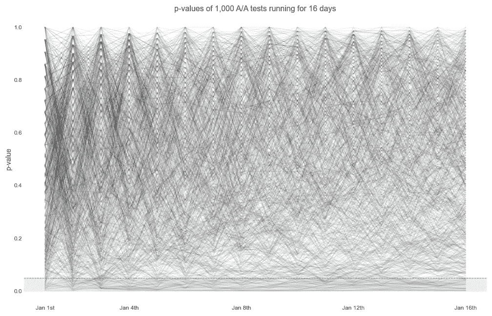
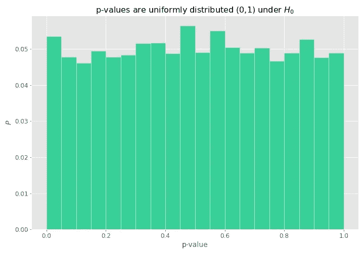
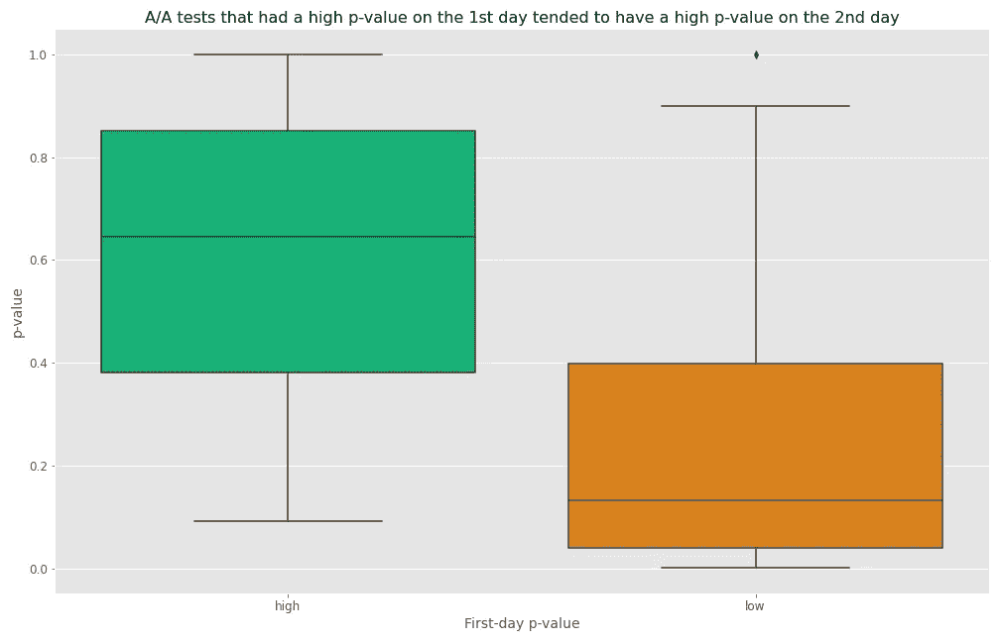
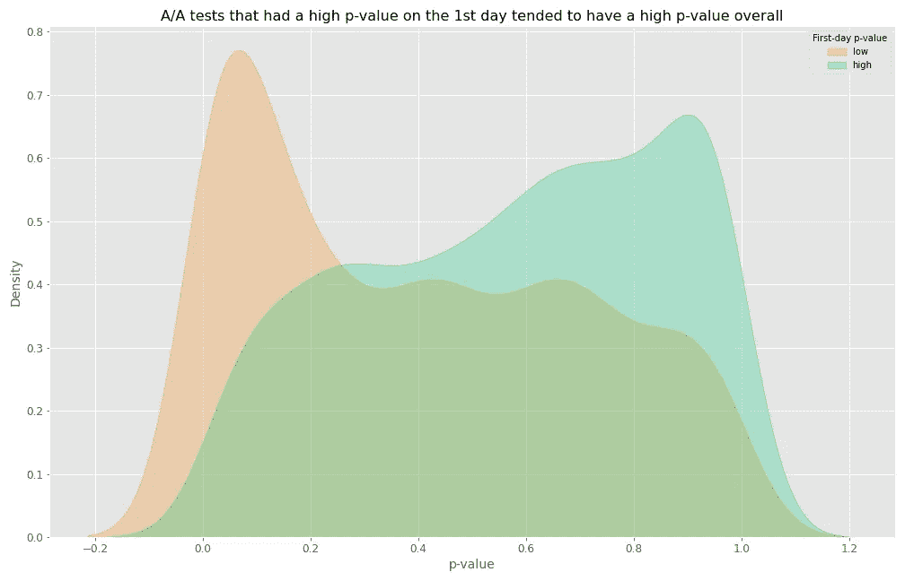
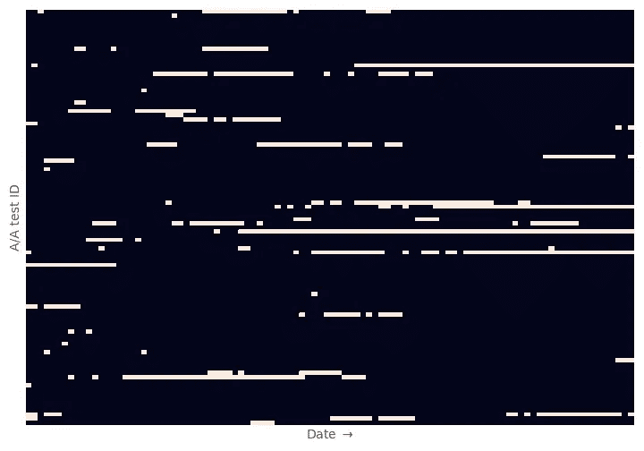

# 在 A/A 测试中，p 值、显著性和均匀分布

> 原文：<https://towardsdatascience.com/on-a-a-tests-p-values-significance-and-the-uniform-distribution-95d6e9a2afb1?source=collection_archive---------36----------------------->

## 模拟 1，000 次 A/A 测试，了解 p 值的分布情况

几周前，我在为我的同事 Andrew 模拟一些 A/A 测试数据。我们想为他那周做的关于 A/B 测试和[偷看](/how-not-to-run-an-a-b-test-88637a6b921b)的危险的全公司演示制作一个如下的图表:

作者图片

我们的目标是展示 p 值如何变动，以及即使在零假设肯定为真的 A/A 测试中，我们如何看到 p 值< 0.05 at some point.

Hence, I went on to simulate 1,000 A/A tests in order to calculate how many of them reached significance (p-value < 0.05) at some point. Each test ran for 16 days. With this simulation, I got that **~23%** 变动。

然而，如果我做一个简单得多的模拟，我只要:
1。从一个均匀(0，1)——**中抽取 16 个随机数，因为空值下的 p 值是均匀分布的**，
2。注意是否至少有一个数字< 0.05 和
3。这样重复了很多次，得到了 16 个数数组中的 **~56%** 至少有一个数<为 0.05。

作者图片

我很困惑。对于 A/A 测试数据，尽管我看到 p 值是均匀分布的，但我发现 23%的测试在 16 天的某个时间点达到显著性。相比之下，当做一个简单得多的模拟，从一个制服(0，1)中随机抽取 16 次时，我得到的比例要高得多，为 56%。

第二天我醒来时脑子里有了一个理论:**有没有可能 A/A 测试中的** **p 值在这 16 天的每个测试中都不是真正独立的**？也就是说，如果一项测试在第一天随机获得了非常高的 p 值，那么它在第二天也更有可能获得高 p 值，这是可能的吗？毕竟，我们不是每天都使用完全不同的数据，而是将新数据累积到用于计算之前 p 值的旧数据中。

于是，我:
1。根据首日 p 值是高(≥ 0.9)还是低(≤ 0.1)对 A/A 测试进行分组，以及
2。观察各组第二天 p 值的分布

这是我看到的:

作者图片

这非常强烈地表明，我发现了一些东西。在第一天碰巧有很高 p 值的 A/A 测试很可能在第二天也有很高的 p 值，反之亦然。这就是看完整个 16 天期间(而不仅仅是第二天)分布的不同之处:

作者图片

同样的故事。更有力的证据。

当我弄清楚这一切的时候，我也问了西蒙(我们的数据科学顾问和 [Coppelia](http://coppelia.io/) 背后的大脑)，因为我对他的想法以及他对我的无独立性假设的认可很感兴趣。

当按天分组时，他也看到了大约 5%的 A/A 测试在任何一点上都是显著的，正如我们所预料的那样。然而，当按测试分组时，情况就完全不同了——依赖关系是这样的，如果我们在第`d`天有假阳性，那么我们在第`d+1`天仍然有假阳性的可能性就大得多。对于真正的否定也是如此。因此，按试验分组的总比率差异很大。

在他发给我的这个图中，这一点非常清楚，它显示了当假阳性(白色方块)发生时，它可能会持续到后续日期:

作者图片

哦，好吧，谜底解开了！今天到此为止。我知道我在这篇博文中没有详细介绍一些统计学概念，但是如果你感兴趣，我鼓励你去了解更多:

*   p 值:【https://en.wikipedia.org/wiki/P-value 
*   意义:[https://en.wikipedia.org/wiki/Statistical_significance](https://en.wikipedia.org/wiki/Statistical_significance)
*   独立性:[https://en . Wikipedia . org/wiki/Independence _(probability _ theory)](https://en.wikipedia.org/wiki/Independence_(probability_theory))
*   均匀分布:[https://en . Wikipedia . org/wiki/Continuous _ uniform _ distribution](https://en.wikipedia.org/wiki/Continuous_uniform_distribution)

感谢阅读！