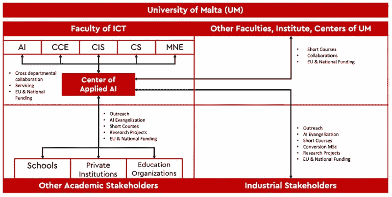

# 执行人工智能任务

> 原文：<https://towardsdatascience.com/on-an-ai-mission-949290e80aa?source=collection_archive---------52----------------------->

## 一所大学如何将一个国家转变为人工智能强国的故事

乔恩·泰森在 [Unsplash](https://unsplash.com?utm_source=medium&utm_medium=referral) 上的照片

几个月前，马耳他政府推出了[马耳他号**。AI 国家战略**](/the-ai-launchpad-is-finally-here-2523426ef77d) 。这是一项雄心勃勃的努力，旨在使 [**马耳他成为世界上人工智能(AI)方面排名前 10 的国家之一。然而，这只是旅程的开始，真正的工作从现在开始！**](/how-to-create-a-world-class-ai-national-strategy-in-10-steps-eec5bc1f91fd)

人工智能不仅仅是另一个我们几个月后会忘记的时髦词。它是自第二次世界大战以来一直在发展的不同技术的集合。它们的成熟度极高，数十亿人最终受益于它们的使用。以至于人们把人工智能称为千年新电。

马耳他大学在这一战略中扮演着至关重要的角色，对国家的成败至关重要。我们不要忘记，该大学已经进行了近四十年的人工智能研究。它的专业知识宝库是无与伦比的，在马耳他和许多其他国家都是如此。但由于马耳他需要加快人工智能的吸收，唯一能够做到这一点的实体无疑是马耳他大学。

正因为如此，马耳他。人工智能战略声明大学将建立一个新的应用人工智能中心(CAAI)。该中心将负责四项主要任务，其中两项是内部任务，另外两项是外部任务。

应用人工智能中心的拟议结构([来源:作者](http://alexiei.dingli@um.edu.mt))

**第一项**内部任务是服务[**ICT(FICT)**学院](https://www.um.edu.mt/ict)。让我们不要忘记，FICT 已经拥有我们所需要的所有专业知识。该中心背后的理念不是要重新发明轮子或复制学院的职能，而是帮助学院及其部门扩大规模。由于人工智能研究人员在学院的五个部门工作，CAAI 将帮助他们走到一起，促进跨部门合作。它还将积极寻求国家&和欧盟的资金，从而帮助研究人员探索新的项目。

**第二项**内部任务涉及与其他院系、研究所、中心的互动。这个想法是聚集所有对人工智能感兴趣的学院的学者，和 FICT 的研究人员一起，创建一个人工智能社区。通过这样做，他们可以共同努力为公众开设短期课程，为所有非信通技术学生提供学分，促进合作，并为联合项目寻求外部资金。

**第三项**任务聚焦于外部学术利益相关者，如学校、私立教育机构和其他教育组织。大学应该设法让这些实体加入进来，以获得更广泛的影响。因此，CAAI 将协调外联举措，组织人工智能宣传活动，提供进修课程以帮助这些实体跟上形势，并与它们合作开展最终旨在提高国家能力的项目。让我们不要忘记，如果我们想让马耳他成为人工智能的领导者，我们必须放眼大学环路之外，创造一个当地的生态系统。

**第四项**任务涉及其他利益相关者。对该大学的一个常见批评是，它没有满足行业需求。这种说法是不真实的，这些联系今天比以往任何时候都更加紧密。然而，我们总是可以做得更多。CAAI 将专注于这项任务，并将帮助进一步加强这些联系。该中心将协调外联活动，传播人工智能，为行业推出短期课程，领导转换硕士，并促进研究合作。

在这个阶段，一个相关的问题是，是否会与现有的结构有任何重叠。CAAI 的范围不在于涉足任何人的领域，也不在于建造其他象牙塔。它旨在促进资源共享，提高效率。大学中没有任何实体优先考虑大学内外的外联和合作。原因是每个人都被工作压得喘不过气来，不幸的是，这些合作往往被抛到了脑后。因此，我们需要 CAAI 来支持和领导这些举措。

这样一个雄心勃勃的项目不容易实现。这需要大量的努力、耐心和奉献。但如果我们想认真对待 AI，我们没有其他选择，除了大学，马耳他没有其他实体可以完成这项任务。正因为如此，我坚信我们大学的使命是帮助我们的国家发展成为一个人工智能强国，公司可以在全球范围内推出他们的人工智能项目。

本文原载于 [Newspoint](https://www.um.edu.mt/newspoint/news/2020/05/malta-AI-powerhouse) 。请在下面留下你的想法评论。如果你喜欢这篇文章，请跟我来🐦[推特](https://twitter.com/alexieidingli)，🔗 [LinkedIn](https://www.linkedin.com/in/alexieidingli/) 或者😊[脸书](https://www.facebook.com/alexieidingli/)。

 [## 一个全新的人工智能世界

### 疫情之后人工智能的兴起

towardsdatascience.com](/a-whole-new-ai-world-6a5e9e49aa12)  [## 失业的人工智能专家

### 失业的人工智能专家就像喜马拉雅山的雪人一样难以捉摸。事实上，在…

towardsdatascience.com](/the-unemployed-ai-expert-de5528e0443b) 

[**Alexei Dingli**](http://www.dingli.org/)**Prof 是马耳他[大学](https://www.um.edu.mt/)的 AI 教授。二十多年来，他一直在人工智能领域进行研究和工作，协助不同的公司实施人工智能解决方案。他的工作被国际专家评为世界级，并赢得了几个当地和国际奖项(如欧洲航天局、世界知识产权组织和联合国等)。他已经出版了几本同行评审的出版物，并且是马耳他[的成员。由马耳他政府成立的人工智能工作组，旨在使马耳他成为世界上人工智能水平最高的国家之一。](https://malta.ai/)**