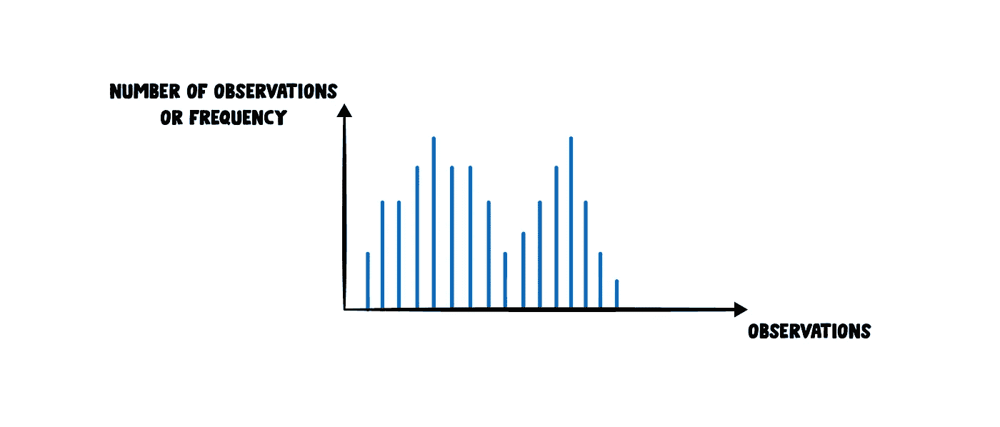
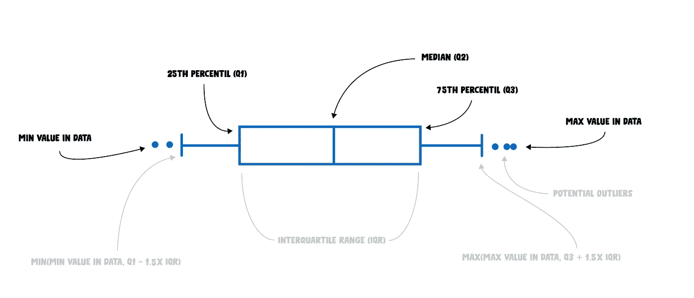
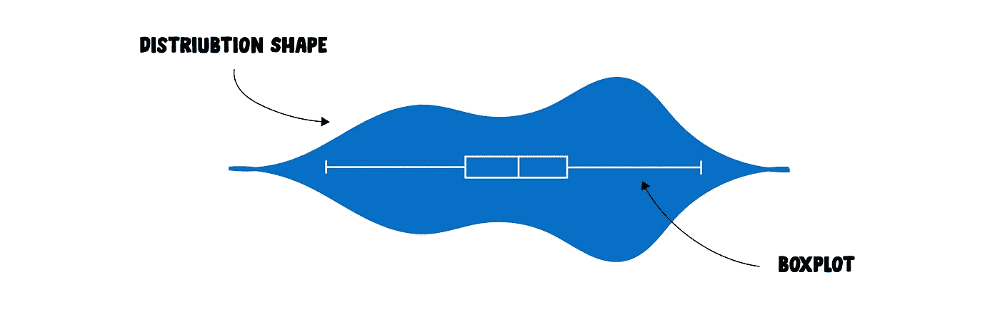
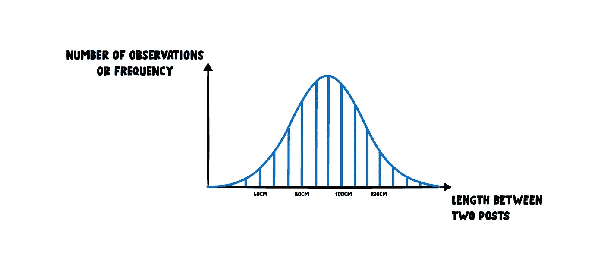

# 平均而言，我们更喜欢使用分销

> 原文：<https://towardsdatascience.com/on-average-we-will-prefer-using-distribution-3c479ba387c8?source=collection_archive---------47----------------------->

## 或者在黑色数字的世界中引入灰色阴影。

“平均”一词来自阿拉伯语“awar”，意思是“缺陷”或“部分损坏的东西”。

大约在 12 世纪，地中海世界首次在海上贸易中使用这个术语。它用于描述损害、损失或非正常费用，这是我们今天在法语单词“avarie”中找到的含义。

当前含义的根源来自中世纪末期的商船法契约。在一场恶劣的风暴中，海军陆战队不得不将一些货物扔出船外，以使船更轻更安全。所有的商人都要按比例遭受损失，更一般地说，任何损失都要按比例分配。

从那时起，这个词被英国的保险公司、债权人和商人采用，用来表示他们的损失分散在他们的整个资产组合中，并有一个平均的比例。今天的意思是从那发展而来的，始于 18 世纪中期的英语。

# 平均的众所周知的缺点

平均值很可能是理解数据的第一个指标。我们在任何地方都能看到和使用它:销售报告、电视新闻、运行应用程序、车载仪器等等。这是非常方便的，因为它将大量数据恢复到一个图形中。

但是从设计上来说，它有一定的局限性:将许多观察结果汇总成一个数字资产会浪费很多重要信息。

让我们用一个简单的例子来看看平均是如何不够的。

考虑到这两个系列: *2，4，6，8，16，17，32* 和 *2，4，6，8，16，17，92* 。

第一个系列的平均值为 12.1，而第二个系列的平均值为 20.7。正如我们所看到的，两个系列之间只有一个元素发生了变化。

我们现在来看看中位数。你可能听说过。它有时接近平均值，但代表另一个统计属性。

简单来说，中位数是一组数字的“中间”。在我们的示例中，两个系列的中位数都是 8。

这是一个非常简单的例子，但它强调了如果我们不仔细观察我们的数据，特别是异常值，平均值会产生误导。

更普遍的说法是:平均值、中间值或其他任何一个数字的汇总都有潜在的危险，并且常常隐藏了数据必须提供的所有模式。因为它们是有意隐藏的，所以如果我们完全依赖它们，就有出错的风险。

# 更精细的视图

我们必须爬得更高。转向更精细的视图。

当数据达到一定数量时，我们的大脑无法处理信息:数据太多了。因此，我们通常不看原始数据，而是通过相似的值来聚合它们:这就是我们通常所说的分布。

分布是一个函数，它显示变量的可能值以及它们出现的频率。

有许多方法可以可视化数据分布，以下是一些方法:

**直方图**

它们可能是绘制分布图最简单的方法。直方图显示数据的整体形状，并告知样本大小。条形图有什么区别？通常，直方图处理连续数据，而条形图用于处理分类数据。

**箱线图**

虽然没有“数据素养”的人很难读懂它们，但是盒状图收集了许多有趣的信息。它们表达基本的统计数据，如中位数、最小值、最大值甚至四分位数。将它与几个组(通常是数据的一个定性属性)一起使用，以减轻这些组之间的差异，这通常是很有趣的。

**小提琴图**

小提琴图结合了箱线图和密度图。它们增加了关于数据分布的完整形状的信息，比箱线图更直观、更有吸引力。

如果你喜欢小提琴图表，你可能会珍惜强调个体数据点的[蜂群图](https://flowingdata.com/charttype/beeswarm/)。

还有很多其他方式来看待分布。上面的三个非常容易制作，并且提供了比单一指标更多的细节。

我们经常被我们理解得非常快的简单的黑色数字所吸引。然而，花一点额外的时间来看看数据分布是值得的。你不会失望，而且会更好:你会很好奇，想了解更多关于你的数据。

**同型图上的一个字**

早在 20 世纪，许多政府信息程序都通过称为“同型”的离散图形元素来显示数据元素。Isotype 代表国际印刷图片教育系统。[这种设计是由奥图·纽拉特、玛丽·纽拉特和格尔德·阿恩茨发起的](https://medium.com/nightingale/exploring-isotype-charts-only-an-ocean-between-part-1-399f227e1c69)，目的是创造一种视觉语言，让尽可能多的受众能够理解统计元素。

它们不仅可以简化信息，还可以快速显示分布中的巨大差距。插图和图片比行号或传统的直方图更容易记住。

同型图突出分布。拍摄自[第二次世界大战信息图](https://www.goodreads.com/book/show/42441387-infographie-de-la-seconde-guerre-mondiale)。

# 到处发行

当我在火车上写下这篇文章时，我的目光迷失在乡村，我正眯着眼看着一个由人手做成的长长的栅栏。与机器制造的现代栅栏不同，这种栅栏非常不规则。

然后出现正态分布。

这里没看到正态分布吗？

几个世纪以来，科学家们发现许多观测数据都遵循相同的数学分布。

每小时到达商店收银台的人数服从泊松分布，人的大小服从正态分布，一个学生考试及格或不及格服从伯努利分布，等等。数学分布在自然界中无处不在。

看着柱子之间的空隙，我可以注意到一种模式。事实上，柱子之间的间距遵循正态分布。

正态分布。你已经看过这个形状了。

在这些发行版背后还有很多技术资产，我们在这里不做介绍。但是，当您听到和看到发行版时，请记住这些名称:您会惊讶地发现它们是多么自然地出现。

正如 RJ·安德鲁斯在他的优秀著作《我们信任的信息》中写道:“数据通常不会显示出开箱即用的有趣模式。”。

所以，下次你看到一位数的统计数据时，先问问自己数据分布的形状是什么。

希望这不是一般的作品。