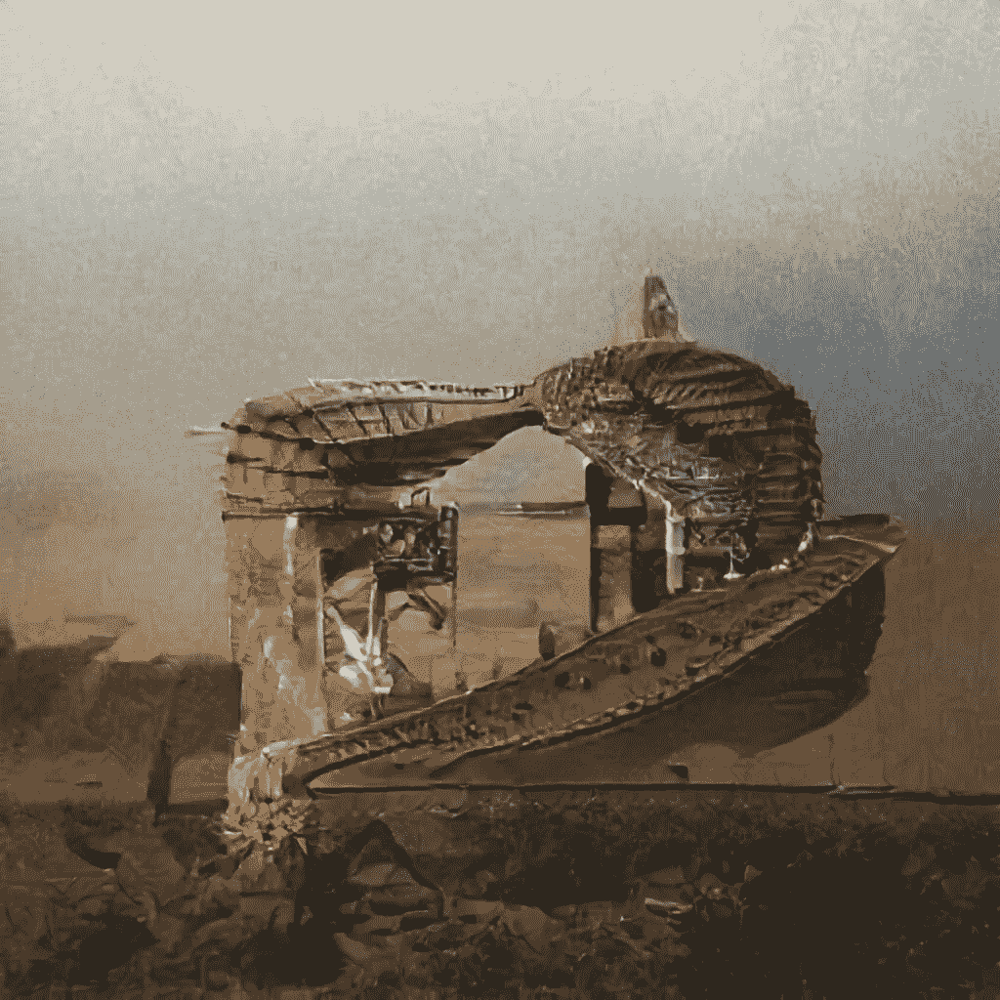

# 艺术和数据科学中的废话

> 原文：<https://towardsdatascience.com/on-bullshit-in-art-and-data-science-2c68c9ae17db?source=collection_archive---------28----------------------->

## 思想开放的几个理由



是的，完全正确。你读了。既不是 ***BS*** 也不是 ***公牛**t*** 。简单来说就是: ***扯淡*** ，或者更准确的说是“*伪深奥的扯淡*”。这已经不是一句脏话了，而是一个科学术语，至少在论文“ ***扯淡让艺术变得更深刻*** ”之后( [PDF](http://journal.sjdm.org/19/190712/jdm190712.pdf) ，以下简称 *BSS* )于去年 11 月问世(载于[判决与决策第 14 卷第 6 期 2019 年 11 月](http://journal.sjdm.org/vol14.6.html))

# 这是怎么回事？

研究的主旨是关于*意为*的**在*艺术*** 中的作用:

> 先前关于审美偏好的研究表明，人们普遍不喜欢他们认为毫无意义的艺术( [*BSS*](http://journal.sjdm.org/19/190712/jdm190712.pdf) )。

根据这项研究，在数字时代，人工智能生成(抽象)图像的趋势正在出现，以及对观众的欺骗。给抽象画加上标题使它们显得*深刻*。对于人工智能生成的标题，它们会引发所谓的“*伪深奥的废话*”，尤其是在艺术家(=自己的人工智能生成的艺术品的策展人)试图获得“社会优势”的情况下。他们在愚弄无辜的观众，他们深信不疑地希望，一切都是有意的:

> 与没有标题时相比，随机生成的伪深奥的废话标题增加了计算机生成的抽象艺术的可感知的深度( [*BSS*](http://journal.sjdm.org/19/190712/jdm190712.pdf) )。

这项研究不仅旨在提高人们对艺术欺诈的认识(低成本人工智能艺术作品在艺术市场获得高估价)，而且还仔细审查抽象艺术家的责任。

> 一些抽象艺术家对艺术抱着一种极端主观的观点，也就是说对于美或意义没有可能的客观标准。**这些艺术家**的目标是给人留下深刻或美感的印象，而不仅仅是不关心真理，而是**否认任何客观真理可能存在** ( [*BSS*](http://journal.sjdm.org/19/190712/jdm190712.pdf) )。

和

> 如果抽象艺术的**世界**事实上**代表了扯淡的理想环境**被部署**作为获得声望的有效低成本策略**，那么人们会期望扯淡在这个领域广泛存在。( [*BSS*](http://journal.sjdm.org/19/190712/jdm190712.pdf) )。

因此，本研究遵循以下几个目标:

1.  关于**标题让无意义的艺术变得深刻的心理学证据**(特别是使用人工智能技术，如甘和自然语言处理)
2.  社会学，然而对抽象艺术家的**刑事调查**是**艺术炫目(**“给别人留下深刻印象的快速有效的方法】 **)**
3.  **质疑抽象艺术形式本身，**据称它们没有以可理解的方式描绘现实。

# 伪高深的学问？

在我看来，这项研究在对艺术理论的无知和伪心理策略之间如履薄冰。

让我们从四个方面来分析这项研究。

## #1.反学术方法

每一项心理学研究都需要人体统计学。他们应该是负责任和可靠的。如果我们看看这项研究的先证者(一篇论文中有几项研究)，我们会看到一些有趣的细节:


“扯淡让艺术变得更深刻”研究的先证者

我们有什么？

*   他们是这所大学的本科生，显然他们正处于学术旅程的开端。对于一般的心理学研究来说，教育状态确实只在特定的案例中起作用。**关于艺术感知的心理学研究**，教育状况、文化能力和背景知识是相关的(多样性计数)。
*   **先证者(想必)不是艺术史学家**
    为什么对研究来说必不可少，我以后会参考。
*   他们参与的动机是“课程学分”。
    还是那句话，没有记录在案，但是志在必得这个可悲的目标可能会引起偏见。这是给先证者的文件— [测试“深度”](http://journal.sjdm.org/19/190712/supp.pdf)。

该研究评估了真实的抽象艺术品(MoMA 作为来源)和人工智能生成的图像，结合人工智能生成的(*“伪深奥的废话”*)和人类创建的(*“世俗”*)标题。


摘自《扯淡让艺术变得更深刻》

人工智能生成的标题倾向于形而上学的想法(“*病理内部*”)，世俗的标题是对艺术作品的视觉描述(“*颜色混合*”)。

检验的重点在于，如果给定标题(*“人工智能生成的”* vs *“平凡的”*)，先证者是否以不同的方式接受抽象的未理解的艺术。这项研究的设置令人惊讶地反学术(缺乏互文性，只是指主观接受代替)。

```
**Titles. Short excourse.**Indeed, **titles are a relatively new phenomenon** in art history. Before the XVIIIth century, most pictures didn't have titles (see also [***NewRepublic***](https://newrepublic.com/article/125621/art-no-name)). ***Art historian E.H.Gombrich*** has observed, title “*is a by-product of the mobility of images*”, this textual attachment emerges parallelly with art market developments (~> mobility of images). Initially, titles were used **not for making art "profound", but rather for raising *motives recognition* among public**, who weren't limited to patrons and educated artwork owners in times of Renaissance anymore. One of the title-proponents, ***abbé Du Bos,*** writes 1719: “*most spectators… are not learned enough to guess the subject of a picture*”. Here titles have rather **educational, explanational task** than valorization of artwork.Along with the evolution of art, also the significance of titles changed. Titles enhance and augment the visual artwork in a psychological way of perception. In a study **"**[**The Influence of Titles on How Paintings Are Seen**](https://www.jstor.org/stable/1575894)**"** (*Leonardo*, vol. 26, no. 2, 1993, pp. 103–108.), Margery B. Franklin (at all) highlights, that "***titles function as guides to interpretation, not simply as identifying tags***". According to this study, titles influence the perception in psychological and even physiological ways. By applying various titles to the same images, researchers observed different viewing tracks by their probands:
```


出自: [**头衔对画是如何被看出来的影响**](https://www.jstor.org/stable/1575894)

**本研究( [*BSS*](http://journal.sjdm.org/19/190712/jdm190712.pdf) )试图用所谓的标题欺骗的论证来为抽象艺术家定罪。**

## **#2 混淆艺术和艺术市场**

**有*社会优势、意义、艺术价值*的不断具体化——所有属于**艺术市场领域**的成分。没有一个字提到这种可能性，即一个艺术家可能通过他的艺术作品来表达自己，而没有任何商业化的意图。**

***艺术品* ( *作为艺术家个人的表达* ) **与*艺术市场*** ( *作为艺术品货币化的平台*)之间的区别，甚至**的并置，不仅是显著的，而且在 20 世纪关于艺术权威被废除的批判性话语中是不可避免的****

**主要的反传统艺术颠覆者是达达主义者、超现实主义者和抽象主义者——这正是我们当前研究的目标群体。**

**这使我们进入…**

## **#3 忽视艺术史**

**具有讽刺意味的是，如果在这项研究中，旁观者的主观观点得到了尊重，艺术家的主观动机却没有得到尊重。**

**平原说，这项研究想要证明给抽象绘画命名是一个**伪深奥的废话**(特别是如果所有组件都是人工智能生成的话)——进一步怀疑抽象艺术本身的相关性。**

**让我们看看*曝光群体的一些作品和标题。***

## **超现实主义:勒内·马格里特**

**"**摔跤手之墓** " (" **摔跤手之墓**")——多么伪深奥的 BS 标题！乍一看。在这个标题中，马格里特引用了法国象征主义者莱昂-阿尔比恩·克拉德尔的小说《Ompadrailles，le tombeau des lutteurs》(1879)。在这个标题的背后，是一个复杂的文化和社会政治故事，基于与纽约人 Lawer 和诗人 Harry Torczyner 关于苏联“塔奇斯特”画家、20 世纪 60 年代欧洲形势等的信件往来**

**马格里特是怪异标题的大师——除了对于不知情的观众来说，“*怪异*只是“*怪异*”**。(#文化能力)****

**达达主义:库尔特·施威特斯**

****

**K.Schwitters，“色情苦难大教堂”(重建，照片由 Merzmensch)**

**这是达达主义者和默茨艺术家库尔特·施威特斯的默茨-鲍尔装置作品。他的跨媒体空间装置占据了他在汉诺威公寓的几个房间。当他从纳粹德国流亡到挪威时，他一直在他居住的每个地方建造 Merz-Baus，没有任何希望(也没有意图)让这个作品出名，将其货币化，或获得任何社会优势。他这样做只是因为他无法停止创作。这是他的生活。**

**《性爱苦难大教堂》这个标题是高度叙事性的:关于他的曲折，关于他那个时代的文化话语，关于二战前的政治崩溃，关于他的个人处境。这个标题被取消，并被重新命名为 Merz-Bau，因为 Schwitters ' uvre 是由纳粹在他们讽刺性的展览“ **Entartete Kunst** ”中提出的([堕落艺术展](http://en.wikipedia.org/wiki/Degenerate_Art_Exhibition)，1937)。本次展览的主要任务是将抽象主义者和先锋派与他们的(*对于同胞来说难以理解和近乎深奥的*)叙事和视觉效果，与“纯粹的”、政治上认可的和有用的现实主义以及纳粹政权委托的艺术进行对比。**

## **抽象艺术:保罗·克利。**

****

**页（page 的缩写）克利，“理性的极限”**

****理性的限度**(《格伦森·德·韦尔斯坦德斯》)。现在，这是一个完美的**伪深奥的废话**，不是吗？**

**不，不是的。在这部抽象作品中，保罗·克利以讽刺的方式探索了包豪斯的哲学。最初，克利是 T4 包豪斯学院的讲师，但它对技术倾向和功利主义的日益关注让保罗·克利对这个艺术学校和运动持怀疑态度。在这幅抽象画中，艺术家表达了包豪斯对实用主义可悲的崇拜。**

**正如你所看到的，在这些第一眼看上去“伪深奥”的标题背后，总是一个庞大的叙事，只有了解背景的观众才能完全理解。在这里，情感艺术变成了智力艺术。**

# **但是…**

**“嗯”，你会说，“但是那些用 StyleGAN 和其他 GANs 生成艺术，并使用像 [this](http://www.artsnova.com/automatic-art-title-generator.html) 或 [this](https://noemata.net/pa/titlegen/) 这样的标题生成器来应用随机的形而上学标题的炫目者和模仿者呢？然后在苏富比上卖[大钱](https://news.artnet.com/market/first-ever-artificial-intelligence-portrait-painting-sells-at-christies-1379902)？是不是**伪深奥的屁话？****

**嗯，可以，但是只有*不买*(有意双关)。**

1.  **其实并不是这样:艺术市场仍然对人工智能生成的艺术持怀疑态度([人工智能生成的艺术泡沫已经破灭了吗？](https://news.artnet.com/market/obvious-art-sale-sothebys-1705608)《艺术网上的》**
2.  **不跟艺人玩同一游戏才是 BS。**

****因为 AI 生成的内容创造了新的叙事。新流派。新的深刻。****

****新的讲故事方式**。**

# **结论**

**[根据牛津词典](https://www.oxfordlearnersdictionaries.com/definition/english/bullshit_1?q=Bullshit)，术语**扯淡**的意思是**

> **你认为愚蠢或不真实的想法、陈述或信念。**

****信不信由你**。用艺术家的频率说话或者拒绝。你不需要为此进行研究，尤其是如果这项研究带有偏见和刻板的概括。**

**毕竟，即使是人工智能生成的艺术([使用 art breader](/artbreeder-draw-me-an-electric-sheep-841babe80b67?source=friends_link&sk=2fff2b9e102ce632d725e58bfa4c67dd))和标题(使用 [TitleGen](https://noemata.net/pa/titlegen/) )的随机组合也可以建立一个新的叙事(如果你打开思维并遵循你的想象力)。**

****

**和平的诗歌**

**如果你把艺术——和生活——看得太重，你只会声称被“伪深奥的废话”愚弄了。**

**智者指点，[驾驶的 GPT-2 型给了我](https://medium.com/merzazine/fridai-meaning-of-life-as-seen-by-artificial-intelligence-24408f0885cf?source=friends_link&sk=97a9663e37b3e4fd05b61b7b9723164f)，就在我问它关于**生命的意义是什么**:**

****

**用[TalkToTransformer.com](http://TalkToTransformer.com)生成**

**幸运的是，我不是唯一有这种观点的人:**

**朋友们，你们觉得怎么样？**