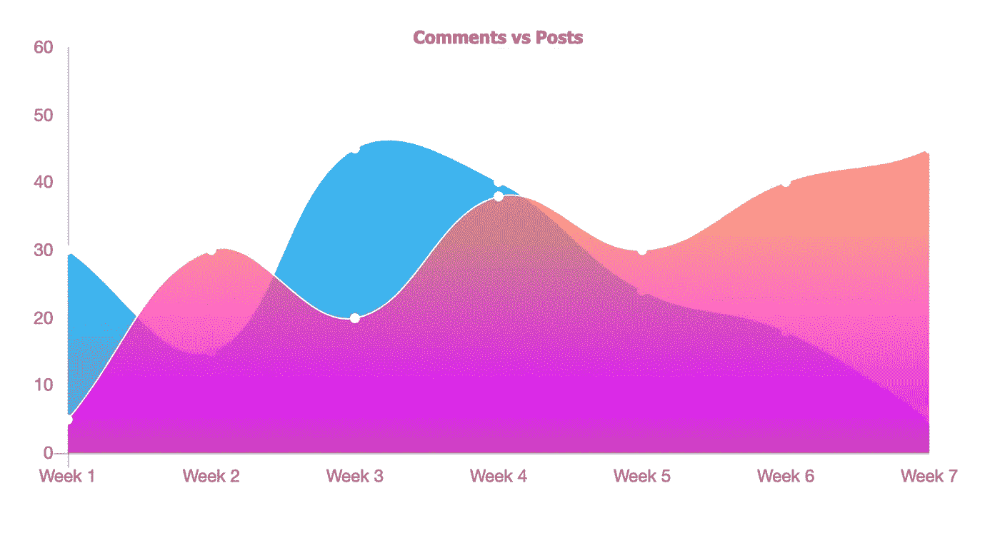

# 按需物化视图:图形、分析或机器学习的可扩展解决方案

> 原文：<https://towardsdatascience.com/on-demand-materialized-views-a-scalable-solution-for-graphs-analysis-or-machine-learning-w-d3816af28f1?source=collection_archive---------19----------------------->



作者使用 Chart.js 提供的图片

为图表、分析、投资组合甚至机器学习聚集数据可能是一项艰巨的任务，难以扩展。在本文中，我将详细介绍 MongoDB 的新(ish) *$merge* 管道，我认为它解决了许多这样的伸缩问题，并自动化了某些以前需要大量定制开发才能完成的设计实践，然而，Mongo 的文档未能提供推断的示例或多个用例。本文将深入探讨 MongoDB 的聚合操作。它将假设您已经了解如何聚合数据，并将主要关注涵盖可伸缩性、缓存和数据增长的*$合并管道*。

```
**Table of Contents** *Basic Usage
Incrementing New Subsets of Data
Incrementing or Replacing a Field based off a conditional* Aggregating Data from Multiple Collections
*Creating a Basic Graph or Machine Learning Data Set*
```

让我们用一些模拟数据创建一个简单的例子。在这个例子中，我们将聚集一般职位，并确定每个配置文件有多少职位，然后我们将聚集评论。如果您使用代码片段来阅读本文，您将希望按照下面的风格创建一些数据点。但是，这种解决方案很容易扩展到具有大量数据点的数据库

```
db.posts.insert({profileId: "1", title: "title", body: "body", createdAt: new Date()})db.comments.insert({profileId: "1", body: "body", createdAt: new Date()})
```

接下来，我们将通过简单的分组来聚合数据

```
db.posts.aggregate([{
  “$group”: {
    “_id”: “$profileId”,
    “totalPostCount”: {“$sum”: 1}
}}])
```

这将为我们提供一系列类似这样的文档

```
[
{_id: “1”, totalPostCount: 5}, 
{_id: “2”, totalPostCount: 4}, 
{_id: “3”, totalPostCount: 9}
]
```

为了避免定期运行集合扫描，即扫描整个集合而不是集合子集的操作，我们可以将此信息存储在概要文件中，并偶尔使用 cronjob 更新它，或者我们可以将内容缓存在某个地方，并重新运行整个聚合来重新同步计数。当有数百万的个人资料和数百万的帖子时，这个问题变得更加明显。突然之间，聚合将占用大量的计算资源和时间，从而推高成本和服务器负载。如果我们显示某种投资组合视图，或者终端用户正在物理地等待这些计数，并且它们需要 100%最新，这将变得更糟；更糟糕的是，许多用户可能同时发出这个请求，使我们的服务器和数据库过载，并使我们的应用程序崩溃。

# 按需物化视图

这就引入了对 MongoDB 的[按需物化视图](https://docs.mongodb.com/manual/core/materialized-views/)的需求。

在计算机科学中，物化视图是与原始数据集分开存储的先前运行的数据查询的结果。在本例中，它描述了$merge 操作，以及如何将结果直接输出到另一个集合中，而不是输出到一个游标中以立即返回到应用程序。Mongo 的文档页面描述了每次运行时都会更新内容——即按需更新。然而，它没有正确解释当扫描更小、更新的数据子集时，如何显示数据的增量表示。在本文的剩余部分，我将展示几个例子和用例来说明如何做到这一点

这种方法将*$合并管道*添加到聚合操作的末尾。它可以将聚合操作的内容输出到为此目的创建的特定集合中，并替换或合并与之匹配的文档。内容将作为返回数组中每个元素的一个文档输出，允许对新的聚合集合进行进一步的聚合和计算。这是对以前的$out 管道操作符的巨大升级，它将覆盖所有匹配的条目。$merge 添加以前不存在的数据，并替换已经存在的数据。这个链接展示了一个非常清晰的例子。

# 基本用法

```
 db.posts.aggregate([
{
  “$group”: {
    “_id”: “$profileId”,
    “totalPostCount”: {“$sum”: 1}
  }
},
{
  “$merge”: {
      “into”: “metricAggregates”
  }
}])
```

现在，我们可以使用 metricAggregates 集合的普通查询来收集数据

```
db.metricAggregates.find()
->
[{_id: “1”, totalPostCount: 5}, 
{_id: “2”, totalPostCount: 4}, 
{_id: “3”, totalPostCount: 9}]
```

这个例子没有涵盖更复杂的用例。它只包括添加新的概要文件，但是在我们的例子中，现有概要文件的新帖子呢？我们如何避免重复扫描之前聚集的数据？拥有数百万的个人资料和数百万的帖子，我们无法承担如此繁重的工作。

# 增加新的数据子集

当处理数百万个文档时，我们需要找到一种方法，只聚合最近的数据，并且只聚合我们还没有聚合的数据。我们不想替换已经存在的字段，我们想增加它们。解决方案隐藏在可选的“**匹配时**”字段底部的$merge 的[文档中](https://docs.mongodb.com/manual/reference/operator/aggregation/merge)

> 用于更新集合中文档的聚合管道。
> [ <第一阶段>，<第二阶段> … ]
> 
> 管道只能由以下阶段组成:
> [$addFields](https://docs.mongodb.com/manual/reference/operator/aggregation/addFields/#pipe._S_addFields) 及其别名 [$set](https://docs.mongodb.com/manual/reference/operator/aggregation/set/#pipe._S_set)
> [$project](https://docs.mongodb.com/manual/reference/operator/aggregation/project/#pipe._S_project) 及其别名[$ unset](https://docs.mongodb.com/manual/reference/operator/aggregation/unset/#pipe._S_unset)
> [$ replace root](https://docs.mongodb.com/manual/reference/operator/aggregation/replaceRoot/#pipe._S_replaceRoot)及其别名 [$replaceWith](https://docs.mongodb.com/manual/reference/operator/aggregation/replaceWith/#pipe._S_replaceWith)

通过应用 *whenMatched* 选项，我们可以应用一个 *$project* 管道操作符，允许我们增加字段

```
db.posts.aggregate([
{ "$match": {"createdAt": {"$gt": aggregationLastUpdatedAt}}},
{
  "$group": {
    "_id": "$profileId",
    "totalPostCount": {"$sum": 1}
  }
},
{
  "$merge": {
    "into": "metricAggregates",
    "whenMatched": [{
      "$project": {
        "_id": "$_id",
        updatedAt: new Date,
        totalPostCount: {
          "$sum": ["$totalPostCount", "$$new.totalPostCount"]
        }
      }
    }]
  }
}])
```

我们在这次行动中增加了两件事。首先是 *$match* 。现在我们需要查询最近的 *updatedAt* 字段，并将其从集合中取出。之后，我们可以将它包含在匹配中，所以我们只拉**自上次调用操作**以来创建的帖子。在 *$merge* 管道中，我们添加了一个 *$project* 操作，因此每次在 *_id* 字段上出现匹配时， *updatedAt* 将被刷新， *totalCount* 将被*递增*而不是被替换。语法 *$$new* 是一个与我们刚刚执行的聚合操作中的数据相关的关键字

> 这些数据只需要查看一次，而且是以很小的增量查看

# 基于条件递增或替换字段

但是如果更复杂呢？如果我们还需要显示本周发布的帖子的数量呢？其中我们需要根据时间戳或其他信息有条件地增加或替换字段

```
let aggregationLastUpdatedAt = //retrieve most recent timestamp in the metricAggregates collectionlet startOfWeekDate = //new Date representing the beginning of the weekdb.posts.aggregate([
{
  "$match": {"createdAt": {"$gt": aggregationLastUpdatedAt}}
},
{
  "$group": {
    "_id": "$profileId",
    "totalPostCount": {"$sum": 1},
    "postsThisWeek": {"$sum": {
       "$cond": {
          "if": {"$gte": ["$createdAt", startOfWeekDate]},
          "then": 1, "else": 0}}},
  }
},
{
  "$merge": {
    "into": "metricAggregates",
    "whenMatched": [{
      "$project": {
        "_id": "$_id",
        "updatedAt": new Date,
        "weekStartedAt": startOfWeekDate,
        "totalPostCount": {
          "$sum": ["$totalPostCount", "$$new.totalPostCount"]
         },
        "postsThisWeek": {
          "$cond": {
            "if": {"$eq": ["$weekStartedAt", startOfWeekDate]},
            "then": {
              "$sum": ["$postsThisWeek", "$$new.postsThisWeek"]
            }, 
            "else": "$$new.postsThisWeek"
          }
        }
      }
    }]
  }
}
])
```

现在我们*有条件地*增加 *postsThisWeek* 如果它匹配 *weekStartedAt* date，或者*替换它*如果它不匹配

# 聚合来自多个集合的数据

如果我们需要从其他集合中聚合数据呢？以前我们可能必须使用一个 *$lookUp* 操作符*、*，但是**、 *$lookUp* 失败了，因为它只与基本集合**匹配。例如，如果我们需要从我们的评论集合中收集指标，该怎么办？一个 *$lookup* 将跳过所有从未发表过帖子的个人资料，导致那些只发表过评论的个人资料从聚合结果中完全消失。 *$merge* 很容易解决这个问题，它允许我们在不同的时间、地点或服务上聚合不同的集合，并将所有输出到同一个集合和文档中

```
db.comments.aggregate([
{
  "$match": {"createdAt": {"$gt": commentsAggregationLastUpdatedAt}}
},
{
  "$group": {
    "_id": "$profileId",
    "totalComments": {"$sum": 1},
    "commentsThisWeek": {
      "$sum": {"$cond": {
         "if": {"$gte": ["$createdAt", startOfWeekDate]},
         "then": 1, "else": 0}}},
  }
},
{
  "$project": {
    "_id": "$_id",
    "totalComments": 1,
    "commentsThisWeek": 1,
    "weekStartedAt": startOfWeekDate,
    "postsThisWeek": {"$literal": 0}, // explained below
  }
},
{
  "$merge": {
    "into": "metricAggregates",
    "whenMatched": [{
      "$project": {
        "_id": "$_id",
        "commentsUpdatedAt": new Date(),
        "weekStartedAt": startOfWeekDate,
        "totalComments": {
          "$sum": ["$totalComments", "$$new.totalComments"]
        },
        "commentsThisWeek": {"$cond": {
          "if": {"$eq": ["$weekStartedAt", startOfWeekDate]},
          "then": {
            "$sum": ["$commentsThisWeek", "$$new.commentsThisWeek"]
          },
          "else": "$$new.commentsThisWeek"
         }},
         //explained below
        "postsThisWeek": {"$cond": {
          "if": {"$eq": ["$weekStartedAt", startOfWeekDate]},
          "then": {"$sum": ["$thisWeek", "$$new.thisWeek"]}, 
          "else": "$$new.thisWeek"
        }},
      }
    }]
  }
}])
```

现在在 comments 集合中，我们很快遵循相同的聚合原则，集合将自动按照我们想要的方式进行合并。您可能已经注意到了一个额外的 *$project* 操作，以及仍然在 *$merge pipeline* 中的 *postsThisWeek* 字段。这样做的原因是，如果评论聚合操作发生在新的一周，则*总评论*将被准确重置，并且*周开始日期*将被正确更新。但是，如果稍后发生 post 聚合，则不会触发周开始替换，因为 *weekStartedAt* 已经匹配，导致 post 字段在应该重置时错误地递增。通过包含这些字段并将该字段设置为{*$ literal 0 }*—*$ literal*将该字段设置为文字整数值 0，而不是解释为排除。代码翻译成*“如果是新的一周，将该字段设置为 0，否则递增 0”*

注意，我们还在 *$merge* 中设置了一个**唯一的**日期字段。我们需要将评论最后一次汇总的时间和帖子分开，否则可能会丢失数据

当最终用户请求数据时，他们只需像任何普通的 mongoDB 操作一样从输出集合中提取数据。即使数据是多个聚合查询和集合的集合，也可以轻松地对其进行排序、分页、过滤和索引。

这种方法保证了即使对于复杂的计算，我们也只需要扫描一次数据，而且只需要一点点。可以在每次查看页面时额外聚合数据，也可以由 cronjob 管理数据。它可以跨越任意数量的集合，而不需要 *$lookup* ，并且复杂度可以根据用例的不同而增加。

最后，新的输出集合还可以被聚合，以得出不同的有趣度量，这可以极大地帮助各种机器学习应用程序或投资组合视图。

# 创建基本图形或机器学习数据集

作为最后一个例子，我将包含一个聚合操作，该操作按周对总计数进行排序，这对于创建可视化图形或机器学习数据集非常有用

```
db.posts.aggregate([
{"$match": {"createdAt": {"$gt": aggregationLastUpdatedAt}}},
{
  "$project": {
    "createdAt": 1,
    "week": {"$trunc": 
      {"$divide": [
        {"$divide": [{"$subtract": ["$createdAt", startDate]}, 86400000]},
        7
      ]}
    }
  }
},
{
  "$group": {
    "_id": "$week",
    "week": {"$first": "$week"},
    "totalPostCount": {"$sum": 1}
  }
},
{
  "$merge": {
    "into": "metricsByWeek",
    "on": ["week"], // this requires a unique index on the metricsByWeek collection
    "whenMatched": [{
      "$project": {
        "week": 1,
        "updatedAt": new Date,
        "totalPostCount": {
          "$sum": ["$totalPostCount", "$$new.totalPostCount"]
        }
      }
    }]
  }
}])
```

*如果您正在实时跟踪代码示例，您将需要在运行上述代码*之前复制并粘贴以下代码片段

```
db.metricsByWeek.createIndex({week:1}, {unique:true})
```

这是因为当您定制 *$merge* 操作符寻找匹配的字段时，该字段(或字段组合)必须有一个惟一的索引，这样才能保证 mongo 只找到一个*单个*匹配

这样就创建了一个这样的文档集合，可以插入到图形库或任何其他应用程序中

```
{
  week: 0,
  totalCount: 3
}
{
  week: 1,
  totalCount: 9,
}
{
  week:2,
  totalCount: 25
}
```