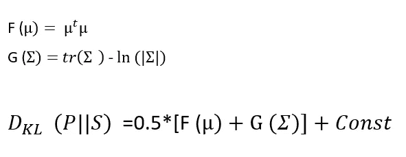

# Z 在 VAE 的分布

> 原文：<https://towardsdatascience.com/on-distribution-of-zs-in-vae-bb9a05b530c6?source=collection_archive---------25----------------------->

## 我们是否正确地使用了创成部分

[https://unsplash.com/photos/Hba7In7vnoM](https://unsplash.com/photos/Hba7In7vnoM)

# **动机**

这个帖子的动机是在学习 VAE 的理论和遵循它的一般实现时提出的。正如我们所知，VAE 由两个网络构成:一个(**编码器**)被训练成将真实数据映射成高斯分布，旨在优化其与给定分布(通常为标准正态分布)的 KL 距离。)和另一个(**解码器**)来将该高斯分布的样本(**Z**s)映射成实数据。也就是说，最终目标是解码器将能够从通用分布中生成数据，但是它具有双重目标

*   越来越接近标准的正常距离。
*   由解码器生成良好的数据样本

VAE 通常使用 [ELBO](https://www.cs.princeton.edu/courses/archive/fall11/cos597C/lectures/variational-inference-i.pdf) 作为损失函数。该函数用于解决**变分推理** ( **VI** )问题和早期热力学。它旨在研究给定观测数据的潜在变量的分布。

虽然 ELBO 看起来是用于生成给定现有真实数据的数据的正确函数(这实际上是 VI 的经典定义)，但是不清楚为什么会期望 ELBO 收敛到 normal dist。

为了开始分析性的讨论，让我们先介绍一下埃尔伯公式。

我们的目标是找到潜在变量**(**Z**s)的最优分布 **Q** ，使其与 P(Z|X)的 KL 距离最小，其中 X 是真实数据**

****

**我们可以这样写 KL:**

****

**这导致了以下情况:**

****

**P(Z)是 Z 的先验分布，并假设为标准正态分布**

**爱尔博是第二任。最大化 ELBO 等价于最小化 KL 散度。**

**考虑到 VAE 的双重目标和爱尔波公式的代数结构，有两个问题:**

*   **ELBO 的 KL 项(在 **Q** 和之前的 **P** 之间)是否收敛到标准正常距离？**
*   **假设第一个问题的答案是肯定的，那么整个 ELBO 呢？**

**在接下来的部分中，我将研究这两个问题并给出一些数值实验**

# **KL 收敛**

**为了证明一个函数收敛到某一点，我们必须证明这个点是一个极值，并且存在一个时间动力学，在这个时间动力学中这个点是稳定的。我们将证明对于 ELBO (0，1)的 KL 项满足这些条件。由于计算损失函数的常用方法是蒙特卡罗估算法，我们将在下一节中说明(0，1)是解析解和蒙特卡罗的最小值。在下一节中，我们将展示这一点的稳定性。**

## ****高斯解析公式****

**假设我们对寻找两个高斯分布之间的 KL 距离感兴趣，一个由 **P** 表示，另一个是标准正态分布( **S** )。**

**对于一个 **K** 维高斯，KL 散度遵循以下公式:**

****

**(**备注**:在 VAE 我们总是假设协方差矩阵是对角的。因为协方差矩阵类似于对角矩阵，并且类似的矩阵共享它们的迹和行列式，所以我们可以知道对角假设是充分的**

**为了简单起见，我们可以用不同的方式来写这个公式:**

****

**F 和 G 是在 0 (F)和 1 (G)处具有唯一零点的非负函数。为了说明，我们提出平面空间**，σ****

****

**KL 图具有这种形式**

****

**我们可以看到，当我们遵循分析方法时，标准正态分布是一个唯一的最小值。**

**然而，这是 KL 术语的最小值，而不是 ELBO 术语的最小值**

**通常我们不用解析形式而是用蒙特卡罗估计来求解 VAE。我们将在下一节讨论这一点。**

## **蒙特卡洛**

**让我们来表示**

****

**我们如前所述**

****P(Z)**-先验分布(标准正态分布)**

****X** -数据**

**我们有爱尔波公式**

****

**因为我们对 KL 的收敛性感兴趣，所以我们关注**、σ** 。很明显，解码器对 Z 的依赖性是难以控制的。因为它是通过解码器的隐藏层获得的。我们将遵守 KL 项。**

**计算 KL 散度的常用方法是假设高斯分布并使用**蒙特卡罗**估计量**

****

**如果我们为每个数据项显式地编写这些术语，我们将得到**

****

**当我们对批量和 Z 的样本进行平均时，我们得到**

****

**回忆**

****

**我们得到了与解析解相同的结果。很明显，如果 KL 散度收敛到一个点(高斯分布)，它将是标准的正态分布。仍然不清楚为什么会发生这种趋同。**

## **动力系统方法**

**以便在学习过程中产生对过程进行重新分级的直觉。我们来考虑一下平原 **- σ。****潜在的学习过程可能遵循红色或蓝色曲线(抱歉，螺旋形更酷)。****

********

****为了了解为什么唯一的最小值是稳定的不动点，我们必须观察 Kl 散度。给定一个分布函数 KL 是一个非负函数，只有相同的函数才会得到 0。这使得它成为 [*李雅普诺夫函数*](https://www.math24.net/method-lyapunov-functions) 的良好候选****

****现在我们有以下内容:****

********

****如果我们考虑一个有争议的时间****

********

****现在我们可以计算 KL 散度的时间导数****

********

****因此 KL 是非负且向内的，即(0，1)是稳定的不动点。****

## ****中间总结****

****我们已经看到使用两种方法论，0，1 是 ELBO 的 KL 项的稳定不动点。如果我们假设整个 ELBO 都需要用于训练，那么就有两种可能的选择:****

*   ****我们需要整个 ELBO，因为它的条件概率项(P(X|Z)达到最小值(0，1)并改善了整个系统****
*   ****ELBO 在(0，1)上没有得到它的最小值，但是仍然提高了 VAE****

****另一方面，如果我们可以在没有解码器的情况下解释到(0，1)的收敛，并保持整体结果，也许我们不需要条件分布项****

# ****实验****

## ****平均场定理****

****在这一节中，我展示了我所做的一些试验，以回答我在上一节中提出的问题。我用这个平均场算法****

********

****该图显示了四个框架工程的衰减:****

******蓝色**当前使用的方法****

******绿色**-蒙特卡罗估算器，仅在编码器上进行训练****

******红色**-仅在编码器上训练的两个高斯分布的解析公式****

******黑色**-从 troch.randn 采样的随机样本的 KL 散度(可以认为是 GAN 的一种输入。)****

****可以看出 **Z** 的分布比我们使用整个 ELBO 时的分布更接近标准正态分布。该图与我们在后面章节中的分析计算一致。此外，我们的 KL-only 培训比简单的 torch.randn 样品获得了更好的分布****

****然而，这些结果没有提供关于解码器的信息。我们可以看到，我们的编码器被训练成具有在 KL 方向上接近标准高斯分布的分布 **Q** ，但是解码器的工作情况如何呢？我们可以使用以下方法之一:****

*   ******训练编码器和比解码器(分开)******
*   ******训练他们俩(同时)******
*   ******遵循当前方法(一起训练整个系统)******

****第一种和第二种方法将提供相同的 KL。然而，解码器的性能相似并不明显，第三种选择将提供较低的 KL (Z 的距离与(0，1)高斯的距离较大)****

****我们将使用两个“KPI”来评估解码器的性能****

*   ******可能性分数******
*   ******生成的图像******

****以下两幅图像是由当前算法创建的****

****************

****我们使用第一种方法(即训练编码器，然后才训练解码器)。以下图像是使用此方法创建的，但有分析损失****

********

****这张图片是由随机取样的 z 创建的****

********

****我们可以在分离的方法中观察解码器分数****

********

****通过分数和图像可以看出，对于当前方法，解码器工作得稍微好一些。****

****下图比较了同时学习和分别学习的区别****

********

****给出了使用同时分析法和蒙特卡罗损失法创建的图像****

****************

******总结******

*   ****我们看到，正如数学直觉所暗示的，在 VAE 独立地训练编码器提供了更好的 KL 结果(即所获得的 Z 更接近于标准的正态分布。****
*   ****以“串联方式”训练 VAE:首先，编码器和解码器类似地同时训练它们(即，用编码器进行 KL 步骤，然后用解码器和 z 进行 BCE 步骤)****
*   ****另一方面，当我们将解码器从编码器训练中移除时，会扭曲其性能。这使得整个训练在数学上不太一致，因为它揭示了好的**z(**好的**-c**loser to standard normal dist)对于好的解码器是不够的。****

## ****推论****

****回想一下，VAE 使用 ELBO 来实现两个目标:****

*   ****训练将数据映射成接近正态分布 KL-wise 的高斯分布(**编码器的目标**)****
*   ****使用该分布的采样来训练解码器生成数据(**解码器的目标**)****

****我们看到 ELBO 确实为解码器的目标提供了最佳结果，而当我们仅使用 KL 散度时，编码器的目标获得了更好的结果****

****一，可以声称，本质部分是生成数据的质量。既然 ELBO 在这方面做得很好，我们也没问题。然而，由于我们希望解码器扮演图像生成器的角色，这一主张遇到了一些障碍，因为我们看到最佳图像是由从非标准分布中抽取的 Z 获得的。****

## ****理论****

****VAE 是一个**变分推理**问题:我们有一个使用潜在变量创建的观测数据，我们希望找到生成这些潜在变量的最佳分布。在推理阶段，我们使用这个函数来生成新数据。**我们看到的是，这个函数不能假设为标准的正态分布。******

****我们可以假设对于每一个数据 **X** 和一类潜在变量的分布 ***P*** 存在一个分布 ***q*******

********

****这优化了解码器。**然而，如果希望使用这种分布生成图像，他必须使用编码器进行处理，或者测量 *q* 的参数，并根据这些参数对解码器的输入进行采样。我们不能假设解码器使用的是通用分布******

****这项研究的代码可以在[这里](https://github.com/natank1/VAE_Loss)找到，基于 Altosaar 教授的代码，你可以在这里找到****

## ****承认****

****我要感谢 Uri Itai 和 Shlomo Kashani 在工作期间的审阅和协助****

# ****文献学****

****[https://Mr-easy . github . io/2020-04-16-KL-divergence-between-2-Gaussian-distributions/](https://mr-easy.github.io/2020-04-16-kl-divergence-between-2-gaussian-distributions/)****

****[https://jaan . io/what-is-variable-auto encoder-vae-tutorial/](https://jaan.io/what-is-variational-autoencoder-vae-tutorial/)****

****[https://www . cs . Princeton . edu/courses/archive/fall 11/cos 597 c/lessons/variation-inference-I . pdf](https://www.cs.princeton.edu/courses/archive/fall11/cos597C/lectures/variational-inference-i.pdf)****

****[https://arxiv.org/pdf/1312.6114.pdf](https://arxiv.org/pdf/1312.6114.pdf)****

****https://www.math24.net/method-lyapunov-functions/****

****[http://www . wisdom . Weizmann . AC . il/~ vered/courseds 2019/tu t8-李亚普诺夫%20functions.pdf](http://www.wisdom.weizmann.ac.il/~vered/CourseDS2019/tut8-Lyapunov%20functions.pdf) 【利亚波诺夫】****

****[https://stanford.edu/class/ee363/lectures/lyap.pdf](https://stanford.edu/class/ee363/lectures/lyap.pdf)****

****[https://chrisorm.github.io/VI-ELBO.html](https://chrisorm.github.io/VI-ELBO.html)****

## ****图片链接****

****[https://unsplash.com/photos/Hba7In7VnM](https://unsplash.com/photos/Hba7In7vnoM)****

## ****Python 代码****

****[https://github.com/lyeoni/pytorch-mnist-VAE](https://github.com/lyeoni/pytorch-mnist-VAE)****

****[https://github.com/altosaar/variational-autoencoder](https://github.com/altosaar/variational-autoencoder)****

****[https://github.com/lyeoni/pytorch-mnist-VAE](https://github.com/lyeoni/pytorch-mnist-VAE)****