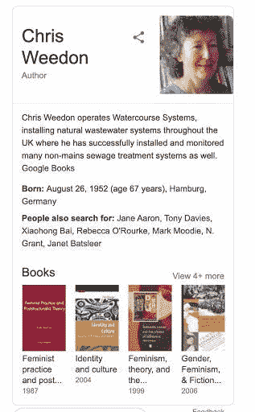
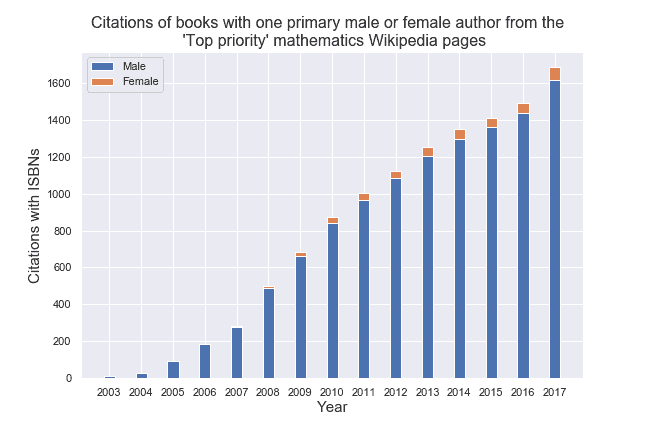
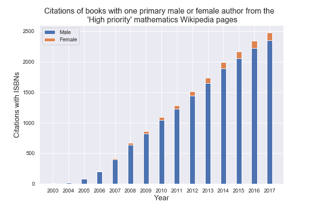
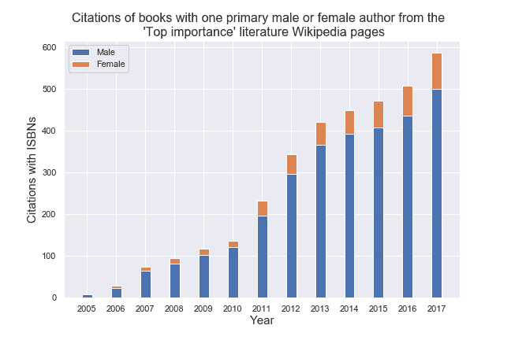
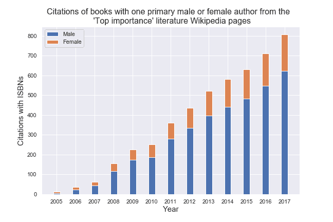

# 性别、技术和开放合作

> 原文：<https://towardsdatascience.com/on-gender-technology-and-open-collaboration-d396bd730caf?source=collection_archive---------46----------------------->

## 维基百科引文研究

一年多前，维基媒体基金会发布了一份长长的列表，列出了所有维基百科引用的出版物(说英语的人通常只想到英文维基百科，但现在有 306 个不同语言的维基百科在 T2)。引文目录包含超过 1500 万条记录，但只是整体的一个子集；没有唯一标识符(例如，书籍使用的 ISBN 或学术论文的 DOI)的源不会出现。不过，这本集子似乎是一个寻找我一直想知道的问题答案的好地方:性别平衡是什么——不是维基百科传记或维基百科编辑的性别平衡，这两者都以 80%以上是男性而闻名——而是维基百科上引用的作者的性别平衡？

维基百科的链接引用为页面上的声明提供了可验证性，并为引用的来源提供了可见性——[潜在的大量可见性](https://undark.org/2020/01/02/wikipedia-footnote-gender-imbalance/)。我想更好地了解那里有什么。

对于我的引文查询，我从英文维基百科的数学引文开始，既是因为我喜欢数学，也是因为我在之前已经查看了[的数学群组，并且知道像](https://medium.com/q-e-d/whos-important-a-tale-from-wikipedia-a370dc6ef078)[数学谱系项目](https://genealogy.math.ndsu.nodak.edu/)这样的工具在识别数学家时非常有帮助。维基百科数学文章列表包含超过 28，000 页——25，000 篇主题文章和 3，000 篇传记。我决定不使用基于姓名的预测工具来识别性别，因为这项工作可能很耗时，所以我不得不限制我的范围。这就是为什么从[数学项目](https://en.wikipedia.org/wiki/Wikipedia:WikiProject_Mathematics)中，我首先只选择了那些被社区认为是“ [top priorit](https://en.wikipedia.org/wiki/Wikipedia:WikiProject_Mathematics/Wikipedia_1.0/Importance) y”(即“文章/主题对其领域极其重要，甚至至关重要”)的页面。

我收集了 239 页最重要的数学页上的引文——总共超过 4000 条引文，其中大约 2750 条有 ISBN。我选择了有一个主要作者或编辑的书，我列出了 1753 个名字(不全是独一无二的；一些作者在不同的书中出现多次和/或同一本书的多次引用)。

我最初认为性别是最难识别的，但我很快发现确定一本书是否有第一作者/编辑是更大的挑战。维基媒体基金会发布的引用数据集不包含作者或书名，只包含参考编号(ISBNs、DOIs 等)，尽管我可以查询 Google Books、Open Library 或 ISBNdb 等服务来返回这些信息，但我对不同服务的结果差异如此之大感到震惊，特别是在确定的名称数量方面。

有一次，我试图自己做一致的评估，比较从不同服务返回的元数据，追踪封面看有多少名字出现，翻阅数字化文本看我在标题页上找到了什么。我花了很多时间做这件事，然后决定这是愚蠢的。

为了这次分析，我选择查看马特·米勒分享的[数据集中找到的作者，他使用](https://medium.com/@thisismattmiller/analyzing-books-cited-in-english-wikipedia-d7520b7838f3) [OCLC 元数据 API](https://www.oclc.org/developer/develop/web-services/worldcat-metadata-api.en.html)收集的英文维基百科上引用的作者和书名记录。如果元数据包含两个或更多的名字——编辑、作者、译者等等——我不认为这本书有第一作者。我不知道返回的信息和维基百科页面上指定的信息有多大差异。数据集不捕获在编辑过的卷中找到的单个作者的姓名，例如，仅捕获编辑的姓名，有时仅捕获几个编辑中的一个编辑(或作者)。

在顶级数学页面的名字中，我将大约 1200 名作者与[维基数据](https://www.wikidata.org/wiki/Wikidata:Main_Page)中的记录进行了匹配，这是一种以机器可读的形式存储信息(例如在维基百科页面上找到的信息)的服务。为此，我使用了 [OpenRefine](http://openrefine.org/) ，一个用于“处理杂乱数据”的开源工具。

虽然不是每个匹配的人都有维基百科页面，但维基百科的记录几乎总是包括性别。这些匹配中的一小部分可能是我所谓的“Weedon matches”，由谷歌将女权主义学者克里斯·威登(Chris Weedon)与废水系统安装人员克里斯·威登(Chris Weedon)的混搭来说明(见信息框)，但我相信大多数是正确的。

我在网上找到了一些简历或提及(一本书或评价我的教授的评论或虚拟国际权威文件 **(** [VIAF](https://viaf.org/) ))证实了大约 400 个不匹配名字的性别——剩下的作者(大约 140 个)，我通过名字和照片来识别，或者在没有照片的情况下，简单地根据名字来识别。我经常依靠代词(“他”或“她”，通常出现在简历中)来识别性别；只使用两种性别会排斥和错误识别那些认同二元之外的人。

更难找到年长的作者——退休的学者，他们不再在他们的机构或个人网页上有网页。那些不属于大学的人更难找到。我从讣告上认出了许多老作品的作者，过去和现在在网上存在的不平衡令人难以忘怀。

在我为只有一个第一作者的书所做的数学引文中，我发现了 1661 个男性和 77 个女性，以及一些我无法合理确定性别的作者(大约十几个)。查看一段时间内累积的引用，可以发现有几年，集合中的女性作者根本不存在。

我还查看了第二层数学页面，那些被视为“高”但不是“最高”优先级的页面:863 个维基百科页面包含 4068 个 ISBN 引用(总共 7384 个引用)。在这些书中，我找到了大约 2500 本书的第一作者:2377 名男性和 125 名女性作者——或者约 5%的女性——还有一些我无法确定的名字。

我翻到英文维基百科文学项目中优先级最高的页面，看看这种平衡是否更好。我收集了被指定为“最重要”的 108 页文献中的图书引文(仅超过 850 条引文)。从这个集合中，我确定了大约 600 个第一作者引用，性别划分为 507 个男性和 88 个女性(15%为女性)。

我看了看文献项目中的第二层页面——那些被认为“高”但不是“最高”重要性的页面。在 1167 次图书引用中，我确定了 644 名男性和 185 名女性主要作者(其余的书目——约 330 本——有两个或更多作者，或我无法确定的作者)。在这组页面中，女性作者占所有单人著作的 22%，其中包括几名女性作为页面主题(顶层页面的页面主题中没有女性)。在第三层“中等重要性”中，女性作者约占单作者引文的 27%。

我很好奇我是否能在诗歌项目中找到同样的模式。尽管一些维基百科页面与文学和诗歌都相关，但重要性水平根据每个页面对特定领域的重要性而有所不同。对于诗歌，在最重要的一层，我发现 300 个男性作者和 67 个女性作者的引用(18%)。在第二层，我发现了 578 名男性和 156 名女性(21%)。在第三层，我找到了 1272 名男性和 390 名女性作者(23%)。不同层次之间的差异较小，但这种模式——随着页面重要性的降低，女性作者的比例越来越高——与我在文学作品中看到的一致。

维基百科在传播知识方面发挥着巨大的作用，任何偏见都同样具有破坏性。谁的作品被引用、被引用的频率以及被引用的显著程度，会对我们认为谁是专家以及我们根本看不到谁(尽管他们的工作非常出色)产生重大影响。如果这些数字是社会偏见的一面镜子，那么在平等地听到女性的声音之前，我们还有很长的路要走。

延伸阅读:

米勒、马特《分析英文维基百科引用的书籍》[https://medium . com/@ thisismatmiller/Analyzing-Books-Cited-in-English-Wikipedia-d 7520 b 7838 f 3](https://medium.com/@thisismattmiller/analyzing-books-cited-in-english-wikipedia-d7520b7838f3)

米丽娅姆·热地；Taraborelli，Dario (2018):维基百科中带有标识符的引文的可访问性和主题。figshare。数据集。https://doi.org/10.6084/m9.figshare.6819710.v1

如果我的电子表格有用或有趣，我会把它们放在这里。这些表格包含来自维基媒体[引用数据集](https://doi.org/10.6084/m9.figshare.6819710.v1)的引用，马特·米勒收集的相关作者/书名[书籍元数据](https://medium.com/@thisismattmiller/analyzing-books-cited-in-english-wikipedia-d7520b7838f3)，以及我自己关于作者性别的笔记和我用来确定作者性别的来源。