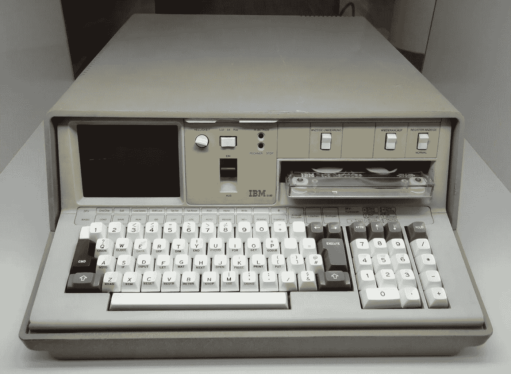
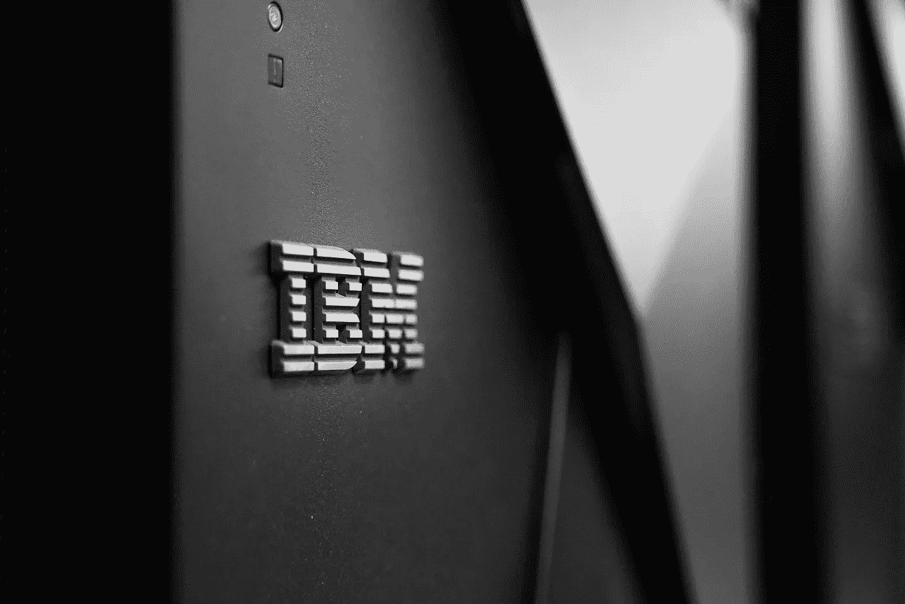
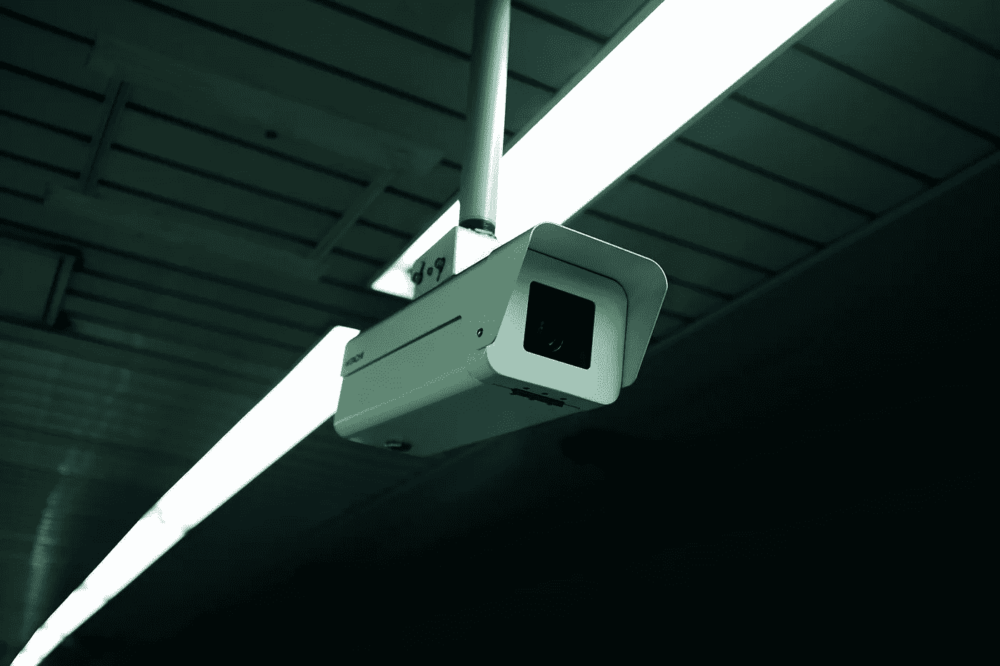

# 关于 IBM 离开面部识别行业

> 原文：<https://towardsdatascience.com/on-ibm-leaving-the-facial-recognition-industry-3b76ef108b91?source=collection_archive---------58----------------------->

## 它会信守承诺吗？

根据[NBC 新闻的一篇](https://www.nbcnews.com/tech/security/ibm-steps-back-facial-recognition-technology-calls-reforms-n1228186)文章*报道，在*对抗议警察暴行和制度性种族主义的回应中，IBM“[周一](https://www.ibm.com/blogs/policy/facial-recognition-susset-racial-justice-reforms/)呼吁国会颁布改革以推进种族公正和打击制度性种族主义”。此外，IBM 首席执行官 Arvind Krishna 表示，在多年来备受关注后，该公司将从面部识别技术业务中退出。

第一台便携式计算机 IBM 5100 的图像。(桑德斯坦/ [CC BY-SA](https://creativecommons.org/licenses/by-sa/3.0) )

Krishna 发布了以下关于使用 IBM 技术的声明:

> "[IBM 坚决反对并且不会宽恕将任何技术(包括其他供应商提供的面部识别技术)用于大规模监控、种族定性、侵犯基本人权和自由，或者用于任何与我们的价值观以及信任和透明原则不一致的目的](https://www.theguardian.com/technology/2020/jun/09/ibm-quits-facial-recognition-market-over-law-enforcement-concerns)"

虽然这绝对是朝着正确方向迈出的一步，但它并没有消除 IBM 在面部识别技术的利用和发展方面令人担忧的过去。

IBM 与 NYPD 有着非常紧密的联系和历史，特别是在警察局希望在纽约全城安装监控摄像头方面。

NYPD 对监视普通纽约居民活动的着迷导致了与 IBM 的合作，共同开发允许 NYPD 根据肤色对个人进行分类的技术。这一切都是通过秘密合作进行的，只是通过*截取者*获得了[机密公司文件](https://www.documentcloud.org/documents/4452844-IBM-SVS-Analytics-4-0-Plan-Update-for-NYPD-6.html)才公之于众。

卡森·马斯特森在 [Unsplash](https://unsplash.com/s/photos/ibm?utm_source=unsplash&utm_medium=referral&utm_content=creditCopyText) 上的照片

鉴于美国国内种族关系紧张和系统性种族主义的状况，这种类型的伙伴关系对有色人种尤其具有破坏性。英国最大的警察部队——伦敦警察厅(Metropolitan Police)进行了一项面部识别技术测试。*独立*发现[产生的](https://www.independent.co.uk/news/uk/home-news/met-police-facial-recognition-success-south-wales-trial-home-office-false-positive-a8345036.html)98%的警报都是误报，根据[报告](https://www.independent.co.uk/news/uk/home-news/met-police-facial-recognition-success-south-wales-trial-home-office-false-positive-a8345036.html)。

英国的另一支警察部队南威尔士警察使用这种技术也产生了非常相似的结果。根据 *The Independent* 的同一篇文章，自 2017 年 6 月以来，系统“[在 15 次部署中返回了超过 2400 个误报，并且在发布时仅发现“](https://www.independent.co.uk/news/uk/home-news/met-police-facial-recognition-success-south-wales-trial-home-office-false-positive-a8345036.html) [234 个警报——不到 10%](https://www.independent.co.uk/news/uk/home-news/met-police-facial-recognition-success-south-wales-trial-home-office-false-positive-a8345036.html)”实际上是正确的。

根据[电子前沿基金会(EFF)](https://www.eff.org/pages/face-recognition) 通过爱荷华州交通部，针对欺诈性驾驶执照，通过以下步骤进行生物特征数据提取:

1.  *图像被捕获*
2.  *确定眼睛位置*
3.  *图像被转换为灰度并被裁剪*
4.  *图像被转换成搜索引擎用于面部比较结果的模板*
5.  *使用复杂的算法搜索和匹配图像，将模板与文件上的其他模板进行比较*
6.  *重复证照被查造假*

多年来，面部识别技术一直因缺乏实用性和产生真正肯定的能力而受到批评。如前所述，IBM 放弃该行业的转变是一个积极的举措，但这并不表明这是一个永久的举措，这为该公司在获得批准的情况下公开回归敞开了大门。

关于象征性的姿态，这当然是一个积极的发展。然而，警察和国家组织的错误仍然存在，几乎没有什么可以阻止 NYPD 等警察部门寻求其他类似于 IBM 的公司的支持，以生产面部识别和人工智能技术。根据*卡耐基国际和平基金会* (CEIP)的一篇论文，截至 2019 年 9 月发表时，“[最大的非中国人工智能监控技术供应商是日本 NEC 公司](https://carnegieendowment.org/2019/09/17/global-expansion-of-ai-surveillance-pub-79847)。

照片由[亚历山大·奈特](https://unsplash.com/@agkdesign?utm_source=unsplash&utm_medium=referral&utm_content=creditCopyText)在 [Unsplash](https://unsplash.com/s/photos/surveillance?utm_source=unsplash&utm_medium=referral&utm_content=creditCopyText) 上拍摄

Clearview AI 是一家利润丰厚的公司，负责开发面部识别应用程序，并处于潜在消除隐私的最前沿"[正如我们所知](https://www.nytimes.com/2020/01/18/technology/clearview-privacy-facial-recognition.html)"据*纽约时报*最近报道了[新冠肺炎·疫情](https://www.cnet.com/news/senator-questions-clearview-ai-over-coronavirus-tracking-plans/)和美国反对制度种族主义的抗议活动。在过去几年中，Clearview AI 一直在向[外国政府](https://www.cnet.com/news/clearview-ai-probed-over-facial-recognition-sales-to-foreign-governments/)、[国内执法部门](https://www.cnet.com/news/clearview-ai-had-entire-client-list-stolen-in-data-breach/)等出售面部识别技术，这引发了人们的担忧。

面部识别技术功能的缺乏应该足以使其不能在公共场合使用，但在过去几周席卷全国的抗议活动之后，看到它成为更常用的工具也就不足为奇了。

虽然 IBM 已经正式停止了这些技术的生产，但 NYPD 等部门仍然可以通过与 IBM 在过去 15 年左右的时间里的合作来获得开发成果，如果 IBM 最终决定在未来重返该行业，这也不足为奇。