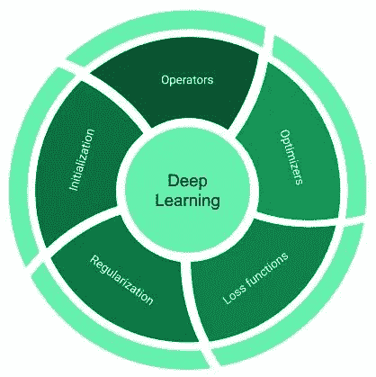
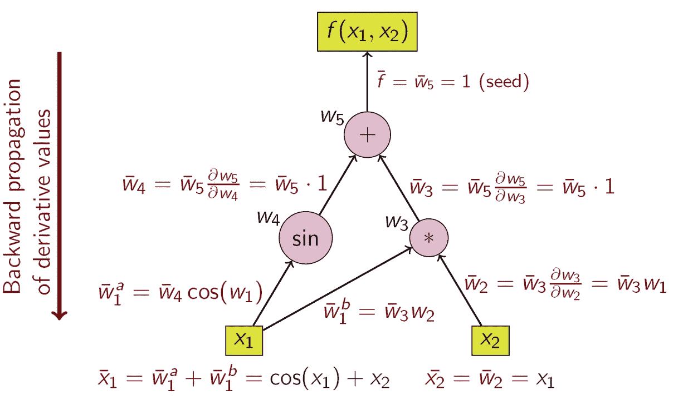
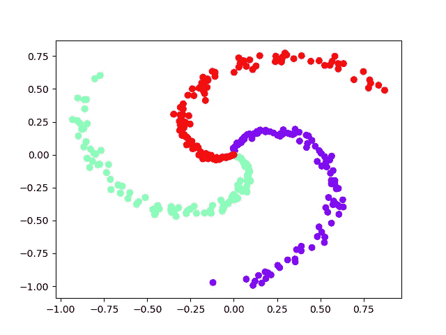
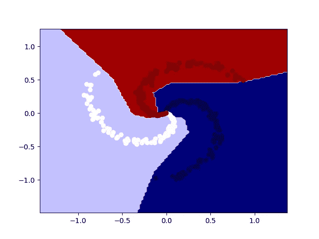

# 用 Python 从零开始实现深度学习库

> 原文：<https://towardsdatascience.com/on-implementing-deep-learning-library-from-scratch-in-python-c93c942710a8?source=collection_archive---------9----------------------->

## 理解深度学习平台基本构件的初学者指南

深度学习已经在很短的时间内从简单的神经网络发展到相当复杂的架构。为了支持这种快速扩张，许多不同的深度学习平台和库被开发出来。这些库的主要目标之一是为构建和训练深度学习模型提供易于使用的界面，这将允许用户更多地关注手头的任务。为了实现这一点，可能需要将核心实现单元隐藏在几个抽象层之后，这使得难以理解深度学习库所基于的基本底层原则。因此，本文的目标是提供关于深度学习库的构建模块的见解。我们首先浏览深度学习的一些背景知识，以了解功能需求，然后使用 NumPy 浏览 python 中一个简单而完整的库，该库能够对神经网络模型(非常简单的类型)进行端到端训练。在这个过程中，我们将学习深度学习框架的各个组件。这个库只有不到 100 行代码，因此应该很容易理解。完整的源代码可以在 https://github.com/parmeet/dll_numpy 找到

# 背景

通常，深度学习计算库(如 TensorFlow 和 PyTorch)由下图所示的组件组成。



深度学习框架的组件

## 经营者

也可与层互换使用，它们是任何神经网络的基本构建块。运算符是转换数据的向量值函数。一些常用的操作符是线性、卷积和池化等图层，以及 ReLU 和 Sigmoid 等激活函数。

## 优化者

他们是任何深度学习图书馆的骨干。它们提供了必要的配方，使用它们相对于优化目标的梯度来更新模型参数。一些著名的优化器有 SGD、RMSProp 和 Adam。

## 损失函数

它们是封闭形式且可微分的数学表达式，用作手头问题的优化目标的替代。例如，交叉熵损失和铰链损失是分类任务常用的损失函数。

## 初始值设定项

它们在训练开始时提供模型参数的初始值。初始化在训练深度神经网络中起着重要的作用，因为不好的参数初始化会导致收敛缓慢或不收敛。有许多方法可以初始化网络权重，比如从正态分布中抽取小的随机权重。你可以看看 https://keras.io/initializers/的综合名单。

## 正则化子

它们提供了必要的控制机制来避免过度拟合和促进泛化。人们可以通过显性或隐性措施来调节过度拟合。显式方法对权重施加结构约束，例如，最小化它们的 L1 范数和 L2 范数，分别使权重更稀疏和均匀。隐式度量是对中间表示进行转换的专用运算符，或者通过显式规范化(例如 BatchNorm)，或者通过更改网络连接(例如 DropOut 和 DropConnect)来进行转换。

> 上述组件基本属于库的前端部分。对于前端，我指的是向用户公开的组件，以便他们有效地设计神经网络架构。在后端，这些库为自动计算损失函数相对于模型中各种参数的梯度提供支持。这种技术通常被称为自动微分(AD)。

## 自动微分

每个深度学习库都提供了一种 AD 风格，以便用户可以专注于定义模型结构(计算图)并将梯度计算的任务委托给 AD 模块。让我们通过一个例子来看看它是如何工作的。假设我们想要计算以下函数相对于其输入变量 *X₁* 和 *X₂* 的偏导数:

```
***Y =* sin(*x₁*)*+X₁*X₂***
```

下图是我从[https://en.wikipedia.org/wiki/Automatic_differentiation](https://en.wikipedia.org/wiki/Automatic_differentiation)那里借来的，展示了它的计算图和用链式法则计算导数。



计算图和用链式法则计算导数

你在上图中看到的是一种逆向模式自动微分(AD)的味道。众所周知的反向传播算法是上述算法的特例，其中顶部的函数是损失函数。AD 利用了这样一个事实，即每个复合函数都由初等算术运算和初等函数组成，因此导数可以通过递归地将链规则应用于这些运算来计算。

# 履行

在前面的部分中，我们已经检查了所有必要的组件，以提出我们的第一个可以进行端到端训练的深度学习库。为了简单起见，我将模仿****[Caffe](https://github.com/BVLC/caffe)**库的设计模式。这里我们定义了两个抽象类:一个“函数”类和一个“优化器”类。此外，还有一个“Tensor”类，它是一个简单的结构，包含两个 NumPy 多维数组，一个用于保存参数值，另一个用于保存它们的梯度。各种层/操作符中的所有参数都是“张量”类型。在我们深入探讨之前，下图提供了该库的高级概述。******

************

******图书馆的 UML 图******

******在撰写本文时，该库附带了线性层、ReLU 激活和 SoftMaxLoss 层以及 SGD 优化器的实现。因此，该库可用于训练包括全连接层和 ReLU 非线性的分类模型。现在让我们来看看两个抽象类的一些细节。******

******“Function”抽象类为操作者提供了一个接口，定义如下:******

******抽象函数类******

******所有操作符都是通过继承“Function”抽象类来实现的。每个操作符必须提供一个 **forward(…)** 和 **backward(…)** 方法的实现，并可选地实现 **getParams** 函数以提供对其参数的访问(如果有的话)。 **forward(…)** 方法接收输入，并通过操作符返回其转换。它还将执行计算梯度所需的任何内务处理。 **backward(…)** 方法接收损失函数相对于算子输出的偏导数，并实现损失相对于算子输入和参数(如果有)的偏导数。注意 **backward(…)** 函数本质上为我们的库提供了执行自动微分的能力。******

****为了使事情具体化，让我们看看线性函数的实现，如下面的代码片段所示:****

****线性函数的实现****

******forward(…)** 函数实现形式 **Y = X*W+b** 的转换并返回。它还存储输入 X，因为这是计算后向函数中 **W** 的梯度所需要的。 **backward(…)** 函数接收损耗对输出 **Y** 的偏导数 **dY** ，并实现对输入 **X** 和参数 **W** 和 **b** 的偏导数。此外，它返回关于输入 **X** 的偏导数，该偏导数将被传递到前一层。****

****抽象的“优化器”类为优化器提供了一个接口，定义如下:****

****抽象优化器类****

****所有优化器都是通过继承“Optimizer”基类来实现的。具体的优化类必须提供**步骤()**函数的实现。该方法使用模型参数相对于我们正在优化的损失的偏导数来更新模型参数。在 **__init__(…)** 函数中提供了对各种模型参数的引用。注意重置渐变的常用功能是在基类本身实现的。****

****为了使事情具体化，让我们看看动量和重量衰减的随机梯度下降(SGD)的实现。****

## ****开始真正的东西****

****为此，我们拥有使用我们的库来训练(深度)神经网络模型的所有成分。为此，我们需要以下内容:****

*   ****这是我们的计算图****
*   ****数据和目标:这是我们的训练数据****
*   ******损失函数:**我们优化目标的替代****
*   ******优化器:**更新模型参数****

****下面的伪代码描述了一个典型的训练周期:****

```
****model** *#computation graph*
**data,target** #*training data*
**loss_fn** *#optimization objective*
**optim** *#optimizer to update model parameters to minimize loss***Repeat:**#until convergence or for predefined number of epochs
   **optim.zeroGrad()** *#set all gradients  to zero*
   **output = model.forward(data)** *#get output from  model*
   **loss   = loss_fn(output,target)** *#calculate loss*
   **grad   = loss.backward()** *#calculate gradient of loss w.r.t output*
   **model.backward(grad)** *#calculate gradients for all the parameters*
   **optim.step()** *#update model parameters***
```

****虽然不是深度学习库的必要成分，但将上述功能封装在一个类中可能是一个好主意，这样我们就不必在每次需要训练新模型时重复自己(这符合像 [Keras](https://keras.io/) 这样的高级抽象框架的哲学)。为此，让我们定义一个类“模型”，如下面的代码片段所示:****

****该类提供以下功能:****

*   ******计算图:**通过 **add(…)** 功能，可以定义一个顺序模型。在内部，该类将简单地将所有操作符存储在一个名为**calculation _ graph**的列表中。****
*   ******参数初始化:**在训练开始时，该类将使用从均匀分布中抽取的小随机值自动初始化模型参数。****
*   ******模型训练:**通过 **fit(…)** 函数，该类提供了一个训练模型的通用接口。这个函数需要训练数据、优化器和损失函数。****
*   ******模型推断:**通过 **predict(…)** 函数，该类提供了一个通用接口，用于使用经过训练的模型进行预测。****

****由于这个类不是深度学习的基础构建块，我在一个名为 utilities.py 的单独模块中实现了它。注意， **fit(…)** 函数使用了 **DataGenerator** 类，其实现也在 utilities.py 模块中提供。这个类只是我们训练数据的包装器，为每次训练迭代生成小批量数据。****

## ****训练我们的第一个模型****

****现在让我们来看最后一段代码，它使用建议的库来训练神经网络模型。受 [Andrej Karapathy](https://cs.stanford.edu/people/karpathy/) 的[博文](http://cs231n.github.io/neural-networks-case-study/)的启发，我打算在螺旋数据上训练一个隐层神经网络模型。utilities.py 文件中提供了生成数据及其可视化的代码。****

********

****三类螺旋数据****

****一个三级螺旋数据如上图所示。数据是非线性可分的。因此，我们希望我们的单隐层神经网络能够学习非线性决策边界。综上所述，下面的代码片段将训练我们的模型。****

****用于训练神经网络模型的端到端代码****

****下图显示了相同的螺旋数据以及训练模型的决策边界。****

********

****螺旋数据与训练模型的相应决策边界****

# ****结束语****

****随着深度学习模型的复杂性不断增加，这些库在功能和底层实现方面都倾向于以指数速度增长。也就是说，非常核心的功能仍然可以在相对较少的代码行中实现。尽管该库可用于训练端到端神经网络模型(非常简单的类型)，但它仍在许多方面受到限制，这些方面使深度学习框架可用于各种领域，包括(但不限于)视觉、语音和文本。也就是说，我认为这也是一个派生基本实现和添加缺失功能的机会，以获得您的实践经验。您可以尝试实现的一些事情有:****

*   ******运算符:**卷积池等。****
*   ******优化者:**亚当 RMSProp 等。****
*   ******调整人员:**批次正常退出等。****

****我希望这篇文章能让你一窥当你使用任何深度学习库来训练你的模型时，在引擎盖下会发生什么。感谢您的关注，我期待着您的评论或评论区的任何问题。****