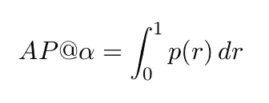
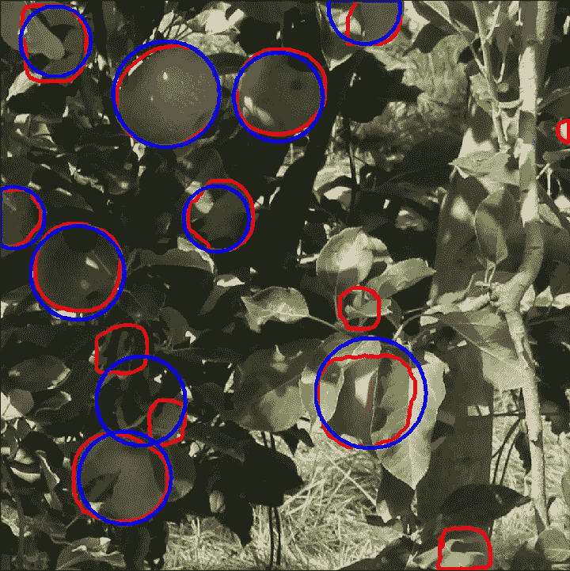

# 具有工作示例的对象检测度量

> 原文：<https://towardsdatascience.com/on-object-detection-metrics-with-worked-example-216f173ed31e?source=collection_archive---------2----------------------->

## AP、mAP 和 AP50 以及其他度量都通过一个示例进行了说明。

照片由 [XPS](https://unsplash.com/@xps?utm_source=unsplash&utm_medium=referral&utm_content=creditCopyText) 在 [Unsplash](https://unsplash.com/s/photos/computer?utm_source=unsplash&utm_medium=referral&utm_content=creditCopyText) 上拍摄

平均精度(AP)和平均平均精度(mAP)是用于评估对象检测模型的最流行的度量，例如更快的 R_CNN、掩模 R-CNN 和 YOLO 等等。相同的指标也用于评估 COCO 和 PASCAL VOC 挑战赛等比赛中的提交材料。

我们可以从 AP 中导出其他度量。例如，mAP、AP50、AP75 和 AP[.5:.5:.

在本文中，我们将仔细阅读这些概念，以便在一天结束时，您能够清楚地理解它们。下图(图 1 和图 2)显示了这些指标在一些最新(SOTA)模型中的使用情况。

图 1:分别在掩码 RCNN ( [源](https://arxiv.org/pdf/1703.06870.pdf))和 YOLOv3 ( [源](https://pjreddie.com/media/files/papers/YOLOv3.pdf))中使用的度量。

图 COCO 挑战赛中使用的一些指标([来源](https://cocodataset.org/#detection-eval)

在低层次上，评估对象检测器的性能归结为确定检测是否正确。

*术语定义:*

*   **真阳性(TP)** —模型做出的正确检测。
*   **假阳性(FP)** —检测器的错误检测。
*   **假阴性(FN)** —物体检测器遗漏(未检测到)的基本事实。
*   **真阴性(TN)**—这是模型正确检测不到的背景区域。在对象检测中不使用该度量，因为在准备注释时没有明确地注释这些区域。

我们需要另一个名为 T22 交集/并集(IoU)的辅助指标来以更可量化的方式定义这些术语。

# 并集上的交集

对象检测中的 IoU 度量评估地面 *(* `*gt*` *)* 真实与预测 *(* `*pd*` *)* 之间的重叠程度。基本事实和预测可以是任何形状-矩形盒、圆形或不规则形状)。其计算方法如下:

用图解法，IoU 定义如下(相交面积除以地面实况和预测框之间的联合面积。

图 3:欠条(来源:作者)

IoU 的范围在 0 和 1 之间，其中 0 表示没有重叠，1 表示`*gt*`和`*pd*`之间完全重叠。IoU 度量通过阈值处理是有用的；也就是说，我们需要一个阈值(比如说α)来确定检测是否正确。

对于α处的 IoU 阈值，真阳性(TP)是对`IoU(*gt,pd)*≥ α`的检测，假阳性是对`IoU(*gt,pd)*< α`的检测。假阴性是与`IoU(*gt,pd)*< α.`一起错过的`*gt*` 地面真相

清楚了吗？如果不是，下图应该会使定义更清楚。

考虑 IoU 阈值，α = 0.5，则 TP、FP 和 FNs 可以如下图 4 所示确定。

图 4:通过 IoU 阈值识别 TP、FP 和 FN。

**注意:**如果我们把 IoU 阈值提高到 0.86 以上，第一个实例就是 FP；如果我们将 IoU 阈值降低到 0.24 以下，第二个实例就变成了 TP。

**备注:**将检测标记为 TP 或 FP 以及将地面实况标记为 FN 的决定完全取决于 IoU 阈值α的选择。例如，在上图中，如果我们将阈值降低到 0.24 以下，那么第二个图像中的检测将变为 TP，如果 IoU 阈值升高到 0.86 以上，则第一个图像上的检测将为 FP。

# 精确度和召回率

**精度**是模型仅识别相关对象的精确程度。它是 TPs 与模型进行的所有检测的比率。

**回忆**测量模型检测所有基本事实的能力——所有基本事实中的 TPs 命题。

等式 1:精确度和召回率

一个模型如果精度高，召回率高，就说是好的。一个完美的模型有零 FNs 和零 FPs(精度=1，召回=1)。通常，获得一个完美的模型是不可行的。

# **精确 x 召回曲线(PR 曲线)**

注意:在继续之前，请看这个图并阅读它的标题。

这是使用[屏蔽 R-CNN](https://arxiv.org/pdf/1703.06870.pdf) 进行的检测。它显示了一个边界框(虚线)、分割遮罩、类(水果)和置信度得分(0.999)。对象检测模型通常输出边界框、置信度得分和类别。置信度值是模型在检测中的置信度，其范围在 0 和 1 之间。

就像前面 IoU 描述的一样，置信度评分也依赖于阈值。提高置信度得分阈值意味着模型将错过更多的对象(更多的 fn，因此低召回和高精度)，而低置信度得分将意味着模型获得更多的 FPs(因此低精度和高召回)。这意味着我们需要在精确度和召回率之间进行权衡。

精确度-召回率(PR)曲线是不同置信度下精确度和召回率的曲线图。对于一个好的模型来说，即使置信度变化，精确度和召回率仍然很高。

# 平均精度

AP@α是在α IoU 阈值下评估的精确召回曲线(AUC-PR)下的面积。形式上定义如下。

等式 2:平均精度的定义

**符号:** AP@α或 APα表示 AP 精度在α IoU 阈值处评估。如果您看到 AP50 和 A75 这样的指标，它们分别表示在 IoU=0.5 和 IoU=0.75 时计算的 AP。

PR 曲线下的高面积意味着高召回率和高精度。自然，PR 曲线是一个锯齿形的曲线。这意味着它不是单调递减的。我们可以使用插值方法消除这一特性。我们将在下面讨论其中的两种插值方法:

1.  *11 点插值法*
2.  *全点插补方法*

**11 点插值法**

11 点 AP 是在 11 个等间隔的标准回忆水平，即 0.0，0.1，0.2，.。。1.0.它被定义为

等式 3: 11 点插值公式

其中，R = {0.0，0.1，0.2，.。。1.0}和

等式 4:支持等式 3

即**召回值处的插值精度，r —** 它是任何召回值 r'≥ r 的最高精度，如果这个没有意义，我向你保证，一旦我们通过一个例子，它就完全有意义了。

**所有点插值法**
在这种情况下，对所有位置(回忆值)进行插值，即，

等式 5:所有点插值方法

# 平均精度

**备注(AP 和班级数):** AP 是针对每个班级单独计算的。这意味着 AP 值和类的数量一样多(不严格)。这些 AP 值被平均以获得**平均精度(mAP)** 度量。

**定义:**平均精度(mAP)是所有类的 AP 值的平均值。

**备注(AP 和 IoU)** :如前所述，AP 是在给定的 IoU 阈值α下计算的。通过这种推理，可以在一个阈值范围内计算 AP。[微软 COCO](https://arxiv.org/pdf/1405.0312.pdf) 计算了给定类别/类在 10 个不同 IoU 下的 AP，范围从 50%到 95%，步长为 5%，通常表示为 AP@[.50:.5:.95]。 [Mask R-CNN](https://arxiv.org/pdf/1703.06870.pdf) 报道 AP@[.50:.5:.上面写着

> “我们报告了标准 COCO 指标，包括 AP(IoU 阈值的平均值)、AP50、AP75 以及 APS、APM、APL(不同规模的 AP)”—摘自 [Mask R-CNN 论文](https://arxiv.org/pdf/1703.06870.pdf)

为了使所有这些事情更清楚，让我们来看一个例子。

# 例子

考虑下面图 5 中显示的 3 个图像。它们包含 12 个检测(红色方框)和 9 个基本事实(绿色)。每个检测都有一个由字母和模型置信度标记的类别。在本例中，假设所有检测都属于同一对象类别，IoU 阈值设置为α= 50%。IoU 值如下表 1 所示。

图 5:检测同类对象的模型。有 12 个检测和 9 个地面真相。

**备注(多次检测)**:例如图像 1 中的 **c，d，图像 2** 中的 **g，f，图像 3** 中的 **i，k。对于类似的多个检测，置信度最高的检测标记为 TP，所有其他检测标记为 FPs，前提是该检测具有 IoU≥阈值的真值框。这意味着:**

*   **c 和 d 成为 FPs** 是因为它们都不满足阈值要求。 *c* 和 *d* 分别有 47%和 42%的欠条，而要求的是 50%。
*   **g 是 TP，f 是 FP** 。两者的 iou 都大于 50%，但 *g* 的信心为 97%，而 *f* 的信心为 96%。
*   那 **i** 和 **k** 呢？

> 图像中同一物体的多次检测被视为错误检测，例如，单个物体的 5 次检测被视为 1 次正确检测和 4 次错误检测— **来源:PASCAL VOC 2012 论文**。
> 
> 一些检测器可以输出与单个地面实况重叠的多个检测。对于这些情况，具有最高置信度的检测被认为是 TP，而其他的被认为是 FP，如 PASCAL VOC 2012 挑战所应用的。-来源:**对象检测算法性能指标调查论文。**

表 1: IoU 阈值，α = 50%。cumTP 和 cumFP 分别是 TP 和 FP 列的累积值。all _ detections = cumTP+cumFP。

**重要提示:**在填写 *cumTP、cumFP、all_detection、precision 和 recall 之前，*您需要按照置信度降序对表格值进行排序。精度是累计/所有检测，召回是累计/实际数量。我们有九个基本事实。

# **11 点插补**

为了使用 11 点插值计算 AP@0.5 的近似值，我们需要对 R 中召回值的精度值求平均值(见等式 3)，即召回值 0.0、0.1、0.2、.。。1.0.如下图 6 所示。

图 6:左:所有精确召回值的图表。右图:匹配以下召回值的 11 个精度值:0.0，0.1，…，1.0。

# 所有点插值

根据等式 5 中的定义，我们可以使用以下所有点插值法计算 AP@50。

图 7:左:覆盖原始 PR 曲线的所有点插值曲线(红色)。右图:所有点插值的区域

简而言之，所有点插值包括计算和求和图 1.3b 中四个区域(R1、R2、R3 和 R4)的面积值，也就是说，

仅此而已！

**备注:**回想一下，我们说过 AP 是为每个类计算的。我们的计算是针对一门课的。对于几个类别，我们可以通过简单地取不同类别的结果 AP 值的平均值来计算 mAP。

这是另一篇关于对象检测指标的文章

 [## 混淆矩阵和目标检测

### 一种评估实例分割模型性能的度量

towardsdatascience.com](/confusion-matrix-and-object-detection-f0cbcb634157) 

# 结论

看完这篇文章，希望你很好的理解 AP，mAP，PR 曲线。您还注意到 IoU 是一个重要的概念，因为如果不基于 IoU 定义阈值，我们就无法定义这些指标。我们还了解到，AP 是按类计算的，得到的 AP 值的平均值就是地图。对于不同的 IoU 阈值，也可以计算 AP。

同样重要的是要注意，预测掩码不一定是矩形框。它可以是任何形状，特别是被检测物体的形状。下图显示了形状不规则的检测示例。

图 8:基本事实(蓝色圆圈)和检测(红色遮罩)。预测不是规则形状的面具。

如果你觉得这篇文章很有帮助，并且想了解 Python 的实现，请给我写信。我个人资料上的电子邮件。

# 更多文章

 [## 7 个月的关系，WhatsApp 消息分析

### 使用 Python 分析 WhatsApp 数据。如此简单。任何人都可以跟随。

towardsdatascience.com](/7-months-of-a-relationship-whatsapp-messages-analyzed-e5c34b8aaa63)  [## 使用 Selenium 的 Web 抓取电子商务网站

### 抓取网上书店的一个简单例子。

towardsdatascience.com](/web-scraping-e-commerce-website-using-selenium-1088131c8541) 

# 参考

*   [https://github.com/rafaelpadilla/Object-Detection-Metrics](https://github.com/rafaelpadilla/Object-Detection-Metrics)

在 https://medium.com/@kiprono_65591/membership[加入 medium](https://medium.com/@kiprono_65591/membership)可以全面了解 Medium 上的每个故事。

你也可以在我发文章的时候通过这个链接把文章发到你的邮箱里:【https://medium.com/subscribe/@kiprono_65591 

一如既往地感谢您的阅读:-)