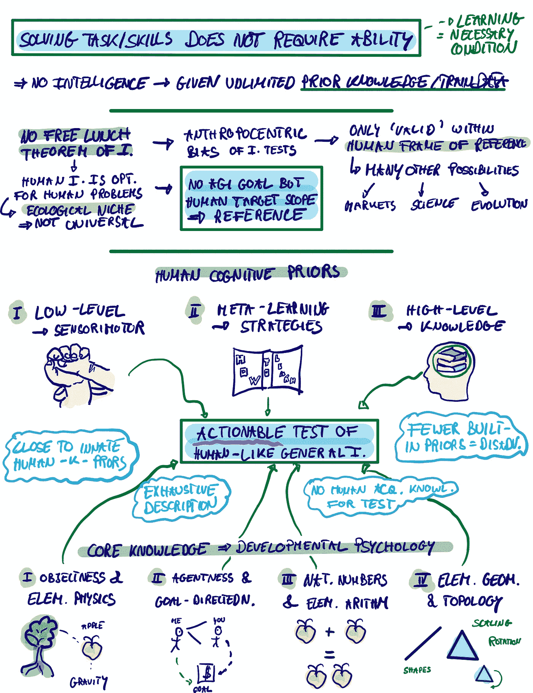
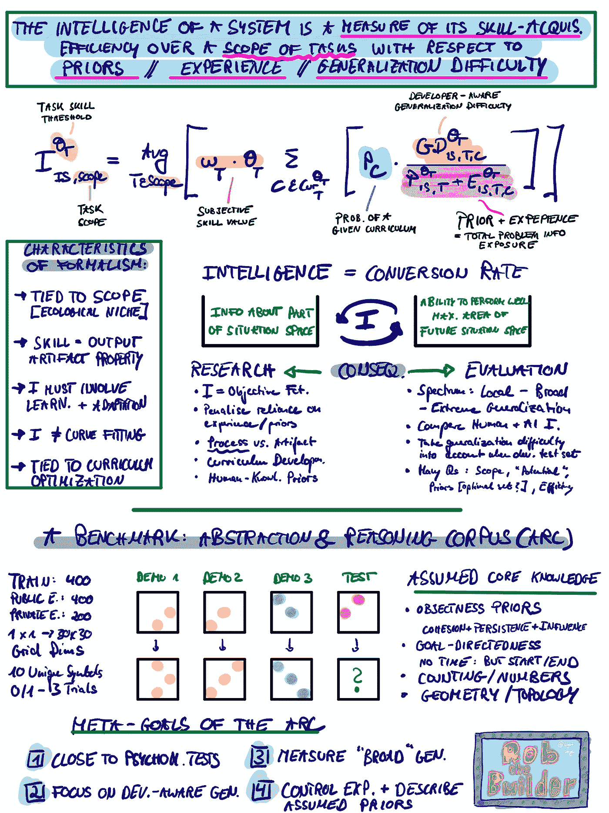
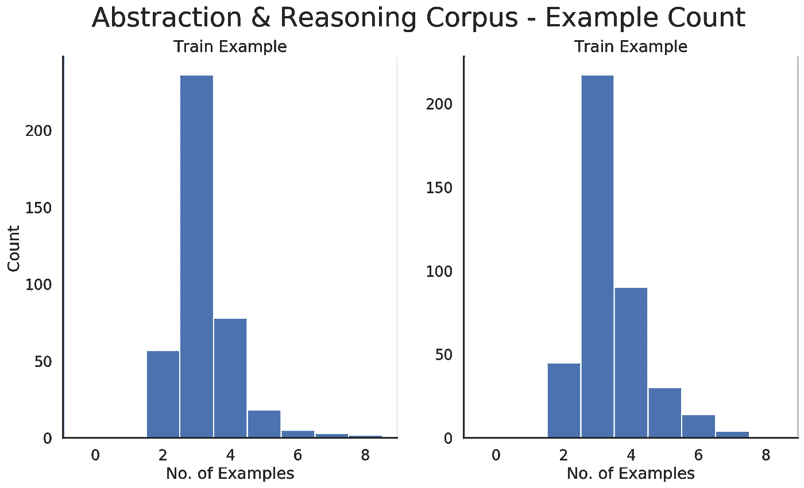

# F. Chollet (2019)的《论智力的衡量》

> 原文：<https://towardsdatascience.com/on-on-the-measure-of-intelligence-by-f-chollet-2019-9c78f8546dc4?source=collection_archive---------32----------------------->

## *走向心理测量&智能系统基于能力的评估*

上周 [Kaggle 宣布了一项新的挑战](https://www.kaggle.com/c/abstraction-and-reasoning-challenge)。这是一个在许多方面都不同的挑战。它基于抽象和推理语料库&，并附有一篇由 Francois Chollet 撰写的[近期论文。在这项工作中，Chollet 强调了当前人工智能研究议程的几个缺点&主张对智能系统进行**心理测量&能力评估，这允许标准化&可靠的比较**。更重要的是，它引入了一个*可操作的*类人一般智力的定义，该定义基于先验、经验和推广难度的概念。这个定义可以被研究团体用来衡量进展和为一个共同的目标而共同努力。读完论文后，在我们的阅读小组中讨论(你可以在这里查看海纳·斯皮斯的](https://arxiv.org/abs/1911.01547)[演讲](https://github.com/RobertTLange/flexible-learning-group/blob/master/presentations/11_2019_Chollet.pdf))以及重读，我的头脑仍然在整理知识内容。所以请继续关注我&让我给你一个 64 页的金矿的自以为是的总结。我还稍微探索了一下抽象的&推理语料库基准，所以如果你想开始处理智能，请留下来！

**机器学习研究的进展绝对不是为了寻找下一个性感的技能或游戏。**但这种感觉时常如此。DeepBlue、AlphaGo、OpenAI 的 Five、AlphaStar 都是大规模公关活动的例子，它们在“成功”宣布后不久就被批评缺乏普遍性。每一次“技能球”被推得更远…到下一个挑战性的游戏(也许是为了某种心智理论合作多智能体学习的 Hanabi？).但是我们最终会在哪里？解决每个游戏的独立算法不一定能推广到更广泛的类似人类的挑战。游戏只是一个人工子集，并不代表我们物种生态位的全部(这允许快速的数据生成)。简而言之:智力不仅仅是学习技能的集合。因此，人工智能研究社区必须确定一个共同的目标——一个一致的智能目标定义。

从历史上看，有许多测量智力的尝试——或多或少有些重叠。Chollet 的论文首先回顾了两个主要支柱:基于技能和基于能力的智力评估。他认为，虽然技能是智能系统的重要输出，但它们仅仅是人工制品。另一方面，能力允许我们扩大可能的技能输出空间。通过学习的魔力(例如，基于进化/梯度、基于可塑性、基于神经动力学)，智能系统能够将先前的知识和经验与新的情况相结合。这种适应性的&面向任务的和非常有条件的过程可能最终受到智力的症结的影响。

对我来说，显而易见的是，学习和相关的特定领域归纳偏差的出现(比如我们的身体和神经系统)必定是智力的核心。它跨越了所有的时间尺度，并与[杰夫·克伦](https://slideslive.com/38924020/how-alternatives-to-conventional-neural-networks-loosely-inspired-by-biology)、[大卫·哈](https://slideslive.com/38922871/invited-talk-innate-bodies-innate-brains-and-innate-world-models)以及布莱斯·阿格拉在 NeurIPS 2019 期间推广的想法产生了很大的共鸣。我们的机器学习基准也应该反映这个高层次的目标。这并不是说已经有了相当多的尝试，包括以下内容:

*   [元学习明确地将快速适应公式化为外部循环目标，而内部循环被限制为在 SGD 的几次更新或展开递归动态内学习。](https://arxiv.org/abs/1611.05763)
*   [**关系深度学习&图形神经网络**](https://arxiv.org/abs/1806.01261) :关系方法将深度学习与围绕命题逻辑的传统方法相结合。因此，人们可以“推理”表征如何相互比较，并获得一组可解释的注意头。希望这种推断/学习的关系表示可以很容易地跨任务转移。
*   [**课程学习**](https://ronan.collobert.com/pub/matos/2009_curriculum_icml.pdf) :另一种方法是建立一个有效的任务序列，允许学习代理平稳地穿越变化的损失面。这样做需要任务之间有重叠，这样技能的转移才有意义。直觉上，这很像我们通过不断挑战来获得技能。

尽管如此，社区中的大多数人仍然致力于解决类似的利基问题，这些问题远离一般化和类似人类的一般智力。*那么我们能做些什么呢？*

AI & ML 社区一直梦想着一个前所未有的通用智能概念。人类的认知和大脑提供了一个自然的第一个起点。但神经科学的发现似乎缓慢/模糊，如何将低水平的细胞灵感转化为归纳偏差的算法版本往往不明显。另一方面，心理学和心理测量学——心理测量的学科(根据维基百科)——提供了不同层次分析的见解。Chollet 建议不要再忽视来自已经开发了人类智力测试几十年的社区的见解。

他的一个主要论点是反对通用的 g 因子。相反，所有已知的智能系统都以它们的环境和任务规范为条件。人类的智慧是为人类的问题而优化的。因此在解决可能在火星上遇到的问题上表现不佳。这就是所谓的**‘智力没有免费的午餐定理’**。因此，我们对智力的所有定义也只在人类参照系中有效。我们不应该忽视拟人化但可操作的智力评估，而是应该接受它。心理测量的视角可以让我们清楚地了解我们的开发者偏见和我们构建到人工系统中的先验知识。Chollet 建议开发**以人为中心的智力测试，它结合了人类认知先验&核心知识的发展心理学概念**。这些包括不同层次的描述(例如低层次的感觉运动反射、学习如何学习的能力以及高层次的知识)以及先天能力(例如初等几何、算术、物理&机构)。因此，情报的可操作定义如下:

> *“一个系统的智能是对它在一个任务范围内的技能获取效率的度量，包括先验知识、经验和概括难度。”—Chollet(2019；第 27 页)*

此外，Chollet 还提供了一种基于算法信息论的人工系统智能测量方法:

简而言之:智力的度量可以解释为当前信息状态和在不确定的未来表现良好的能力之间的转换率。它考虑了任务的概括难度、先验知识和经验&考虑了任务的主观权重以及我们关心的任务的主观结构。这项措施与提出的任务范围(生态位)相联系，将技能仅仅视为产出的人工制品属性，并以课程优化为基础。在高层次上，这个度量可以用来定义一个自顶向下的优化目标。这将允许应用一些链式法则/自动微分魔法(如果生命是平滑可微分的),最重要的是量化进展。它损害了先前的知识和经验，从而遵循了上述原则。

显而易见的下一个问题是:那么我们如何才能真正按照这样的衡量标准行事呢？

抽象和推理语料库通过引入一种旨在评估和提供人工智能可重复测试的新基准来解决这个问题。它让人想起经典的瑞文渐进矩阵，有时甚至对人类来说也很棘手。每个任务(见上面的例子)为系统提供一组示例输入-输出对，并查询测试输入的输出。系统最多可以提交 3 个解决方案，并接收一个二元奖励信号(对/错)。上述任务的具体解决方案需要对重力的概念有一个大致的了解。输出只是将对象“放下”到图像数组的底部。但这只是一个解决方案示例。基准要宽泛得多，需要不同的核心知识概念。整个数据集由 400 个训练任务、400 个评估任务和另外 200 个坚持测试任务组成。很刺激，对吧？

在过去的几天里，我一直在用基准测试来弄脏我的手。当试图使用即插即用深度(强化)学习时，有几个基本问题。最初，问题在于**不规则的输入/输出形状**。如果您训练您最喜欢的 MNIST-CNN，输入和输出层形状都是固定的(即 32x32 和 10 个输出数字标签)。从这个意义上说，ARC 基准并不规则。有时有两个不同形状的例子&输出查询有一个不同的例子。因此，**不可能训练具有单一输入/输出层**的网络。此外，示例的**数量也有所不同**(见下图)，并且不清楚如何利用这 3 次尝试。我最初的想法是对给定的例子进行 k 重交叉验证训练，并尝试利用来自相关 DL 社区的想法(例如 [PrediNet](https://arxiv.org/abs/1905.10307) )。两人一组训练，最后一个例子测试。只有在收敛&零交叉验证错误后，我们才能进行实际的测试用例。主要问题:每个例子的在线训练。这可能会变得相当计算密集型。

一种利用尝试可能性的可能方式可能是元强化学习目标的形式。这可以允许快速适应。因此，我们将在与 oracle 的 3 次闭环交互中优化性能。这也可以通过训练一个 [RL LSTM](https://arxiv.org/abs/1611.02779) 来完成，它接收先前的尝试反馈作为输入。以下是一些更具挑战性的见解:

*   必须有涉及适应或程序合成的特定任务训练。仅仅将所有先验硬编码到一个简单的前馈网络中是不够的。
*   当我们人类看到输入-输出对时，我们会立即找出正确的先验来处理运行中的测试示例。这包括定义解决方案空间的调色板。如果训练输出具有三种类型的唯一数字像素值，则测试输出不太可能有 20 个。
*   我意识到，当我试图解决一个任务时，我会做很多跨任务推理。双重检查假设并执行基于模型的交叉验证。将推断框定为重复假设检验可能是一个很酷的想法。
*   最小化逐像素的 MSE 损失在根本上是有限的。因为在解决方案的评估中没有半错，所以即使很小的 MSE 损失也会导致错误的输出。
*   核心知识很难编码。关系深度学习和几何深度学习提供了有前途的前景，但仍处于初级阶段。我们还远远不能用元学习来模拟进化。
*   试图解决所有问题的目标过于雄心勃勃(就目前而言)。

Chollet 自己提议进入一个叫做 [**程序合成**](https://sunblaze-ucb.github.io/program-synthesis/index.html) 的领域。直觉上，这需要你自己生成程序来解决一些任务，然后在更高的层次上学习这样的程序生成。

尽管如此，所有这些想法都留下了一个问题，即归纳偏见应该用于哪些方面:视觉处理的回旋，集合运算的注意力，记忆的 RNN，以及对抗遮挡/客体持久性？我为每个有兴趣开始使用基准测试的人起草了一个小笔记本。[你可以在这里找到](https://github.com/RobertTLange/code-and-blog/blob/master/02_arc/arc_viz.ipynb)。在这里你可以找到一个 [Kaggle 内核](https://www.kaggle.com/nagiss/manual-coding-for-the-first-10-tasks)，它为 ARC 中的 10 个任务提供“手动”解决方案。

我非常喜欢杰弗里·辛顿的这句话:

> “未来取决于某个对我所说的一切深感怀疑的研究生。”

这是一种严重怀疑的表达，尽管反向传播和重大深度学习突破无处不在。在过去的日子里，我的经历让我非常谦卑，也让我看清了许多事情。我喜欢被最近的进展所宣传，但在 ML 社区面前也有巨大的挑战。深度学习目前的形式绝对不是智能的圣杯。它缺乏灵活性、效率和分发性能。智能系统还有很长的路要走。ARC 基准提供了一个很好的途径。所以让我们开始吧。

附注:挑战持续 3 个月。

*原载于 2020 年 2 月 10 日*[*https://roberttlange . github . io*](https://roberttlange.github.io/posts/2020/02/on-the-measure-of-intelligence/)*。*