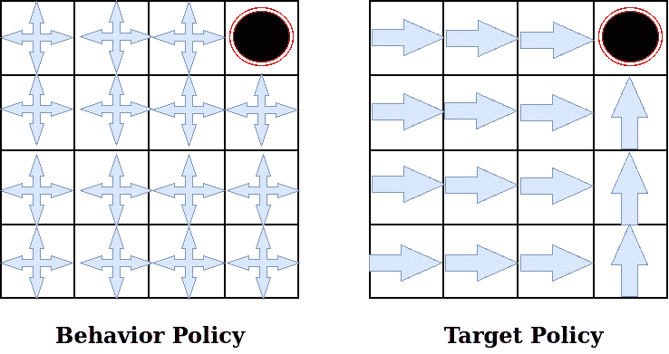
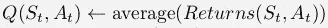
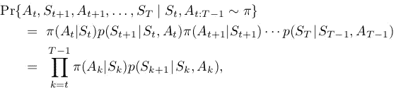
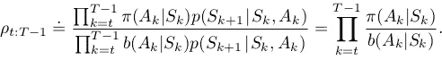
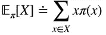
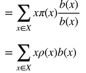
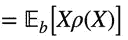
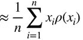

# 政策上的 v/s 政策外的学习

> 原文：<https://towardsdatascience.com/on-policy-v-s-off-policy-learning-75089916bc2f?source=collection_archive---------6----------------------->

## 了解政策外学习的重要抽样

在本文中，我们将试图理解策略上学习和策略外学习的区别，这对于刚接触强化学习的人来说可能会有点困惑。并将深入研究非政策学习的重要抽样概念。在进一步讨论之前，让我们先来看看两个术语。

1.  目标策略 pi(a|s):它是代理试图学习的策略，即代理正在学习该策略的值函数。
2.  行为策略 b(a|s):它是代理用于动作选择的策略，即代理遵循该策略与环境交互。

行为和目标政策示例，通过[https://app.diagrams.net/](https://app.diagrams.net/)制作的图像

## 政策学习:

基于策略的学习算法是评估和改进用于选择动作的相同策略的算法。这意味着我们将尝试评估和改进代理已经用于操作选择的相同策略。简而言之，[目标策略==行为策略]。策略上算法的一些例子是策略迭代、值迭代、用于策略上的蒙特卡罗、Sarsa 等。

## 政策外学习:

偏离策略学习算法评估和改进不同于用于动作选择的策略的策略。总之，【目标政策！=行为政策】。非策略学习算法的一些例子是 Q 学习、预期 sarsa(可以以两种方式起作用)等。

> 注意:行为策略必须覆盖目标策略，即 pi(a|s) > 0，其中 b(a|s) > 0。

## 为什么使用非策略？

非策略方法的一些好处如下:

1.  持续探索:当代理正在学习其他策略时，它可以用于在学习最优策略的同时继续探索。而按策略学习次优策略。
2.  从演示中学习:代理可以从演示中学习。
3.  并行学习:这加速了收敛，即学习可以很快。

# 对不符合策略的情况使用重要抽样

到目前为止，我们知道了保单外和保单内的区别。所以出现的问题是，我们如何在遵循另一个政策的同时，在一个政策下得到国家价值的期望值。这就是重要采样派上用场的地方。让我们用蒙特卡洛更新规则来理解。

图像通过强化学习:介绍
理查德 s 萨顿和安德鲁 g 巴尔托

如您所见，更新规则由来自一个州的所有抽样奖励的平均值组成。这些奖励是按照行为策略 b(a|s)抽样的，但是我们想要估计目标策略 pi(a|s)的值，并且需要从目标策略 pi(a|s)抽样的奖励。我们可以通过简单地将“ρ”乘以从行为政策中抽取的每个奖励来实现。**‘ρ’的值等于目标策略 pi(a|s)下的轨迹概率除以行为策略 b(a|s)下的轨迹概率**。轨迹的这些概率被定义为代理在状态 St '采取行动' At '并进入状态' St+1 '然后在时间 t 之前采取行动' At+1 '的概率。这个概率可以分成两部分，即在某个状态' St '采取行动' At '的概率和通过在状态' S '采取行动' At '而在某个状态' St+1 '结束的概率。简而言之，随机政策和随机环境。

## 重要抽样的推导:

假设从概率分布‘b’中抽取一个随机变量‘x ’,我们想估计‘x’相对于目标分布‘pi’的期望值。期望可以写成

现在，我们可以通过‘b’乘以采样 x 的概率。通过将 b(x)移至 pi(x)以下，我们得到了重要的采样比‘ρ’。

现在，如果我们把 xρ(x)看作一个新变量，那么我们可以把它写成 b 下的期望。

现在，我们可以将数据的期望值写成加权样本平均值，其中“ρ”用作权重。

现在我们可以从“b”中抽取“x ”,并使用上面的公式估计它在“pi”下的期望值。

所以，本文到此结束。谢谢你的阅读，希望你喜欢并且能够理解我想要解释的东西。希望你阅读我即将发表的文章。哈里奥姆…🙏

# 参考资料:

 [## 强化学习

### 由阿尔伯塔大学提供。强化学习专业化包括 4 门课程探索权力…

www.coursera.org](https://www.coursera.org/specializations/reinforcement-learning)  [## 强化学习，第二版

### 显着扩大和更新的广泛使用的文本强化学习的新版本，最…

mitpress.mit.edu](https://mitpress.mit.edu/books/reinforcement-learning-second-edition)