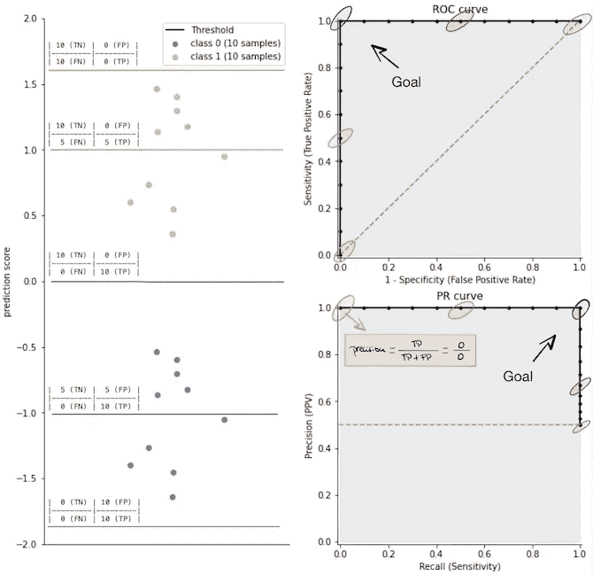
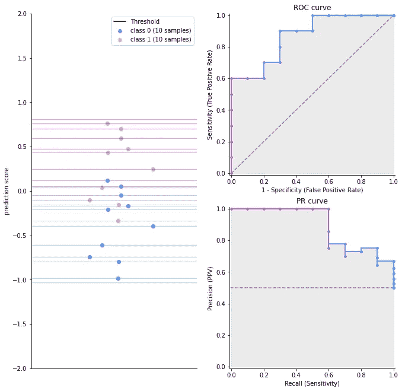
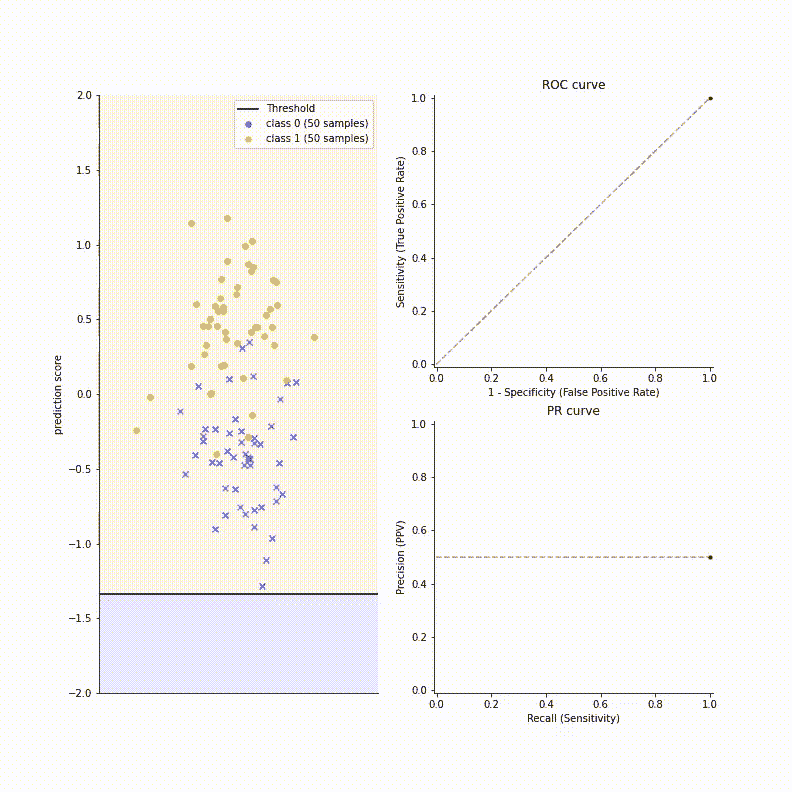
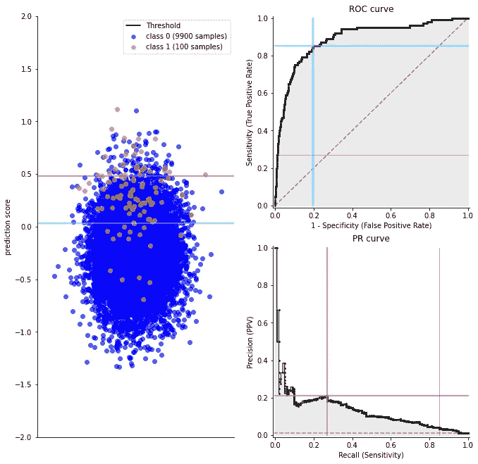
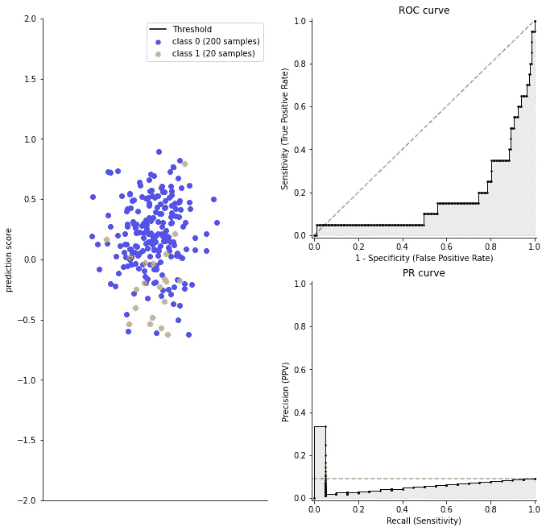
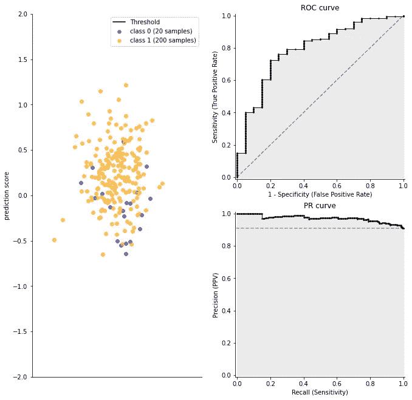
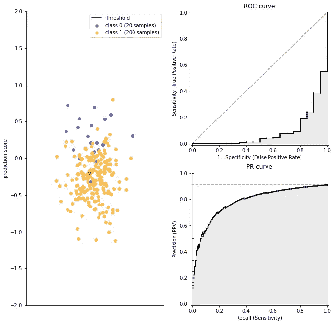

# ROC 曲线与精确回忆曲线

> 原文：<https://towardsdatascience.com/on-roc-and-precision-recall-curves-c23e9b63820c?source=collection_archive---------9----------------------->


卡洛斯·阿泽维多的照片

## 它们有什么不同，它们携带什么信息，为什么一个不能取代另一个

在机器学习中，当面临二分类问题时，每个数据科学家使用的度量工具主要有两种:接收者操作特征( **ROC** 曲线)和精度-召回( **PR** 曲线)。

本文的主要目标是介绍如何解释这些曲线以及它们固有的混淆矩阵和阈值。

我们从覆盖这些曲线的原始数据开始:混淆矩阵。然后我们浏览实际的曲线，最后，我们展示当问题没有正确设置时，这些曲线会是什么样子。

# 混淆矩阵

混淆矩阵是我们将在这里展示的一切的原始数据:它是一个包含真阳性(TP)、真阴性(TN)、假阳性(FP)和假阴性(FN)数量的表格。使用 ROC 和 PR 曲线的优点是它们总结了与二元分类问题相关的性能信息。与拥有几个混淆矩阵(每个阈值一个)相比，它更容易阅读和解释，然后**计算一些比率来粗略了解这些数字(TP，TN，FP，FN)的含义。**和*瞧*，我们刚刚定义了 ROC 和 PR 曲线所代表的东西——我们从几个混淆矩阵中得到的数字的比率。混淆矩阵支持几个类，但是在本文中，我们将集中讨论二进制分类问题。

```
 | predicted negative  | predicted positive  |
|-----------------|---------------------|---------------------|
| actual negative | True Negative  (TN) | False Positive (FP) |
| actual positive | False Negative (FN) | True Positive  (TP) |**True Positives (TP)**: Positive samples predicted as positive
**True Negatives (TN)**: Negative samples predicted as negative**False Positives (FP):** Negative samples predicted as positive
**False Negatives (FN)**: Positive samples predicted as negative
```

当处理平衡的数据集时，混乱矩阵是完美的。当我们处理不平衡的数据集时，我们需要一个更复杂的评估指标，让我们能够清楚地进行权衡。

# ROC 和 PR 曲线

## 指标和目标——完美的分类器

维基百科有一个很棒的[页面](https://en.wikipedia.org/wiki/Confusion_matrix)，上面有关于二进制分类的所有指标。我发现同一个度量标准有几个名称令人困惑。在这里，我将主要列出与本文相关的变量，以及最常用的变量:

```
**Negatives (N):** Total number of negative samples.
N = FP + TN**True Positive Rate (TPR)**: ratio of correct positive predictions to the overral number of positive examples in the dataset.
TPR = Recall = Sensitivity = TP / P**False Positive Rate (FPR)**: ratio of correct negative predictions to the overral number of negative samples in the dataset.
FPR = 1 - Specificity = FP / N**Precision**: From the positive predictions what proportion of it is correct.
Precision = TP / (TP + FP)**Important:** Note that the ***y-axis* of the ROC curve** (Sensitivity) **is the same as the *x-axis* of the PR curve** (Recall).
```



完美的分类器。**左**:作为分类器输出的分数和水平线给出的 5 个不同的阈值。**右上**:映射了 5 个阈值的 ROC 曲线。**右下**:映射了 5 个阈值的 PR 曲线。

*   **左图**:沿着 *y 轴*，我们有分数，而 *x 轴*只是通过使其更分散来帮助可视化，这样我们可以很容易地看到分数数据点。有 5 条不同的水平线，代表不同的阈值:在这条线以下，所有的数据点被分类为阴性(*类 0* )，如果数据点在线以上或得分相同，则被分类为阳性(*类 1* )。每条线都有不同的颜色，以便将它们映射到另外两条曲线:ROC 和 PR 曲线。
*   **右上图**:这是 ROC 曲线。 *x 轴*为 FPR， *y 轴*为灵敏度(或召回或 TPR)。随着左边图上的阈值从底部到顶部，ROC 曲线从右到左发展。该图中的每个数据点代表一个不同的阈值，在每个步骤中，该阈值将正预测变为负预测。
    ROC 空间中的目标是在左上角——这是点(0，1 ),意味着我们没有假阳性( *FPR=0* )，并且我们将所有阳性分类为阳性(*回忆=1* )。对角线虚线(无技能分类器的“*曲线*”)是我们在单位区间内随机抽取分数或者我们的预测全为 0 或全为 1 时的平均值。
*   **右下图**:这是 PR 曲线。PR 曲线的 *x 轴*和 ROC 曲线的 *y 轴*都代表回忆，所以我们看到它们的发展是相似的。这条曲线主要关注积极阶层的表现，这在处理不平衡阶层时至关重要。在公关领域，目标是在右上角——右上角(1，1)意味着我们将所有阳性分类为阳性( *Recall=1* )，并且我们分类为阳性的一切都是真阳性(*Precision = 1*)——后者意味着零假阳性。在这种情况下，无技能分类器的“*曲线*”是由 P/(N+P)获得的水平线，由虚线表示——在这种情况下，分类器总是预测少数类，*，即*为正。

ROC 空间或 PR 空间中的每个点代表一个特定的阈值，该阈值改变混淆矩阵(TP，TN，FP，FN ),从而改变召回率、精确度和 FPR。

精确度和召回率之间通常存在一种权衡，这是由区分正面案例和负面案例的阈值决定的，这种权衡通常与业务决策者讨论，以最终决定应该放在哪里。

另一个伪例子如下，其中我们不能通过阈值处理获得完美的分离:



不完美的分类器。**左**:作为分类器输出的分数和水平线给出的不同阈值。**右上** : ROC 曲线，其中映射了阈值。**右下** : PR 曲线，其中映射了阈值。

## 走查示例

让我们将刚刚学到的知识付诸实践，看看下面的动画，它将作为接下来的模板:

*   请注意阈值总是跳到下一个样本:这是因为在样本之间，指标保持不变，因此连接 ROC 和 PR 曲线中各点的线没有意义。
*   ROC 曲线中点之间的距离是恒定的:它仅取决于样本总数——每个样本一个点，只要没有分数完全相同，那么移动阈值会改变两个数据点的决策。
*   PR 曲线中各点之间的距离随着方向而变化:如果步长是水平移动的(回想一下),那么它是恒定的，就像 ROC 曲线一样。对于垂直步长(精度),这取决于有多少个阴性样本——假阳性(FP)的数量越多，步长越小——精度= TP / (TP + FP)。



阈值动画。 **Left** :作为分类器输出的分数和一个自下而上的移动阈值。**右上**:根据移动阈值计算的 ROC 曲线。**右下**:根据移动阈值计算的 PR 曲线。

根据设计，ROC 曲线总是呈 U 形发展，除非有什么问题——所以关于上面的动画，随着阈值的上升，只有两个选择:向左或向下。

1.  **左移:**将假阳性(蓝十字)变为真阴性(蓝点)。这种行为代表了正确的决定，因此降低了假阳性率( *x 轴*)。当阈值在底部从-1.5 向上移动到-0.5 时，很容易观察到，其中每次转换都连续减少假阳性的数量。
2.  **向下步进:**将一个真阳性(橙色圆点)变为假阴性(蓝色十字)。这种行为代表了一个错误的决定，因此降低了召回率( *y 轴*)。很容易观察到，当阈值在 0.5 到 1.5 时，每次转换都错误地将阳性样本分类为阴性。

## 不平衡数据的影响

到目前为止，我们研究了两个有一个共同点的例子:两个数据集都非常平衡——相同数量的阳性和阴性样本。与 ROC 曲线相比，PR 曲线的亮点在于当我们处理不平衡数据集，并且我们对少数类感兴趣时。让我们看一个例子。



ROC 和 PR 曲线的最佳阈值之间的差异。**左**:作为分类器输出的分数，以及 ROC(紫色)和 PR(绿色)的最优阈值。**右上** : ROC 曲线及其最佳阈值(绿色)和 PR 最佳阈值(灰色)。**右下** : PR 曲线及其最佳阈值(紫色)和 ROC 最佳阈值(灰色)。

根据 ROC 曲线判断，我们可能对我们的分类器过于乐观——我们可以从几个有性能的阈值中选择。然而，PR 曲线告诉我们一个不同的故事——就像数据点的曲线图一样。由于类别分布中的大偏斜，PR 曲线对算法的性能更有洞察力:当阴性样本的数量大大超过阳性样本的数量时，假阳性数量的大变化会导致 ROC 分析中使用的假阳性率的小变化。另一方面，Precision 通过将假阳性与真阳性而不是真阴性进行比较，来捕捉大量阴性样本对算法性能的影响。

我们决定优化哪条曲线的方式取决于具体情况。如果我们正在处理欺诈检测，那么针对 PR 曲线进行优化可以通过标记欺诈而不使误报检查超载来提供最大的好处，而如果我们正在处理癌症检测，那么误报的成本很高，因此针对 ROC 曲线进行优化是更可取的——然而，这需要业务专业知识来决定算法在权衡中的位置。

# 杂项——当它做错了

在这里，我们将展示另外两个不经常看到的场景，原因是这意味着问题被错误地表述了——所以当我们做错事情时，我们仍然会看到它，这是一个很好的提醒，它不应该看起来像什么。

*   **类的设置与**相反:正的应该是负的，反之亦然。这很容易通过 ROC 曲线识别——只要曲线在对角线的错误一侧，就意味着我们的标签是错误的。



*   **小众阶层被错误设定为负面阶层**。根据定义，利益阶层，我们称之为积极阶层，是少数阶层。这很容易通过 PR 曲线识别，我们看到在 *Recall=1* 时，精度为 0.9，这告诉我们数据类别不平衡倾向于类别 1。



*   当我们两个都错了的时候，这就是它的样子:标签和少数阶级。这里两条曲线都告诉我们有些奇怪的事情——上面的两种情况都出现了。



我希望这篇文章能让你更熟悉 ROC 曲线和 PR 曲线，从而推断出关于数据和分类器本身的知识。让我知道，如果你觉得有什么东西不见了，这将是有意义的添加到这个职位。我总是乐于探索基础的细节。

这里是用来为这篇文章创建内容的 github repo 。

**参考文献**

[1]戴维斯，杰西和马克戈德里奇。"精确回忆和 ROC 曲线之间的关系."*第 23 届机器学习国际会议论文集*。2006.

[2][https://machine learning mastery . com/threshold-moving-for-unbalanced-class ification/](https://machinelearningmastery.com/threshold-moving-for-imbalanced-classification/)

[3][https://www . r-bloggers . com/what-it-the-diversion-of-the-diagonal-for-a-roc-curve/](https://www.r-bloggers.com/what-it-the-interpretation-of-the-diagonal-for-a-roc-curve/)