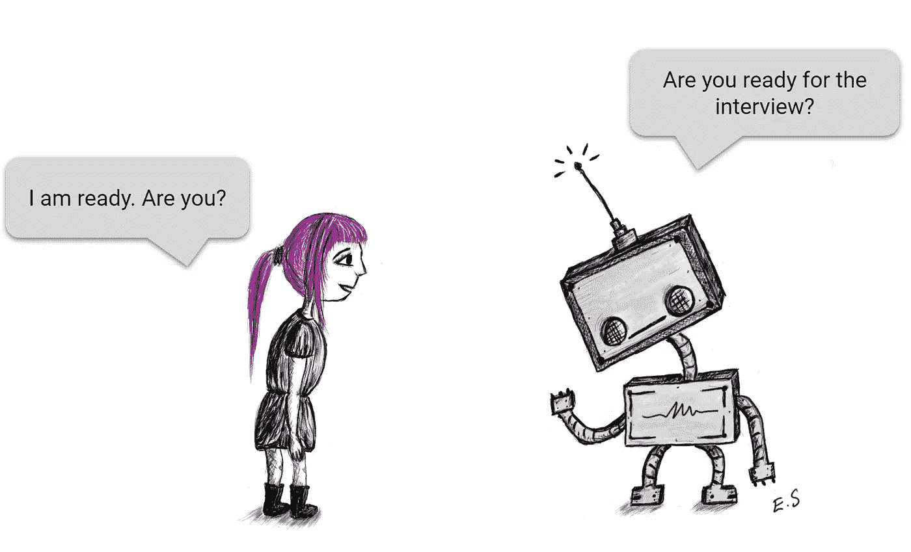
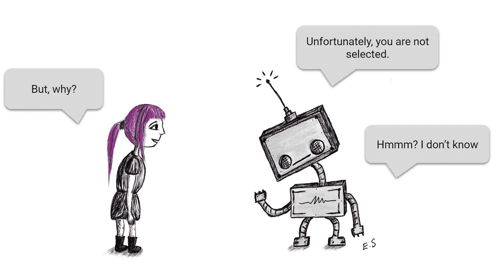
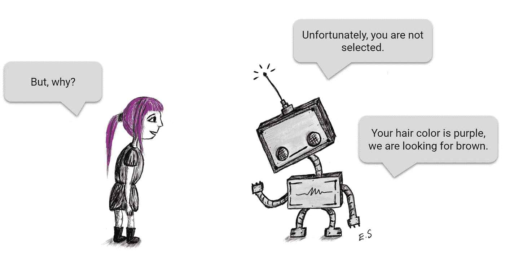
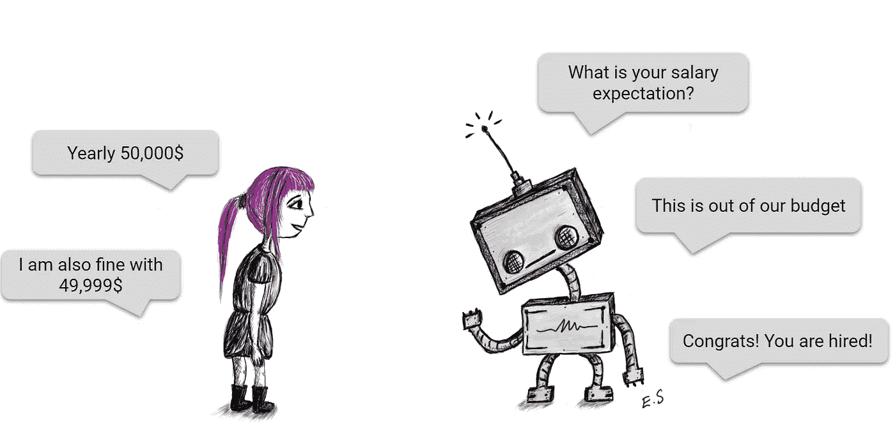

# 论人工智能的社会特征

> 原文：<https://towardsdatascience.com/on-social-characteristics-of-artificial-intelligence-5fb85ed2e69d?source=collection_archive---------44----------------------->

## 理解负责任的人工智能系统的组成部分

**人类 vs 人工智能招聘人员**

嗯，可能最近，你已经听过很多次类似的短语了，如下:

*   人工智能是人类的救星！
*   人工智能是神奇的，它将解决我们所有的问题，它将创造地球上的天堂！
*   AI 是邪恶的！它会夺走我们的工作，让我们失业！
*   AI 要终结人类了！让我们在它阻止我们之前阻止它！

基本上 AI 就是一个工具，就像锤子一样。当然，更加复杂、先进和不断发展，但仍然是一种工具。同样，就像任何其他工具一样，你可以根据你如何使用它来产生好的或坏的结果。你可以用锤子砸碎核桃或者破坏别人的车。所以，它是反映用户意图的媒介。有时候，我们可能在头脑中有一个很好的目标要用我们的工具来实现，但是我们可能会达到一个完全的灾难，因为我们没有完全的能力来使用它。

虽然有许多人工智能应用领域(约束编程，逻辑编程，推理等。)，这里我们将主要关注机器学习(ML)。它是人工智能的后起之秀和旗舰，但它是万能的、公平的和完美的吗？当然不是。我们需要处理许多问题和缺陷。

机器学习是科学和艺术的结合，你根据历史/收集的数据建立决策系统。利用这些数据，人们可以设计一个智能系统，为手头的任务提供解决方案。让数据自己说话，它会给你指明方向。ML 帮助您轻松决策、解决问题和自动化日常任务。但是，它真的足够成熟来承担其决策的责任吗？答案是，这取决于应用程序的严肃程度。或许，如果亚马逊推荐给你一些你完全不感兴趣的东西，你不会那么失望。但是，你真的会相信一个建议你做手术的临床应用程序吗，或者你也想和医生确认一下吗？或者一个机器人法官真的会对任何犯罪嫌疑人公正无私吗？你会接受这样一个机器人的评判吗？

即使作为 ML 系统的忠实粉丝、供应商、应用者和支持者，在当前的缺点和不足下，我也不会 100%依赖 ML 系统在所有应用领域的决策。我可以愉快地使用一个应用程序，它可以跟踪我的杂货购物，估计下一个购物清单中的项目，并对它们进行排序。如果它没有为我点牛奶，我也不会如此沮丧。但如果一份申请建议我辞去目前的工作，在一个我认为自己没有相关技能和经验的新行业开始新的职业生涯，我会非常讽刺。

作为一个面向生活的算法应用程序的用户，一个人想要理解其决策的原因(可解释的)，并学习它是否是无偏见的(公平的)，一致的((不)敏感的)和进步的(进化的)。请注意，这些也反映了我们的本性:人工智能，这是人类的孩子，也有类似的缺点。我们希望看到人工智能在我们失败的地方取得成功。现在，让我们更详细地讨论它们。

## 可解释性

目标是找到人工智能做出某个决定的原因:决策过程应该是可追踪和透明的。想一个典型的例子:招聘。你不会质疑人工智能招聘人员为什么拒绝你申请的某个职位吗？今天使用的大多数 ML 系统都是作为黑盒部署的。深度网络是当今最流行的最大似然系统，尤其是那些在中间层具有非线性激活函数的系统，由于它们具有大量的参数并且难以解释它们，因此理解起来非常复杂。另一方面，决策树是可追踪的，对于规则提取来说非常方便，但是它可能不够精确，不能作为商业产品部署。即使它们是学术界(主要在卷积神经网络-CNN 中)提取和量化人工智能系统决策原因的一些尝试，如逐层相关传播 LRP 或集成梯度，但当前的度量标准对于构建可理解的系统来说不合适或不够好。我们需要新的损失函数和度量来创建可解释的人工智能系统。

## 公平

让我们继续以招聘为例:在两个几乎具有相同属性(如教育、技能、经验等)的候选人中，一个比另一个更受青睐。但这是公平的选择吗？这是政治学或司法制度等许多社会科学的基本问题之一。我们如何确保我们给出一个公正、公平的决定？对此没有简单的普遍答案。因为对于公平的定义，还没有一个共同的结论。公平的含义是什么？公平还是平等？根据我们拥有的个人特征或根据我们所属的群体(如性别)特征，被选中的机会(概率)相等吗？其实 ML 不公平的主要原因是生活本身的不公平。我们收集的数据应该代表我们可能遇到的所有情况；因此，这是一个很好的样本。但是在选择样本(例如，可能排除人口中的某个亚群体)或创建数据(例如，由于所用设备的缺陷，可能在某些情况下引入测量偏差)的过程中，可能会引入偏差。即使数据集是无偏的，在应用程序的设计、实现和部署期间，系统中也会引入偏差。最后，作为一个极端情况，系统的输出也可能被错误地解释，无论是否有任何恶意意图。请注意，这里讨论的偏差并不是 ML 算法(误差的偏差-方差分解)中固有的偏差，这是由于设计期间引入的假设或放宽。招聘人员系统拒绝你是因为你是前一个人类招聘人员有偏见的种族群体的成员吗，这种偏见也嵌入在历史数据中？或者你被拒绝不是因为缺乏一些技能，而是因为一些有利于其他候选人的积极的区别对待？在文献中，定义了 150 多种不同的偏见(性别、种族、教育、社会地位等。)在日常生活中，其中一些可能不可避免地嵌入到数据中。

## (不)敏感

如果你的简历中有不同的爱好(被认为与职位要求无关)，或者如果你的简历中有一个打字错误，导致在解析过程中丢失了一个特征，人工智能招聘人员还会在候选人列表中按相同的顺序排列你吗？不敏感性关注的是人工智能系统对其输出的一致性。该决定应该依赖于直接影响输出的区别特征。它还应该对输入中的微小变化或小误差鲁棒或不敏感，以便输出不会剧烈变化。例如，你期望年薪的 1 美元的变化不应该导致你被淘汰。只要变化不在区别特征的主要集合中，或者它们在可容忍/可忽略的范围内，输出就不能颠倒变化。如何定义或衡量这种(不)敏感性是另一回事。在文献中，特别是在信号处理领域，有量化灵敏度的方法。

## 演变

随着时间的推移，社会在变化，工作条件和环境也在变化。随着技术的进步，我们获得了新的工具，我们需要新的技能来掌握这些工具。新概念导致了职业的出现，或者破坏了某个职位的现有技能要求。你还想让一个人工智能招聘人员评估一个数据科学家的职位吗？这个人工智能招聘人员一直在用 2005 年以前的就业历史数据进行培训(深度神经网络时代之前，没有 TensorFlow 或 PyTorch！)?同样，作为一名雇主，你会热衷于使用这样的系统来寻找你的完美匹配的理想员工吗？ML 系统的进化是其作为生命体的本性要求。它应该能够消化可能由新出现的、以前不存在的条件引起的新情况，并适应它们。但它仍然必须是一致的。说起来容易，做起来难。例如，当我们开始殖民火星时，在地球(某个国家)训练的机器人法官也应该用在火星上吗？很可能，对于一个机器人法官来说，在火星上从零开始建立所有的司法系统将是一个几乎不可能完成的任务。注意，这里所说的进化，我指的不是更快的计算或更高的准确率，而是处理看不见的情况或异常的能力。《星际迷航》系列中的通用翻译器将是这种进化人工智能的一个绝佳例子。一个可以在“初次接触”中学习新文明的语言和文化的翻译家！！！难以想象，不是吗？

## 下一步是什么？

在这里，我们讨论人工智能的哲学方面，而不是技术方面:当我们为对人们生活有深刻影响的领域/领域构建人工智能系统时，我们应该记住什么。我给出的列表可以扩展，或者它可能已经遗漏了一些要点(例如，用户的隐私问题和决策步骤的跟踪支持/可审计性)。请注意，也有关于人工智能系统所采取行动的后果的法律责任的持续讨论:该怪谁？我在参考资料中给出的材料的帮助下，结合自己的想法和理解，写了这篇文章。想了解更多更详细的信息，你可以向他们申请。

看好你的 AI 孩子，让它成长为一个有担当的少年！:)不要糟蹋它！

PS:我感谢我的妻子 Elif Semerci 创作了这些可爱的漫画！

**参考文献:**

*   [AI 中的偏见和歧视](https://courses.edx.org/courses/course-v1:UMontrealX+IVADO-BIAS-220+1T2020/course/)edX 中的 MOOC
*   [实践中的人工智能:50 家成功公司如何利用人工智能和机器学习解决问题](https://www.wiley.com/en-us/Artificial+Intelligence+in+Practice%3A+How+50+Successful+Companies+Used+AI+and+Machine+Learning+to+Solve+Problems-p-9781119548980)
*   机器学习:新的人工智能
*   [关于人工智能的 50 个问题](https://www.amazon.de/Soruda-Yapay-Zeka-Cem-Say/dp/6055888580)
*   [可解释的人工智能:解释、说明和可视化深度学习](https://link.springer.com/book/10.1007/978-3-030-28954-6)
*   [社会数据:偏见、方法陷阱和伦理界限](https://www.frontiersin.org/articles/10.3389/fdata.2019.00013/full)
*   [蒙特利尔责任 AI 宣言](https://www.montrealdeclaration-responsibleai.com/)