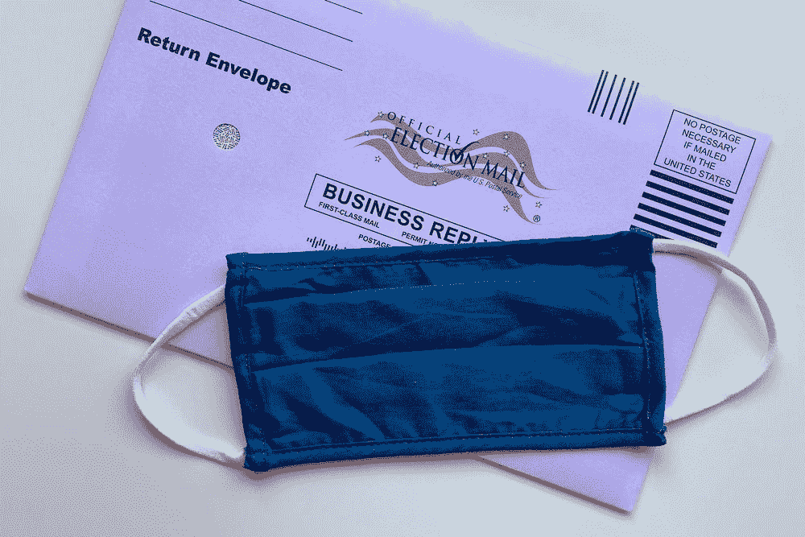

# 关于 2020 年选举，德州扑克和蒙特卡洛

> 原文：<https://towardsdatascience.com/on-the-2020-elections-texas-holdem-poker-and-monte-carlo-43807a4c068e?source=collection_archive---------45----------------------->

## *当数据成为个人信息时*

图片由[阿曼达·琼斯](https://unsplash.com/photos/K2PAVcngNvY)在 [Unsplash](http://www.unsplash.com) 上提供。

有一段时间，我经常玩扑克，尤其是德州扑克。我喜欢它的一切——试图预测对手的下一步行动，根据我仅有的一点信息计算概率，下注大小，管理心态，包括驾驭游戏的高潮和低谷。

在扑克中，有一句流行的谚语，“玩(wo)人，而不是牌。”换句话说，你不会得到游戏中其他牌的所有信息，所以你必须尽你所知了解对手的玩法。

最近，我读了一本由获奖心理学家 Maria Konnikova 所著的书[The big Bluff](https://www.mariakonnikova.com/books/)，这本书讲述了她成为扑克冠军的经历以及她从游戏中学到的关于生活的东西，这让我想起了这一点。在她的书中，Maria 讨论了玩扑克的批判性思维，游戏如何教会你在有限的信息下做出更好的选择，以及处理这些决定结果的策略。

正如 Konnikova 指出的，在现实生活中，我们也经常被迫在有限的信息下操作。你只能如此肯定地预测筹码将如何下跌——归根结底，这只是一个非常有根据的猜测。我们进行这些有根据的猜测的主要方法之一是通过统计，最受欢迎的统计方法之一是蒙特卡洛模拟，它恰如其分地以世界扑克之都摩纳哥的蒙特卡洛命名。

# 蒙特卡罗模拟和不可靠的数据

任何统计学家都会告诉你，[蒙特卡洛模拟](https://en.wikipedia.org/wiki/Monte_Carlo_method)有许多引人注目的应用，从公司财务和风险分析到——你猜对了——[扑克](https://en.wikipedia.org/wiki/Poker_calculator)。

简而言之，[蒙特卡洛模拟](https://en.wikipedia.org/wiki/Monte_Carlo_method)基于在复杂情况下使用大量随机模拟来预测结果的想法，通常是在你没有封闭形式的分析模型时。

然而，即使使用像蒙特卡罗这样的技术，数据也很少是完整或准确的，即使是最完整的数据集和实验条件也应该经过仔细检查。

我们将这种非常普遍的不可靠数据称为[数据宕机](https://www.montecarlodata.com/the-rise-of-data-downtime/)。严格来说，数据宕机指的是数据丢失、不准确或出现其他错误的时间段，从扑克玩家到数据团队的每个人都是接收方。

# 这对美国选举意味着什么

图片来自[蒂芙尼在](https://unsplash.com/photos/Y2Vxsb75RVo) [Unsplash](http://unsplash.com) 上的第三次亮相。

即将到来的 2020 年美国大选本身就是一个有趣的事件，但也因为这类事件的结果难以预测(比如我们的 2016 年总统大选)。

每个选举周期， [FiveThirtyEight](https://projects.fivethirtyeight.com/2020-election-forecast/) 都使用蒙特卡洛来估计选举结果。他们在各州进行了 40，000 次蒙特卡洛模拟，以产生一系列可能的结果，并根据发生的可能性进行排名。FiveThirtyEight 的数据科学家和记者团队从各州的民意调查中获得数据，并结合人口统计、经济和其他数据来预测谁将获胜。随着选举的临近，越来越多的投票信息变得可用，他们的预测变得不那么不确定。

我还没有遇到一个数据科学家愿意承认他们的数据是“完美的”或者他们的预测是 100%可靠的。选举也不能幸免于数据问题。

# 这对你意味着什么

选举预测并不是数据宕机影响我们个人的唯一地方。一个更明显的例子是 2020 年美国人口普查，这是一项对美国人口的年度统计，确定每个州在美国众议院的席位数量，并向地方社区分配数十亿美元的联邦资金。像 FiveThirtyEight 一样，美国人口普查局也使用[蒙特卡洛模拟](https://www.census.gov/topics/research/stat-research/expertise/sim-stat-modeling.html)，在他们的案例中评估新统计方法的质量，并分析人口样本调查中的测量误差。

2020 年，美国人口普查数据收集过程[受到数据停机问题](https://www.cnn.com/2020/10/01/politics/us-census-workers-work-conditions/index.html)的困扰，例如过时的技术、重复的地址，以及由于新冠肺炎而缩短的最后期限[。总而言之，这些因素影响了人口普查的完整性和准确性，阻碍了民主，并证明了数据宕机不仅仅是一个业务问题。](https://www.npr.org/2020/09/18/911960963/how-trump-officials-cut-the-2020-census-short-amid-the-pandemic#:~:text=2020%20Census%20Timeline%3A%20How%20Trump%20Administration%20Shortened%20The%20Schedule%20Because,end%20counting%20a%20month%20early.)

底线是:数据可能是个人的，像这样的事件更加明显地表明，我们需要以应有的勤奋对待数据。正如最好的统计学家会告诉你的，即使是一个伟大的蒙特卡洛模型也无法保存你的数据。

***热爱扑克和蒙特卡洛模拟？伸出手去*** [***巴尔摩西。***](https://www.linkedin.com/in/barrmoses)