# 论数学之美

> 原文：<https://towardsdatascience.com/on-the-beauty-of-math-f2453be9db84?source=collection_archive---------10----------------------->

## 伟大的数学家欧拉和他对著名的巴塞尔问题的精妙解答

图 by[sash kin](https://www.shutterstock.com/g/sashkin7)/shutterstock . com

德国数学家、天文学家和物理学家[卡尔·弗里德里希·高斯](https://en.wikiquote.org/wiki/Carl_Friedrich_Gauss)、[被许多人认为是“自古以来最伟大的数学家”曾经宣称:](https://ui.adsabs.harvard.edu/abs/1927SciMo..24..402D/abstract)

> “对欧拉著作的研究仍将是不同数学领域的最佳学校，其他任何东西都无法取代它。”
> 
> —卡尔·弗里德里希·高斯

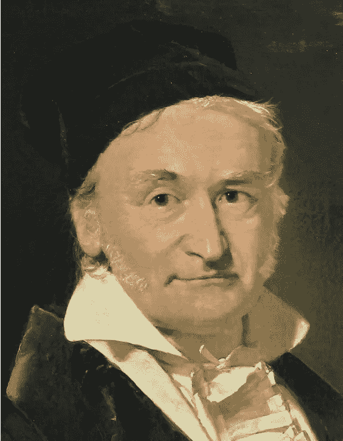

图 1:卡尔·弗里德里希·高斯的肖像，被称为“自古以来最伟大的数学家”([来源](https://en.wikipedia.org/wiki/Carl_Friedrich_Gauss))。

本文将描述瑞士数学家莱昂哈德·欧拉是如何解决著名的巴塞尔问题的。欧拉是历史上最伟大的数学家之一。他的多产是传奇的素材，他的作品集[填满了 92 大卷](https://www.cs.purdue.edu/homes/wxg/EulerLect.pdf)。[皮埃尔·西蒙·拉普拉斯](https://en.wikipedia.org/wiki/Pierre-Simon_Laplace)断言了欧拉对数学的影响，他有一句名言:

> “读欧拉，读欧拉，他是我们所有人的主宰。”
> 
> —皮埃尔·西蒙·拉普拉斯

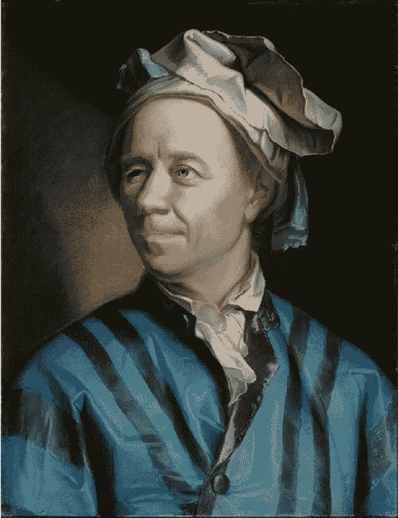

图 J. E. Handmann 拍摄的莱昂哈德·欧拉肖像([来源](https://en.wikipedia.org/wiki/Leonhard_Euler))。

# 巴塞尔问题

意大利数学家皮埃特罗·门戈利于 1650 年首次提出了巴塞尔问题，欧拉于 1734 年解决了这个问题，使他立即得到了认可。该问题要求自然数平方的倒数之和:

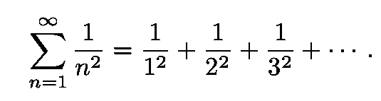

等式 1:巴塞尔问题。

许多有影响的数学家试图找到平方倒数之和的公式。微积分的两位共同发明者，约翰·沃利斯和伟大的 T2，戈特弗里德·莱布尼茨，都曾尝试过并遭遇过失败。欧拉在年轻时(他 28 岁)就解决了这个问题，他的答案的数学本质让数学界感到惊讶。他的第一个证明(他后来提供了其他几个)并不严谨，但它的美丽、简单和独创性令人惊讶。

图 3:欧拉的故乡巴塞尔([来源](https://en.wikipedia.org/wiki/Basel))。

欧拉杰出的洞察力是写下 sinc(πx)函数

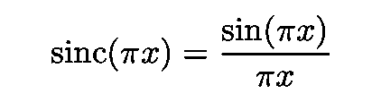

等式 2:sinc(πx)函数的定义。

作为零数的乘积。

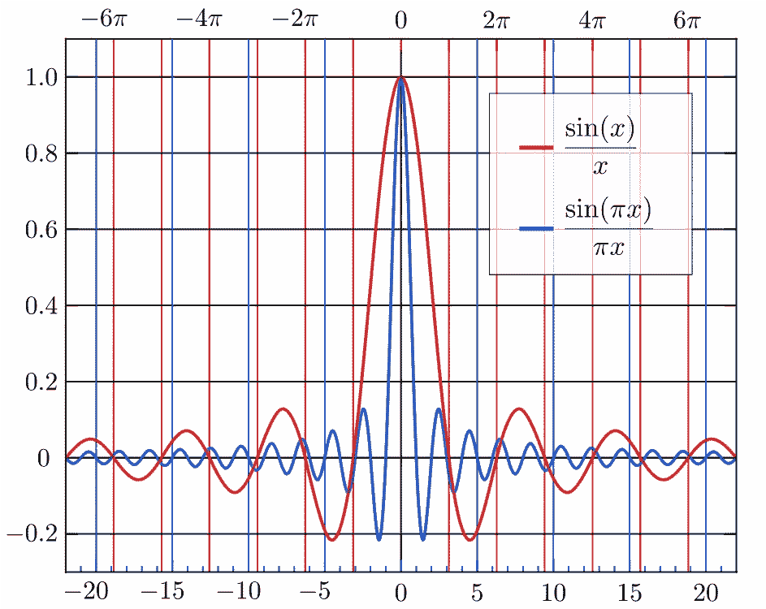

图 4:归一化和非归一化 sinc(x)函数(分别用蓝色和红色表示)([来源](https://en.wikipedia.org/wiki/Sinc_function))。

为了理解这一点，例如，考虑下面的四次多项式写为其零点上的乘积:

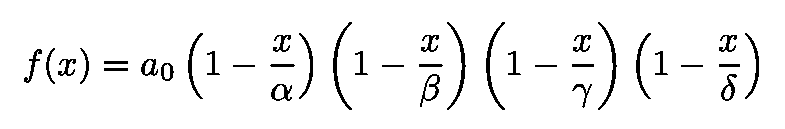

等式 3:一个四次多项式 f(x)被写成其零点上的乘积。

将表达式相乘，我们得到:

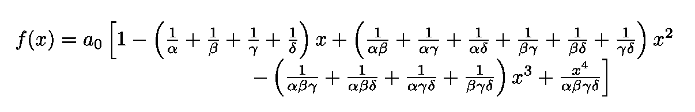

等式 4:乘以因子后的等式 3。

欧拉的策略是将同样的扩展应用于超越函数。

## 超越函数

这种函数不满足多项式方程，例如方程。4.[指数函数](https://en.wikipedia.org/wiki/Exponential_function)、[三角函数](https://en.wikipedia.org/wiki/Trigonometric_functions)和[对数函数](https://en.wikipedia.org/wiki/Logarithm)是三个众所周知的例子。

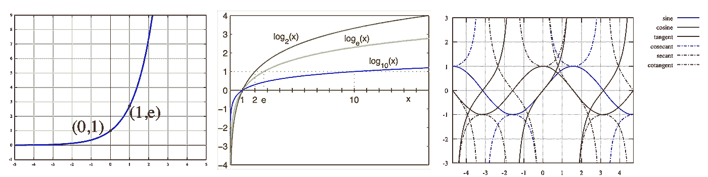

图 5:指数函数([源](https://en.wikipedia.org/wiki/Exponential_function))、对数函数([源](https://en.wikipedia.org/wiki/Logarithm))和三角函数([源](https://en.wikipedia.org/wiki/Trigonometric_functions))的曲线图。

sinc( *πx* )函数有以下根源:

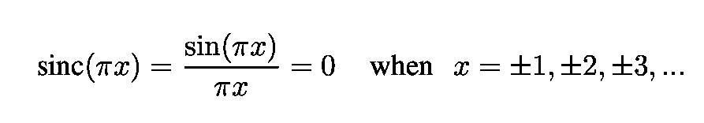

等式 5:sinc(πx)函数的根。

欧拉继续用与等式 *f* ( *x* )相同的方式写出 sinc(x)。3.使用基本的数学恒等式

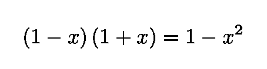

因为对于等式中的每个根。5 有一个相应的消极的他能够写:

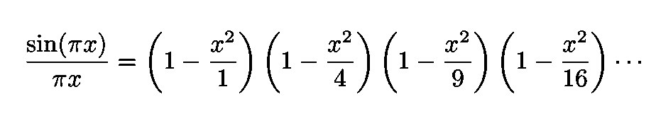

等式 6:sinc(πx)函数表示为其零点的乘积。

下一步是将等式中的各项相乘。6 但是只关注二次方程:

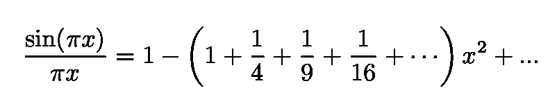

等式 7:等式 6 乘以各项后，只关注二次项。

## 泰勒级数

泰勒级数将函数表示为无穷多个项的和。每一项都是从函数在一个单点的导数的值计算出来的(更多细节见[链接](https://en.wikipedia.org/wiki/Taylor_series))。

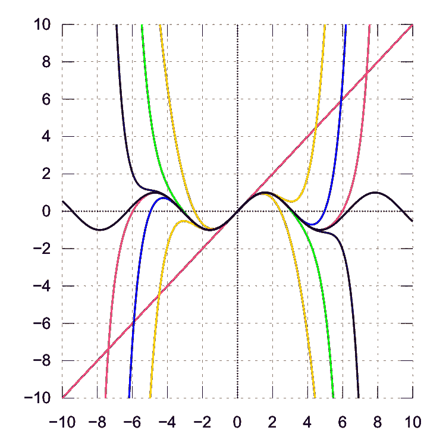

图 6:增加泰勒级数的次数，它收敛到正确的函数。黑色曲线代表 sin(x)。其他曲线是泰勒近似，是 1、3、5、7、9、11 和 13 次多项式([来源](https://en.wikipedia.org/wiki/Taylor_series))。

图 6 所示的七个泰勒级数具有以下代数形式:

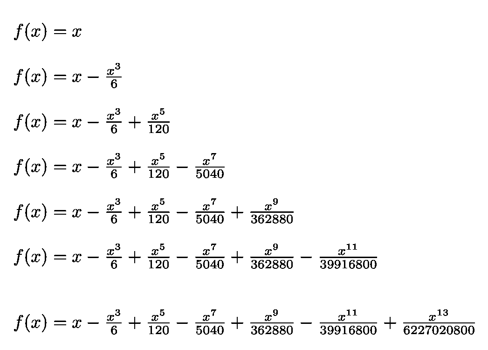

等式 8:对应于函数 sin(x)的若干次泰勒多项式。这些函数的曲线如图 6 所示。

sinc(x)函数的泰勒展开式为:

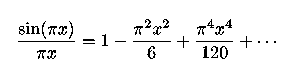

等式 9:sinc(πx)的泰勒级数。

可以想到情商。8 作为一个具有无限次数的“伪多项式”。这样的伪多项式有无穷多个根。等式中给出了根。5.

## 比较两种结果

比较情商。7 和情商。我们得到了我们想要的结果:

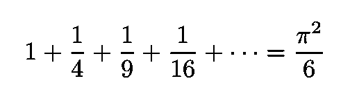

方程式 10:巴塞尔问题的欧拉解。

作为奖励，欧拉的推导给了我们众所周知的沃利斯积。只需在等式中代入 x = 1/2 即可。6 并将其倒置。我们获得:

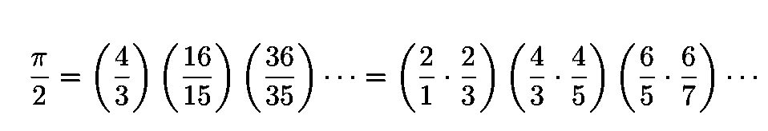

等式 10:作为证明巴塞尔问题的奖励而获得的 Wallis 乘积。

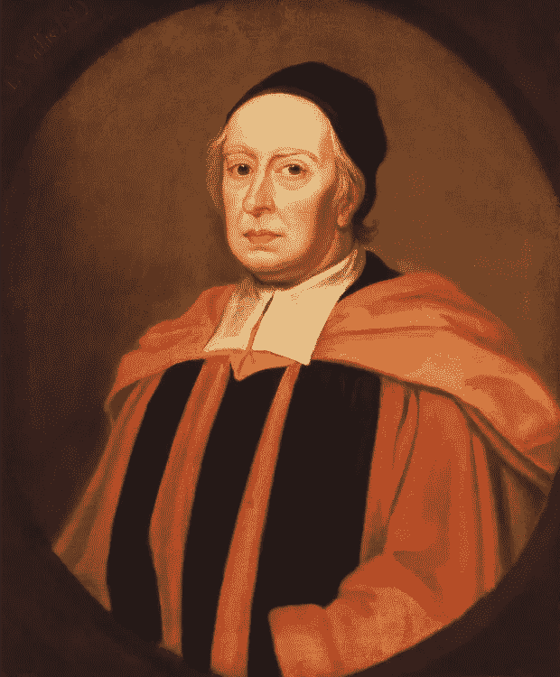

*图 7:戈弗雷·内勒*的约翰·沃利斯肖像([来源](https://en.wikipedia.org/wiki/John_Wallis))。

# 严格的证明

在这最后一节，我们将看到如何获得欧拉结果的严格证明(这个证明的作者是[丹尼尔·p·吉西](https://proofwiki.org/wiki/Mathematician:Daniel_P._Giesy))。考虑功能:

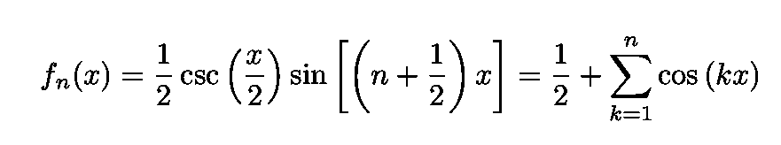

等式 11:d . p . Giesy 在证明巴塞尔问题时引入的辅助函数。

(通常以不同的形式书写)。然后定义数字 *E* ( *n* )并计算它，在等式 2 的第二个等式之后积分表达式。11:

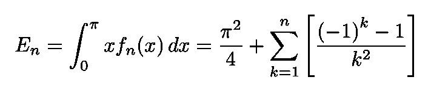

等式 12:数 E(n)的定义。

很明显，对于偶数 *k* 来说，右边的和是零。因此，可以用(2 *k* -1)代替 *k* ，并且只考虑 *E* 的子索引为奇数的项:

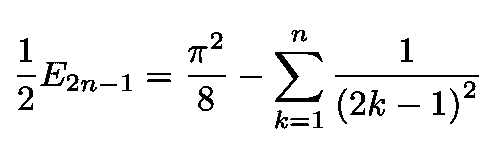

等式 13:等式。12 仅用于 *E.* 的子索引的奇数值

现在，为了完成证明，我们需要证明这个表达式消失了。由于这个演示相当费力，也不是很有启发性，所以就省略了。结果是:

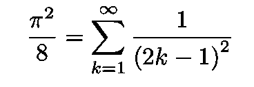

等式 14:证明有效的必要条件。

经过一些简单的代数运算后，我们再次得到方程。10:

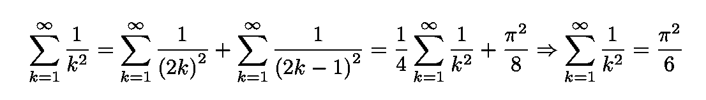

等式 15:使用简单的代数运算，就可以得到最终结果。

我的 [Github](https://github.com/marcotav) 和个人网站 [www.marcotavora.me](https://marcotavora.me/) 有一些关于数学和其他主题的有趣材料，如物理、数据科学和金融。看看他们！