# 雨天的可能性

> 原文：<https://towardsdatascience.com/on-the-chances-of-rainy-days-5699e73919d2?source=collection_archive---------31----------------------->

## 如何使用组合学的力量进行简单的概率计算？

普吉岛邦陶海滩，作者拍摄

在我们的泰国假期开始前不久，我查看了普吉岛的天气预报，发现在我们为期 10 天的旅行中，预计会有四个雨天。可能仍然会很有趣，但是我想知道，如果根据维基百科的记录，二月份平均只有四天下雨，那么在我们 10 天的假期中，这四天都下雨的概率是多少？

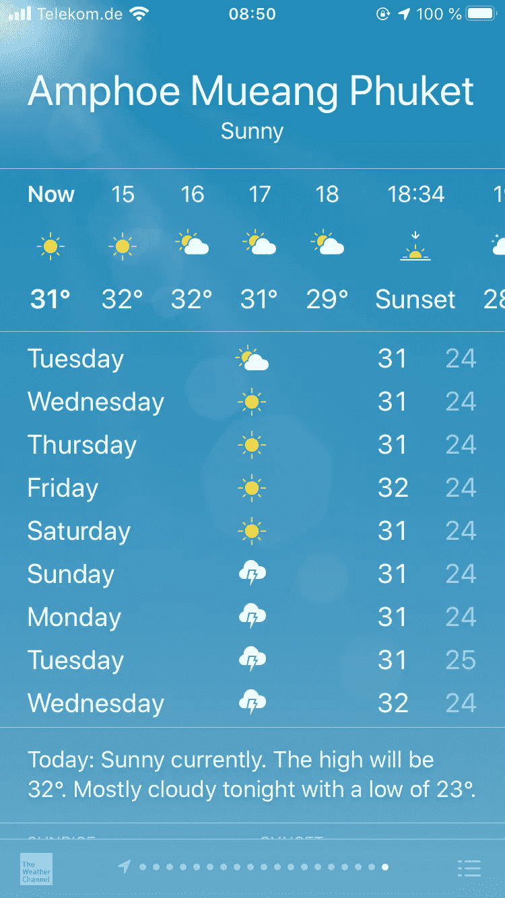

作者截图

# 假设

为了找到答案，我做了一些假设。首先，让我们假设这 4 个雨天随机出现在二月，并且彼此独立，也就是说，某一天下雨对另一天下雨的可能性没有影响。第二，让我们假设下雨天的概率在整个二月是均匀分布的，所以下雨天在二月初和二月末的概率是一样的。当然，这是一种过于简化的说法，真实的天气比这个*(见脚注 5)* 要复杂得多，但是对于我的偶然计算，它仍然有效。最后，为了简单起见，我们假设二月有 28 天。

# 用组合数学回答概率问题

*这个问题有一个可能的解决方案。借助组合学，我们可以在结构上接近它。这里的直觉是得到在 10 天内所有 4 个雨天都被选中的方法的数量，然后用它除以所有可能的方法从 28 天中选出 10 天。首先，让我们找出我们整个空间的所有可能组合是什么？*

二月份我们有 24 个晴天和 4 个雨天。

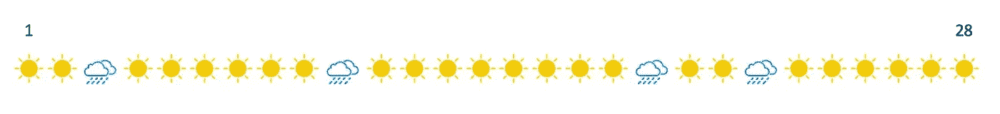

我们从中抽取 10 个。

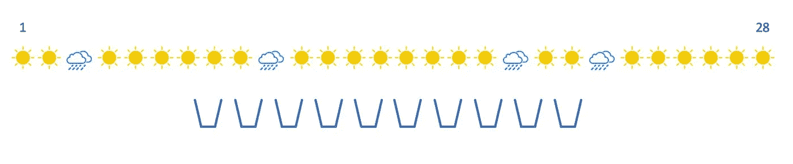

从 28 个项目中抽取 10 个项目总共有多少种方法？对于第一天，我们有 28 种可能性，然后，一旦我们选择了第一种，就有 27 种剩余的可能性，第二种之后是 26 种，以此类推，直到 19 种。

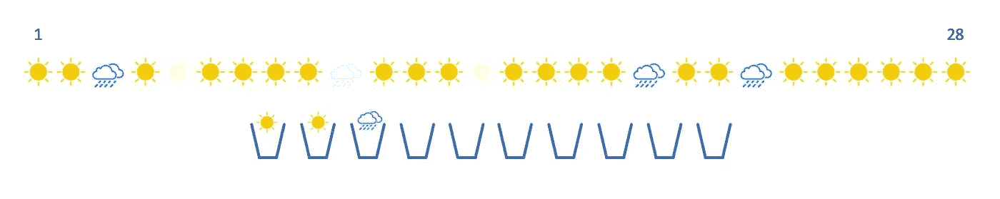

这给了我们*【28 * 27 * 26 * 25 * 24 * 23 * 22 * 21 * 20 * 19】*或者

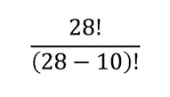

从 28 天中选择 10 天的总可能性。(分母*(28–10)！*干脆把 28 中 18 及以下的因素全部抵消！).

但是，这样我们计算了 10 天假期中所有可能的排列，这意味着第一个时段的晴天和第二个时段的雨天将与第一个时段的雨天和第二个时段的晴天分开计算，即使它们是相同的天数组合-一个晴天和一个雨天。

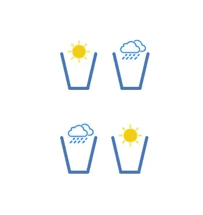

为了得到独特的组合，我们需要将所有可能排列的空间除以我们可以重新排列 10 天的方式的数量。想象一下，对于 10 天的单一唯一组合，我们可以将第一天放在 10 个开放时段，第二天放在 9 个，依此类推。所有可能排列的数目将是*【10 * 9 * 8 * 7 * 6 * 5 * 4 * 3 * 2 * 1】*或 *10！。*

通过从 28 个项目中选择 10 个项目来计算唯一组合数量的最终表达式是:

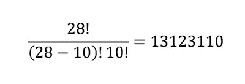

当然，你可能已经认识到二项式系数的公式，也被称为 *n-choose-k* 。这正是我们在这里所做的——从 total *n* 对象池中选择 *k* 对象，在我们的例子中 *n* =28， *k* =10。[https://en.wikipedia.org/wiki/Binomial_coefficient](https://en.wikipedia.org/wiki/Binomial_coefficient)

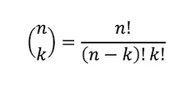

现在我们知道了从 28 种组合中选择 10 种独特组合的所有可能方法。为了找出这 10 天中所有 4 个雨天出现的概率，我们需要找出所有 4 天都出现的组合的数量。

我们如何做到这一点？让我们想象一下这个场景。我们对宇宙的版本感兴趣，当所有四个雨天都发生在我们的 10 天时段。

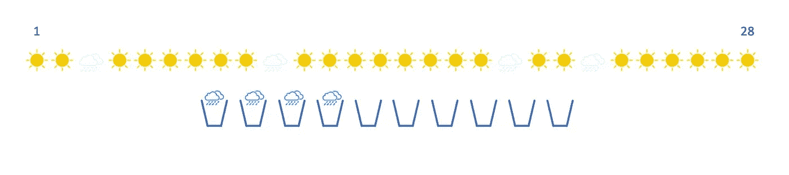

在我们的总空间 *28 中选择 10 种*可能的组合，这种情况会出现在多少种组合中？我们有 6 个开放的假期，还有 24 天可以选择。在这里，我们有 24 种方法来选择第一个桶，23 秒..正如我们在上面看到的，这给了我们 *24 个选择 6 个*可能的组合，当所有 4 个雨天都发生在我们的 10 个假期时。

现在我们只需要在所有可能的组合空间中找到这 4 天组合的分数。

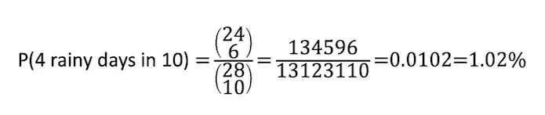

令人惊讶的是，根据假设，在我们的假期中，所有 4 个雨天发生的几率只有 1%多一点！毕竟，在我们的旅行中不可能观察到所有的四个雨天:)

当解决类似的问题时，验证解决方案并确保直觉是正确的总是有帮助的。值得庆幸的是，对于少量的组合，很容易就可以“暴力”解决方案，并简单地列举所有可能的组合。只是用 Python 写了几行代码；)

## 三个雨天的可能性有多大？

恰好 3 个雨天的概率是多少？这里变得更加微妙了。在所有四个雨天的情况下，只有一种方法从总共四天的降雨中选择四天的降雨。但是现在我们只选择 3 天。从 4 天中选择 3 天的方法有多少种？有 *4 选 3* 或 4 种方式。因此，当 10 天中有 3 天下雨时，我们总共有 4 个组合。

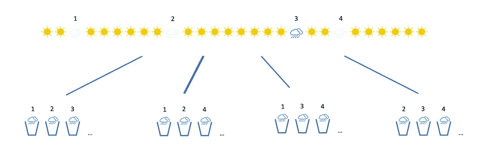

这些三胞胎各包含多少种组合？通过应用相同的逻辑，从 25 或 *25-choose-7* 总可用天数*中选择剩余的 7 天。*

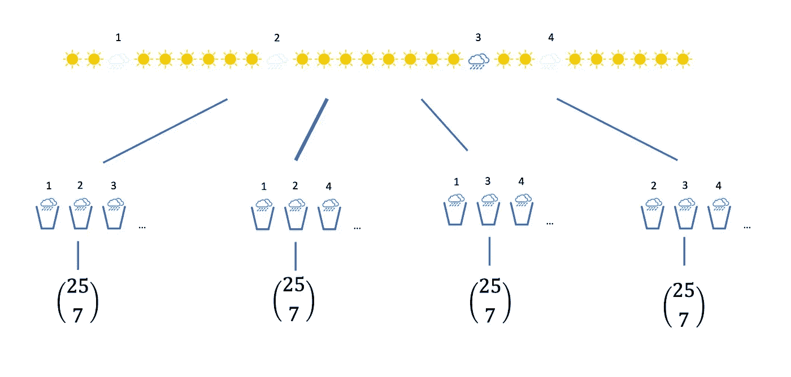

但是在这里，由于其中一个雨天仍然留在池中，所以我们会在 *25-choose-7* 三胞胎的分支中过度计数四个雨天的情况。

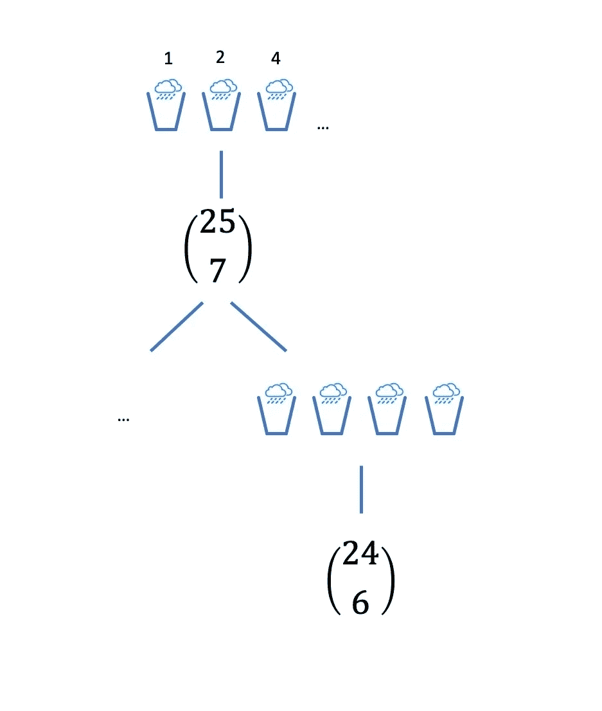

为了避免过多计算 4 个雨天的案例，我们需要从 24 个晴天的集合中选择，而不是从 25 天的总集合中选择:

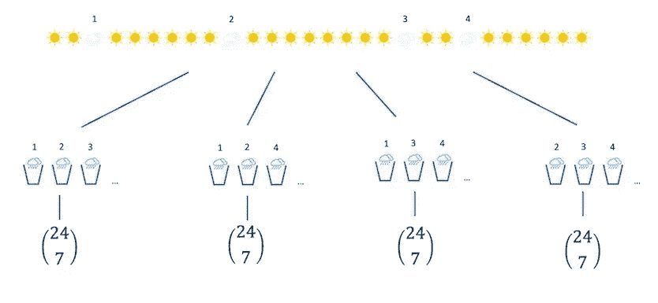

导致:

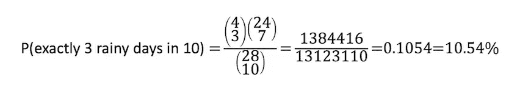

现在，3 天或更长时间的雨会怎么样？在这种情况下，我们只需要将上面计算的 4 天组合的总数相加。

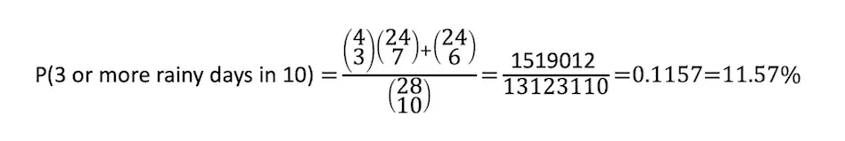

## 至少有一个雨天的概率。

最后，至少有一个雨天的概率呢？如果我们应用上面的逻辑，这里会变得有点令人毛骨悚然，特别是如果雨天的数量变得更多。我们需要计算 3，4，2，1 个雨天的组合数，然后把它们加起来。

但是对于至少有一个雨天的情况，如果我们考虑反问题，我们真的可以简化这个过程——没有雨天发生的概率是多少？那么至少有一个雨天的概率是:

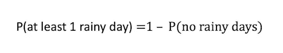

不下雨的概率很容易计算:

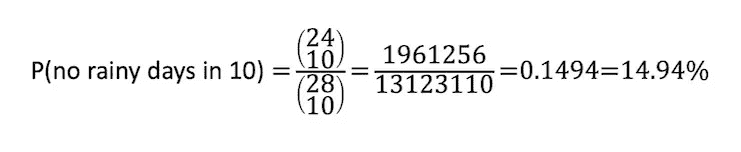

这给出了至少一个雨天的概率:

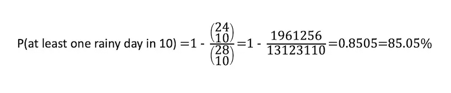

我希望你喜欢这个小概率练习，如果你能想到一个替代的解决方案，请在评论中分享！ [Jun Mei](https://www.linkedin.com/in/nevralia/) 建议使用泊松分布对预期计数进行建模，敬请关注后续情况。；)

PS。我们在普吉岛的 10 天里只下过一次雨:)

脚注:

1.  *这里有一个关于 Khan Academy 的优秀视频，讲述了一个非常相似的问题，以及关于组合和概率主题的其他宝石。*[*https://www . khanacademy . org/math/statistics-probability/counting-permutations-and-combinatorics-probability/v/probability-of-dependent-events-2*](https://www.khanacademy.org/math/statistics-probability/counting-permutations-and-combinations/combinatorics-probability/v/probability-of-dependent-events-2)
2.  *类似结构题:*[*https://en.wikipedia.org/wiki/Poker_probability*](https://en.wikipedia.org/wiki/Poker_probability)
3.  如上所述，4 个雨天是一个平均值，可能在某些月份会有更多或更少的雨天。如果我们有额外的分散测量，如标准偏差或随机变量的整个分布，其他统计方法会给出更准确的结果。
4.  在我的例子中，我使用了苹果的天气预报应用。与维基百科使用的泰国气象部门相比，天气频道可能使用了不同的雨天概念。https://www.bbc.com/news/uk-44238426T2
5.  *见《现代天气预报概述》作者* [*内特·西尔弗*](https://en.wikipedia.org/wiki/Nate_Silver) *，改编自他的著作* [*【信号与噪音】*](https://en.wikipedia.org/wiki/The_Signal_and_the_Noise) *。*[*https://www . nytimes . com/2012/09/09/magazine/the-weatherman-is-not-a-moron . html*](https://www.nytimes.com/2012/09/09/magazine/the-weatherman-is-not-a-moron.html)