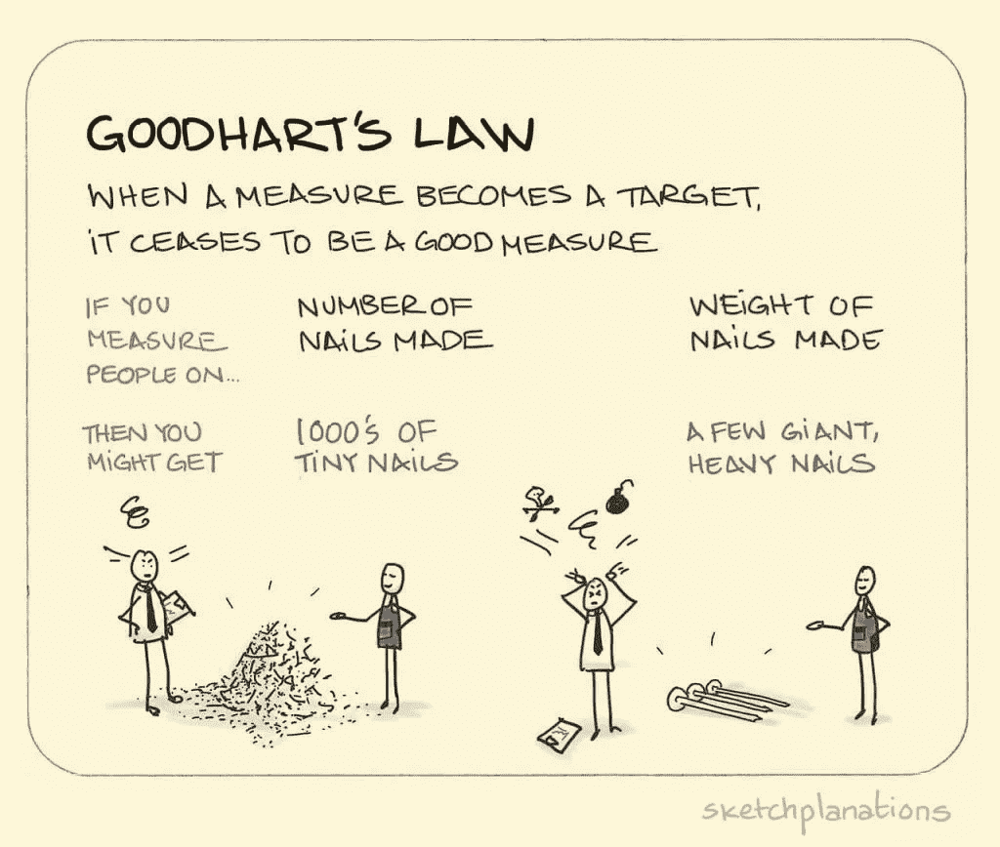

# 古德哈特定律对数据科学的启示

> 原文：<https://towardsdatascience.com/on-the-implications-of-goodharts-law-for-data-science-8f4c5cd81d2e?source=collection_archive---------38----------------------->

2002 年，老布什总统签署了《不让一个孩子掉队》( NCLB)法案，这是一项教育政策，规定所有接受公共资助的学校必须对学生进行年度标准化评估。该法的一项规定要求学校在标准化评估中逐年取得适当的年度进展(AYP)(即当年参加评估的三年级学生必须比前一年的三年级学生表现更好)。如果学校继续无法达到 AYP 的要求，将会产生严重的后果，包括学校重组和学校关闭。因此，许多学区管理者制定了内部政策，要求教师提高学生的考试分数，并将这些分数作为衡量教师质量的标准。最终，随着他们的工作岌岌可危，老师们开始“[为考试而教](https://www.chalk.com/resources/teaching-to-the-test-vs-testing-what-you-teach-mastery-based-evaluations/)”事实上，这种政策无意中*刺激了*作弊，这样老师和整个学校系统就可以维持必要的资金。涉嫌作弊的最突出的案例之一是亚特兰大公立学校作弊丑闻。

这种意想不到的后果实际上非常普遍。英国经济学家查尔斯·古德哈特曾经说过:“当一个衡量标准成为目标时，它就不再是一个好的衡量标准。”这种说法被称为*古德哈特定律*，除了社会政策和经济之外，实际上还可以应用于许多现实世界的场景。

来源:Jono Hey，[草图解释](https://www.sketchplanations.com/post/167369765942/goodharts-law-when-a-measure-becomes-a-target) (CC BY-NC 3.0)

另一个常见的例子是，呼叫中心经理设定目标，增加中心每天接听的电话数量。最终，呼叫中心员工人数的增加是以实际客户满意度为代价的。在观察员工的谈话时，经理注意到一些员工在没有确保客户完全满意的情况下就匆匆结束了通话。这个例子，以及“不让一个孩子掉队”的问责措施，强调了古德哈特定律最重要的元素之一— **目标可以而且将会被博弈。**

资料来源:绍博·维克托， [Unsplash](https://unsplash.com/photos/UfseYCHvIH0)

考虑到人工智能和机器学习模型可能容易受到游戏和/或入侵的影响，游戏的威胁要大得多。2019 年[对 Youtube 上 84695 个视频的分析](https://twitter.com/gchaslot/status/1121603851675553793?s=20)发现，国有媒体*今日俄罗斯*的一个视频被 200 多个频道推荐，远远超过 YouTube 上其他视频的平均推荐数量。分析结果表明，俄罗斯以某种方式操纵了 YouTube 的算法，在互联网上传播虚假信息。该平台依赖收视率作为用户满意度的衡量标准，这进一步加剧了这个问题。这造成了意想不到的后果 [*刺激了关于主要媒体机构的不可靠和不诚实的阴谋论*](https://www.kdnuggets.com/2019/10/problem-metrics-big-problem-ai.html) ，这样用户将继续从 YouTube 获取他们的信息。

> “摆在我们面前的问题是，仅仅因为它能增加人们在网站上的停留时间，就把人们引入充满错误信息和谎言的可恨的兔子洞，这是道德问题——而且它确实起作用了” [Zeynep Tufekci](https://www.theguardian.com/technology/2018/feb/02/how-youtubes-algorithm-distorts-truth)

## 那么能做些什么呢？

在这种情况下，重要的是要批判性地思考如何有效地衡量和实现预期的结果，以最大限度地减少意想不到的后果。这其中很大一部分并没有过于依赖单一的指标。相反，理解变量的*组合*如何影响目标变量或结果有助于更好地将数据联系起来。《纽约时报》首席数据科学家克里斯·维金斯提供了四个有用的步骤来创建符合道德的计算机算法，以避免有害的结果:

> 1.从定义你的原则开始。我建议[[特别是五个](https://www.datascience.columbia.edu/ethical-principles-okrs-and-kpis-what-youtube-and-facebook-could-learn-tukey#fnref5)]，它们是由关于研究伦理的[贝尔蒙特](https://www.hhs.gov/ohrp/regulations-and-policy/belmont-report/index.html)和[门洛](https://www.caida.org/publications/papers/2012/menlo_report_actual_formatted/)报告的作者的集体研究提供的信息，并因对产品用户安全的关注而增加。选择是重要的，因为选择提前定义指导您公司的原则，从高层企业目标到单个产品关键绩效指标(KPIs 或指标]。
> 
> 2.下一步:在优化 KPI 之前，考虑这个 KPI 是否符合你的原则。现在记录下来并进行交流，至少在内部交流，如果不对外或只是在线交流的话。
> 
> 3.下一步:监控用户体验，定量的**和定性的**和**。考虑一下你观察到了哪些意想不到的用户体验，以及不管你的 KPI 是否在改善，你的原则是如何受到挑战的。**
> 
> **4.重复:这些冲突是公司学习和成长的机会:我们如何重新思考我们的 KPI，使其与我们的目标和关键结果(okr)保持一致，这些目标和关键结果应该来自我们的原则？**如果你发现自己说你的一个指标是“事实上的”目标，那你就错了。****