# 虚拟变量和交互作用在线性回归中的作用

> 原文：<https://towardsdatascience.com/on-the-role-of-dummy-variables-and-interactions-in-linear-regression-558d9644fc67?source=collection_archive---------13----------------------->

## [入门](https://towardsdatascience.com/tagged/getting-started)

## 了解这一点将有助于您在拟合线性模型时更好地控制局面

我们都熟悉线性回归的典型例子:[根据房子的大小、房间和浴室的数量等等来预测房价](https://datalesdatales.medium.com/predicting-house-prices-with-linear-regression-595422992c48)。然而，我们也可能经常想在我们的模型中引入分类变量，例如房子是否有游泳池或者它的邻居。

线性回归模型的一个问题是它们只能解释数字输入。因此，我们需要一种方法，将像街区名称这样的词翻译成模型可以理解的数字。

最常见的方法是创建虚拟变量。假设我们正在查看三个主要城市的西班牙房屋，我们有一个分类变量来捕捉房屋所在的城市。这个分类变量可以取值为“Barcelona”、“Madrid”和“Valencia”，因此，如果我们希望我们的模型能够解释它，我们需要对它进行转换。我们这样做的方法是通过创建 *m-1* 虚拟变量，其中 *m* 是我们数据集中唯一城市的总数(本例中为 3)。因此，我们将用“城市”变量代替下面的两个虚拟变量:

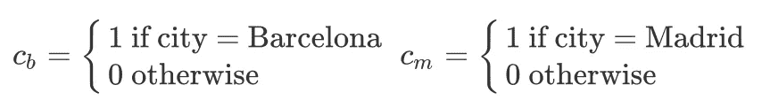

作者图片

这些虚拟变量非常简单。如果城市是巴塞罗那，第一个将等于 1，否则将等于 0。同样，当且仅当城市是马德里时，秒将等于 1。你能明白为什么我们只需要添加 *m-1=2* 个虚拟变量来代表所有可能的情况吗？如果这两个假人都是 0，那一定是城市是瓦伦西亚的情况。如果我们天真地包括三个虚拟变量，我们会为自己制造一个多重共线性问题，因为这三个变量将完全共线。请注意:

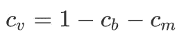

作者图片

其中 cᵥ代表瓦伦西亚市的虚拟变量。因此，我们应该只创建 *m-1* 虚拟变量，以避免过度参数化我们的模型。

现在，让我们看看著名的[鸢尾花数据集](https://en.wikipedia.org/wiki/Iris_flower_data_set)，罗纳德·费雪在他 1936 年的论文*中介绍了多重测量在分类学问题中的应用*。尽管他使用它来展示他的线性判别式，并且它被广泛用于分类技术的教学，但在这里我们将使用它来展示虚拟变量和交互作用在多元线性回归中的重要性和解释。

数据集由来自三种鸢尾花的每一种的 50 个样本组成:刚毛鸢尾、海滨鸢尾和杂色鸢尾。每朵花有四个测量值:萼片长度、萼片宽度、花瓣长度和花瓣宽度。

在 [Unsplash](https://unsplash.com?utm_source=medium&utm_medium=referral) 上由[zdenk macha ek](https://unsplash.com/@zmachacek?utm_source=medium&utm_medium=referral)拍摄的照片

让我们假设我们对萼片长度(`sepalL`)和花瓣长度(`petalL`)之间的关系感兴趣。这种关系看起来是这样的:

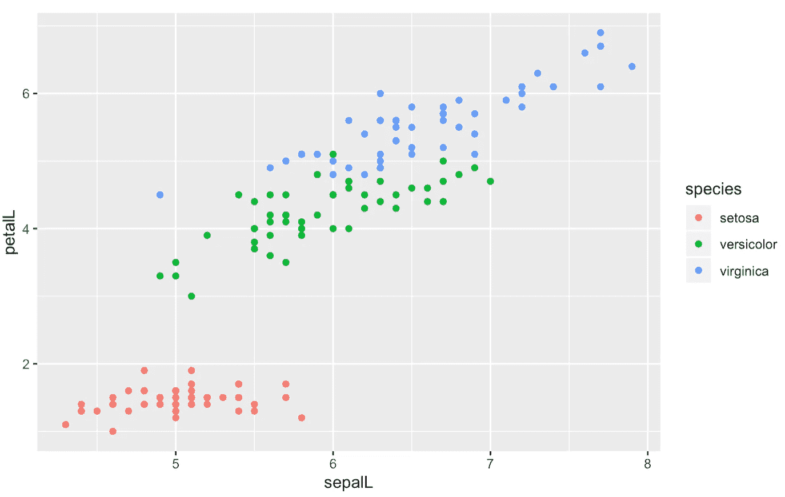

作者图片

为了更好地理解萼片长度和花瓣长度之间的关系，我们可能希望拟合以下简单的线性回归模型:

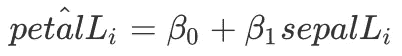

作者图片

也就是说，我们将花 *i* 的花瓣长度建模为其萼片长度(加上截距项)的函数。将该模型与我们的数据进行拟合，我们发现最佳拟合线如下所示:

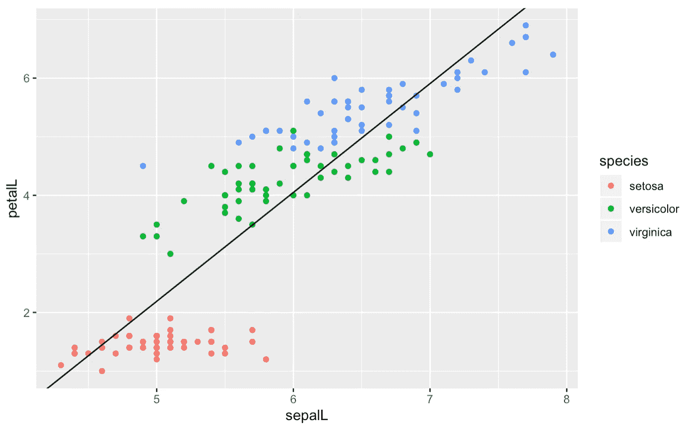

作者图片

然而，通过观察这条线，我们已经可以看到我们是如何高估了鸢尾的花瓣长度——注意我们的模型(最佳拟合线)几乎完全位于红点上方。同时，我们也低估了其他两个物种的花瓣长度。通过查看我们模型的标准化残差，我们也可以看到这一点:

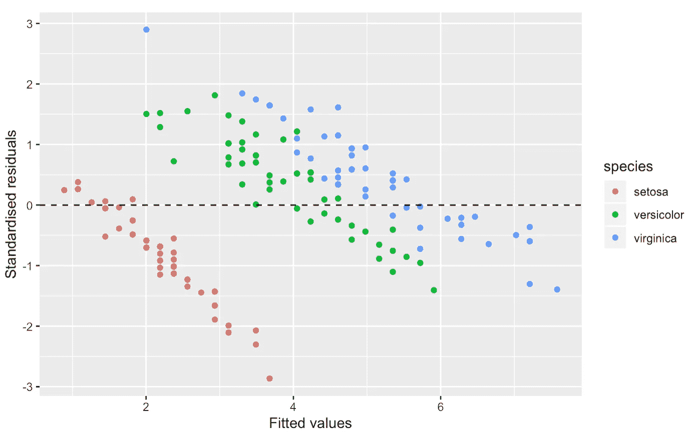

作者图片

回想一下，残差是观测值和预测值之间的差值。因此，负残差意味着预测值高于观测值(高估)，而正残差意味着预测值低于观测值(低估)。理想情况下，我们希望看到标准化残差随机分布在 0 附近，没有清晰的模式。不幸的是，我们可以清楚地看到，上面两个图表中的情况并非如此，我们需要做得更好。

看起来我们可以从增加一个虚拟变量来代表花的种类中获益。因此，与我们之前对西班牙城市所做的类似，我们可以创建两个虚拟变量:

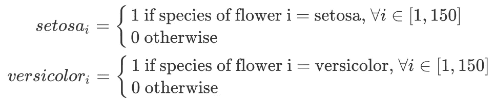

作者图片

因此，我们现在将从简单回归转向多元线性回归。新模型将具有以下形式:

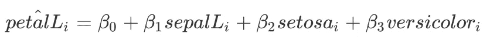

作者图片

现在，注意这将如何根据花的种类产生三条不同的线。如果花是鸢尾:

作者图片

如果花是杂色鸢尾:

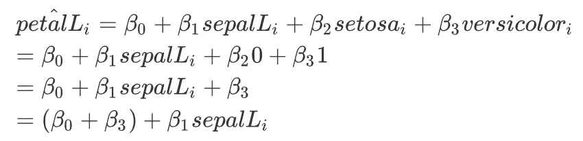

作者图片

如果花是海滨鸢尾:

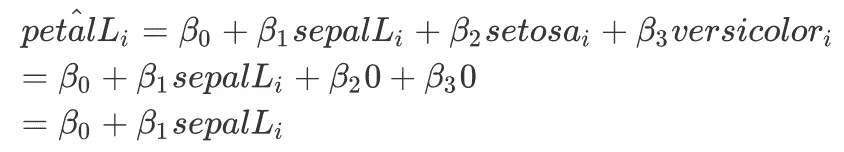

作者图片

请注意 Iris virginica 是我们的参考类别。当花是鸢尾或杂色花时，虚拟变量具有改变截距的效果。由于斜率没有变化，这意味着拟合这个模型将给出三条平行线——每个物种一条。让我们看看它的表现如何:

作者图片

标准化残差:

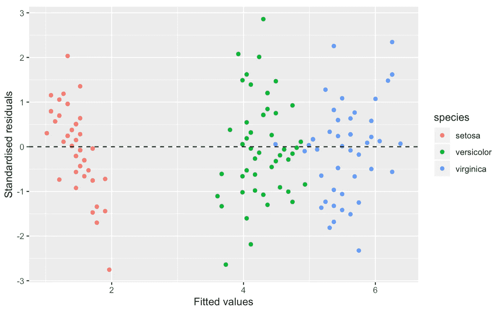

作者图片

这个型号比上一个型号好得多。允许三种不同的截取给了我们的模型更多的灵活性。现在它可以更好地代表这三个物种——我们可以在两个图中看到这一点。但是我们仍然可以做得更好一点。看起来考虑到不同的坡度也是有价值的，特别是在看鸢尾花的时候。

用数学术语来说，这意味着我们需要在物种模型和萼片长度之间添加一个**相互作用**。这是我们的最终模型:

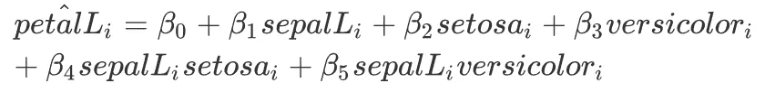

作者图片

再次注意，这将根据花的种类产生三条独特的线。不同的是，这一次，**截距和斜率将被允许不同**。如果花是鸢尾:

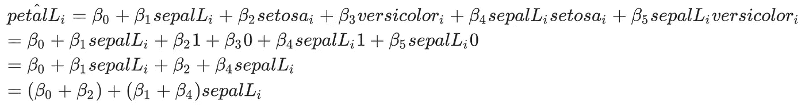

作者图片

如果花是杂色鸢尾:

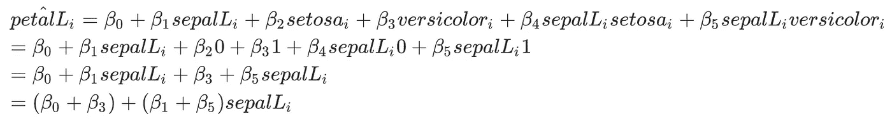

作者图片

最后，如果花是鸢尾:

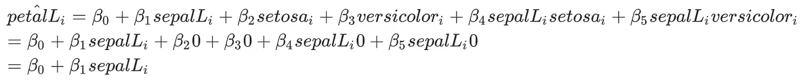

作者图片

在这种情况下，我们可以看到如何将相互作用项添加到我们之前的模型中，从而使模型提供具有不同截距和不同斜率的三条线。让我们来拟合这个模型，看看我们得到了什么:

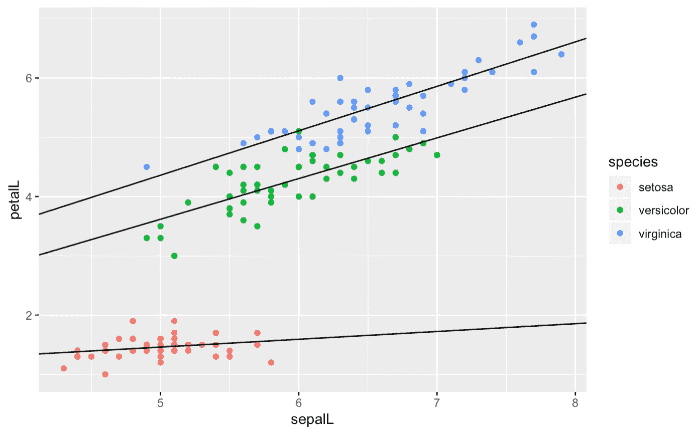

作者图片

标准化残差:

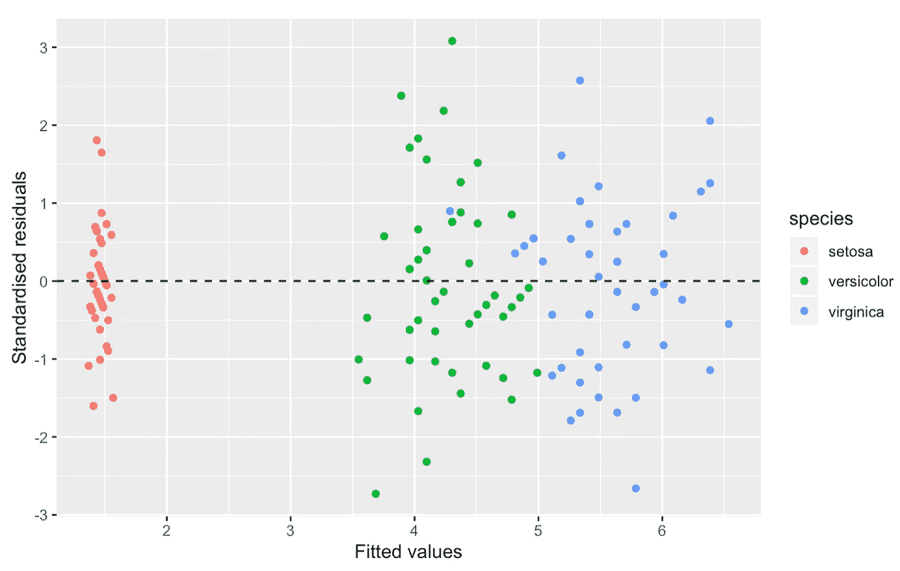

作者图片

现在我们可以看到我们的模型与数据非常吻合。看看那个残差图——它几乎是完美的！

为了完整起见，下面的表格显示了三种模型的[调整后的 R 平方](https://en.wikipedia.org/wiki/Coefficient_of_determination#Adjusted_R2)(越高越好)和[剩余标准误差](https://stats.stackexchange.com/questions/57746/what-is-residual-standard-error)(越低越好):

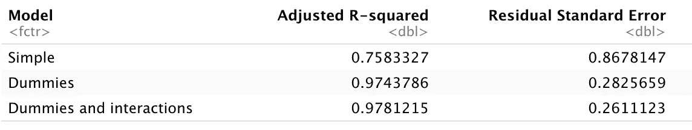

作者图片

我希望我已经能够传达理解虚拟变量和交互项在线性回归的上下文中所起的作用是多么重要。了解这一点将有助于您在对数据进行线性模型拟合时，更好地控制自己的行为和决策。