# 关于倒数级数的和

> 原文：<https://towardsdatascience.com/on-the-sums-of-series-of-reciprocals-6711437ad893?source=collection_archive---------13----------------------->

## 伟大的数学家欧拉和他的伟大发现

图片由来自[皮克斯拜](https://pixabay.com/fr/?utm_source=link-attribution&utm_medium=referral&utm_campaign=image&utm_content=702784)的[皮特·林福思](https://pixabay.com/fr/users/TheDigitalArtist-202249/?utm_source=link-attribution&utm_medium=referral&utm_campaign=image&utm_content=702784)拍摄

1735 年，著名数学家[莱昂哈德·欧拉](https://en.wikipedia.org/wiki/Leonhard_Euler)发表了论文“*De summis serierum reciprocarum*”(关于倒数级数的和)如图 1 所示(点击此[链接](https://scholarlycommons.pacific.edu/cgi/viewcontent.cgi?article=1040&context=euler-works)查看全文)。在这篇论文中，大师发现了求和的一般封闭公式:

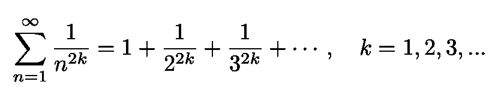

等式 1:整数的偶次幂的倒数之和。

欧拉惊人聪明的方法[从](https://en.wikipedia.org/wiki/Bernoulli_number#CITEREFEuler1735)开始就让数学家们着迷。欧拉在 1734 年已经证明了巴塞尔问题。这个结果将巴塞尔问题从指数 2 推广到任何偶数指数。

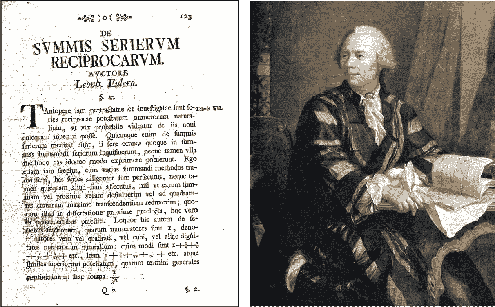

图 1:欧拉和他的里程碑式论文“*De summis serierum reciprocarum*”([来源](https://math0.pm.tokushima-u.ac.jp/~hiroki/major/euler-e.html))。

前三个例子是:

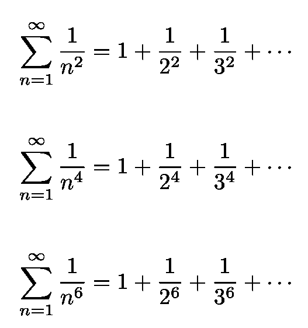

等式 2:等式的前三个例子。1，对于 k=1，2 和 3。第一个是巴塞尔问题，一年前由欧拉首次证明。

注意等式中的第一种情况。2 是巴塞尔问题，也是由欧拉(1734 年)解决的，在我最近的一篇文章中探讨过。

图 2:1712 年 Seki kūwa s Katsuyo sanpús*的一页，他在其中列出了二项式系数和伯努利数([来源](https://en.wikipedia.org/wiki/Seki_Takakazu))。*

但在进行欧拉的精彩证明之前，必须解释一下[伯努利数](https://en.wikipedia.org/wiki/Bernoulli_number)的概念。

图 3:他家族中几位杰出的数学家之一，[雅各布·伯努利](https://en.wikipedia.org/wiki/Jacob_Bernoulli)，发现了伯努利数，并以其命名([来源](https://en.wikipedia.org/wiki/Jacob_Bernoulli))。这些数字是由日本数学家 Seki kūwa 独立发现的。

# 伯努利数

这是证明的第一部分。我们首先提醒读者泰勒级数的概念。泰勒级数可以很快[定义](https://mathworld.wolfram.com/TaylorSeries.html)为“一个函数关于一个点的级数展开”泰勒级数的主题非常广泛，因此我将只讨论一个例子，即指数函数 e *ˣ.的展开，而不是在这里详细探讨*由下式给出:

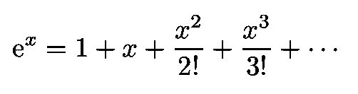

等式 3:指数函数的泰勒级数。它的收敛半径∞，因此它对所有的ℝ.值都收敛

e *ˣ* 的收敛半径 r 为 R=∞。这意味着 Eq。3 是一个幂级数，它收敛于 *x* ∈ ℝ.的所有值

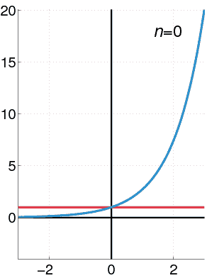

图 4:这个动画显示了当我们在等式中包含更多的项时。3 我们走近ˣ.

现在，为了获得伯努利数，我们执行两个步骤。第一个是琐碎的:我们从等式两边减去 1。3 除以 x，我们得到:

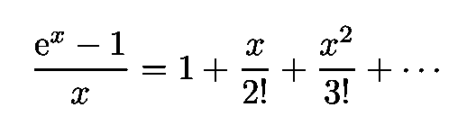

等式 4:在对等式进行简单处理后，ˣ-1)/x 获得了函数(e *的泰勒级数。3.*

对 *x* ≠ 0 有效。伯努利数通过将该级数倒置来定义，如下所示:

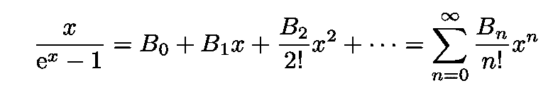

等式 5:伯努利数是如何(间接)定义的。

为了找到 B，我们将使用一个数学技巧。自从情商。4 和 Eq。5 是彼此的倒数(通过构造)，它们的乘积是 1。然后，我们可以将两个等式的右边相乘，然后将所得乘积乘以 *n* ！。

经过一些简单的代数运算，我们得到了一个很好的表达式，它允许我们立刻确定伯努利数:

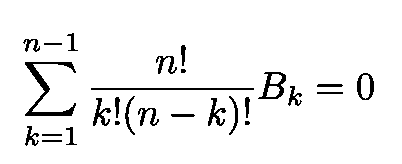

等式 6:可以快速计算伯努利数的等式。

得到的第一个伯努利数是:

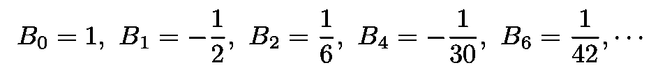

等式 7:从等式 7 获得的第一个伯努利数。6.

# 正切函数及其幂级数

我们现在提供证明的第二部分。在本节中，我们将需要用伯努利数来表示 *x* 的正切值。让我们首先考虑以下恒等式:

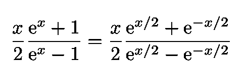

这给出了:

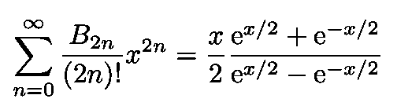

等式 8:伯努利数的幂级数。

我们现在执行两个简单的步骤。将等式 8 右边的 *x* 替换为 2 *ix* (其中 *i* 为虚数单位)得到:

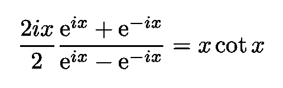

现在，在等式的左边做同样的替换。8 我们得到:

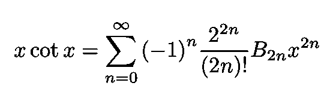

等式 9:用伯努利数表示的 x cot x 的幂级数。

然后我们用三角恒等式

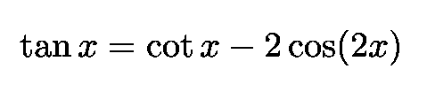

还有情商。9、到达:

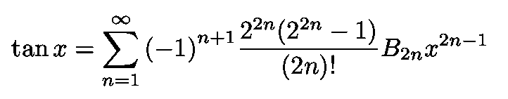

等式 10:tan x 的幂级数用伯努利数表示。

# 余切函数及其部分分数

现在是证明的第三部分，也是最后一部分。利用[部分分数](https://en.wikipedia.org/wiki/Partial_fraction_decomposition)，欧拉得出了如下展开式:

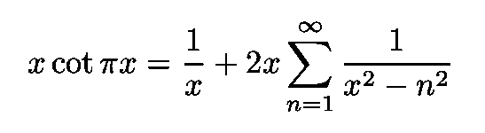

等式 11:x cotπx 对非整数 x 的展开，也是欧拉发现的。

我们现在比较情商。9 和情商。11 前者用πx 代替 x。经过一些简单的操作，我们得到了这个奇妙的表达式:

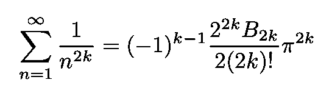

等式 12:我们想要的结果。注意指数总是偶数。对于奇指数没有等价的展开式。

有趣的是，对于奇指数没有类似的公式(对于 *k* =1，立方的倒数之和等于一个数~1.20，称为[阿普里常数](https://mathworld.wolfram.com/AperysConstant.html))，但是没有像等式这样的通用公式。12).也许有人读到这里会发现这一点！

我的 [Github](https://github.com/marcotav) 和个人网站 [www.marcotavora.me](https://marcotavora.me/) 有一些其他有趣的材料，既有关于数学的，也有关于物理、数据科学和金融等其他主题的。看看他们！