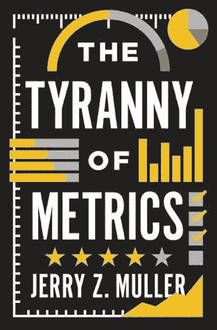

# 论度量的专制和度量的固定

> 原文：<https://towardsdatascience.com/on-the-tyranny-of-metrics-and-metric-fixation-b4c1d44b5f6c?source=collection_archive---------42----------------------->

图片由 [Pixabay](https://pixabay.com/?utm_source=link-attribution&utm_medium=referral&utm_campaign=image&utm_content=1509707) 的 [arielrobin](https://pixabay.com/users/arielrobin-2483349/?utm_source=link-attribution&utm_medium=referral&utm_campaign=image&utm_content=1509707) 提供

## 在一个充满指标的世界里，我们需要清楚地认识到那些弊大于利的指标

从 20 世纪 70 年代和 80 年代开始，我们可以观察到在企业管理中作为绩效衡量标准的度量概念的迅速崛起。[彼得·德鲁克](https://en.wikipedia.org/wiki/Peter_Drucker)，这位据说发明了现代商业管理的人，曾经写道“你不能管理你不能衡量的东西”。从那时起，这句名言中的思想不仅被应用于商业环境，而且基本上被应用于所有行业，包括教育、医疗保健、军事等。

然而，度量标准并不是衡量业务不同方面效率的灵丹妙药。此外，人们经常错误地认为度量是数字的，并且在某种程度上是标准化的，它们背后有强大的科学推理。

在 Nate Silver 的《信号与噪音》和 Cathy O'Neil 的《数学毁灭武器》等书中，我们可以读到不同的统计/机器学习算法如何在无意中弊大于利。度量标准也是如此，因为选择一个错误的或有偏见的度量标准会导致错误的和潜在有害的结论。Jerry Muller 在他的书《度量的暴政》中关注于度量的固定性，即相信标准化的度量包含了做出明智决策所需的所有相关信息。这样，决策者通常将度量和改进视为同一件事，这导致了用度量来代替由经验和才能支持的判断。

来源:[好阅读](https://www.goodreads.com/book/show/36644895-the-tyranny-of-metrics)

与度量固定相关的两个固有且经常被引用的*定律*是坎贝尔定律和古德哈特定律。

坎贝尔定律:

> “任何量化的社会指标越多地用于社会决策，它就越容易受到腐败压力的影响，就越容易扭曲和腐蚀它打算监测的社会进程。”

古德哈特定律(由玛丽莲·斯特拉瑟恩解释):

> "当一个度量成为目标时，它就不再是一个好的度量."

两者都有相同的基本概念，即当给定的绩效指标成为人们/公司试图实现的目标时，完全相同的指标不再是最初试图衡量的良好代表，因为总会有实体试图利用该指标为自己谋利。

在这篇文章中，我探讨了一些与作者在*度量的暴政*中描述的度量崇拜有关的问题，以及我们如何不应该盲目地遵循有偏见/游戏化的度量作为真理的来源。

# 度量固定引起的潜在问题

我将尝试简要描述由度量固定引起的潜在问题，并用真实的例子来说明它们。为了更深入的分析，我推荐阅读*《度量的暴政》*。

## 测量最容易测量的

当我们实际想要测量的东西非常复杂或不可捉摸时，我们经常试图使用简单的测量方法。在这种情况下，我们经常选择更简单、更容易测量的代理，它可能只捕捉到我们想要测量的实际事物的一小部分(或者实际上什么也没有)。问题也出现在**隧道视野**的名下。

当然，这个问题没有放之四海而皆准的解决方案，有些事情太复杂了，无法用一个或几个指标完全衡量。重要的是要记住，所选择的指标/代理实际上是对实际问题的简化，它抛弃了在做决策时不应被忽略或忘记的许多复杂性。

照片来自 [Pexels](https://www.pexels.com/photo/person-holding-white-printer-paper-3740390/?utm_content=attributionCopyText&utm_medium=referral&utm_source=pexels)

## 衡量投入而不是产出

与前一个问题相联系，衡量一个项目所花费的资源量(无论是货币还是其他可量化的单位)通常比努力的结果更容易。这在政治中经常可以观察到，在政治中，各方陈述投入到某项计划中的资金数量，而不是陈述项目的结果或对人们生活的影响。

## 通过标准化降低信息质量

量化是非常诱人的，因为它在广义上组织和简化了知识。通过使用标准化的度量标准，我们可以很容易地获得我们在人(员工、学生等)之间进行比较的数字信息。)或实体(学校、医院等。).

这个问题的一个例子可以是学校给定班级后的标准化考试。理论上，他们应该衡量学生在学习 X 年后的知识水平。然而，他们实际上告诉学生在测试中做得如何(仅测试所有理论上获得的知识的子集)，而没有说明其他重要的事情，如激励学生追求知识，团队合作，发展个性等。

此外，指标提供的过度简化(为了确保可比性)会导致扭曲，因为指标会将信息从上下文、历史和意义中剥离出来。回到测试结果，只看数字可以掩盖一个事实，即一所学校取得的数字与其他学校相比可能较低，但它们实际上是一项成就，因为该学校位于一个动荡的街区，并处理有困难的个人/家庭情况的孩子。

通过剥离不确定性、警告和模糊性来创建度量标准，我们最终获得了确定性和权威知识的外观，因为我们假设度量标准必须有深刻的科学背景。

## 通过奶油游戏度量标准

通过**创造**，穆勒的意思是人们可以通过找到更容易或更简单的案例来保留或改进当前指标的案例。他提供了一个基于医疗保健行业的例子，其中外科医生可以选择易于手术的患者，这样可以最大限度地降低手术失败的风险，从而降低外科医生或医院的成功率。不幸的是，在这种情况下，情况复杂的病人可能会被拒绝手术，这对他们的康复甚至存活的机会产生负面影响。

## 通过省略或歪曲数据来提高数字

这是衡量标准的另一种游戏形式，其中相关方可以省略或扭曲数据来改进衡量标准。书中的一些例子包括:

*   警察降低犯罪的严重性(将重罪归类为轻罪)，
*   将邻近地区的多个犯罪案件归为一类，即使它们明显没有联系，
*   一些学校曾经将成绩差的学生归类为残疾学生，以便将他们从普通学生群体中剔除，从而提高平均成绩。

## 通过降低标准来改进指标

这种谬论的一个明显例子存在于教育部门。一些学校可以简单地降低获得及格分数所需的分数，以增加毕业学生的指标。通过这种方式，看起来学校实际上比实际情况做得更好。

由 [Unsplash](https://unsplash.com/s/photos/airport?utm_source=unsplash&utm_medium=referral&utm_content=creditCopyText) 上的 [chuttersnap](https://unsplash.com/@chuttersnap?utm_source=unsplash&utm_medium=referral&utm_content=creditCopyText) 拍摄

另一个真实的案例是航空公司操纵航班时间。有些航空公司会人为地延长航班的预定时间。通过这种方式，他们试图考虑潜在的延误，并玩弄航班准点率的衡量标准。当所有的初始航班时间都被夸大时，即使途中发生了一些延误，也更有可能按时到达。

## 目标位移

目标位移是指由于专注于优化特定指标，个人或机构的目标向非最优轨迹转移的现象。让我们用一个商业例子来说明这一点。当基于一个或几个指标对员工进行评估时，就会发生目标位移，这可能无法说明员工的全部职责及其对公司成功的影响。

想象一下，一个员工的评估仅仅基于一个指标，如解决的客户支持票据的数量。在这种情况下，这样的员工会尽最大努力关闭尽可能多的票，以保住工作，获得加薪等。但与此同时，该员工只专注于完成工作单，可能会错过他或她可以为公司做的其他潜在事情，例如指导更多初级同事、提出潜在的新项目、发现 CS 工作单中的模式并向适当的团队提及，以便解决/改善客户旅程中的棘手问题等。所有这些都没有在绩效评估指标中考虑，这限制了员工只能专注于一项活动。

值得一提的是，这种衡量标准对于从事重复性、非创造性工作的员工来说可能非常合适，比如工厂工人或打电话推销的广告客户。

目标转移的另一个例子可以在教育行业再次找到。我们已经看到了标准化考试的例子，标准化考试是用来衡量知识的总体水平的。这种考试导致了一种普遍的现象，即*为考试而教*，老师们专注于教授考试中可能出现的内容和过去已经出现的内容，而忽视了其他方面。一个例子可能是忽略较长的论文，而倾向于对考试中的问题给出简洁的答案。

## 限制创造力和企业家精神

度量固定会导致限制员工的创造力和他们的创业精神。这与目标位移有关，因为员工很可能会根据他们的评估指标进行优化，而不是发挥创造力和提出新想法。实验和创业的问题在于，新的、大胆的想法伴随着风险。许多想法可能会失败，而有些想法可能会改变一些企业的游戏规则。然而，这种突破性的想法伴随着不可估量的风险，并且不能很好地与非常具体的性能指标一起工作。这就把我们带到了由公制固定引起的下一个问题。

## 短期主义

许多企业(但不仅仅是企业)可能会关注短期，因为在不久的将来为指标进行优化要容易得多。上市公司就是这种情况，它们每个季度都会公布收益。因此，为下一季度设定现实且可实现的预期，并真正实现它们，是这些公司最关注的。

许多潜在的革命性想法和项目可能需要大量的时间来开发和实施，这与实现短期目标的优化不一致。此外，创新项目是不确定的，可能不会导致公司市场状况的实际改善。这就是为什么高管们经常将资金从 R&D 的部门转移到那些可以更有效地利用这些资金来实现短期目标的部门。

[斯科特·格雷厄姆](https://unsplash.com/@sctgrhm?utm_source=unsplash&utm_medium=referral&utm_content=creditCopyText)在 [Unsplash](https://unsplash.com/s/photos/accountant?utm_source=unsplash&utm_medium=referral&utm_content=creditCopyText) 上拍照

## 数据收集的无形成本

指标固定的一个通常被忽视的因素是收集计算指标所需数据的实际成本。虽然数据收集和分析是许多企业的关键组成部分(因此数据科学迅速崛起，数据科学家被评为 21 世纪最性感的工作)，但教育或医疗保健等行业的情况并非如此。

通常，医生/教授自己必须收集所需的病例文档并将数据手动输入到某种中央系统中，这可能需要大量的时间，并且通常是在没有额外补偿的情况下加班完成的。另一个问题是**机会成本**，在这种情况下，这是教授或医生在收集所需数据时可以做的事情:改进课程，帮助学生，治愈更多的人，等等。

# **结论**

《度量的暴政》是一本警示性的书，作者在书中指出了度量固定的主要特征:

*   用标准化的数字指标取代基于经验的判断的强烈意愿。
*   一种信念是，将绩效指标公之于众将确保相应的机构正确地履行其职责。不幸的是，由于文章中描述的各种形式的衡量标准博弈，情况并非如此。
*   天真地认为，基于标准化指标的奖励/惩罚是一种通用的解决方案，可以适当地激励相关方持续改进他们的绩效。

从本书中可以吸取的教训是，在许多情况下，标准化的度量标准是对现实的过度简化，并没有考虑到情况的整个范围。因此，正如生活中的许多事情一样，适度是关键。我们绝不应该停止使用度量标准，因为没有适当的度量标准来运行任何组织都是适得其反的。我们应该使用它们，但同时也要意识到它们的缺点，并结合基于经验的判断来使用它们，以做出可能的最佳决策。

当提出新的指标时，我们应该始终努力确保:

*   我们实际上需要新的度量标准，因为度量标准的丰富性不是我们想要的，
*   度量尽可能准确地反映我们想要测量的实际事物，
*   这个度量标准并不是一个几乎毫无价值的不可测量事物的代理，
*   如果指标涉及到员工，请尝试让他们参与到建立指标的过程中，因为他们通常拥有深入的领域知识，而高层管理人员在建立指标时可能会忽略这些知识。

这本书包含了更多真实生活中的例子，这些例子都是由度量标准的固定所导致的潜在谬误。但同时，它不仅仅是悲观的，还展示了一些使用度量标准实际上改善了情况的例子。

就个人而言，我非常希望在书中看到更多的空间来解决问题，设计更有意义的度量标准，并实际使用它们和领域专业知识来增强决策过程。