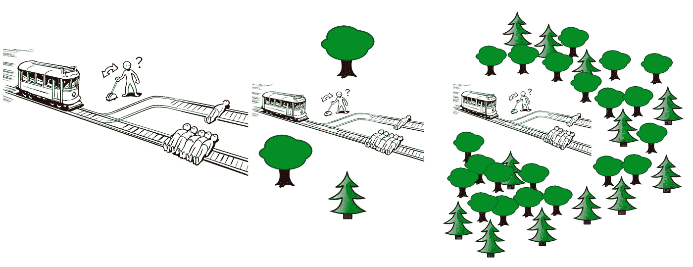
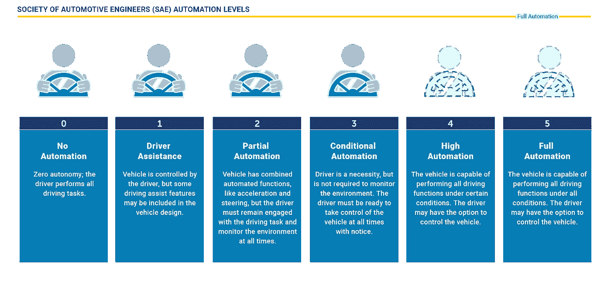
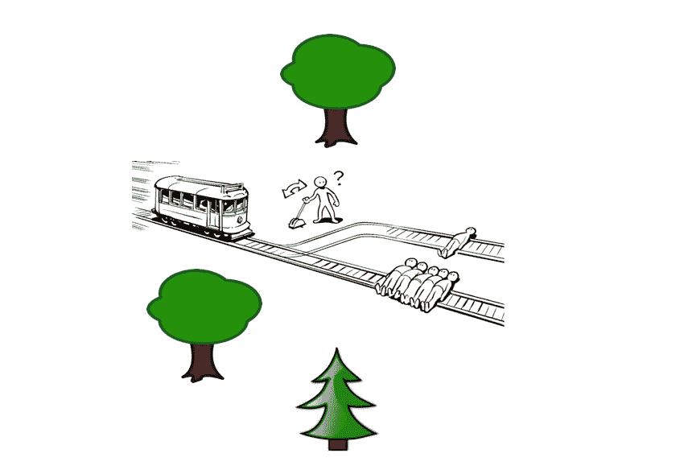
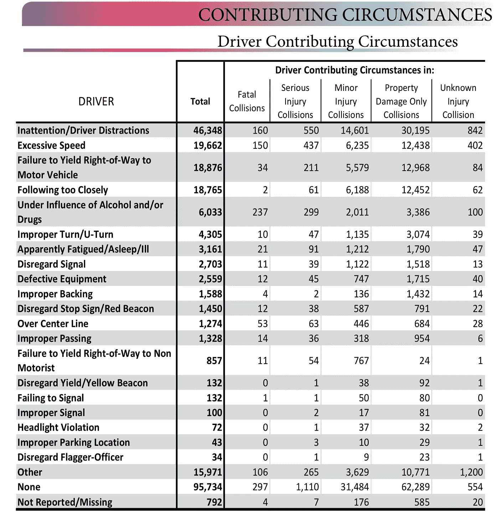
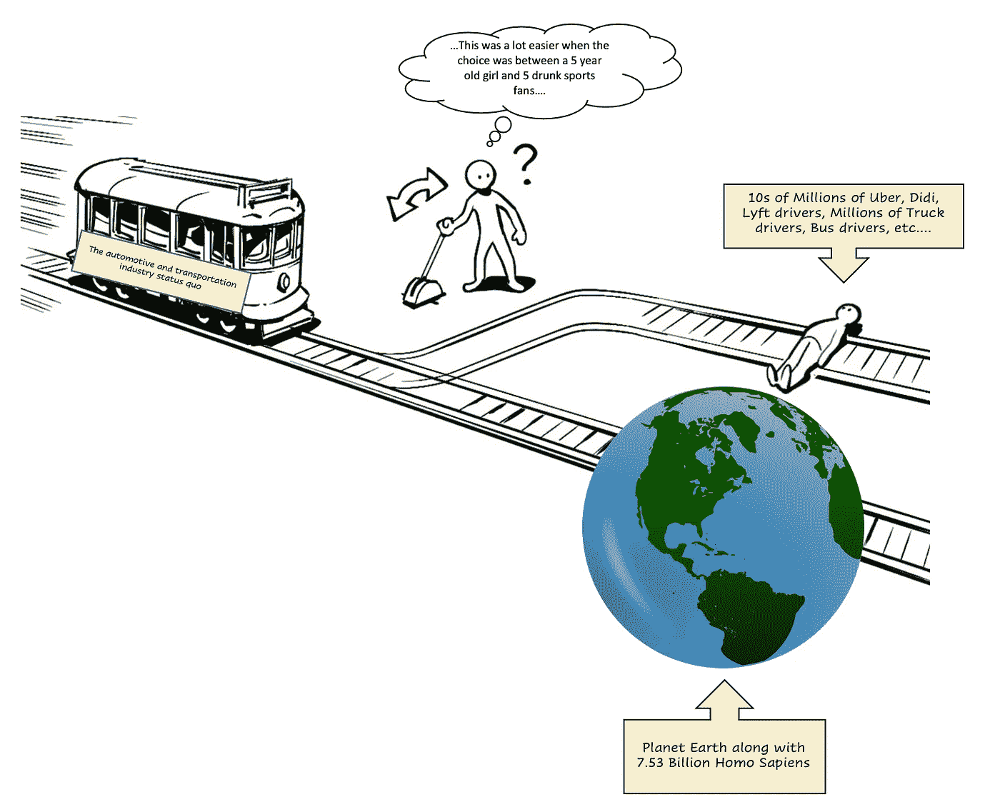
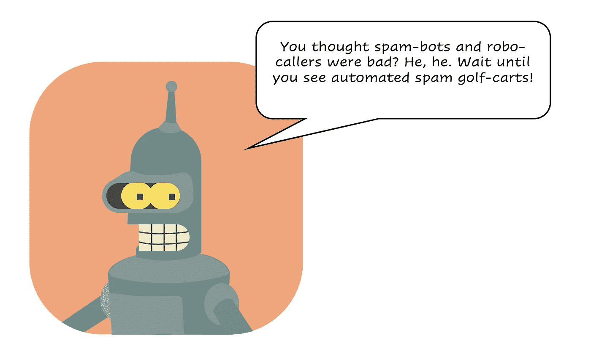

# 在电车上，自动驾驶汽车上，为了树木而错过森林。

> 原文：<https://towardsdatascience.com/on-trolleys-and-missing-the-forest-for-the-trees-or-how-i-went-from-fearing-self-driving-cars-to-a27210456ccf?source=collection_archive---------21----------------------->

## 我是如何从害怕自动驾驶汽车到相信它们可以拯救我们的。

***TL，*** *博士:我曾经认为自动驾驶汽车会导致各种各样的伦理问题，应该劝阻其发展。思考如何将* [*无轨电车问题应用于自动驾驶汽车*](/trolley-problem-isnt-theoretical-2fa92be4b050) *让我改变了想法，现在我相信它们的好处远远大于它们的风险，从道德上来说，我们必须尽快建造和部署它们。然而，它们带来的一些伦理困境仍然存在，因此它们的广泛采用需要仔细规划，并包括某些护栏。*

# 为什么我害怕无人驾驶汽车:

我以前真的很讨厌自动驾驶汽车这个想法。这是小小的嫉妒:在公众心目中，自动驾驶汽车象征着当前人工智能和人工智能范式转变所承诺的可能性。另一方面，在零售和数据科学领域之外，很少有人理解我自己的需求预测和库存优化日常工作与任何计算机视觉或 NLP 问题一样值得拥有人工智能的绰号。

好吧，我太幼稚了。实际上，我认为无人驾驶汽车带来的坏处比好处多，还有两个更深刻、更严重的原因:

*   当谈到无人驾驶汽车时，我觉得在责任和道德责任问题上有几个伦理困境。尽管这些问题还没有答案，但鉴于最终将制造和运营自动驾驶汽车的公司可能的财务实力，为这些困境拟定的答案肯定不会有利于公众。例如:一个人因嵌入式计算机视觉模型的错误分类而被自动驾驶汽车伤害，该模型通常有 99.99%的准确率。自动驾驶汽车公司将进行游说，将这类事件归类为反常的统计事件，以避免对随后的损害和伤害承担责任。毕竟，在当今世界，没有一个硬件制造商期望他们的产品达到 100%的可靠性，卷积神经网络只是另一个技术神器。另一方面，一个在过去 30 年里从未闯红灯的人类司机，因为他从未误认为是绿灯，但他今天第一次意外地错分了十字路口信号灯的颜色，并最终在这个过程中伤害了某人，他将无法声称他的红色分类准确率迄今为止为 99.9995%，这只是一个反常的统计事件。从刑罚的角度来看，基于他良好的记录，他可能会得到宽大处理，但他仍然要对损害和费用负责。
*   在更大的范围内，我觉得自动驾驶汽车是第一种严重威胁社会的技术。也有其他信息技术和自动化取代人力的案例，但其影响或多或少局限于有限的领域，或者新技术的采用是渐进的，社会能够适应(你们中有多少人因为被网飞解雇的重磅炸弹员工而失眠？).自动驾驶汽车的情况并非如此:在发达国家，驾驶某种车辆谋生可能是那些没有大学教育或其他专业技能的人最稳定、最赚钱、最广泛的职业之一。优步估计[到 2017 年底](https://ride.guru/lounge/p/how-many-uber-drivers-are-there)，他们在美国有 130 万司机(现在这个数字可能更高)。美国还有[350 万卡车司机](https://schneiderjobs.com/blog/post/truck-drivers-in-usa)，还有成千上万的公交司机、送包裹司机、送餐司机等等。与此同时，在中国，[滴滴拥有*多达 3100 万司机*](https://www.cnbc.com/2019/08/05/chinese-rideshare-giant-didi-makes-big-move-in-driverless-car-race.html) 。采用也不会是缓慢渐进的。一旦[第五级自动驾驶汽车(即完全不需要司机的汽车)](https://www.aitrends.com/selfdrivingcars/richter-scale-levels-self-driving-cars/)实现，它们的采用将会非常非常迅速。科技公司、乘车共享和其他运输公司以及汽车制造商已经预见到了这一点，并为此做出了规划。此外，它们将降低成本，比普通汽车方便得多，只要汽车公司能够以足够快的速度生产它们，它们的广泛采用将比拼车服务取代老式出租车服务所需的时间更短。自 19 世纪初以来，技术反对者、勒德分子和其他各种悲观主义者就一直在警告技术失业。对此的回应一直是，到目前为止，世界末日的情景还没有成为现实，技术创造的就业机会一直比它带走的多。但鉴于自动驾驶汽车的速度和影响范围，它们的影响会有所不同。如此迅速地让如此多的在职成年人失业将会产生严重的经济和社会后果，这一次，我们将无法躲避技术失业的子弹。

概括地说，我非常担心 L5 自动驾驶汽车的到来，因为:(1)它们提出了伦理困境，这些困境可能会以有利于大公司的方式解决，而不利于骑手的安全和财务，(2)它们可能会导致工人大规模和突然的失业，这是我们作为一个社会没有能力应对的。

车辆自主性的 0-5 等级(来源:[https://www . nhtsa . gov/technology-innovation/automated-vehicles-safety](https://www.nhtsa.gov/technology-innovation/automated-vehicles-safety))

# 输入台车问题:

T 电车难题是由[菲利帕·福特](https://plato.stanford.edu/entries/philippa-foot/)在 1967 年提出的一个现代形式的思维实验。其基本公式如下:

> 你正看着一辆失控的电车沿着轨道冲下山坡，有 5 个人被卡在轨道上，几秒钟之内就会被轧死，所以在那之前没有机会把他们从轨道上解救出来。在你旁边是一个杠杆，如果拉动它，它会将手推车重新引导到一个侧轨道上，一个 5 岁的小女孩正在轨道上玩耍。如果你拉动杠杆，那 5 个人得救了，但是小女孩死了。如果你不拉操纵杆，那 5 个人都会死，但是那个女孩什么也不会发生。你应该拉操纵杆，还是让电车继续在轨道上行驶？

这是一个奇怪的场景，在现实生活中几乎不会发生。其最初的目的是证明结果主义伦理学(其中结果决定哪种行为最道德)和义务论伦理学(其中普遍规则决定哪种行为最道德)之间可能的冲突:一个结果主义者会选择拉杠杆来拯救 5 个人并牺牲那个女孩，因为 5 个生命比一个生命更有价值，而义务论者会选择不拉杠杆，因为否则他会谋杀一个无辜的女孩，而什么也不做。 他没有犯任何错误，即使这 5 个人被困在原来的道路上运气不好(注意，我们在这里不考虑不作为有罪的情况)。

在它存在的大部分时间里，手推车问题主要是学术兴趣，或者是在晚宴上提出来让自己显得有趣和深刻的东西。没有人会真的面对一个真实的世界，在那里他们有几秒钟的时间进行道德计算，并决定他们是伊曼纽尔·康德的信徒还是约翰·斯图亚特·穆勒的信徒。差不多吧。这确实发生过一次，是火车，不是电车。

但是随着自动驾驶汽车成为现实，电车问题突然变成了一个非常实际的问题:

> 当一辆配备了最新图像识别和实体检测算法的自动驾驶汽车发现自己处于必须在撞到左边的 5 个人和右边的一个年轻女孩之间做出决定的情况下，会发生什么？需要提供一种算法来做出这样的决定:我们是否把它变成一个优化问题，用一个数值目标函数来计算每一个行动过程将拯救多少生命？或者，我们是否对一些明确的“如果-那么”类型的规则进行编码，以反映“无论代价如何，你都不应伤害一个无辜的人”这一原则？

这个问题开始引起一大堆议论:哲学毕业生现在可以考虑在谷歌担任产品经理，而不是被迫去社区大学教书。开发人员会喜欢尝试解决这种类型的问题，而不是花费他们的日日夜夜苦干，想出另一个微服务 REST API，也许有 5 个人会在未来 2 年内使用。深刻的哲学问题和算法/建模挑战的交集让每个人都觉得他们是在现实生活中的[阿西莫夫的故事](https://en.wikipedia.org/wiki/Three_Laws_of_Robotics)。在晚宴上提出手推车问题的人现在可以在哲学玩笑中说出特斯拉和 Waymo 的名字，并表现为*都是与尖端技术领域相关的*渊博的知识分子*和*

最近偶然看到这篇很棒的帖子，让我想起了电车问题的这个新化身:[“电车问题不再是理论上的”](/trolley-problem-isnt-theoretical-2fa92be4b050)。它对电车问题给出了一个清晰明了的概述，也是一个关于各种伦理框架(义务论、结果论等)的很好的入门，这些伦理框架可以用来解决人工智能的伦理困境。

我开始研究无轨电车问题的逻辑，试图弄清楚为什么这对人工智能驾驶的车辆来说是一个现实世界的困境，但对人类司机来说却很少如此？毕竟，Foot 最初的表述涉及到人类决策者，基于此，想象处理“类似手推车问题”的情况实际上是准备驾照考试时标准道路规则培训材料的一部分并不牵强。

答案是:在这种情况下，人类司机很少能够诉诸逻辑。他们无法在头脑中做出如此闪电般快速的纯理性计算，同时他们还试图保持对碰撞车辆的控制，*和*也在认真思考自己的死亡。他们将无法以所需的速度处理信息，更不用说在管理情绪、肾上腺素和任何其他生理影响的同时处理信息了，这些都是由于不可避免的碰撞造成的。

这是我突然想到的:无人驾驶汽车将是比人类好得多的驾驶员！首先，尽管自动驾驶汽车将不得不处理偶尔的技术缺陷或软件错误，但总体而言，它们比人类司机更不容易出错。自动驾驶汽车绝不会边发短信边开车，也不会酒后驾车，更不会故意超速行驶，等等…

更重要的是(对于 Trolly 问题)，在碰撞或其他高风险情况下，他们在瞬间做出决定时会更加理性。因此，他们需要能够进行解决诸如手推车问题这样的困境所需的伦理演算。另一方面，人类太慢，太依赖生理因素，太情绪化，永远无法在必要的时间框架内解决它们，这样的伦理困境与他们的驾驶技能没有实际关联。现在我们明白了为什么考驾照时不需要手推车问题的知识。

# 缩小以查看森林:

好的但是如果自动驾驶汽车比人类司机更好，那么这里就不仅仅是电车问题这样的边缘案例，或者自动驾驶汽车的责任和代理问题了。

绝大多数车祸都是由各种人为错误造成的:分心驾驶、鲁莽驾驶、疲劳驾驶、酒后驾驶、未打信号等。例如，我的家乡华盛顿州 2015 年造成碰撞的统计数据见下表(我认为可以肯定的是，类似的模式正在国家层面发生，在大多数其他发达国家也是如此)。

统计数据来自华盛顿州运输部 2015 年年度碰撞总结:请注意，有缺陷的设备——这是任何自动驾驶汽车最有可能发生碰撞的情况——导致了 2559 起碰撞。相比之下，分心驾驶的次数为 46348 次，超速驾驶的次数为 19662 次，未让出优先通行权的次数为 18876 次，所有这些原因都可以通过适当设计的自动驾驶汽车来消除。

这意味着自动驾驶汽车的广泛采用将大大减少因交通事故而发生的死亡、受伤以及物质和经济损失的数量。事实上，可以想象自动驾驶汽车技术将会进步(通过将 M.L .和 A.I .与各种控制工程和基于规则的护栏相结合),达到汽车碰撞接近零的程度。尽管上面讨论的一些伦理困境(电车问题、自动驾驶汽车的责任和道德代理等)仍然相关，但与自动驾驶汽车在拯救生命方面的总体优势相比，它们的重要性显著下降(注意，我在这里使用的是结果主义思维模式，以便做出最后一个声明)。

# 说到树…

今天的汽车平均有 95%处于闲置状态。让我们先看看我自己家庭的使用模式:每天早上我开车 2.8 英里/7 分钟到离我们家最近的公交车站，然后把我的车留在公交车站，乘公交车去西雅图市区。我妻子大部分时间在家工作，但每周有两天不得不去华盛顿大学上课。她开车约 6 英里/14 分钟到达当地校园。她的通勤时间总是和我的不一样。对于其他任务，如购物和周末，我们只使用我的车。由于这种时间冲突，我和我妻子的通勤时间表之间每周有两个早晨，这意味着我们不得不在家里养两辆车，而不是一辆。

有了自动驾驶汽车，这种情况将不复存在。自动驾驶汽车带我去汽车站。在我妻子需要去 UW 的日子里，车会自己回家，然后送我妻子去学校。我可能会在白天给她发短信或电子邮件，告诉她我会在 18:00 回到汽车站，那时她可以派车来接我。我们获得了前两辆车相同的物流灵活性，排放率大致相当，但现在只生产和维护一辆车而不是两辆车的环境足迹。

使用合适的优化和车辆路线安排技术，上述优点可以应用于更大的人群和组织。理论上，我们可以有效地达到这样一个点，即每个人口中心都有一个单一的集体运输系统，该系统仍然提供个人拥有车辆的物流灵活性，但车辆数量要少得多(尽管实现这样一个 u̵n̵i̵v̵e̵r̵s̵a̵l̵̵p̵u̵b̵l̵i̵c̵̵t̵r̵a̵n̵s̵p̵o̵r̵t̵a̵t̵i̵o̵n̵系统的社会障碍，至少在美国，将是令人生畏的)。当然，这意味着汽车制造和维护对环境的影响将显著降低，交通拥堵和通勤时间的显著减少也将带来社会(和精神健康)效益。

# 自动驾驶汽车是一种道德要求:

所以现在我们已经确定无人驾驶汽车有潜力做到以下几点:

*   通过消除由人的失误和弱点造成的汽车碰撞，每年挽救大量的生命，这些失误和弱点构成了汽车碰撞的绝大多数。
*   显著降低汽车制造和维修行业对环境的影响。
*   通过大幅减少世界各大城市的汽车数量，从而减少或完全消除交通堵塞，提供显著的社会效益。

正因为如此，我现在相信，自动驾驶汽车的潜在好处对改善人类状况是如此引人注目和至关重要，以至于有能力这样做的当局和组织在道德上必须尽一切努力制造自动驾驶汽车，并确保它们尽快得到广泛采用。

让我用另一种更戏剧化的方式来表达:

> 据估计，全世界每年有 125 万人死于车祸。因此，发达国家政府和主要科技公司必须尽快开发无人驾驶汽车的道德义务，与世界各国政府和医疗机构在出现危险的传染病如 SARS 或 2019-nCoV 冠状病毒时必须开发疫苗的道德义务是相同的。

我意识到这是一个非常强烈，甚至激进的说法。但正如我在上面所说的，我认为自动驾驶汽车对人类和环境的积极影响确实证明了这种必要性。

太好了，如果你相信那个论点，那我们就都准备好了！！！自动驾驶汽车或多或少是一种绝对的好处，任何关心自己未来孙子、讨厌交通堵塞的负责任的好公民都应该开始给他的国会议员打电话，或者尝试在 Waymo 找份工作。在这种关于自动驾驶汽车的新的宏伟观点中，那些讨厌的伦理困境不再是存在的问题。相反，它们仅仅是设计细节，无论哪个软件团队被指定为他们工作，他们都可以担心，而我们却在期待一个更清洁、无交通堵塞的星球，一个 17 岁的 Snapchat 用户不再有能力摧毁一个家庭。

没那么快！！！！我们实际上让困境变得更糟……

# 无轨电车问题，非常严重…

我们忘记了我关于自动驾驶汽车的第二个严重问题:几乎所有以驾驶陆地车辆为生的人突然大规模的技术失业。事实上，我们现在发现自己正在处理一个“宏观”层面的电车问题:

自动驾驶汽车带来的“真正”电车问题:权衡自动驾驶汽车将为人类和地球带来的巨大好处，以及那些将被自动驾驶汽车淘汰的人的生计和人类尊严。

当权衡自动驾驶汽车的潜在好处，还是纠结于各种哲学谜题，如最初的自动驾驶汽车电车问题或自动驾驶汽车的道德机构问题时，选择是显而易见的。

但是当我们考虑到技术失业的问题时，那么做一个简单的成本效益分析就不再可能了。事实上，我们开始看到后果主义方法的局限性:在这种情况下计算效用是很难的——与全人类相比，数百万职业司机中只有几千万人受到影响，但我们是否考虑了他们的家庭和社区？如此大规模的失业对经济和整个社会的连锁反应如何？可以想象，如此大规模的失业将导致如此严重的社会冲突，以至于首先抵消了自动驾驶汽车的好处。

在这一点上，我们必须进入康德的领域:康德的伦理学方法是义务论方法的缩影，他谈到了“[目的王国](http://myweb.ecu.edu/mccartyr/GW/KingdomOfEnds.asp)”，一个理想的社会，在这个社会中，每个人都被视为自己的“目的”，没有人被视为仅仅是实现另一个人或团体的目标的手段，无论这些目标多么高尚或崇高。

这里有一个非常黑暗、令人毛骨悚然的思想实验来说明康德关于目的王国的概念:

> 想象一下，我告诉你可以实现一个持久的世界和平:一个可持续的结束所有的战争和所有的冲突和意识形态的斗争，但前提是你必须履行以下仪式:你需要带一个 4 岁的孩子，把他们关在黑暗的地下室里度过余生，每天，你必须进入地下室，用喷灯折磨他们 30 分钟。这是为了世界和平可以接受的代价吗？

大多数人会响亮地回答:“不！”。

从这个角度来看，如何潜在地避免汽车碰撞，或者如此激进地减少流通车辆的数量会对环境产生什么影响都无关紧要:只要哪怕是一个人的尊严，一个“终点”被践踏，那么自动驾驶汽车就不是我之前认为的绝对积极的东西。

我觉得还是有希望的。虽然我认为自动驾驶汽车的大规模采用将比其他技术快得多，自由市场的极度便利和效率*乐于助人*，但它仍然不会是瞬间的。在 L5 自动驾驶汽车的第一个成功量产模型和它的广泛采用之间，仍将有几个月的时间(或者至少我希望如此。如果我们的技术和商业模式以比这更快的速度发展，[那么我们将面临更大的人工智能相关问题](https://en.wikipedia.org/wiki/Technological_singularity)，我们都应该为数字末日做好准备。在此期间，不同的世界政府和组织可能会探索不同的解决方案。这些解决方案必须经过周密的计划(以便在执行时干扰最小)，并且需要足够的勇气。

作为可以实施的政策类型的一个例子:我在 2003 年参加了一个海洋生物学会议(在过去的生活中，[我将神经网络和预测算法应用于沙丁鱼和鲭鱼种群](https://www.academia.edu/10835205/MedSudMed_Technical_Documents_No.5_Acoustic_identification_of_small-pelagic_fish_species_target_strength_analysis_and_school_descriptor_classification))。毛里求斯代表解释了该国政府如何作为拯救珊瑚礁努力的一部分，实际上向沿海渔民支付全额工资，不让他们在任何受影响的珊瑚礁区捕鱼。这就是我所说的有勇气:美国政府有没有勇气向 3000000 多名美国卡车司机支付报酬，让他们在 4 或 5 年内不要驾驶卡车，或者提供其他形式的安全网，让他们过渡到新的就业形式？

# 一句警告:

你可能已经注意到，在提到自动驾驶汽车的好处时，我经常使用“潜在”这个词。这并不是因为我认为 L5 自动驾驶汽车的未来在某些方面是不确定的。一点也不。这是因为更深层次的风险:

仅仅因为一项新技术具有显著改善人类状况的潜力，并不意味着该技术的实际应用会带来这样的结果。只要看看互联网，它本应是知识共享和统一的工具，但却变成了相反的东西:错误信息、宣传和分裂的工具。或者更接近眼前的主题:看看打车服务，它承诺减少流通车辆的数量，因为许多人会发现使用它们作为他们的默认交通方式比拥有一辆汽车更少麻烦，更具成本效益。相反，它们导致许多大城市的车辆数量增加，因为驾驶拼车服务被视为一种容易获得和灵活的工作，几乎不需要或根本不需要资格。

同样的风险也适用于自动驾驶汽车:它们在社会中的部署必须谨慎进行，并得到指导，以便我们作为一个社会努力实现它们的潜在好处。否则，它们可能会变成不同的东西，导致更多而不是更少的车祸，或者将我们已经拥堵的道路变成自主的深度卷积网络驱动的无政府状态。今天，大多数在线广告服务都是完全自动化的，由客户目标 ML 算法运行，没有任何人工干预——看看由此产生的垃圾网站、垃圾窗口和恶意软件网页，它们已经成为现代浏览体验的定义。现在，将那些作为在线加法行业特征的相同设计原则、商业模式和技术过度应用于从 Roomba 到 18 轮车大小的自动驾驶汽车，想象一下对我们的基础设施和环境的影响……你看到了吗？一想到这件事就害怕得不敢去想。

这就是说，为了防止自动驾驶汽车的部署陷入算法-机械混乱，政府和大技术必须协同工作，确保它们的采用和使用遵循严格的计划和规则，在所有阶段都将康德的“目的王国”概念作为指导原则。

鉴于各国政府在其它任何重要的全球问题上几乎没有达成一致，它们如何才能实现所需的协调规划水平？我不知道，但我确实有希望，因为在这种情况下，Bigtech 有影响力，有手段，也有自我利益，来引导自动驾驶车辆朝着正确的方向正确部署。

# 结论:

在这篇文章中，我解释了我是如何从觉得无人驾驶汽车将是最大的问题来源，转变为相信使用无人驾驶汽车的优势将解决如此多的问题，以至于政府和科技公司在道德上有义务尽快提供它们。我认为，尽管有诸多积极影响，自动驾驶汽车仍将带来前所未有的技术就业水平，带来可怕的社会和经济后果。我认为，基于康德的目的王国的概念，我们不应该忽视那些被自动驾驶汽车淘汰的人的困境，因为这将把他们视为手段，而不是目的。最后，我呼吁，一旦实现了必要的技术创新，L5 自动驾驶汽车用于公共用途的部署应该谨慎并根据预定的计划进行，以确保它们确实完全实现其承诺，并减轻它们将导致的工人失业的影响。