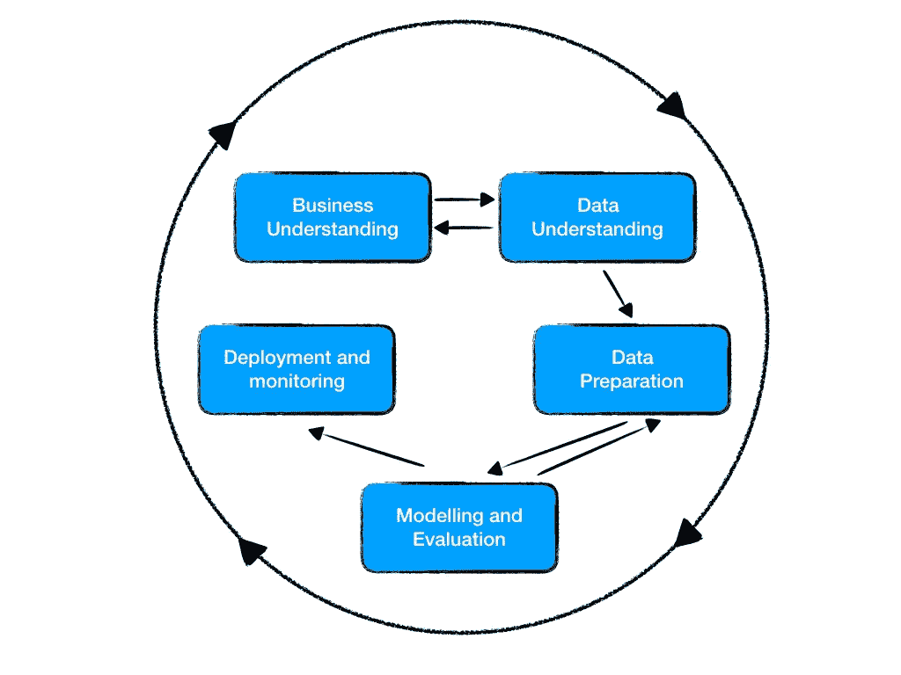

# 同样，CRISP-DM 方法

> 原文：<https://towardsdatascience.com/once-again-crisp-dm-methodology-13f02557b632?source=collection_archive---------33----------------------->

弗兰基·查马基在 [Unsplash](https://unsplash.com?utm_source=medium&utm_medium=referral) 上拍摄的照片

## 快速浏览机器学习项目的著名方法之一

如果你正在读这篇文章，说明你对机器学习和数据科学感兴趣。你可能会尝试在这个领域开始你的职业生涯。或者简单地说，你想更新这种方法。

无论如何，非常欢迎你继续阅读！

老实说，这是许多关于这种方法的帖子之一。你不会在这里发现其他帖子没有的新东西。然而，我会给它一个不同的方法。不是如何将这种方法应用到你在互联网上找到的数据集，而是如何在实际的商业问题中使用它。

长话短说 *CRISP-DM* ，代表*数据挖掘的跨行业标准流程*，是一个由几个步骤组成的迭代过程。它为如何从头开始构建数据宁敏项目设定了框架。

基于 CRISP-DM 流程的米格尔·托雷斯图像

**业务理解**

如果你想成为一名成功的数据科学家，你需要对业务有高度的理解。我肯定你已经听过这句话很多次了。

好吧，惊讶吧，是我再一次告诉你，不管你认为你对这个行业或这个行业了解多少，你知道的还不够。

我说的不是理解你 Kaggle 项目的栏目。我的意思是，拥有高水平的商业专业知识，这需要很多年才能实现。只是不要忘了一直学习业务，研究你正在工作的行业。

基本上，没有业务专业知识，你不知道你的模型需要什么样的关键特性。此外，你不会有无限的时间只专注于了解行业或领域。你将有许多其他任务要做，例如，照顾数据，维护，运行和部署其他模型。

总之，依靠与业务相关的人会帮助你更快地实现这一点。向他们提问、学习并创造协同效应。

> 对这个行业非常好奇

一旦你了解了业务，并且你有一个问题要解决，设定目标，写下它们，并使它们清晰公开，这样业务人员就可以联合起来。(*请注意，这些目标很可能会改变*)

**数据理解**

[Adeolu Eletu](https://unsplash.com/@adeolueletu?utm_source=medium&utm_medium=referral) 在 [Unsplash](https://unsplash.com?utm_source=medium&utm_medium=referral) 上拍摄的照片

现在你认为你了解这个行业了吗？理解数据是一个全新的世界。这需要专业技能，更重要的是，需要大量的时间和耐心。可能你不会有。这将不会是几个表或只是一个简单的排序和清理 CSV。幸运的是，很少有大的数据库。

数据理解和业务理解一样，是一个漫长的过程，在你的整个职业生涯中，你都将经历这个过程。

> 对数据充满好奇

**数据准备**

想想你需要什么来创建理想的数据集，然后疯狂地获取它们。不要只关注数据库中的内容。离开它们，去其他网页(也叫网络报废)，去仓库，甚至，让你的公司购买它。

这一步有时被称为特征工程，它包括数据清理、分类和删除相关变量等任务。

这被认为是一个创造性的过程，也是这个项目的真正价值所在。当然，这将是你花费大部分时间的地方。有人说，大约 80%的时间花在数据争论上。

所以…

> 沉迷于功能

**建模与评估**

我不会在这上面花太多时间，但是如果你想节省时间和头痛…

> 先试试 XGBoost

这会给你带来非常好的结果。并且您不必花费大量时间来选择最合适的算法和更改超参数。你可以花很多时间只是为了稍微减少你的模型的误差。真的值得吗？将这些额外的时间用在特性工程阶段会更好吗？在这个阶段，你可以产生更大的影响。

**部署和监控**

如果你到了这里，炒作是真实的。这意味着商业人士对你所做的很满意，并且已经可以使用了。否则，你不会这样做。

这里的目标是…

> 尽可能自动化。

有许多不同的部署。它可以只是一个报告，或每晚的批处理，或一个 CSV 文件。大多数情况下，您必须将您的模型放在一个生产服务器中，并且它将由第三方使用。随着时间的推移，模型的准确性会降低，必须用新的模型来代替。因此，创建必要的指标来自动跟踪它何时不能正常工作。

**结论**

这是迭代的，意味着您将在不同的步骤上来回多次。因此，这可能导致项目并不总是到达最后一步。试着不要沮丧，一切都是学习过程的一部分，基本上，统计。你可以一直责怪数据:)

这是一般项目的完美方法，不管你在哪个领域。它会给你保持某种组织的力量，在这个过程中你不会迷路。基本上，只要遵循这种结构，你就能获得很高的收益。

然而，一旦你深入具体的行业，你可能会有其他更适合的方法。它将永远取决于你正在解决的问题！

你喜欢邮报吗？检查其他我有，他们更实际的真实数据，我相信你会喜欢他们:D

 [## 面对神经网络的 ARIMA 模型

### 北京污染的时间序列预测

towardsdatascience.com](/facing-the-arima-model-against-neural-networks-745ba5a933ca) 

感谢阅读！别忘了保持你的数据项目整洁、有记录和有条理！:D