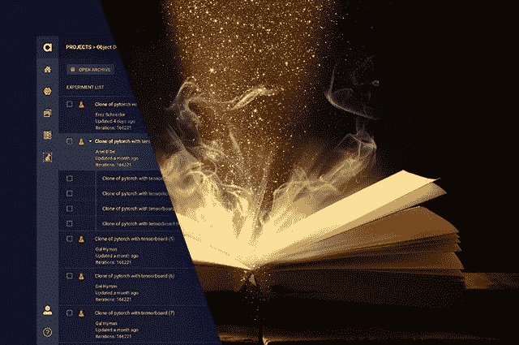
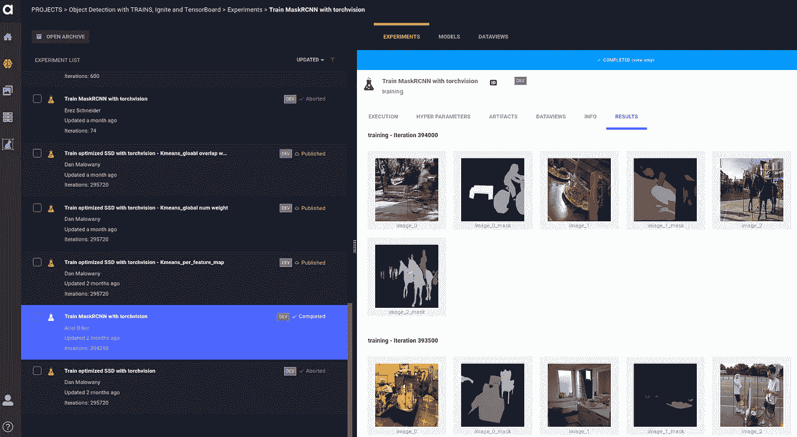
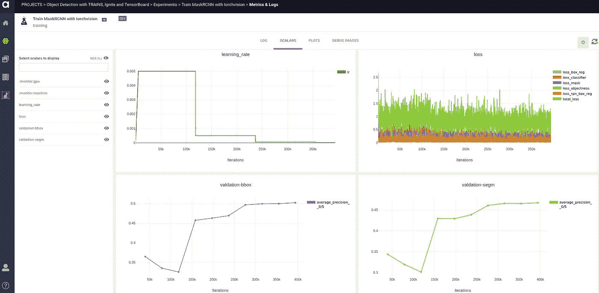

# 从前的知识库:如何用 PyTorch 编写可读、可维护的代码

> 原文：<https://towardsdatascience.com/once-upon-a-repository-how-to-write-readable-maintainable-code-with-pytorch-951f03f6a829?source=collection_archive---------24----------------------->

## [**现实世界中的数据科学**](https://medium.com/towards-data-science/data-science-in-the-real-world/home)

## 深度学习代码库系列的英雄之旅—第一部分

由[丹·马洛瓦尼](https://www.linkedin.com/in/dan-malowany-78b2b21/)和[加尔·海姆斯](https://www.linkedin.com/in/gal-hyams-2146a662/)
[创作的快板艾团队](https://medium.com/u/7743e9a45144?source=post_page-----951f03f6a829--------------------------------)



我们的目标都是编写一个可维护的模块化代码库，支持从研究到生产的 R&D 过程。高效和成功的深度学习项目的关键，这不是一个容易的壮举。这就是为什么我们决定写这个博客系列——分享我们从众多深度学习项目中获得的经验，并展示使用开源工具实现这一目标的方法。

本系列的第一篇文章是关于如何利用 PyTorch 生态系统和 Allegro Trains experiments manager 来轻松编写可读和可维护的计算机视觉代码的教程。我们主要关注 PyTorch 生态系统中的两个包，Torchvision 和 Ignite。Torchvision 是一个流行的包，由流行的数据集包装器、模型架构和计算机视觉的通用图像转换组成。Ignite 是一个新的库，可以简单明了地将指标报告、提前停止、模型检查点和其他功能添加到您的培训循环中。在这篇文章中，我们编写了一个代码库，在 [COCO](http://cocodataset.org/#home) 数据集上训练和评估一个 [Mask-RCNN 模型](https://arxiv.org/abs/1703.06870)。然后，我们将训练数据(损失、准确性等)注册到 Pytorch 本机 [Tensorboard](https://pytorch.org/docs/stable/tensorboard.html) 中，并使用[Allegro Trains](https://github.com/allegroai/trains)experiment&autoML manager 来管理和跟踪我们的训练实验。通过这些步骤，我们实现了一个无缝的、有组织的、高效的模型培训流程。

# 我们的开源资源

Ignite 框架的本质是它的引擎类，该类在数据集上循环给定次数，并执行处理功能。例如，训练引擎循环遍历训练数据集并更新模型参数。此外，引擎具有可配置的事件系统，便于运行的每个步骤上的交互:(1)引擎启动/完成；(2)纪元开始/完成；(3)迭代开始/完成。因此，您可以将自定义代码作为事件处理程序来执行。
Allegro Trains 是一个“自动逻辑”实验& AutoML manager，它通过代码版本控制、性能指标和模型来源来跟踪和控制培训过程。Trains 还为工作人员灵活地执行队列管理，并使多个用户能够协作和管理他们的实验。

# 让代码开始

请注意，为了运行本教程，应该安装以下开源包:PyTorch、TorchVision、Ignite、TensorBoard、NumPy 和 Allegro Trains。请访问以下页面进行安装:

*   [PyTorch](https://pytorch.org/get-started/locally/)
*   [火炬传递](https://pytorch.org/docs/stable/torchvision/index.html)
*   [PyTorch 点燃](https://pytorch.org/ignite/)
*   [张量板](https://pytorch.org/docs/stable/tensorboard.html)
*   [NumPy](https://numpy.org/)
*   [快板列车](https://github.com/allegroai/trains)

我们从 Trains 两条线的集成开始编码。将这两行代码添加到任何代码都会在您执行 Trains 任务时启动它。project_name 参数将在 Trains web app 中打开一个专用项目(如果不存在),并以 task_name 参数中定义的名称注册您的实验。

每次你执行代码时，Trains 会自动在创建的任务中记录你所有的实验信息(git repo、commit id、使用的 python 包、argparse 参数等)，这将让你在默认的演示服务器或你自己的私有 [Trains 服务器](https://github.com/allegroai/trains-server)上跟踪、复制和管理你所有的实验(即做科学实验)。此外，将 argparse 参数注册到 Trains 任务中可以在以后使用 [Trains 代理](https://github.com/allegroai/trains-agent)执行自动超参数优化。

```
*from* trains *import* Task
task = Task.init(project_name='Object Detection with TRAINS, Ignite
                               and TensorBoard',
                 task_name='Train MaskRCNN with torchvision')
```

Trains 具有的另一个有用的特性是将配置数据连接到模型的能力，因此在系统中注册的每个模型都将包括用于训练它的配置数据。您可以连接一个配置文件，或者只提供一个配置字典。为此，我们还将在两行集成代码之后添加以下两行代码。

```
# Connect the model configuration data to train as well: configuration_data = {'image_size': 512,
                      'mask_predictor_hidden_layer': 256}
configuration_data = task.connect_configuration(configuration_data)
```

# 数据争论

为了训练 Torchvision 模型，我们使用 __getitem__ 方法将数据集设置在一个类中，该方法将下一个数据集实例作为 PIL 图像元组和元数据字典返回。元数据字典包括将用于在每个图像上训练模型的地面真相的盒子、标签和遮罩。__getitem__ 方法通过对图像和元数据执行提供给类构造函数 __init__ 的转换来结束。

```
*class* CocoMask(CocoDetection):
    *def __init__*(self, *root*, *annFile*, *transform*=*None*,
                 *target_transform*=*None*, *transforms*=*None*,
                 *use_mask*=*True*):
        super(CocoMask, self).__init__(*root*, *annFile*, *transforms*,
              *target_transform*, *transform*)
        self.transforms = *transforms* self.use_mask = *use_mask

    def __getitem__*(self, *index*): 
        coco = self.coco
        img_id = self.ids[*index*]
        ann_ids = coco.getAnnIds(imgIds=img_id)
        target = coco.loadAnns(ann_ids)
        *if* len(ann_ids) == 0:
            *return None* path = coco.loadImgs(img_id)[0]['file_name']
        img = Image.open(os.path.join(self.root,
                         path)).convert('RGB')

        # From boxes [x, y, w, h] to [x1, y1, x2, y2]
        new_target = {"image_id":torch.as_tensor(target[0]
                                 ['image_id'], dtype=torch.int64),
                      "area":torch.as_tensor([obj['area'] 
                             *for* obj *in* target],
                             dtype=torch.float32),
                      "iscrowd":torch.as_tensor([obj['iscrowd'] 
                                *for* obj *in* target], 
                                dtype=torch.int64),
                      "boxes":torch.as_tensor([obj['bbox'][:2] + 
                              list(map(add, obj['bbox'][:2], 
                              obj['bbox'][2:])) 
                              *for* obj *in* target], 
                              dtype=torch.float32),
                      "labels": torch.as_tensor([obj['category_id'] 
                                *for* obj *in* target], 
                                dtype=torch.int64)}
        *if* self.use_mask:
            mask = [coco.annToMask(ann) *for* ann *in* target]
            *if* len(mask) > 1:
                mask = np.stack(tuple(mask), axis=0)
            new_target["masks"] = torch.as_tensor(mask,
                                  dtype=torch.uint8)

        *if* self.transforms *is not None*:
            img, new_target = self.transforms(img, new_target)

        *return* img, new_target
```

一旦使用 __getitem__ 方法将数据包装在一个类中，就可以将训练验证集构造为 PyTorch 数据集，并启动相应的数据加载器。DataLoader 类基本上提供了一个高效的迭代器，它使用 CPU 加载和准备数据，而 GPU 运行深度学习模型。该类为用户提供了对常见深度学习数据加载属性的控制，如批量大小、随机播放等。注意，除了加载器之外，下面的函数也返回‘标签枚举’。它是一个字典，将标签名称与它们的数字 id 连接起来，这些数字 id 将在稍后阶段使用。

```
*def* get_data_loaders(*train_ann_file*, *test_ann_file*, *batch_size*,
                     *test_size*, *image_size*, *use_mask*):
    # Create PyTorch dataset objects, for train and validation data.
    dataset = CocoMask(
        root=Path.joinpath(Path(*train_ann_file*).parent.parent, 
             *train_ann_file*.split('_')[1].split('.')[0]),
        annFile=*train_ann_file*,
        transforms=get_transform(train=*True*, image_size=*image_size*),
        use_mask=*use_mask*)
    dataset_test = CocoMask(
        root=Path.joinpath(Path(*test_ann_file*).parent.parent, 
             *test_ann_file*.split('_')[1].split('.')[0]),
        annFile=*test_ann_file*,
        transforms=get_transform(train=*False*,image_size=*image_size*),
        use_mask=*use_mask*)

    labels_enumeration = dataset.coco.cats

    indices_val = torch.randperm(len(dataset_test)).tolist()
    dataset_val = torch.utils.data.Subset(dataset_test,
                  indices_val[:*test_size*])

    # set train and validation data-loaders
    train_loader = DataLoader(dataset, batch_size=*batch_size*, 
                   shuffle=*True*, num_workers=6,
                   collate_fn=safe_collate, pin_memory=*True*)
    val_loader = DataLoader(dataset_val, batch_size=*batch_size*, 
                 shuffle=*False*, num_workers=6,
                 collate_fn=safe_collate, pin_memory=*True*)

    *return* train_loader, val_loader, labels_enumeration
```

# 创造火炬点燃引擎

完成数据集准备后，我们用下面的“运行”方法训练 MaskRCNN 模型。首先，为任务设置模型(作为 GPU 模型—如果机器上有此选项)。如果您从先前的训练方案继续，加载预训练的模型权重。然后，设置前面代码片段中定义的数据加载器。由于 TensorBoard 现在是 Pytorch 的原生版本，您可以轻松导入并设置 TensorBoard SummaryWriter 来记录您的所有报告。此外，您所有的 TensorBoard 报告将自动注册到 Trains 服务器中，以便您能够实时监控您的所有实验。只需设置 Tensorboard Summary Writer，并在相关的引擎事件处理程序中添加标量和图像的报告。
最后，创建 Ignite 训练器和评估器引擎，并运行训练器引擎。

```
*def* run(*task_args*):
    # Define train and test datasetstrain_loader, val_loader, labels_enum = 
       get_data_loaders(*task_args*.train_dataset_ann_file,
                        *task_args*.val_dataset_ann_file,
                        *task_args*.batch_size,
                        *task_args*.test_size,
                        configuration_data.get('image_size'),
                        use_mask=True) val_dataset = list(chain.from_iterable(zip(*batch) 
                  *for* batch *in* iter(val_loader)))
    coco_api_val_dataset = convert_to_coco_api(val_dataset)
    num_classes = max(labels_enum.keys()) + 1  
    configuration_data['num_classes'] = num_classes

    # set the training device to GPU if available
    device = torch.cuda.current_device() 
             *if* torch.cuda.is_available() *else* torch.device('cpu')
    # optimization for fixed input size    
    torch.backends.cudnn.benchmark = *True 
             if* torch.cuda.is_available() *else False* 

    model = get_model_instance_segmentation(
            num_classes, 
            configuration_data.get('mask_predictor_hidden_layer'))
    iou_types = get_iou_types(model)    # if there is more than one GPU, parallelize the model
    *if* torch.cuda.device_count() > 1:
        print("{} GPUs were detected - we will use all of 
              them".format(torch.cuda.device_count()))
        model = torch.nn.DataParallel(model)

    # copy the model to each device
    model.to(device)

    *if task_args*.input_checkpoint:
        print('Loading model checkpoint from'
              .format(*task_args*.input_checkpoint))
        input_checkpoint = torch.load(*task_args*.input_checkpoint,
                           map_location=torch.device(device))
        model.load_state_dict(input_checkpoint['model'])

    writer = SummaryWriter(log_dir=*task_args*.log_dir)

    # define Ignite's train and evaluation engines
    trainer = create_trainer(model, device)
    evaluator = create_evaluator(model, device)### Here we will later define the engines events handlers ###

    trainer.run(train_loader, max_epochs=task_args.epochs)
    writer.close()
```

让我们深入了解一下 Ignite 的训练引擎从内部看起来是什么样子。每个引擎都有更新功能，根据给定的数据批次更新模型。它向前传递数据以计算损失，然后通过反向传播更新模型权重，最后返回输入数据、地面实况和损失字典。

```
*def* create_trainer(*model*, *device*):
    *def* update_model(*engine*, *batch*):
        images, targets = copy.deepcopy(*batch*)
        images_model, targets_model = prepare_batch(*batch*,
                                      device=device)

        loss_dict = model(images_model, targets_model)
        losses = sum(loss *for* loss *in* loss_dict.values())

        # reduce losses over all GPUs for logging purposes
        loss_dict_reduced = utils.reduce_dict(loss_dict)
        losses_reduced = sum(loss *for* loss *in* loss_dict_reduced.values())

        loss_value = losses_reduced.item()

        *engine*.state.optimizer.zero_grad()
        *if not* math.isfinite(loss_value):
            print("Loss is {}, resetting loss and skipping training
                  iteration".format(loss_value))
            print('Loss values were: ', loss_dict_reduced)
            loss_dict_reduced = {k: torch.tensor(0) *for* k, v *in* loss_dict_reduced.items()}
        *else*:
            losses.backward()
            *engine*.state.optimizer.step()

        *if engine*.state.warmup_scheduler *is not None*:
            *engine*.state.warmup_scheduler.step()

        images_model = targets_model = *None

        return* images, targets, loss_dict_reduced
    *return* Engine(update_model)
```

# 定义 Ignite 处理程序

一旦定义了引擎，您就可以释放 Ignite 事件处理程序的能力。每个引擎都连接有 Ignite 处理程序，一旦事件发生，这些处理程序就可以执行给定功能。函数的定义是通过在函数中添加一个装饰器来完成的，说明相关的引擎和事件，在我们的例子中，引擎是训练器和评估器。请注意，操作人员必须熟悉他们的引擎。将事件设置为定义引擎的函数的嵌套函数，只是该需求的一个简单实现。下面是我们感兴趣的处理程序。您可以在代码中找到更多信息。

第一个要讨论的训练员是训练开始。在这个处理程序中，在训练过程开始时执行，设置模型优化器和学习率。

```
@trainer.on(Events.STARTED)
*def* on_training_started(*engine*):
    # construct an optimizer
    params = [p *for* p *in* model.parameters() *if* p.requires_grad]
    *engine*.state.optimizer = torch.optim.SGD(
                             params,
                             lr=task_args.lr,
                             momentum=task_args.momentum,                  
                             weight_decay=task_args.weight_decay)
    *engine*.state.scheduler = torch.optim.lr_scheduler.StepLR(
                             *engine*.state.optimizer, 
                             step_size=3, 
                             gamma=0.1)
    *if* task_args.input_checkpoint *and* task_args.load_optimizer:
       *engine*.state.optimizer.load_state_dict(
       input_checkpoint['optimizer']) *engine*.state.scheduler.load_state_dict(
       input_checkpoint['lr_scheduler'])
```

epoch-completed 处理程序将 epoch 平均精度标量注册到 TensorBoard，这使得它可在 Trains-Server webapp 上查看。然后，它保存模型检查点，该检查点自动神奇地连接为 Trains-task 输出模型。

```
@trainer.on(Events.EPOCH_COMPLETED)
*def* on_epoch_completed(*engine*):
    *engine*.state.scheduler.step()
    evaluator.run(val_loader) *for* res_type *in* evaluator.state.coco_evaluator.iou_types:
        average_precision_05 =
        evaluator.state.coco_evaluator.coco_eval[res_type].stats[1]
        writer.add_scalar("validation-{}/average precision 0_5"
                          .format(res_type), average_precision_05,
                          *engine*.state.iteration) checkpoint_path = os.path.join(task_args.output_dir,
                    'model_epoch_{}.pth'.format(*engine*.state.epoch))
    checkpoint = {
        'model': model.state_dict(),
        'optimizer': *engine*.state.optimizer.state_dict(),
        'lr_scheduler': *engine*.state.scheduler.state_dict(),
        'epoch': *engine*.state.epoch,
        'configuration': configuration_data,
        'labels_enumeration': labels_enum}
    utils.save_on_master(checkpoint, checkpoint_path)
    print('Model checkpoint from epoch {} was saved at {}'
          .format(*engine*.state.epoch, checkpoint_path))
```

以下句柄是评估时句柄的一个示例。它计算并注册调试图像到 TensorBoard，可以在 Trains-Server 上查看——类似于 TensorBoard 标量。这使用户可以密切监视模型的进展性能。

```
@evaluator.on(Events.ITERATION_COMPLETED)
*def* on_eval_iteration_completed(*engine*):
    images, targets, results = *engine*.state.output *if engine*.state.iteration % task_args.log_interval == 0:
        print("Evaluation: Iteration: {}"
              .format(*engine*.state.iteration))

    *if engine*.state.iteration % task_args.debug_images_interval== 0:
        *for* n, debug_image *in* enumerate(
               draw_debug_images(images, targets, results)):
            writer.add_image("evaluation/image_{}_{}"
                             .format(*engine*.state.iteration,n),
                             debug_image,trainer.state.iteration,
                             dataformats='HWC')
            *if* 'masks' *in* targets[n]:
                writer.add_image("evaluation/image_{}_{}_mask"
                                 .format(*engine*.state.iteration, n),
                                 draw_mask(targets[n]), 
                                 trainer.state.iteration,
                                 dataformats='HW')
                curr_image_id = int(targets[n]['image_id'])
                writer.add_image(
                       "evaluation/image_{}_{}_predicted_mask"
                       .format(*engine*.state.iteration, n),
                       draw_mask(results[curr_image_id]).squeeze(),
                       trainer.state.iteration, 
                       dataformats='HW')
```

# 坐下来，放松并监控你的实验

现在我们的代码库已经准备好了，我们可以执行 train 脚本，并在 Trains webapp 中监控它的进度。由于统计数据和调试图像记录在 Trains 中，您可以在您自己的专用 Trains 服务器(或 Trains 演示服务器)上查看它们。通过查看统计数据和调试图像，您可以跟踪训练过程，并确保它按计划运行。例如，查看报告的调试图像可以让您知道您的基本事实是否有问题和/或数据扩充是否产生了错误的结果。



图 Allegro Trains webapp 的调试图像快照

在上面的快照中，您可以查看实验列表，这些实验是同一个项目的一部分。点击特定的实验使我们能够在训练周期中监控预测的遮罩和边界框。在下面的快照中，您可以看到同一实验的训练统计数据—在本例中，是边界框和遮罩的平均精度。



图 Allegro Trains webapp 中培训过程的快照

# 摘要

我们希望你喜欢这个教程，并且现在已经更好地掌握了如何编写可读、可维护和可复制的深度学习代码。使用 Ignite 和 [Trains](https://github.com/allegroai/trains) 可以实现更简单、更高效的机器和深度学习工作流。完整的代码可以在[这里](https://github.com/allegroai/trains-blogs/tree/master/once_upon_a_repository)找到。
我们的代码库受到 PyTorch 的 [mnist with tensorboardX](https://github.com/pytorch/ignite/blob/master/examples/mnist/mnist_with_tensorboardx.py) 和 torch vision[object detection fine tune 教程](http://pytorch.org/tutorials/intermediate/torchvision_tutorial.html)的启发。

在本系列的下一篇文章中，我们将展示我们在这里展示的代码库的模块化结构如何能够用 SSD 模型轻松替换 MaskRCNN。我们将解释单镜头和双镜头对象检测模型之间的差异，以及如何在 TorchVision 特征提取器上设置 SSD 模型。然后，我们将执行我们刚刚与您一起编写的训练和评估脚本——这一次使用单次检测器。[敬请期待！](https://medium.com/@allegroai)

*原载于 2020 年 1 月 30 日*[*https://allegro . ai*](https://allegro.ai/blog/once-upon-a-repository-how-to-write-readable-maintainable-code-with-pytorch-ignite/)*。*