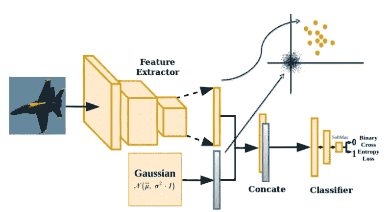
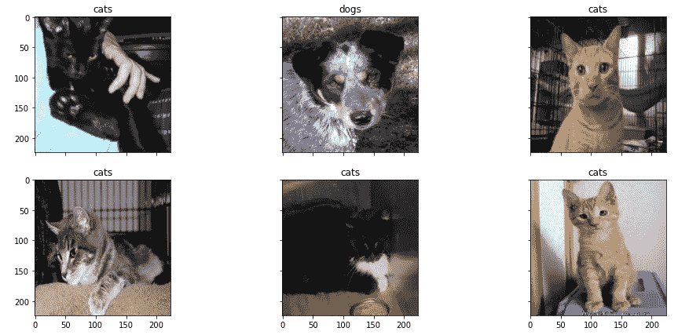
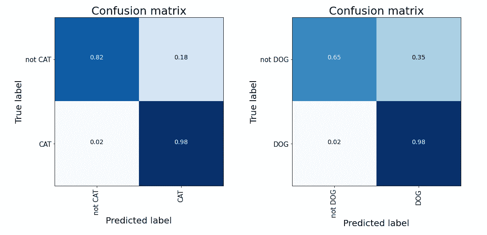

# Keras 中的单类神经网络

> 原文：<https://towardsdatascience.com/one-class-neural-network-in-keras-249ff56201c0?source=collection_archive---------10----------------------->

## 为单类分类任务开发卷积 VGG

在 [Unsplash](https://unsplash.com?utm_source=medium&utm_medium=referral) 上由 [Rodion Kutsaev](https://unsplash.com/@frostroomhead?utm_source=medium&utm_medium=referral) 拍照

无监督学习应用于一类分类，旨在发现在没有标签的情况下区分正常和异常数据的规则。一类 SVM (OC-SVM)是一种常见的无监督方法来检测异常值。它将所有的数据点视为积极标记的实例，并在它们周围建立一个平滑的边界来检测“奇怪”的样本。

最近，基于特征提取模型的各种方法似乎是与 OC-SVM 一起使用的有效工具。随着深度神经网络作为特征提取器的惊人成功，利用深度学习和 OC-SVM 的不同方法被引入作为**多步骤**单类过程。

在这篇文章中，我们提出了一个单类卷积神经网络架构(如这里介绍的)，它合并了深度网络的能力，以提取有意义的数据表示以及单类目标，所有这些都在**一步**中完成。

# 模型

该结构由两部分组成:特征提取器和多层感知器。这种方法的一个基本方面是，任何预先训练的深度学习模型都可以用作特征提取的基础网络。最常见的选择是采用标准网络模块进行特征提取，例如，VGG、ResNet 或 Inception 可能是这一特定任务的良好替代方案。对于在何处切割网络以生成有意义的要素制图表达，没有固定的规则。多层感知器部分位于末端，它接收嵌入的表示，并试图将它们分类为 0 或 1。这里，1 意味着输入样本属于真正的目标类，而 0 意味着输入样本属于噪声类。和以前一样，这部分的结构选择是不固定的。可以对其进行操作和调整，以实现更好的性能。

在特征提取模块和最终的多层感知器网络之间发生了奇迹。正是在那里，我们可以找到整个过程的核心思想，它允许我们将特征提取与分类结合在一起，所有这些都在一个步骤中完成，并且只有一组标签可供处理。嵌入的数据样本被“破坏”,增加了一些零中心高斯噪声。然后，将这些修改后的样本与其原始配对进行批量连接。这种方法的结果是，我们有一批由原始样本(类别 1)和损坏样本(类别 0)形成的复制图像。我们的目标是，我们的分类层可以理解这种差异，并将真实图像与所有其他图像区分开来。

提议方法的模式。来源[此处](https://arxiv.org/pdf/1901.08688.pdf)

# 实验

我们尝试使用 Tensorflow 和 Keras 的多功能性来复制上述工作流程。首先，我们需要一个一类分类问题。所有的分类任务都可以看作是一类问题。我们可以简单地选择一个我们感兴趣的标签，然后训练一个模型来识别它，这正是我们所做的。

猫和狗的任务听起来不错。这是因为我们可以利用一些标准和预训练的深度学习模型来利用迁移学习的力量。

训练样本图片[数据](http://kaggle.com/tongpython/cat-and-dog)

我们开始选择自己感兴趣的标签，比如说“猫”。我们在训练数据中只取猫的图像。这些狗在测试期间被找回。在猫，我们给它贴上 1 的标签。标签 0 是在训练期间自动创建的，由一些随机高斯图像组成。原来只有猫的批量输入是这样复制的，现在是由标记数据和随机信号形成的。真实图像被馈入特征提取器网络。在我们的例子中，它由一个预先训练好的 VGG 组成。VGG 为我们的真实图像创建了一个有意义的嵌入式表示，这些图像与随机图像连接在一起。此时，它们通过一个多层感知器神经网络，其中的权重是可训练的。最后，我们有了一个完整的架构，可以识别猫，并且只对猫进行训练！模型的推论可以一如既往地计算出来。我们停用负责产生随机嵌入表示的网络部分，并且只保留特征提取器和多层感知器。我们测试程序传递给网络猫和狗的图像。如果成功，狗必须被归类为噪音(相当于标签 0)。

为了得到可靠的结果，拟合过程必须应用于我们所掌握的所有类。在我们的例子中，我们仅用“猫”来拟合模型，然后仅用“狗”来拟合模型。总性能是所有单个任务性能的平均值。我们获得了大约 85%的最终准确率，这对于一类学习过程来说是非常好的！

# 摘要

在这篇文章中，我们介绍了一个在单类分类任务上进行端到端训练的架构。这种方法适用于利用预先训练的迁移学习表示的每个领域。它也是一个很好的资源，可以应用于检索标记数据需要大量成本的每一个场景。

[**查看我的 GITHUB 回购**](https://github.com/cerlymarco/MEDIUM_NoteBook)

保持联系: [Linkedin](https://www.linkedin.com/in/marco-cerliani-b0bba714b/)

**参考文献**

一类卷积神经网络。Poojan Oza，IEEE 学生会员，和 Vishal M. Patel，IEEE 高级会员