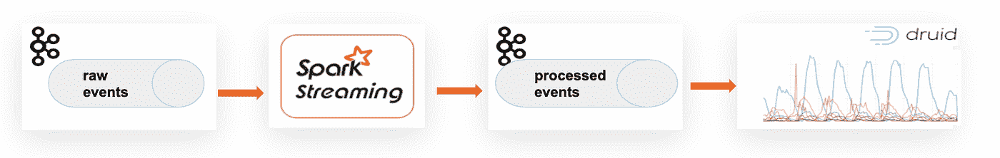
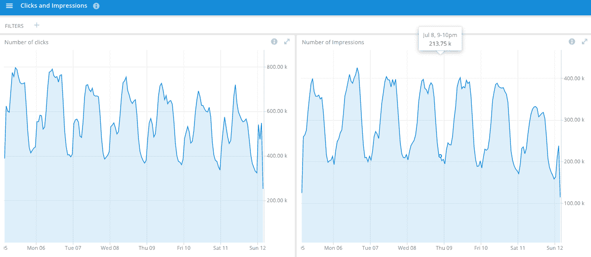
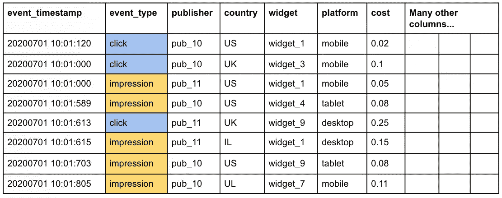
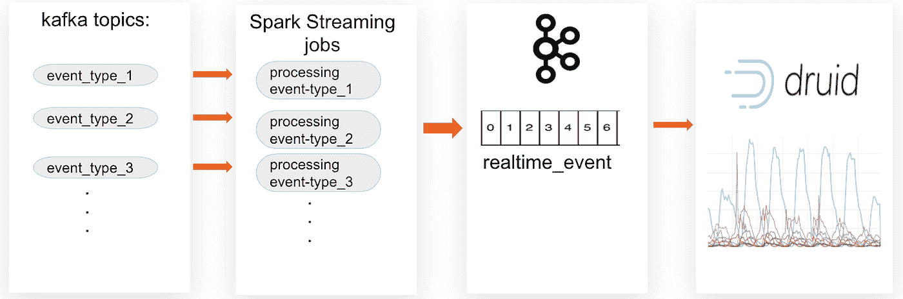

# 一个事件来统治他们

> 原文：<https://towardsdatascience.com/one-event-to-rule-them-all-e9adf04667a3?source=collection_archive---------50----------------------->

## [理解大数据](https://towardsdatascience.com/tagged/making-sense-of-big-data)

## *将实时分析提升到新的水平*

*图片由* [鲁斯兰发牢骚](https://www.shutterstock.com/g/garloon) *经*[*shutterstock.com*](/www.shutterstock.com)*下发给远出者*

我们已经基于 Apache Kafka、Spark Streaming 和 Apache Druid 运行实时分析一年多了。在解决了连接这些技术的问题之后，正如我最近的博客文章所描述的，我们向我们的系统添加了许多用例。一般来说，每个用例都是根据以下原则构建的:从一个 Kafka 主题中读取原始事件，在 Spark 流作业中处理它们，写入另一个 Kafka 主题，并摄取到 Apache Druid 中。

作者图片

它使我们能够从实时仪表盘中获得广泛的洞察力。然而，每种类型的事件都有自己的流程和可视化，独立于其他类型的事件。例如，我们有一个单独的视图来显示我们所有的点击和我们的印象。我们可以创建一个仪表板，并排显示两个磁贴——一个用于点击，一个用于展示。

作者图片

但是，我们无法同时获得基于这两个流的指标。例如，我们无法计算 CTR — [点击率](https://en.wikipedia.org/wiki/Click-through_rate)——这是广告技术行业非常重要的指标。计算点击率需要特定时间段的点击数除以印象数。对于关系数据库来说，这是一项非常简单的任务——使用连接语法从两个或多个表中选择一个表来运行一个查询。德鲁伊就不是这样。**加入**操作最近被添加到了最新的德鲁伊版本中，然而，它主要被用作查找功能的一部分。完整的连接支持预计将在下一个版本中提供，直到 2020 年底。

# 联合与加入

为了最大限度地利用我们的实时分析系统，我们希望找到一种方法来根据不同类型的事件计算指标，而不使用连接。我们在寻找一个创新的想法。我们决定使用逻辑联合来解决这个问题。

让我们考虑下面的例子:我们有一个包含两种类型事件的大表——点击和印象。

作者图片

我们看到，在特定的时间段内，我们获得了三次点击和五次展示。所以那段时间的 CTR 是 3/5=0.6

类似地，我们可以计算另一个重要的指标——RPM——每千次展示的收入。

这两个指标都是从单个表中计算出来的，不需要连接到其他表。这里的技巧是“标记”不同类型的事件，以便在查询期间区分它们。

# 实时事件—实时数据的中心。

基于这个例子，我们构建了一个系统，将几种不同的事件类型流式传输到一个 Kafka 主题，然后传输到 Druid。该系统包含几个 Spark 流作业，每个作业处理一种特定类型的事件。每个作业从原始 Kafka 主题中读取事件级数据，用更多字段丰富它，并写入输出 Kafka 主题。注意，所有的作业都写进了**同一个卡夫卡主题。**每个作业根据具体的业务逻辑，除了其他字段外，还为每个事件添加一个“event_type”字段。通常作业会添加一些布尔字段，例如处理点击的作业可以验证点击状态，并将“is_valid_click”设置为 0 或 1。这使得这些字段能够在 Druid 和 SQL 查询中得到有效处理。

作者图片

# 数据采样

实时处理如此大量的数据是资源密集型的。我们需要 Spark 流集群中的资源来运行 Spark 流作业。我们需要 Kafka 集群中的资源来包含所有类型事件的统一主题。最后，我们需要 Druid 集群中的资源来存储所有这些事件。

让我们回顾一下——我们想从这个系统中获得什么好处？我们的目标是建立一个系统，为我们的数据提供实时视图。我们的目标是缩小基于批处理的主数据处理系统造成的差距，该系统每小时利用 Hive、Vertica、Tableau 和数百个 ETL 作业。批处理过程提供了对数据的可访问性，有几个小时的延迟。相比之下，基于 Druid 构建的系统应该快速灵活，我们还可以允许一些数据差异。因此，我们决定通过对数据进行采样来降低系统的负载。

# 火花作业中的取样。

我们使用 *RDD.sample* API 对从 Kafka 主题中读取的事件进行采样。采样率是我们所有 Spark 工作的一个参数。

*rdd.sample(false，sampleRate，seed)；*

每个作业的采样率可以不同。例如，印象的数量远大于点击的数量，因此我们可以对 100%的点击进行采样，但只能对 1%的印象进行采样。

这个技术减少了火花，卡夫卡和德鲁伊的负荷。然而，我们需要记住，我们只有德鲁伊所有事件的一部分。我们如何保证从德鲁伊那里查询的数据是正确的，并得到完整的图片？

# 在德鲁伊教中处理采样。

假设我们在 Spark 流工作中对 1%的印象事件进行采样。因此在德鲁伊中我们只有 1%的印象。请注意，印象的所有记录都有以下标记字段: *is_impression = 1* 。通常，在没有抽样的情况下，我们会在 Druid 中运行以下查询来获得印象数:

*从 realtime_event 中选择 SUM(is _ impression)；*

现在，对采样数据运行这个查询，我们需要记住结果应该乘以 100。如果我们将采样率从 1%提高到 10%，会发生什么？在这种情况下，我们需要将来自 Druid 的查询结果乘以 10。这种手动方法可以运行一些特定的查询。但是，对于包含多个 Spark 作业(每个作业都有自己的采样速率)的系统，它是不可伸缩的。此外，我们为来自不同团队的多个用户开发了我们的系统——采样方法应该对他们透明。他们应该能够简单透明地查询数据。

# 添加样本因子

为了能够透明地处理我们在 Druid 中的数据，我们提出了以下想法:我们为每个事件添加了一个“sampleFactor”字段，通过以下公式计算:

*采样因子= 1/采样速率。*

因此，对于 1%的采样速率，采样因子为 100。因此德鲁伊的度量值应该乘以 100。

我们使用*样本因子*来计算德鲁伊在摄取卡夫卡时的重要度量。

# 选择抽样

将这些实时数据应用到生产中时，我们面临一项新的需求——需要对特定流量进行“完全采样”的场景。例如，特定发布者的流量。使用 Spark 流作业可以轻松实现这一新要求。首先，我们检测事件是否属于特定的发布者，这应该是完全抽样的。如果是肯定的，我们不为此事件应用*rdd . sample()*；我们还将 *sampleFactor=1* 添加到该事件中。使用这种方法，我们仍然可以在德鲁伊得到正确的数字，即使一些事件被完全采样。

# 抽样与汇总

为什么我们开发我们的特别“抽样”机制，而不是使用 Druid 内置的 rollup 特性？原因是 realtime_event 数据源是几个事件类型的联合。它还包含各种维度的联合。该数据源中有 100 多个维度。我们可以根据需要相对容易地添加更多的维度。使用 Druid 的 rollup 特性来计算可用维度的数量是没有效率的。Druid 为汇总数据源添加了内部计数器和总和。定义大约 100 维的 rollup 减少了两个事件具有完全相同的维(一分钟)的概率。然而，内部计数器和求和的开销仍然存在，使其效率低下。

# 摘要

通过在 Druid 中将不同的事件类型合并到一个数据源中，我们构建了一个非常广泛的实时数据视图。这便于不同团队使用不同的数据分析用例。它还允许聚合传统上使用表间连接计算的各种度量。我们通过对事件进行采样来处理伸缩和资源问题。我们的采样技术可以根据需要轻松扩展。此外，我们管理 Druid 中的数据，以便底层采样对使用 Druid 数据的团队保持透明。