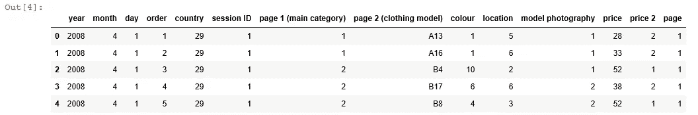
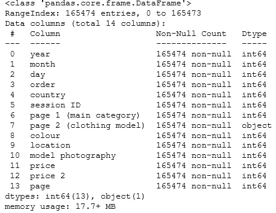
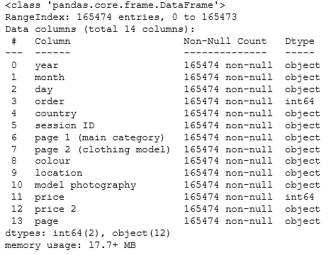
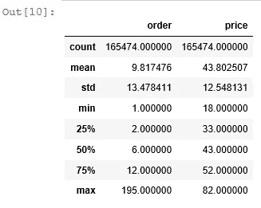
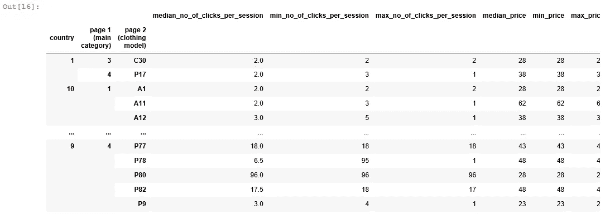
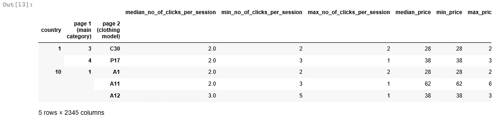
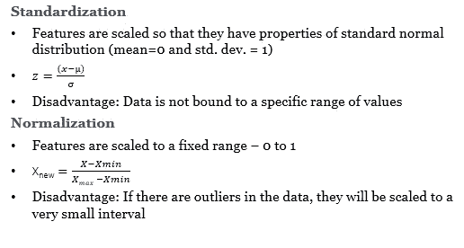
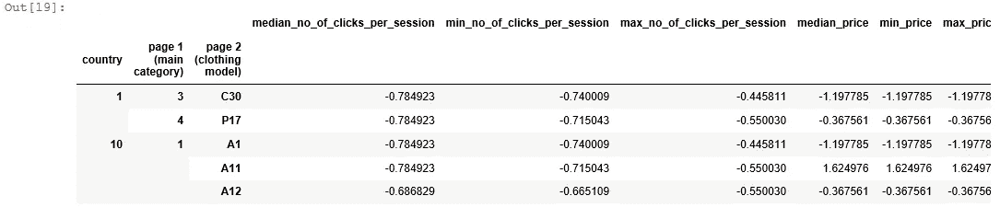
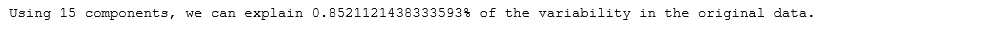

# 一次热编码，标准化，PCA:python 中分段的数据准备

> 原文：<https://towardsdatascience.com/one-hot-encoding-standardization-pca-data-preparation-steps-for-segmentation-in-python-24d07671cf0b?source=collection_archive---------3----------------------->


照片由[梅尔·巴兰德](https://unsplash.com/@mael_bld)在 [Unsplash](https://unsplash.com/?utm_source=medium&utm_medium=referral) 上拍摄

## 获得正确的数据，实现完美的细分！

数据驱动的客户定位或产品捆绑对于企业在激烈的竞争中保持相关性至关重要。消费者现在有太多的选择，更喜欢个性化的产品。随着以人工智能和大数据技术的巨大增长为形式的第四次工业革命的到来，现在是利用细分模型进行此类分析的最佳时机。但是在我们深入研究这些模型之前，我们应该知道这些模型需要什么样的数据。这是我博客的重点，因为我们将经历将原始数据集转换为训练和测试分割算法所需格式的所有必要步骤。

**数据**

在这个练习中，我们将使用来自一家为孕妇提供服装的在线商店的点击流数据。它有从 2008 年 4 月到 2008 年 8 月的数据，包括产品类别、图片在网页上的位置、IP 地址的来源国以及产品的美元价格等变量。我选择这个数据集的原因是点击流数据正在成为提供关于客户行为的精细信息的一个非常重要的来源。它还为我们提供了一个具有典型挑战的数据集，如高维度、对特征工程的需求、分类变量的存在和不同规模的字段。

我们将尝试通过执行以下步骤为产品细分准备数据:

1.  探索性数据分析
2.  特征工程
3.  一个热编码
4.  标准化
5.  主成分分析

**探索性数据分析(EDA)**

我们将首先尝试读取数据集(使用`read_csv`函数)并查看前 5 行(使用`head`函数):

```
# Read dataset and look at top records
import pandas as pd
df = pd.read_csv('e-shop clothing 2008.csv', delimiter=";")
df.head(5)
```



图 1:前 5 条记录

我们有多个服装模特每天的数据(字段名:“第 2 页(服装模特)”)。接下来，让我们检查行数和列数及其类型(使用`info`函数)

```
#Check the number of rows and columns and their types
df.info()
```



图 2:检查字段类型

我们有 165474 条记录和 14 个字段。需要注意的一点是，很多字段都是数值型的，但理想情况下应该是字符串。让我们使用`as.type(str)`函数将字段转换为字符串:

```
# Convert categorical variables to string
cat_vars = ['year', 'month', 'day', 'country', 'session ID',
               'page 1 (main category)', 'page 2 (clothing model)',   'colour',
               'location', 'model photography', 'price 2', 'page']
df[cat_vars] = df[cat_vars].astype(str)
df.info()
```



图 3:转换后检查字段类型

接下来让我们检查数字字段的属性:

```
# Check properties of numeric fields
df.describe()
```



图 4:检查数值字段的属性

如图 4 所示，产品价格(字段名:“价格”)比一个会话期间的点击序列(字段名:“订单”)要大得多。这意味着我们必须将这些场标准化，使它们具有相同的比例，因为基于距离的模型(如 K-means)会受到场的比例的影响。

**特征工程**

如前所述，我们的数据集是每日级别的，我们需要在产品级别聚合数据，因为我们想要执行产品细分。我们在产品级别聚合时创建了以下功能:

1.  最常出现的产品颜色、浏览日期、国家、照片类型(个人资料、正面)、价格类型(高于或低于类别平均值)、网站内的页码以及产品照片在页面上的位置(使用`mode`功能)
2.  唯一会话 id 的总数(使用`nununique`函数)
3.  单次点击序列的中值、最小值和最大值以及产品价格(使用`median`、`min`和`max`功能)

```
# Feature Engineering
from scipy.stats import mode 
df2 = df.groupby(['country','page 1 (main category)','page 2 (clothing model)']).agg(
                                                                             median_no_of_clicks_per_session=('order', 'median'),
                                                                             min_no_of_clicks_per_session=('order', 'max'),
                                                                             max_no_of_clicks_per_session=('order', 'min'),
                                                                             median_price=('price', 'median'),
                                                                             min_price=('price', 'max'),
                                                                             max_price=('price', 'min'),
                                                                             total_number_of_sessions =('session ID', pd.Series.nunique),
                                                                             most_frequent_day=('day', lambda x: mode(x)[0][0]),
                                                                             most_frequent_colour=('colour', lambda x: mode(x)[0][0]),
                                                                             most_frequent_location=('location', lambda x: mode(x)[0][0]),
                                                                             most_frequent_photo_type=('model photography', lambda x: mode(x)[0][0]),
                                                                             most_frequent_price_type =('price 2', lambda x: mode(x)[0][0]),
                                                                             most_frequent_page_number =('page', lambda x: mode(x)[0][0])
                                                                            )df2
```



图 5:特征工程

**一个热编码**

一种热编码创建虚拟变量，虚拟变量是代表分类变量的一个级别的重复变量。水平的存在由 1 表示，不存在由 0 表示。如果分类变量是有序的(即变量的类别是有序的)，那么我们可以使用`OrdinalEncoder`函数将变量转换为数值变量。在我们的例子中，分类变量没有任何顺序性，因此，我们使用`get_dummies`函数来创建虚拟变量。

```
# One hot encoding - to convert categorical data to continuouscat_vars = ['most_frequent_day',
           'most_frequent_colour', 'most_frequent_location',
           'most_frequent_photo_type', 'most_frequent_price_type',
           'most_frequent_page_number']
df2[cat_vars] = df2[cat_vars].astype(str)
df3 = pd.get_dummies(df2)df3.head(5)
```



图 6:一个热编码

如果我们的标称特征是整数，我们也可以使用`OneHotEncoder`函数代替`get_dummies`函数。

**标准化**

如图 4 所示，我们的数字特征有不同的标度。缩放有助于将不同范围或单位的独立要素转换为可比值后进行比较。有两种主要的缩放方法:



作者图片

当我们知道数据的分布不遵循高斯分布时，或者对于不假设任何数据分布的算法(如 K-最近邻和神经网络),归一化是理想的选择。另一方面，当数据遵循高斯分布时，可以使用标准化。但是这些并不是严格的规则，理想情况下，我们可以两者都尝试，并选择给出最佳集群验证结果的选项。在这个例子中，我们将使用`StandardScaler`函数来标准化我们的数字字段。

```
# Standardizingfrom sklearn.preprocessing import StandardScaler
con_vars = ['median_no_of_clicks_per_session', 'min_no_of_clicks_per_session',
           'max_no_of_clicks_per_session', 'median_price', 'min_price',
           'max_price', 'total_number_of_sessions']scaler = StandardScaler()
df3[con_vars]=scaler.fit_transform(df3[con_vars])
df3.head(5)
```



图 7:标准化

**主成分分析**

主成分分析以特定的方式结合我们当前的特征来创建新的特征，然后我们可以丢弃“最不重要的”，同时仍然保留所有原始变量中最有价值的部分。当我们有很多特性要处理时，这是一个有用的方法。它计算所有特征的协方差矩阵，然后从矩阵中生成特征向量和特征值。然后，协方差矩阵乘以特征向量以创建主分量。这些主成分是基于我们的原始特征的新特征，并且它们在解释数据集中的可变性方面的重要性由特征值给出。我们可以保留解释原始数据集中最小方差的排名最高的主成分。

我们可以使用来自`sklearn.decomposition`模块的`pca`函数实现 PCA 分析。我设置了一个循环函数来识别能够解释数据集中至少 85%方差的主成分的数量。

```
# PCAfrom sklearn.decomposition import PCA# Loop Function to identify number of principal components that explain at least 85% of the variance
for comp in range(3, df3.shape[1]):
    pca = PCA(n_components= comp, random_state=42)
    pca.fit(df3)
    comp_check = pca.explained_variance_ratio_
    final_comp = comp
    if comp_check.sum() > 0.85:
        break

Final_PCA = PCA(n_components= final_comp,random_state=42)
Final_PCA.fit(df3)
cluster_df=Final_PCA.transform(df3)num_comps = comp_check.shape[0]
print("Using {} components, we can explain {}% of the variability in the original data.".format(final_comp,comp_check.sum()))
```



图 8: PCA 输出

如图 8 所示，15 个成分能够解释我们数据集中 85%的差异。我们现在可以在我们的无监督模型中使用这些特征，如 K 均值、DBSCAN、分层聚类等来细分我们的产品。

**结论**

在这篇文章中，我们了解了为细分分析准备数据所需的步骤。

具体来说，我们了解到:

*   我们应该如何通过查看数据、字段类型和数值字段的属性来执行探索性数据分析。
*   我们可以从原始分类字段和连续字段中创建何种特征的示例。
*   如何在 python 中实现一个热编码以及顺序编码
*   各种类型的缩放技术以及如何在它们之间进行选择
*   什么是 PCA 以及如何在 python 中使用它进行特征约简

你对这个博客有什么问题或建议吗？请随时留言。

*最后，我鼓励您阅读下面的文章，以深入了解选择最佳分类数的不同方法:*

[*在 Python 中实现 7 种选择最佳聚类数方法的备忘单*](https://indraneeldb1993ds.medium.com/cheat-sheet-to-implementing-7-methods-for-selecting-optimal-number-of-clusters-in-python-898241e1d6ad)

# 感谢您的阅读！

如果你像我一样，对人工智能、数据科学或经济学充满热情，请随时在 [LinkedIn](http://www.linkedin.com/in/indraneel-dutta-baruah-ds) 上添加我。