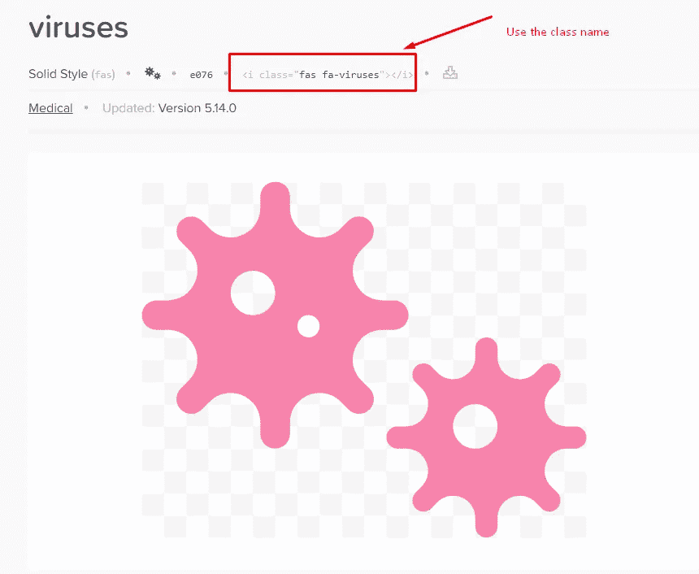

# 一行 Python 代码帮助您理解一篇文章

> 原文：<https://towardsdatascience.com/one-line-of-python-code-to-help-you-understand-an-article-c8aacab33dcb?source=collection_archive---------11----------------------->


[纳西索 1](https://pixabay.com/users/narciso1-608227/) 在 [Pixabay](https://pixabay.com/illustrations/word-cloud-tag-happy-birthday-680706/#) 拍摄的照片

## 使用`stylecloud`生成花哨的掩蔽词云图像

当有人说我们需要从一篇文章中提取主题时，你会想到 NLP(自然语言处理)算法、RNN 深度学习等吗？嗯，这些都是正确的答案，但有时对于一个简单的问题来说可能有点小题大做了。

你可能听说过也可能没有听说过云这个词。我想说的是，在某些用例中，这是一个非常充分、有趣且快速的解决方案，可以用来展示一篇文章的主题，或者仅仅是一段文字。基本上，它可以做以下事情:

*   提取文章的关键词
*   基于出现次数可视化关键词
*   以一种奇特的方式呈现视觉化

在本文中，我将介绍一个最容易使用的 Python 库— **stylecloud** ，它可以为我们生成这个单词云图像。

# 快速启动


由[像素](https://pixabay.com/photos/chair-cottage-country-style-1840526/)上的[像素](https://pixabay.com/users/pexels-2286921/)拍摄的照片

安装 stylecloud 库和其他库一样简单。只是用`pip`如下。

```
pip install stylecloud
```

那么，让我们快速开始。您将会看到，使用这个库可以非常容易地生成一个漂亮的单词云图像。

有人曾经问我“数据架构师是做什么的？”当然，回答这个问题的最佳方式是使用一系列要点来阐述一般数据架构师的主要职责。然而，我们也可以用“云”这个词来“形象化”这些概念上的点。

让我们使用维基百科中的术语。例如，下面的网页显示了术语数据架构师的内容。


我们可以复制这一页上的所有内容，然后简单地保存到文本文件中。然后，魔术时间到了。

```
import stylecloud as scsc.gen_stylecloud(
    file_path='data_architect.txt', 
    output_name='data_architect.png'
)
```

所以，我们只是把文本文件名给了 stylecloud 库。单词云图像将按照我们为`output_name`参数指定的那样简单地生成。


非常酷。这是我为数据工程师角色生成的另一个单词云。我们可以把它们放在一起进行比较。


当然，我们不能指望一行 Python 代码就能产生像 RNN 模型给我们的一样精确的东西。然而，我想说它是数据可视化、非结构化数据的一个极好的替代方案:)

从两个单词的云图中，我们可以忽略一些没有太大意义的东西，比如单词“percent ”,只关注我们感兴趣的东西。通常可以看出，数据架构师的角色更多的是一个组织级别，为项目设计数据架构，必须具备一些管理技能，而数据工程师的角色则侧重于工程，需要更多的技术技能。

# 一些高级用法


由[拍摄的照片](https://pixabay.com/users/free-photos-242387/)在 [Pixabay](https://pixabay.com/photos/person-mountain-top-achieve-1245959/) 上

你有没有注意到我们生成的两幅图像都是国旗形状的？是的，这是 stylecloud 最棒的功能之一——屏蔽。

假设我们想要为新冠肺炎生成一个单词云图像。在这个例子中，我再次使用了维基百科上的页面。那么，我们如何才能使图像看起来更适合我们要生成的主题呢？我不想要 stylecloud 默认的“flag”掩码，因为它对病毒的主题没有太大意义。

stylecloud 库使用 FontAwesome 作为它的图标库。FontAwesome 通常用于网页设计。例如，许多小图标，如 Twitter、Linkedin 等。得到了 FontAwesome 的支持。基本思想是使用一个 HTML 类使 HTML 元素显示为一个好看的图标。不要担心，如果你不知道 web 开发，在这种情况下你不需要知道。

这里是 FontAwesome 的链接。

[](https://fontawesome.com/) [## 字体真棒

### 世界上最受欢迎和最容易使用的图标集刚刚得到了升级。更多图标。更多款式。更多选择。

fontawesome.com](https://fontawesome.com/) 

我们可以简单地搜索“病毒”，我们会得到如下病毒图标页面。



唯一需要做的就是复制类名`fas fa-viruses`并在`gen_stylecloud()`函数中使用它，如下所示。

```
sc.gen_stylecloud(
    file_path='covid-19.txt',
    icon_name='fas fa-viruses',
    output_name='covid-19.png'
)
```


# 将 Stylecloud 和维基百科库结合起来


照片由 [geralt](https://pixabay.com/users/geralt-9301/) 在 [Pixabay](https://pixabay.com/photos/social-media-faces-photo-album-3129481/) 上拍摄

现在，我要给你看一些更“蟒蛇”的东西。Python 的一个令人惊奇的特点是有如此多令人惊奇的库可用。在上面的例子中，我们一直使用维基百科，并手动将内容复制到文本文件中。那一点也不方便。

在我以前的一篇文章中，我介绍了一个 Python 库，可以开箱即用地删除维基百科中的内容。

[](/three-out-of-box-web-content-scraping-applications-in-python-e342a6836ba4) [## Python 中的三个“开箱即用”的 Web 内容抓取应用程序

### 你不需要通过使用它们来学习刮削

towardsdatascience.com](/three-out-of-box-web-content-scraping-applications-in-python-e342a6836ba4) 

我们可以一起使用这两个库！

首先，我们来安装维基百科 Python 库。

```
pip install wikipedia
```

然后，导入库以供使用。

```
import wikipedia
```

第三，让我们摇滚吧！这里有一个 LinkedIn 的例子。

```
sc.gen_stylecloud(
    text=wikipedia.summary("linkedin"),
    icon_name='fab fa-linkedin-in',
    output_name='linkedin.png'
)
```


还有推特。

```
sc.gen_stylecloud(
    text=wikipedia.summary("twitter"),
    icon_name='fab fa-twitter',
    output_name='twitter.png'
)
```


我猜想例子的数量已经足够了。接下来，你自己去图书馆看看吧！

# 摘要


照片由 Pixabay 上的 [mat_hias](https://pixabay.com/users/mat_hias-4154603/) 拍摄

在本文中，我介绍了另一个令人惊叹的 Python 库——style cloud。最漂亮的是，它可以生成一个带有遮罩图标的单词云的图像。

这样一个库的使用非常简单。也就是一个功能几乎可以实现一切。然而，这背后的逻辑并不像我们如何使用它那么简单。感谢每一个为社区做贡献的人。

[](https://medium.com/@qiuyujx/membership) [## 通过我的推荐链接加入 Medium 克里斯托弗·陶

### 作为一个媒体会员，你的会员费的一部分会给你阅读的作家，你可以完全接触到每一个故事…

medium.com](https://medium.com/@qiuyujx/membership) 

**如果你觉得我的文章有帮助，请考虑加入灵媒会员来支持我和成千上万的其他作家！(点击上面的链接)**