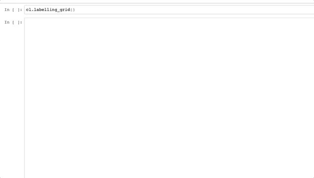

# 在 Jupyter 笔记本中点击鼠标来标记图像

> 原文：<https://towardsdatascience.com/one-mouse-click-to-label-an-image-within-a-jupyter-notebook-40053095333a?source=collection_archive---------58----------------------->

## 一个交互式笔记本，使您在处理图像识别时更有效地标记数据

照片由[陈茂三潭](https://unsplash.com/@tranmautritam?utm_source=medium&utm_medium=referral)在 [Unsplash](https://unsplash.com?utm_source=medium&utm_medium=referral) 上拍摄

训练图像识别模型的关键是拥有大量手动标记的图像。这需要时间，所以您希望添加每个标签的过程越快越好，最好只需点击一下鼠标。

当我遇到这个问题时，我很惊讶我找不到任何免费的一键解决方案。所以我自己造了一个:

 [## g morinan/click 2 标签

### 要开始标记图像，只需单击鼠标，打开 labelling.ipynb 并执行前两个代码单元格。每…

github.com](https://github.com/gmorinan/click2label) 

如果您打开`labelling.ipynb`并运行前两个单元格，您将能够像这样做:

[作者图片](https://github.com/gmorinan/click2label)

看看`click2label.py`的底层代码。

我本可以为现有的开箱即用服务付费。但是作为一名数据科学家，我更希望有一段 Python 代码，我可以根据每个项目的持续需求快速定制。

另外，使用 Jupyter 笔记本使我不必打开另一个程序。

*我在* [*机器医学技术*](https://machinemedicine.com/) *工作，我们使用计算机视觉，但这篇文章与我们在那里做的任何事情完全无关。此外，给猫&狗的基因贴标签比从视频中检测人类生物标记要容易得多。*