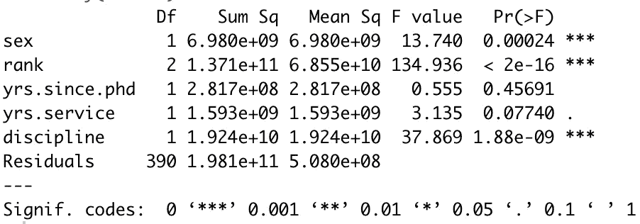
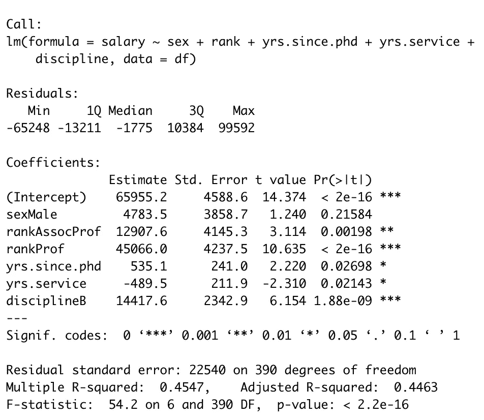
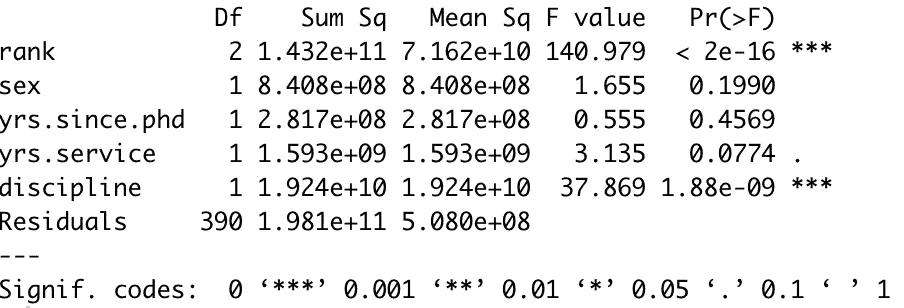
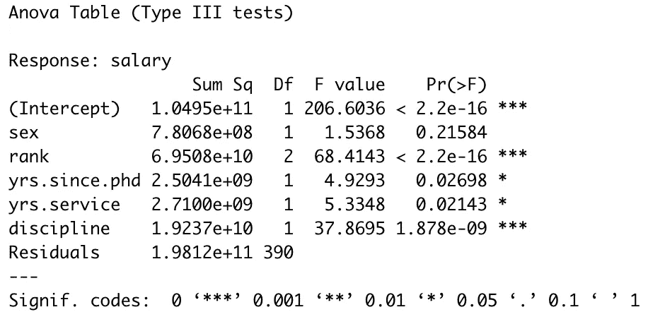

# 在 R 中进行方差分析时最常见的错误之一

> 原文：<https://towardsdatascience.com/one-of-the-most-common-unintentional-mistakes-when-running-an-anova-in-r-cfa55d332a?source=collection_archive---------14----------------------->

## 或者:为什么 OLS 回归(lm)和方差分析(aov)函数有时会不同，以及如何使用 car 软件包解决这个问题。

想象一下这个场景:你在 R 中运行 ANOVA，同时控制其他变量(技术上来说，是 ANCOVA)。然而，结果看起来很奇怪:独立变量的顺序很重要并影响结果——怎么会这样呢？如果你尝试输入相同的模型作为线性回归，结果也完全不同。再说一遍，这怎么可能呢？

这篇文章旨在阐明这个共同的问题。首先，让我们从重现这个问题开始。如果你正在寻找关于 ANOVAs 的更全面的介绍，可以看看我关于这个主题的文章。


许多人没有注意到他们的 ANOVAs 是错误的。(图片由[loc fürhoff](https://unsplash.com/@imagoiq?utm_source=unsplash&utm_medium=referral&utm_content=creditCopyText)在 [Unsplash](https://unsplash.com/s/photos/university?utm_source=unsplash&utm_medium=referral&utm_content=creditCopyText) 上拍摄)

我们将使用 base R 中包含的薪水数据集重新创建这个问题。它包含教授薪水和其他变量的数据，这些变量会直观地影响教授的薪水，如学科和资历。您可以使用以下命令来访问它。

```
df=Salaries
```

现在，假设我们感兴趣的是，在控制其他直观上重要的自变量时，教授的性别是否会影响他们的工资。人们可以使用方差分析来分析这些差异。因此，让我们用 ANOVA 分析数据集中两组之间的差异。

```
aov1.1=aov(salary~sex+rank+yrs.since.phd+yrs.service+discipline,df)summary(aov1.1)
```



这个方差分析似乎暗示性别对教授的工资有显著影响。但是，如果你运行与线性回归模型相同的分析，就会得出不同的结论。

```
lm1.1=lm(salary~sex+rank+yrs.since.phd+yrs.service+discipline,df)summary(lm1.1)
```



在这里，性别对教授工资的影响似乎微不足道。那是什么呢？性别到底有没有影响教授的工资？另一件奇怪的事情出现了:如果你重新运行 ANOVA 1.1，但改变了自变量的顺序，它也会显示不同的结果。在下面的例子中，我们改变了独立变量性别和等级的位置。

```
aov1.2=aov(salary~rank+sex+yrs.since.phd+yrs.service+discipline,df)summary(aov1.2)
```



同样，不同的结果。现在我们有三组结果和终极困惑。性别对于回归是不显著的，但是，例如，yrs.since.phd 也是不显著的，这与回归结果不同。这是怎么回事？哪个自变量影响教授的工资？为什么所有的结果都不一样？

原因是*类平方和*。它描述了 R 如何将误差项合并到回归模型中，以及合并误差的不同方式导致不同的拟合模型。默认情况下，R 使用类型 I(“一”)方差分析的平方和，类型 1 非常适合只有一个自变量的方差分析。然而，当你添加更多的自变量(技术上是 ANCOVA)时，I 型将产生*不正确的*结果。对于回归(当使用 lm()函数时)，R 默认使用类型 III(“三”)平方和。

在上面的例子中，所有的 ANOVAs 都是错误的，只有 lm()函数产生了正确的结果*。*虽然我不会解释不同类型平方和之间的区别，但可以说你应该*几乎总是使用第三类平方和。*如果你想了解更多关于不同类型平方和的信息，请查看[安迪·菲尔德的书《使用 R](https://amzn.to/2t2Tf9l) 发现统计学》中的[这一页](https://books.google.ch/books?id=wd2K2zC3swIC&lpg=PP1&hl=de&pg=PA475#v=onepage&q&f=false)

**因此，如果我们运行一个具有多个自变量的 ANOVA(技术上是 ANCOVA)，我们需要覆盖 R 的默认设置，并告诉它必须使用类型 III 平方和。**

由于 aov()函数不允许我们修改平方和的类型，我们需要使用另一个不同包中的 ANOVA 函数来指定这一点。我们将使用*赛车*套件。运行下面的命令来安装 *car* 包，如果你还没有安装的话。

```
install.packages("car")
```

然后加载包。

```
library(car)
```

然后，在我们的*原始 ANOVA* 对象(aov1.1)上运行 *car Anova* 命令，指定我们希望使用 III 类误差。

```
Anova(aov1.1, type=”III”)
```



现在查看结果，您可以看到它们与回归输出一致。