# 一次比例和拟合优度检验(在 R 和手工中)

> 原文：<https://towardsdatascience.com/one-proportion-and-goodness-of-fit-test-in-r-and-by-hand-8c7997013c84?source=collection_archive---------55----------------------->

## 了解如何执行单一比例和拟合优度测试，这对于检查分布是否遵循特定的已知分布非常有用


照片由[罗曼·马格](https://unsplash.com/@roman_lazygeek?utm_source=medium&utm_medium=referral)拍摄

# 介绍

在之前的一篇文章中，我介绍了 R 中独立性的[卡方检验，它用于检验两个](https://www.statsandr.com/blog/chi-square-test-of-independence-in-r/)[分类](https://www.statsandr.com/blog/variable-types-and-examples/#qualitative)变量之间的独立性。在本文中，我展示了如何执行，首先在 R 中，然后手动执行:

1.  一比例检验(也称为单样本比例检验)
2.  卡方拟合优度检验

当定性变量只有**两个类别**时，第一个测试用于比较观察比例和预期比例。第二个测试用于比较多个观察比例和多个预期比例，在这种情况下，定性变量有**两个或更多类别**。

这两种检验都允许检验定性变量水平之间的比例是否相等，或者检验给定比例是否相等。这些给定的比例可以任意确定或基于已知分布的理论概率。

# 在 R 中

# 数据

在本节中，我们使用与关于[描述性统计](https://www.statsandr.com/blog/descriptive-statistics-in-r/)的文章中相同的数据集。这是众所周知的`iris`数据集，我们向其中添加了变量`size`。如果花瓣的长度小于所有花的中值，变量`size`对应`small`，否则对应`big`:

```
# load iris dataset
dat <- iris# create size variable
dat$size <- ifelse(dat$Sepal.Length < median(dat$Sepal.Length),
  "small", "big"
)# show first 5 observations
head(dat, n = 5)##   Sepal.Length Sepal.Width Petal.Length Petal.Width Species  size
## 1          5.1         3.5          1.4         0.2  setosa small
## 2          4.9         3.0          1.4         0.2  setosa small
## 3          4.7         3.2          1.3         0.2  setosa small
## 4          4.6         3.1          1.5         0.2  setosa small
## 5          5.0         3.6          1.4         0.2  setosa small
```

# 一比例检验

对于这个例子，我们有一个 150 朵花的样本，我们想测试小花的比例是否与大花的比例相同(通过变量`size`测量)。以下是按大小排列的花朵数量，以及相应的比例:

```
# barplot
library(ggplot2)
ggplot(dat) +
  aes(x = size) +
  geom_bar(fill = "#0c4c8a") +
  theme_minimal()
```

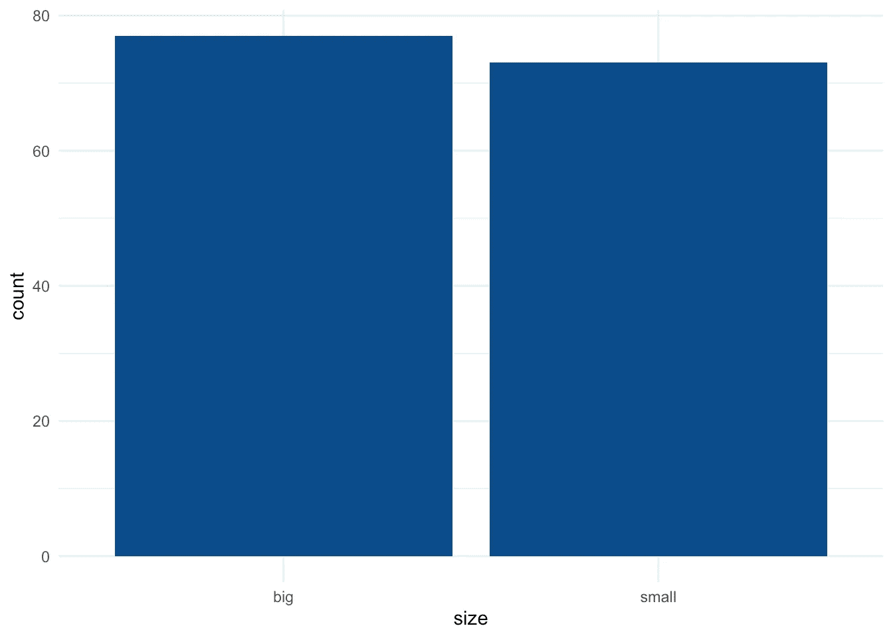

```
# counts by size
table(dat$size)## 
##   big small 
##    77    73# proportions by size, rounded to 2 decimals
round(prop.table(table(dat$size)), 2)## 
##   big small 
##  0.51  0.49
```

在构成我们样本的 150 朵花中，51%和 49%分别是大的和小的。为了测试两种尺寸的比例是否相同，我们使用接受以下参数的`prop.test()`函数:

*   成功次数
*   观察/试验次数
*   预期概率(我们要测试的概率)

(任意地)考虑到`big`是成功的，我们有: [1](https://www.statsandr.com/blog/one-proportion-and-goodness-of-fit-test-in-r-and-by-hand/#fn1)

```
# one-proportion test
test <- prop.test(
  x = 77, # number of successes
  n = 150, # total number of trials (77 + 73)
  p = 0.5
) # we test for equal proportion so prob = 0.5 in each grouptest## 
##  1-sample proportions test with continuity correction
## 
## data:  77 out of 150, null probability 0.5
## X-squared = 0.06, df = 1, p-value = 0.8065
## alternative hypothesis: true p is not equal to 0.5
## 95 percent confidence interval:
##  0.4307558 0.5952176
## sample estimates:
##         p 
## 0.5133333
```

我们通过零概率(`0.5`)、检验统计量(`X-squared = 0.06`)、自由度(`df = 1`)、*p*-值(`p-value = 0.8065`)、替代假设(`true p is not equal to 0.5`)、95%置信区间(也可以用`test$conf.int`提取)和样本中的比例(`0.5133333`)获得一个输出。

p 值为 0.806，因此，在 5%的显著性水平上，我们不拒绝小花朵和大花朵的比例相同的无效假设。

# `prop.test()`和`binom.test()`的假设

注意`prop.test()`使用二项式分布的正态近似值。所以这个测试的一个假设是样本量足够大(通常是， *n > 30* )。如果样本量较小，建议使用精确二项式检验。

可以使用`binom.test()`函数执行精确的二项式测试，并接受与`prop.test()`函数相同的参数。对于本例，假设我们有一个 12 朵大花和 3 朵小花的样本，我们想测试两种花的比例是否相同:

```
# barplot
barplot(c(12, 3), # observed counts
  names.arg = c("big", "small"), # rename labels
  ylab = "Frequency", # y-axis label
  xlab = "Size" # x-axis label
)
abline(
  h = 15 / 2, # expected counts in each level
  lty = 2 # dashed line
)
```

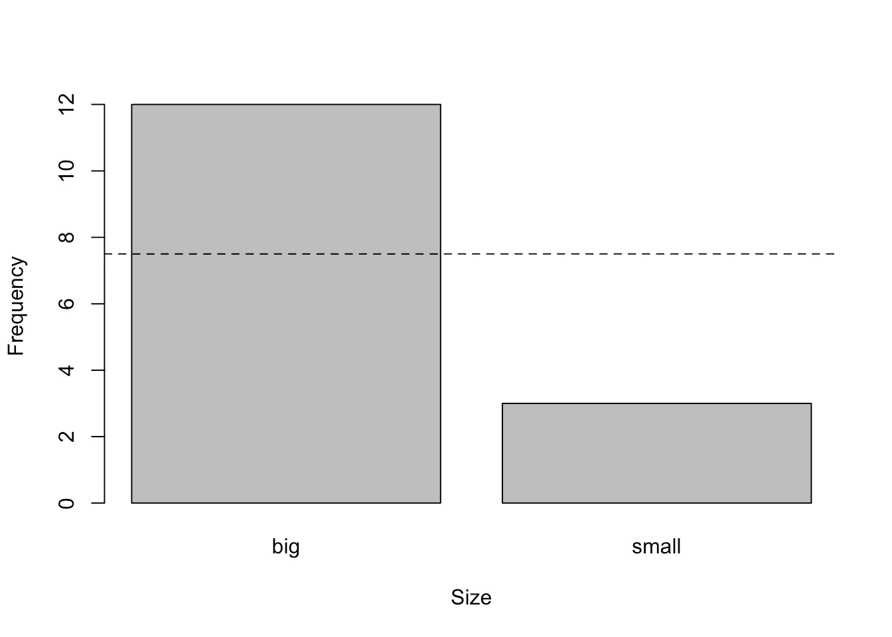

```
# exact binomial test
test <- binom.test(
  x = 12, # counts of successes
  n = 15, # total counts (12 + 3)
  p = 0.5 # expected proportion
)test## 
##  Exact binomial test
## 
## data:  12 and 15
## number of successes = 12, number of trials = 15, p-value = 0.03516
## alternative hypothesis: true probability of success is not equal to 0.5
## 95 percent confidence interval:
##  0.5191089 0.9566880
## sample estimates:
## probability of success 
##                    0.8
```

p 值为 0.035，因此，在 5%的显著性水平上，我们拒绝零假设，我们得出结论，小花和大花的比例显著不同。这相当于断定大花的比例与 0.5 显著不同(因为只有两种大小)。

如果要测试大花比例大于 50%，在`binom.test()`函数中加入`alternative = "greater"`自变量: [2](https://www.statsandr.com/blog/one-proportion-and-goodness-of-fit-test-in-r-and-by-hand/#fn2)

```
test <- binom.test(
  x = 12, # counts of successes
  n = 15, # total counts (12 + 3)
  p = 0.5, # expected proportion
  alternative = "greater" # test that prop of big flowers is > 0.5
)test## 
##  Exact binomial test
## 
## data:  12 and 15
## number of successes = 12, number of trials = 15, p-value = 0.01758
## alternative hypothesis: true probability of success is greater than 0.5
## 95 percent confidence interval:
##  0.5602156 1.0000000
## sample estimates:
## probability of success 
##                    0.8
```

p 值为 0.018，因此，在 5%的显著性水平上，我们拒绝零假设，我们得出结论，大花的比例明显大于 50%。

# 卡方拟合优度检验

现在假设定性变量有两个以上的级别，如变量`Species`的情况:

```
# barplot
ggplot(dat) +
  aes(x = Species) +
  geom_bar(fill = "#0c4c8a") +
  theme_minimal()
```

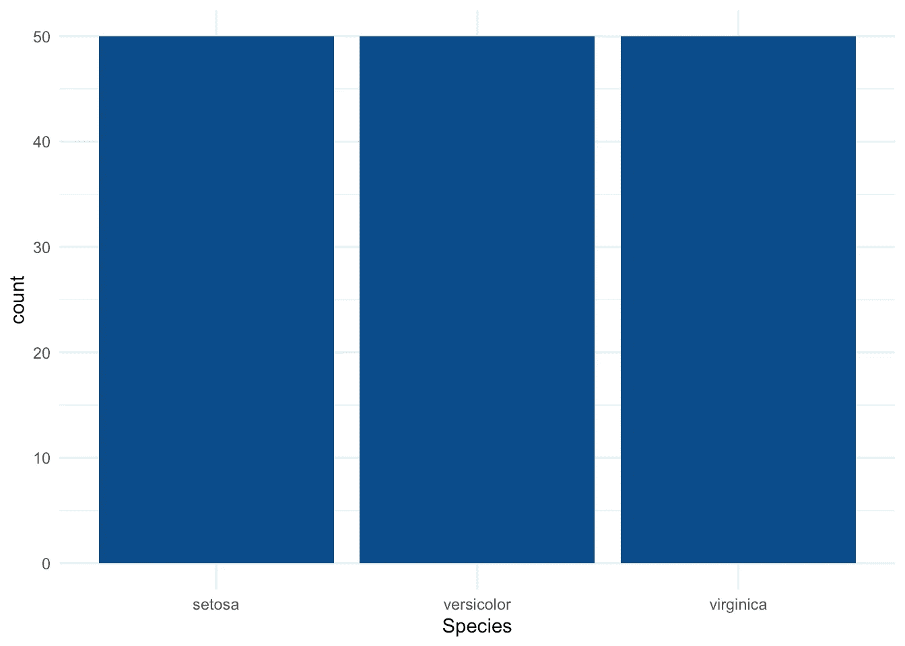

```
# counts by Species
table(dat$Species)## 
##     setosa versicolor  virginica 
##         50         50         50
```

变量`Species`有 3 个级别，每个级别有 50 个观察值。假设在这个例子中，我们想测试这三个物种是否同样常见。如果它们同样普遍，那么它们将平均分布，每个物种的预期比例将是 1/3。

这个测试可以用`chisq.test()`函数完成，接受以下参数:

*   代表观察到的比例的数字向量
*   代表预期比例的概率向量(与观察到的比例长度相同)

适用于我们的研究问题(即，这三个物种是否同样常见？)，我们有:

```
# goodness of fit test
test <- chisq.test(table(dat$Species), # observed proportions
  p = c(1 / 3, 1 / 3, 1 / 3) # expected proportions
)test## 
##  Chi-squared test for given probabilities
## 
## data:  table(dat$Species)
## X-squared = 0, df = 2, p-value = 1
```

*p*-值为 1，因此，在 5%的显著性水平上，我们不拒绝所有物种之间比例相等的无效假设。

即使在进行统计测试之前，这也是非常明显的，因为每个物种正好有 50 朵花，所以很容易看出这些物种是同样常见的。然而，我们仍然进行了测试，以显示它在实践中是如何工作的。

# 我的分布是否遵循给定的分布？

在上一节中，我们自己选择了比例。拟合优度测试对于将观察到的比例与基于某种已知分布的预期比例进行比较也特别有用。

记住测试的假设:

*   H0:观察到的频率和预期的频率之间没有显著的差异
*   H1:观察到的频率和预期的频率有很大的差异

对于这个例子，假设我们测量了 100 个有 5 个孩子的家庭中女孩的数量。我们想测试(观察到的)数字女孩的分布是否遵循二项分布。

## 观察到的频率

在我们的 100 个有 5 个孩子的家庭样本中，每个家庭的女孩数量分布如下:

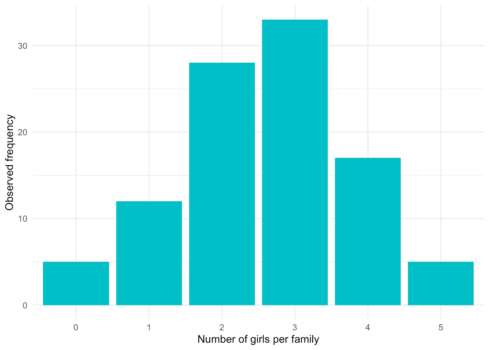

以及相应的频率和相对频率(记住相对频率是频率除以总样本量):

```
# counts
dat##   Girls Frequency Relative_freq
## 1     0         5          0.05
## 2     1        12          0.12
## 3     2        28          0.28
## 4     3        33          0.33
## 5     4        17          0.17
## 6     5         5          0.05
```

## 预期频率

为了将观察到的频率与二项式分布进行比较，并查看两种分布是否匹配，我们首先需要确定在二项式分布的情况下将获得的预期频率。假设生女孩的概率为 0.5(5 个孩子中的每一个)，预期频率如下:

```
# create expected frequencies for a binomial distribution
x <- 0:5
df <- data.frame(
  Girls = factor(x),
  Expected_relative_freq = dbinom(x, size = 5, prob = 0.5)
)
df$Expected_freq <- df$Expected_relative_freq * 100 # *100 since there are 100 families# create barplot
p <- ggplot(df, aes(x = Girls, y = Expected_freq)) +
  geom_bar(stat = "identity", fill = "#F8766D") +
  xlab("Number of girls per family") +
  ylab("Expected frequency") +
  labs(title = "Binomial distribution Bi(x, n = 5, p = 0.5)") +
  theme_minimal()
p
```

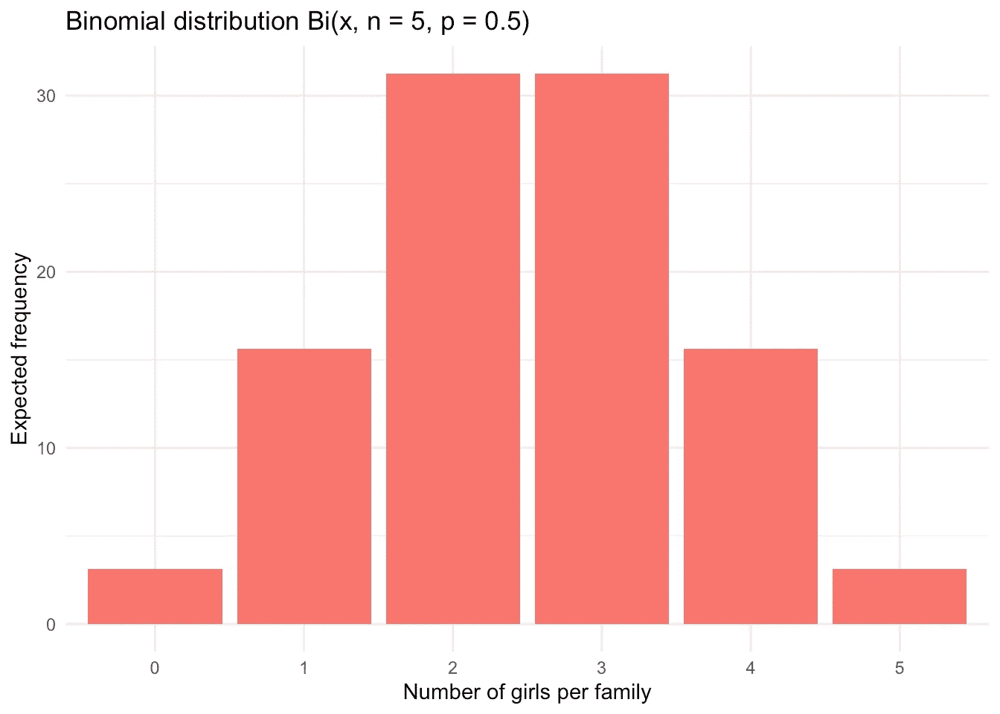

```
# expected relative frequencies and (absolute) frequencies
df##   Girls Expected_relative_freq Expected_freq
## 1     0                0.03125         3.125
## 2     1                0.15625        15.625
## 3     2                0.31250        31.250
## 4     3                0.31250        31.250
## 5     4                0.15625        15.625
## 6     5                0.03125         3.125
```

## 观察频率与预期频率

现在，我们将观察到的频率与预期的频率进行比较，看两者是否有显著差异。如果两者相差很大，我们就不接受每个有 5 个孩子的家庭的女孩数量服从二项式分布的假设。另一方面，如果观察到的和预期的频率相似，我们不拒绝每个家庭的女孩数量遵循二项分布的假设。

视觉上我们有:

```
# create data
data <- data.frame(
  num_girls = factor(rep(c(0:5), times = 2)),
  Freq = c(dat$Freq, df$Expected_freq),
  obs_exp = c(rep("observed", 6), rep("expected", 6))
)# create plot
ggplot() +
  geom_bar(
    data = data, aes(
      x = num_girls, y = Freq,
      fill = obs_exp
    ),
    position = "dodge", # bar next to each other
    stat = "identity"
  ) +
  ylab("Frequency") +
  xlab("Number of girls per family") +
  theme_minimal() +
  theme(legend.title = element_blank()) # remove legend title
```

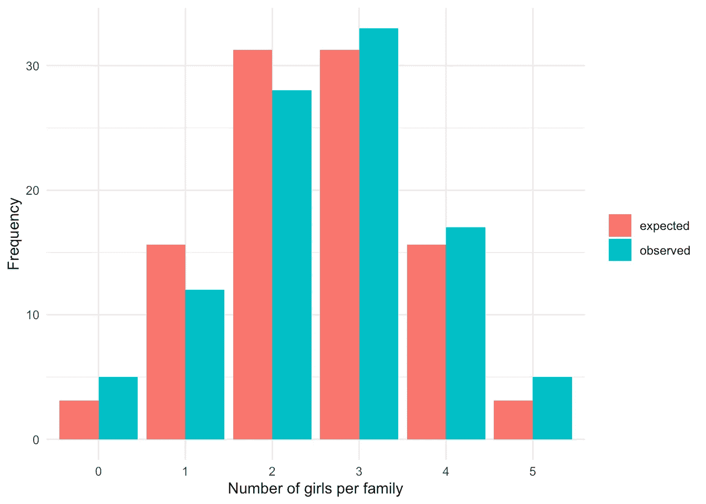

我们看到观察到的和预期的频率非常相似，所以我们预计有 5 个孩子的家庭中女孩的数量遵循二项分布。然而，只有拟合优度测试会证实我们的信念:

```
# goodness of fit test
test <- chisq.test(dat$Freq, # observed frequencies
  p = df$Expected_relative_freq # expected proportions
)test## 
##  Chi-squared test for given probabilities
## 
## data:  dat$Freq
## X-squared = 3.648, df = 5, p-value = 0.6011
```

*p*-值为 0.601，因此，在 5%的显著性水平上，我们不拒绝观测频率和预期频率相等的无效假设。这相当于得出结论，我们不能拒绝五个孩子的家庭中的女孩数量遵循二项分布的假设(因为预期频率是基于二项分布的)。

请注意，拟合优度测试当然可以用二项式分布以外的其他分布类型来执行。例如，如果您想要测试观察到的分布是否遵循泊松分布，此测试可用于将观察到的频率与泊松分布情况下获得的预期比例进行比较。

# 用手

既然我们已经展示了如何在 R 中执行一次比例和拟合优度测试，那么在本节中我们将展示如何手工执行这些测试。我们首先说明一比例检验，然后是卡方拟合优度检验。

# 一比例检验

对于这个例子，假设我们投掷一枚硬币 100 次，注意到它有 67 次正面朝上。接下来，我们要测试硬币是否公平，即测试正面或反面落地的概率是否等于 50%。

对于许多假设检验，我们通过 4 个简单的步骤来完成:

1.  陈述无效假设和替代假设
2.  计算检验统计量(也称为 t-stat)
3.  找到拒绝区域
4.  通过比较检验统计量和拒绝区域得出结论

**第一步。**

在我们的例子中，无效假设和替代假设是:

*   H0: p0 = 0.5
*   H1: p0 ≠ 0.5

其中 p0 是头部着地的预期比例。

**第二步。**

测试统计为: [3](https://www.statsandr.com/blog/one-proportion-and-goodness-of-fit-test-in-r-and-by-hand/#fn3)

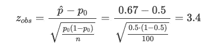

(如果你在计算检验统计量时需要更多帮助，请参阅如何在一个闪亮的应用程序中执行[假设检验。)](https://www.statsandr.com/blog/a-shiny-app-for-inferential-statistics-by-hand/)

**第三步。**

通过正态分布表找到拒绝区域。假设显著性水平α = 0.05，我们有:

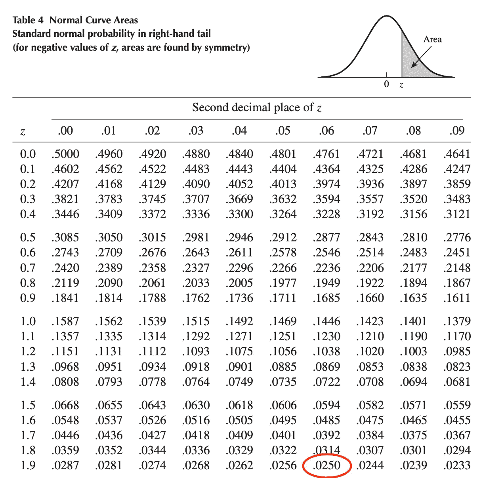

z(α/2) = z(0.025) = 1.96

**第四步。**

我们将测试统计(在步骤 2 中找到)与拒绝区域(在步骤 3 中找到)进行比较，并得出结论。视觉上，我们有:

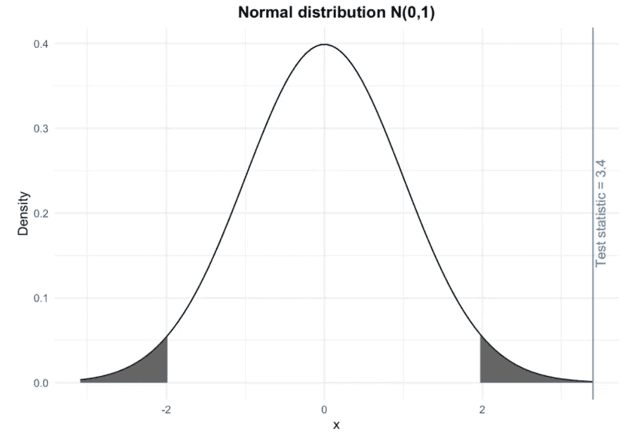

测试统计位于拒绝区域内(即灰色阴影区域)。因此，在 5%的显著性水平上，我们拒绝零假设，我们得出结论，头部(以及尾部)的比例显著不同于 50%。换句话说，仍然在 5%的显著性水平，我们得出结论，硬币是不公平的。

如果您更喜欢计算*p*-值，而不是比较 t-stat 和拒绝区域，您可以使用这个[闪亮的应用程序来轻松计算不同概率分布的*p*-值](https://www.statsandr.com/blog/a-guide-on-how-to-read-statistical-tables/)。打开应用程序后，设置 t-stat，相应的选项，你会在页面顶部找到*p*-值。

# R 中的验证

为了便于说明，下面是上面例子在 R 中的验证:

```
# one-proportion test
test <- prop.test(
  x = 67, # number of heads
  n = 100, # number of trials
  p = 0.5 # expected probability of heads
)test## 
##  1-sample proportions test with continuity correction
## 
## data:  67 out of 100, null probability 0.5
## X-squared = 10.89, df = 1, p-value = 0.0009668
## alternative hypothesis: true p is not equal to 0.5
## 95 percent confidence interval:
##  0.5679099 0.7588442
## sample estimates:
##    p 
## 0.67
```

*p*-值为 0.001，因此，在 5%的显著性水平上，我们拒绝正面和反面比例相等的无效假设，我们得出结论，硬币是有偏差的。这和手动发现的结论是一样的。

# 拟合优度检验

我们现在用下面的例子来手工说明拟合优度测试。

假设我们掷骰子 100 次，我们记下它落在每个面上的次数(1 到 6)，然后测试骰子是否公平。以下是观察到的骰子点数:

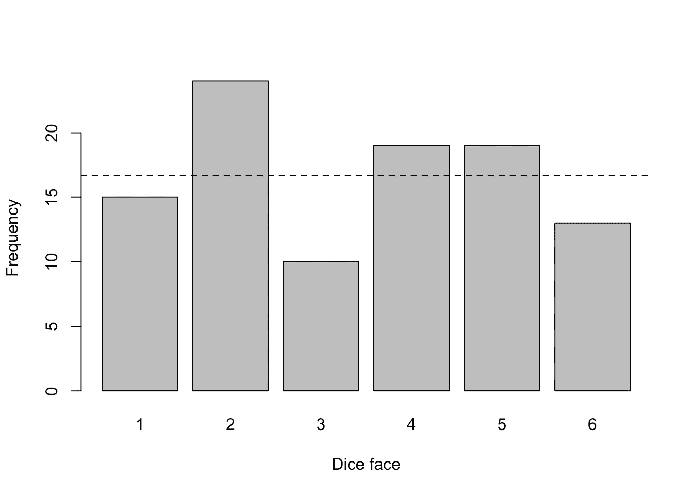

```
## dice_face
##  1  2  3  4  5  6 
## 15 24 10 19 19 13
```

对于一个公平的骰子，我们会期望它在每个面上降落 100/6 ≈ 16.67 次(这个期望值在上图中用虚线表示)。尽管观察到的频率不同于预期值 16.67:

```
##   dice_face observed_freq expected_freq
## 1         1            15         16.67
## 2         2            24         16.67
## 3         3            10         16.67
## 4         4            19         16.67
## 5         5            19         16.67
## 6         6            13         16.67
```

我们需要测试它们是否有显著的不同。为此，我们按照上面提到的 4 个简单步骤进行适当的假设检验:

1.  陈述无效假设和替代假设
2.  计算检验统计量(也称为 t-stat)
3.  找到拒绝区域
4.  通过比较检验统计量和拒绝区域得出结论

**第一步。**

拟合优度检验的无效假设和替代假设是:

*   H0:观察到的频率和预期的频率之间没有显著的差异
*   H1:观察到的频率和预期的频率有很大的差异

**第二步。**

测试统计数据为:

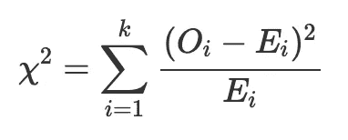

其中 Oi 是观察到的频率，Ei 是预期的频率，k 是类别的数量(在我们的例子中，有 6 个类别，代表 6 个骰子面)。

这种χ2 统计量是通过计算每个类别中观察到的病例数和预期病例数之间的差异获得的。该差值被平方(以避免正负差值被补偿)并除以该类别中的预期病例数。然后将所有类别的这些值相加，总和被称为χ2 统计量。该检验统计量的大值导致无效假设被拒绝，小值意味着无效假设不能被拒绝。 [4](https://www.statsandr.com/blog/one-proportion-and-goodness-of-fit-test-in-r-and-by-hand/#fn4)

根据我们的数据，我们有:

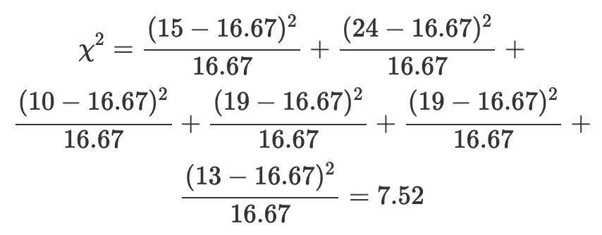

**第三步。**

χ2 检验统计量是小还是大取决于拒绝区域。通过χ2 分布表找到拒绝区域。自由度等于 k1(其中 k 为类别数)，假设显著性水平α = 0.05，则我们得到:

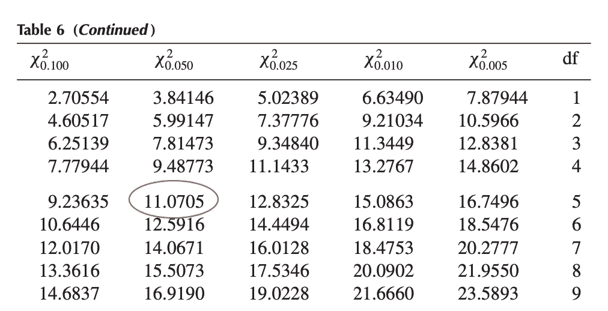

χ2(α;k1)=χ2(0.05；5) = 11.0705

**第四步。**

我们将测试统计(在步骤 2 中找到)与拒绝区域(在步骤 3 中找到)进行比较，并得出结论。视觉上，我们有:

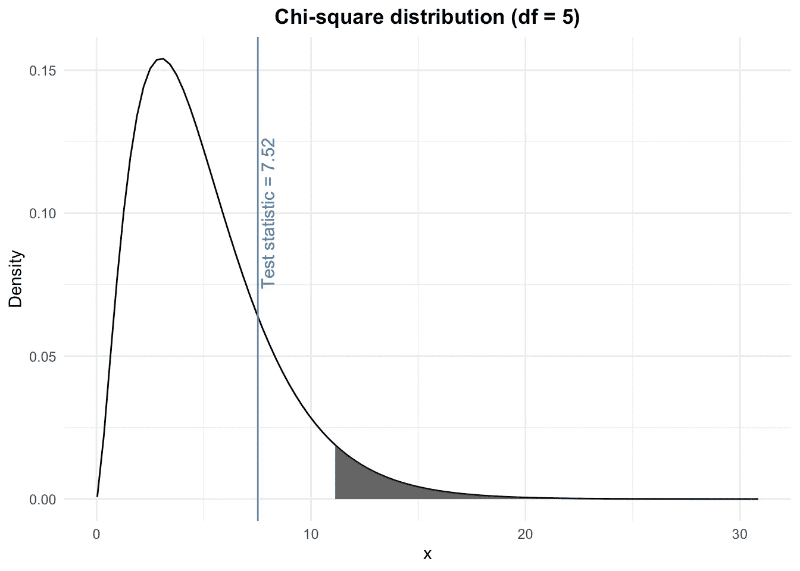

测试统计不在拒绝区域内(即灰色阴影区域)。因此，在 5%的显著性水平，我们不拒绝零假设，即观察到的频率和预期的频率之间没有显著差异。换句话说，仍然在 5%的显著性水平上，我们不能拒绝骰子是公平的假设。

同样，您可以使用[闪亮的应用程序](https://www.statsandr.com/blog/a-guide-on-how-to-read-statistical-tables/)轻松计算给定测试统计的*p*-值，如果您更喜欢这种方法而不是 t-stat 和拒绝区域之间的比较。

# R 中的验证

为了便于说明，下面是上面例子在 R 中的验证:

```
# goodness of fit test
test <- chisq.test(dat$observed_freq, # observed frequencies for each dice face
  p = rep(1 / 6, 6) # expected probabilities for each dice face
)test## 
##  Chi-squared test for given probabilities
## 
## data:  dat$observed_freq
## X-squared = 7.52, df = 5, p-value = 0.1847
```

测试统计和自由度与手动发现的完全相同。*p*-值为 0.185，仍处于 5%的显著性水平，得出的结论与手动得出的结论相同(即未能拒绝零假设)。

感谢阅读。我希望这篇文章能帮助你理解并手工执行一比例和拟合优度检验。

和往常一样，如果您有与本文主题相关的问题或建议，请将其添加为评论，以便其他读者可以从讨论中受益。

1.  选择大或小作为成功事件给出了完全相同的结论。 [↩](https://www.statsandr.com/blog/one-proportion-and-goodness-of-fit-test-in-r-and-by-hand/#fnref1)
2.  同样，这个自变量也可以加入到`prop.test()`函数中，检验观察比例是否大于预期比例。如果您想测试观察到的比例是否小于预期的比例，请使用`alternative = "less"`。 [↩](https://www.statsandr.com/blog/one-proportion-and-goodness-of-fit-test-in-r-and-by-hand/#fnref2)
3.  这个测试的一个假设是 n⋅p≥5 和 n⋅(1−p)≥5.假设得到满足，因此我们可以使用二项分布的正态近似。 [↩](https://www.statsandr.com/blog/one-proportion-and-goodness-of-fit-test-in-r-and-by-hand/#fnref3)
4.  来源:[http://uregina.ca/~gingrich/ch10.pdf](http://uregina.ca/~gingrich/ch10.pdf)。 [↩](https://www.statsandr.com/blog/one-proportion-and-goodness-of-fit-test-in-r-and-by-hand/#fnref4)

# 相关文章

*   [如何手动执行单样本 t 检验，并对一个平均值进行 R:检验](https://www.statsandr.com/blog/how-to-perform-a-one-sample-t-test-by-hand-and-in-r-test-on-one-mean/)
*   [如何在 R 中一次对多个变量进行 t 检验或方差分析，并以更好的方式传达结果](https://www.statsandr.com/blog/how-to-do-a-t-test-or-anova-for-many-variables-at-once-in-r-and-communicate-the-results-in-a-better-way/)
*   [学生的 R 和手工 t 检验:如何在不同场景下比较两组](https://www.statsandr.com/blog/student-s-t-test-in-r-and-by-hand-how-to-compare-two-groups-under-different-scenarios/)
*   [R 中独立性的卡方检验](https://www.statsandr.com/blog/chi-square-test-of-independence-in-r/)
*   [每个数据科学家都应该知道的概率中的 9 个概念和公式](https://www.statsandr.com/blog/the-9-concepts-and-formulas-in-probability-that-every-data-scientist-should-know/)

*原载于 2020 年 5 月 13 日 https://statsandr.com**的* [*。*](https://statsandr.com/blog/one-proportion-and-goodness-of-fit-test-in-r-and-by-hand/)