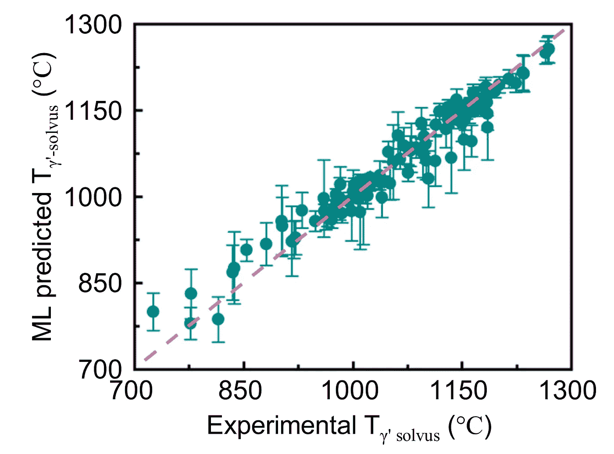
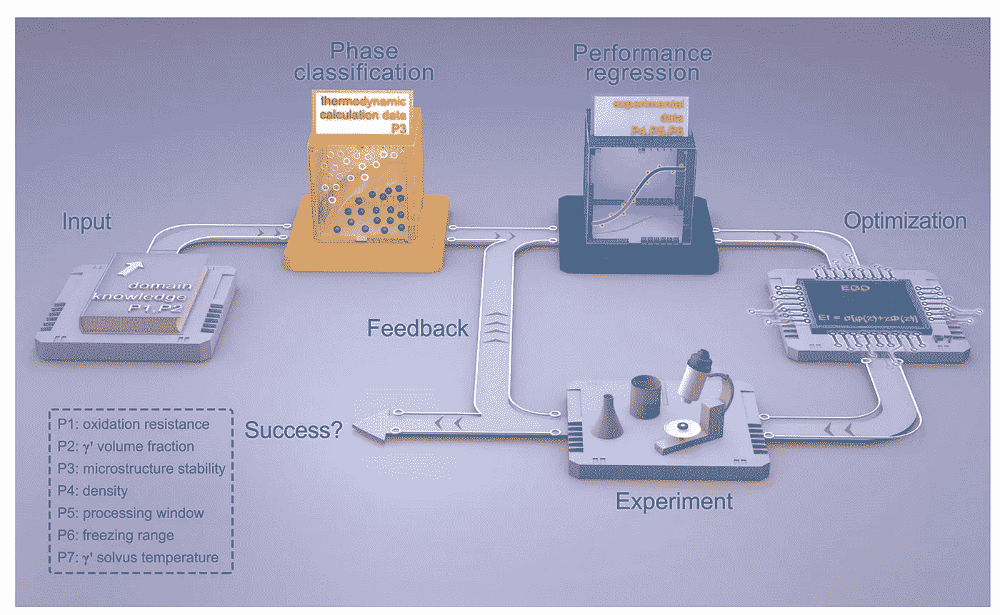
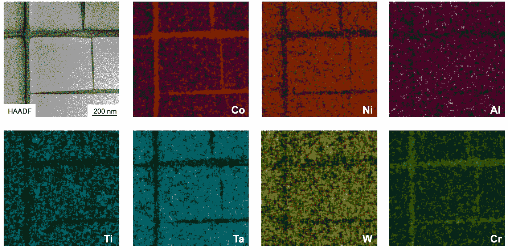

# ML 的一小步…

> 原文：<https://towardsdatascience.com/one-small-step-for-ml-b5f4fca7cb4b?source=collection_archive---------45----------------------->

## ML 能帮助我们发现飞船的新材料吗？

*我通过总结激动人心的新研究论文来探索人工智能对传统科学的影响。在这篇文章中，我正在讨论另一篇很酷的新论文:“多性能优化的γ′强化钴基高温合金的机器学习辅助设计”(*[*)npj computu。脱线。，6，62，2020*](https://www.nature.com/articles/s41524-020-0334-5) *)。*

**1|我们如何发现新材料？**

想象一下，你是一名航空工程师，正试图为火箭设计一个新的发动机。你想用什么材料？为了经受住像巨型火箭发动机那样恶劣的条件，材料必须具有非常特殊的性质；一个真正高熔点，低密度和化学稳定性，仅举几例。当你进入细节时，几乎没有任何已知的材料实际上足够好，这就是为什么我们真的需要开发新的材料。

SpaceX 猎鹰重型发射，航空航天工程的惊人范例。图片来自[Unspalsh.com](https://unsplash.com)

合金真的很有趣；它们是多种不同金属的原子混合在一起的材料。改变所用的金属及其在成分中的比例可以改变合金的物理和化学性质。超级合金是一种合金，即使在接近其熔点的高温下(想想 1000 C 以上)也具有难以置信的强度！).它们是这些航空航天应用的绝佳候选材料，但开发最佳高温合金实际上非常困难。

你如何为你的合金选择最好的金属；铝、钴、钛、铁、铬、钼或钨……有这么多可供选择！更复杂的是，提高合金一种性能的元素会破坏另一种性能。这种同时进行多种性能优化的平衡行为使得新合金的开发如此具有挑战性和趣味性。这就像一个拼图游戏，其中的碎片一直在移动。传统上，这是通过实验室研究的常规“试错法”来完成的——尝试制造一些全新的东西，然后测试它的性能，看看它有多好。这种标准的研究方法是如此的低效和昂贵；这可能需要几个月的时间(或者如果你不走运，甚至几年！)在你甚至不确定新材料是否具有你真正想要的特性时，找出制造新材料的方法。对新材料的测试既昂贵又耗时，而且毕竟你可能不得不重新开始整个过程，因为你制作的材料并不像你希望的那样。一定有更好的办法！

实验性的实验室工作，既昂贵又危险，而且耗时。图片来自[Unsplash.com](https://unsplash.com)

**2|也许机器学习能有所帮助？**

如果我们不必浪费时间在试错上呢？如果我们可以使用 ML 来预测元素的组合，从一开始就给出最佳的超级合金，会怎么样？这种加速的研究方法可能会彻底改变材料科学，推动科学发现以前所未有的速度向前发展。这是刘培和他的同事在他们最近的论文[“多性能优化的γ′强化钴基高温合金的机器学习辅助设计”](https://www.nature.com/articles/s41524-020-0334-5)中探索的想法。他们想有效地开发一种新的钴基高温合金，该合金具有用于航空航天应用的优化性能。让我们来看看他们做了什么！

**3|理想的高温合金应该是什么样的？**

基于以前的超级合金，选择钴、铝、钨、镍、钛、钽和铬的化学混合物，其中合金中每种元素的百分比是要改变的变量。由于对每种元素的最小值和最大值有一些限制，总共有 210，792 种可能的高温合金可供选择。你可以明白为什么没有 ML 会很难！

α-铁金属结构的结构，这是用于制造新型高温合金的元素之一。图片来自[Unsplash.com](https://unsplash.com)

作者有很多物理性质，他们希望他们的最佳高温合金满足，并通过计算从如此多的选择中识别它，他们首先必须设置数值目标。首先要知道的是合金可以有不同的相。相位是相同原子的不同排列。这些排列可以导致同一合金的不同相具有不同的性质，即不同的熔化温度、不同的强度等。这使得事情更加复杂；除了元素原子的排列方式，你还必须控制合金中的元素。

合金材料的一个样品可以具有彼此相邻的不同相的区域，并且这些相的相对量影响材料的整体性能。γ和γ′是指合金的两种不同相，其中γ′是较强的相。作者希望这种强相构成他们优化材料的大部分(60%)。

γ′固溶线温度非常重要——这听起来很复杂，但实际上是强γ′转化为弱γ的温度。由于作者想要避免这种转变，他们正在寻找具有真正高固溶线温度的材料——超过 1250 C！

他们还希望各相之间有较宽的温度窗口(以使加工更容易)，耐化学反应(氧化)和低密度材料(≤ 8.7 克/厘米 3)——好的合金必须很轻，这样才不会加重飞机的重量。

**4|用 ML 加速研究**

显然，要从 210，792 种候选合金中正确地找到具有所有这些特性的材料需要做大量的工作。为了帮助应对这一挑战，这个过程被分成几个阶段。

**一.顺序滤波器**

首先，一系列的过滤器被应用到选择中，尽可能快速地删除不可行的选项。作者运用自己的文献知识删减了不合理的合金成分。然后，他们使用热力学数据库来计算预测合金的相，并确定有希望的γ和γ’混合物的候选物。

他们还将不同的回归模型应用于已知合金的物理属性，以预测新材料的密度和相变温度。尝试了六种不同的模型([支持向量机](/support-vector-machine-introduction-to-machine-learning-algorithms-934a444fca47)、 [Ada Boost](https://medium.com/machine-learning-101/https-medium-com-savanpatel-chapter-6-adaboost-classifier-b945f330af06) 、 [KNN](/machine-learning-basics-with-the-k-nearest-neighbors-algorithm-6a6e71d01761) 、[决策树](/decision-trees-in-machine-learning-641b9c4e8052)、[随机森林](/understanding-random-forest-58381e0602d2)和[梯度树提升](/understanding-gradient-boosting-machines-9be756fe76ab)(点击每一个查看背景)，但是梯度树提升给出了最好的结果！下图显示了已知合金的真实密度与回归模型预测的密度之间的相关性。仅仅使用这些简单的回归技术就能准确预测复杂合金材料的实验性能，这真是令人惊讶。这允许不太可能满足目标的候选材料被拒绝。尽管经过如此广泛的筛选，他们仍然有 6000 多份候选材料！

显示真实γ′固溶线温度和梯度树推进回归模型预测值之间相关性的图表。在[知识共享许可](https://creativecommons.org/licenses/by/4.0/)下，经[原始论文](https://www.nature.com/articles/s41524-020-0334-5)许可复制。

**二世。高效全局优化算法(EGO)**

接下来，他们使用一个 [EGO](https://users.mai.liu.se/nilqu94/publications/report_OSEGO.pdf) 来寻找具有最佳γ′固溶线温度的合金，因为这是最重要的属性。优化问题可能需要计算非常复杂的函数，这非常慢并且计算量很大。基于元模型的优化算法真的可以帮助解决这个问题，EGOs 是最受欢迎的。他们的工作方式是仅从点的样本中创建代理模型，然后逼近函数。这用于通过计算预期改善(EI)来自适应地采样新点，并通过添加具有最高 EI 的点来更新模型。重复这一过程，直到达到比传统优化技术更有效的最优值。

这是非常酷的，因为即使这些简单和众所周知的 ML 技术也可以在这个领域得到一些非常好的结果！

**三。实验验证和反馈**

EGO 仅用于推荐四种具有高γ′固溶线的合金，然后对其进行实验制造和测试，以了解它们的实际物理性质。然后将这些结果反馈到数据集中，并再次重复该过程，直到在实验中找到与他们期望的目标相匹配的材料。

图片显示了用于识别新型高温合金的研究途径。在[知识共享许可](https://creativecommons.org/licenses/by/4.0/)下，经[原文](https://www.nature.com/articles/s41524-020-0334-5)许可复制。

**4|结果**

这听起来工作量很大，但迭代过程只需重复三次，就能找到一些真正令人兴奋的高温合金。**这意味着从 210，792 种未知合金中，使用 ML 技术可以同时优化多种性能，因此只需制造 12 种材料。与正常的实验工作相比，这种效率令人难以置信，而且确实减少了昂贵的实验时间！**

他们发现的性能最好的合金是钴-镍(36%)-铝(12%)-钛(2%)-钽(4%)-钨(1%)-铬(2%)。这种材料真的很棒，其成分中高达 74.5%是强合金相(他们的目标是至少 60%)，固溶线温度高达 1267 C。这一结果甚至超过了一些基准合金。考虑到它的重量也很轻，密度只有 8.68 克/立方厘米，这是一个全面的超级合金。

STEM 研究了这种最好的材料(在[上周的论文中讨论过！](/atomic-scale-deep-learning-34238feda632))显示不同金属原子在合金中的位置。如果你看下面的图片，你甚至可以看到不同的合金相(正方形区域是γ′相，中间的位是γ),不同的合金成分分布在各处。

优化高温合金的 STEM 图像。左上是主干图像，其余的彩色图像显示了不同元素的分布。根据[知识共享许可，经](https://creativecommons.org/licenses/by/4.0/)[原创论文](https://www.nature.com/articles/s41524-020-0334-5)许可改编。

**5|对结果的一些想法**

1.  虽然这项研究的结果很有希望，但合金的稳定性(抗氧化性)还可以更好一些。由于 EGO/experimental 循环仅执行了 3 次迭代，因此有可能通过更多次迭代来改进。
2.  在我们知道这种材料是否适用于工业用途之前，还需要测试其他物理特性，但这仍然是一个很好的开始。

总的来说，这篇论文是 ML 加速传统科学研究能力的一个很好的例子，如果你想了解更多细节，我鼓励你完整阅读这篇论文。但这还不止于此……这种 ML/实验相结合的方法正被用于加速许多领域的研究，如[新药开发](https://www.nature.com/articles/s41587-020-0521-4)和[识别新超导体](https://www.nature.com/articles/s41524-018-0085-8)。随着人工智能的不断进步，它的潜力在传统科学中得到认可，我确信我们将会从这种交叉中看到更多令人兴奋的结果。