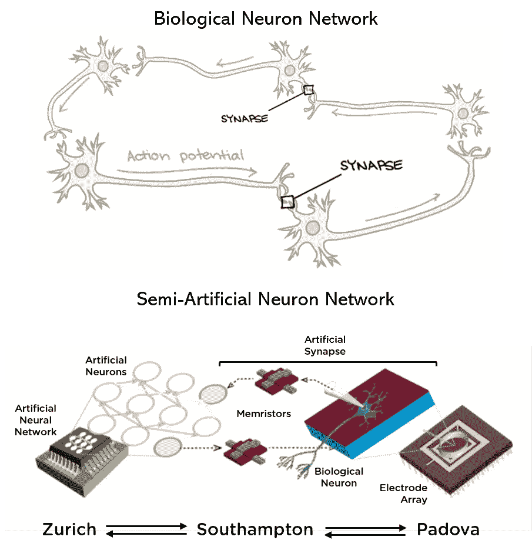
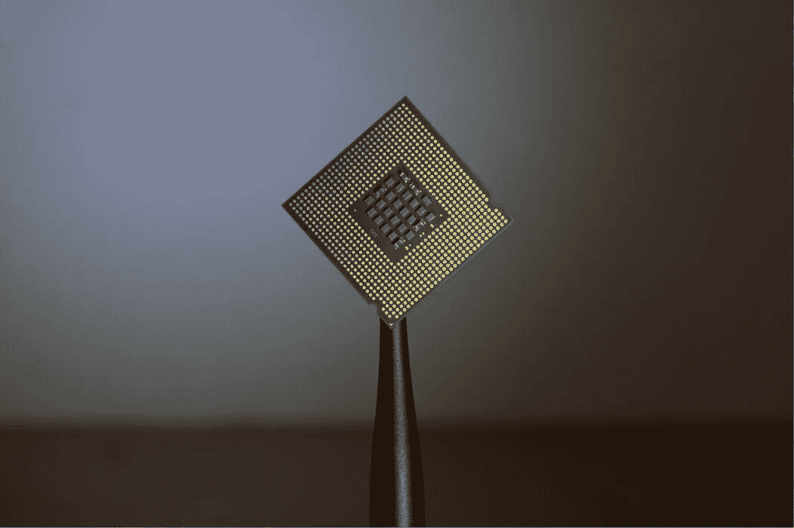

# 离 Neuralink 更近一步？通过互联网成功连接生物和人工神经元

> 原文：<https://towardsdatascience.com/one-step-closer-to-neuralink-95af55a0d852?source=collection_archive---------39----------------------->

## 英国、意大利和瑞士的研究人员创建了一个网络，能够利用互联网将信号从生物神经元传输到人工神经元，这可能会朝着埃隆马斯克(Elon Musk)的 Neuralink 等想法取得重大进展。

约书亚·索蒂诺在 [Unsplash](https://unsplash.com/) 上拍摄的照片

南安普顿大学(University of Southampton)本周发表的一项研究表明，培养自大鼠的生物神经元可以通过物理突触样元件将信息传递给人工神经元，反之亦然。研究的所有三个要素；人工神经元、生物神经元和突触组件位于世界各地的不同位置，通过网络连接在一起。

近年来，世界各地都在努力推进神经电子连接技术，这将在我们的大脑和互联网之间建立联系。这种系统可能会让我们的大脑与数据实时互动，就像我们与自己的知识、思想和记忆互动一样。

埃隆·马斯克的公司 Neuralink 投入巨资开发了这一概念，提出在大脑中植入一个微型设备，将我们直接连接到互联网。

# 生物

在自然界中，大脑通过一个巨大的神经元网络发挥作用，这些神经元通过电信号向其他神经元发送信息，这些电信号分别被称为“动作电位”。这种信号在神经元之间传递的空间被称为突触。

神经元只能向一个方向发送信息。一个信号将通过一个神经元，到达它的输出端。信息穿过突触，刺激其接收端的下一个神经元，以此类推。

图改编自[可汗学院](/www.khanacademy.org)和原始研究论文(塞尔维亚，a .，索蕾娜，a .，乔治，R. *等*忆阻突触连接大脑和硅尖峰神经元。 *Sci Rep* **10，** 2590 (2020)。[https://doi.org/10.1038/s41598-020-58831-9](https://doi.org/10.1038/s41598-020-58831-9)

# 硅

这项研究由三个相互作用的部分组成。苏黎世大学和苏黎世联邦理工学院培养了老鼠的生物神经元，并将其组织到电极阵列上。通过完善的实验室技术，可以发送来自这些神经元的电信号，并接收捕获的信号。

人造神经元是由意大利帕多瓦大学开发的，并被安装在硅微芯片上。很像生物神经元，它们能够发送和接收可以读取和测量的信号。

Brian Kostiuk 在 [Unsplash](https://unsplash.com/) 上拍摄的照片

在南安普顿大学，科学家们使用忆阻器(一种能够传递电荷的微小电路元件)来创建物理设备，这些设备可以将信息从生物神经元传输到人工神经元，反之亦然。由此产生的人工突触被称为 ***突触*** 。

由于神经元之间输入和输出的差异，创建了两个独立的突触来完成电路，一个代表*脑-硅*，一个代表*硅-脑*。

两个突触器中使用的尖端纳米技术的细微差异导致了单向电路。从这个意义上来说，该系统模仿大脑，信息只能以一个方向通过各自的系统。

该团队能够利用互联网成功地将电子信号传递到研究的所有部分。这是第一次人工和生物成分在不同的地方以这种方式联系在一起。

这些结果在神经界面研究领域意义重大，很可能会影响许多其他领域的研究。这项工作背后的科学家指出，他们希望这可能是神经电子学互联网的开始(由[科学日报](https://www.sciencedaily.com/releases/2020/02/200226110843.htm)报道)。

*原始研究文章可在*[https://www.nature.com/articles/s41598-020-58831-9](https://www.nature.com/articles/s41598-020-58831-9)找到

*注:可汗学院所有内容均可在(*[*www.khanacademy.org*](/www.khanacademy.org)*)——*[*https://khanacademy . zendesk . com/HC/en-us/articles/202262954-Can-I-use-Khan-Academy-s-videos-name-materials-links-in-my-project-*](https://khanacademy.zendesk.com/hc/en-us/articles/202262954-Can-I-use-Khan-Academy-s-videos-name-materials-links-in-my-project-)

*研究论文获得知识共享署名 4.0 国际许可，该许可允许以任何媒体或格式使用、共享、改编、分发和复制*[*【http://creativecommons.org/licenses/by/4.0/】*](http://creativecommons.org/licenses/by/4.0/)