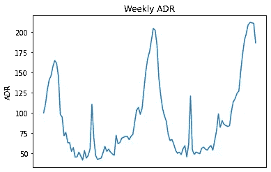
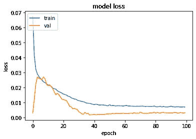
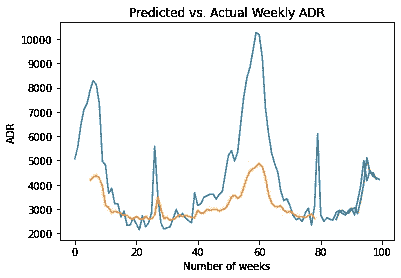
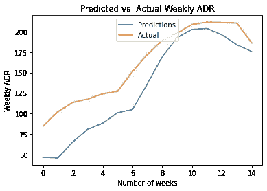

# LSTM 一步预测法:预测酒店收入

> 原文：<https://towardsdatascience.com/one-step-predictions-with-lstm-forecasting-hotel-revenues-c9ef0d3ef2df?source=collection_archive---------15----------------------->

## 使用 LSTM 生成单步预测


来源:图片来自 [Pixabay](https://pixabay.com/photos/bedroom-hotel-room-white-bedding-1285156/) 的 [Pexels](https://pixabay.com/users/Pexels-2286921/)

*注意:这是对我之前的文章* [*的更新，预测使用 LSTM*](/forecasting-average-daily-rate-trends-for-hotels-using-lstm-93a31e01190a) *的酒店的平均每日价格趋势。此后，我意识到了最初分析中的几个技术错误，并决定写一篇新文章来解决这些问题，并扩展我之前的分析。*

# 背景

在这种情况下，使用 LSTM 模型的目的是预测酒店的平均每日房价。

ADR 计算如下:

```
ADR = Revenue ÷ sold rooms
```

在本例中，计算了客户每周的平均 ADR，并将其公式化为时间序列。然后，LSTM 模型用于逐周预测这一指标。

Antonio、Almeida 和 Nunes (2019)的原始研究可在[此处](https://www.sciencedirect.com/science/article/pii/S2352340918315191)找到。

使用熊猫，每周计算平均 ADR。以下是每周 ADR 趋势图。



来源:Jupyter 笔记本输出

注意，本例中的 Jupyter 笔记本可以在本文末尾找到。

# 数据准备

## 1.用 MinMaxScaler 归一化数据

与任何神经网络一样，数据需要进行缩放，以便网络进行正确的解释，这一过程称为标准化。**最小最大缩放器**用于此目的。

然而，这伴随着一个警告。在数据被分成训练集、验证集和测试集之后，必须进行**缩放，每个数据集都被单独缩放。第一次使用 LSTM 时的一个常见错误(这是我自己犯的错误)是在分割数据之前先对数据进行归一化。**

这是错误的，因为归一化技术将使用来自验证和测试集的数据作为整体缩放数据时的参考点。这将无意中影响训练数据的值，本质上导致验证和测试集的数据泄漏。

在这方面，100 个数据点被分成训练集和验证集，最后 15 个数据点作为测试数据，用于与 LSTM 预测进行比较。

```
train_size = int(len(df) * 0.8)
val_size = len(df) - train_size
train, val = df[0:train_size,:], df[train_size:len(df),:]
```

形成数据集矩阵:

```
def create_dataset(df, previous=1):
    dataX, dataY = [], []
    for i in range(len(df)-previous-1):
        a = df[i:(i+previous), 0]
        dataX.append(a)
        dataY.append(df[i + previous, 0])
    return np.array(dataX), np.array(dataY)
```

此时，训练数据可以按如下方式缩放:

```
scaler = MinMaxScaler(feature_range=(0, 1))
train = scaler.fit_transform(train)
train
```

以下是输出示例:

```
array([[0.35915778],
       [0.42256282],
       [0.53159902],
...
       [0.0236608 ],
       [0.11987636],
       [0.48651694]])
```

同样，验证数据也以同样的方式进行缩放:

```
val = scaler.fit_transform(val)
val
```

## 2.定义回顾期

“回顾周期”定义了使用多少个先前的时间步长来预测随后的时间步长。对此，我们采用的是**一步预测**模型。

在这种情况下，回看周期被设置为 **5** 。这意味着我们使用 *t-4、t-3、t-2、t-1、*和 *t* 的时间步长来预测时间 *t+1* 的值。

```
# Lookback period
lookback = 5
X_train, Y_train = create_dataset(train, lookback)
X_val, Y_val = create_dataset(val, lookback)
```

注意回望周期的选择是一个相当随意的过程。在这种情况下，显示了 5 的回看窗口，以展示在测试集上的最佳预测性能。然而，另一种选择是使用 PACF 指示的滞后数量来设置回看窗口的大小，如[数据科学堆栈交换](https://datascience.stackexchange.com/questions/38692/lstm-for-time-series-which-window-size-to-use)所述。

让我们来看看 **X_train** 的归一化窗口。

```
array([[0.35915778, 0.42256282, 0.53159902, 0.6084246 , 0.63902841],
       [0.42256282, 0.53159902, 0.6084246 , 0.63902841, 0.70858066],
       [0.53159902, 0.6084246 , 0.63902841, 0.70858066, 0.75574219],
...
```

以下是前三个条目。我们可以看到，紧接在我们试图预测的一个时间步骤之前的五个时间步骤以步进运动的方式移动。

例如，第一个条目在时间 *t* 显示 0.63902841。在第二个条目中，该值现在向后移动到时间 *t-1* 。

让我们举一个适用于这种情况的例子。例如，对于希望预测第 26 周的 ADR 值的酒店，酒店将使用该模型，使用第 21、22、23、24 和 25 周的数据来进行前一周的预测。

现在，输入被整形为**【样本、时间步长、特征】**格式。

```
# reshape input to be [samples, time steps, features]
X_train = np.reshape(X_train, (X_train.shape[0], 1, X_train.shape[1]))
X_val = np.reshape(X_val, (X_val.shape[0], 1, X_val.shape[1]))
```

在这种情况下，输入的形状是**【74，1，1】**。

在训练数据中存在 74 个样本，模型在 1 的时间步长上运行，并且在模型中使用 1 个特征，即时间序列的滞后版本。

# LSTM 模型

LSTM 模型定义如下:

```
# Generate LSTM network
model = tf.keras.Sequential()
model.add(LSTM(4, input_shape=(1, lookback)))
model.add(Dense(1))
model.compile(loss='mean_squared_error', optimizer='adam')
history=model.fit(X_train, Y_train, validation_split=0.2, epochs=100, batch_size=1, verbose=2)
```

用 4 个神经元创建 LSTM 模型。考虑到我们正在处理一个回归问题，均方误差被用作损失函数。此外，还使用了 adam 优化器，进行了 100 多个时期的训练，验证比例为 20%。

以下是培训和验证损失的直观概述:

```
# list all data in history
print(history.history.keys())
# summarize history for accuracy
plt.plot(history.history['loss'])
plt.plot(history.history['val_loss'])
plt.title('model loss')
plt.ylabel('loss')
plt.xlabel('epoch')
plt.legend(['train', 'val'], loc='upper left')
plt.show()
```



我们可以看到，在验证损失的初始增加之后，损失在大约 10 个时期之后开始减少。

现在，预测被转换回原始比例:

```
# Convert predictions back to normal values
trainpred = scaler.inverse_transform(trainpred)
Y_train = scaler.inverse_transform([Y_train])
valpred = scaler.inverse_transform(valpred)
Y_val = scaler.inverse_transform([Y_val])
predictions = valpred
```

在训练和验证集上计算均方根误差:

```
# calculate RMSE
trainScore = math.sqrt(mean_squared_error(Y_train[0], trainpred[:,0]))
print('Train Score: %.2f RMSE' % (trainScore))
valScore = math.sqrt(mean_squared_error(Y_val[0], valpred[:,0]))
print('Validation Score: %.2f RMSE' % (valScore))
```

获得的 RMSE 值如下:

*   **列车误差:** 3.88 RMSE
*   **验证错误:** 8.78 RMSE

整个验证集的平均 ADR 值为 69.99，相比之下，验证误差非常小(约为平均值的 12%)，这表明该模型在预测 ADR 值方面做得很好。

这是一个跨训练和验证集的预测与实际 ADR 值的图表。

```
# Plot all predictions
inversetransform, =plt.plot(scaler.inverse_transform(df))
trainpred, =plt.plot(scaler.inverse_transform(trainpredPlot))
valpred, =plt.plot(scaler.inverse_transform(valpredPlot))
plt.xlabel('Number of weeks')
plt.ylabel('Cancellations')
plt.title("Predicted vs. Actual Weekly ADR")
plt.show()
```



来源:Jupyter 笔记本输出

我们可以看到，LSTM 模型通常捕捉时间序列的方向振荡。然而，在 ADR 的极端峰值期间，例如第 60 周，该模型的表现似乎不太好。

但是，为了完全确定模型是否具有预测能力，现在将使用它来预测系列中的最后 15 个时间步长，即测试数据。

```
Xnew = np.array([tseries.iloc[95:100],tseries.iloc[96:101],tseries.iloc[97:102],tseries.iloc[98:103],tseries.iloc[99:104],tseries.iloc[100:105],tseries.iloc[101:106],tseries.iloc[102:107],tseries.iloc[103:108],tseries.iloc[104:109],tseries.iloc[105:110],tseries.iloc[106:111],tseries.iloc[107:112],tseries.iloc[108:113],tseries.iloc[109:114]])
```

在这个例子中，Xnew 使用前面的五个时间步长在时间 *t+1* 进行预测。例如，第 95 至 100 周用于预测第 101 周的 ADR 值，然后第 96 至 101 周用于预测第 102 周，依此类推。



来源:Jupyter 笔记本输出

上图显示了 LSTM 预测值与测试集(系列中的最后 15 个点)中的实际 ADR 值。

获得的 RMSE 和 MAE(平均绝对误差)值如下:

*   **梅:** -27.65
*   **RMSE:** 31.91

测试集的 RMSE 误差明显高于验证集的误差——这是意料之中的，因为我们正在处理看不见的数据。

然而，在测试集上的平均 ADR 值为 **160** 的情况下，RMSE 误差约为平均值大小的 20%,表明 LSTM 在确定下一时间步的值时仍然具有相当强的预测能力。

理想情况下，人们希望使用大得多的数据样本来验证 LSTM 是否能保持对新数据的预测能力。此外，如这个 [Reddit 线程](https://www.reddit.com/r/datascience/comments/79hjzn/how_good_is_lstm_for_time_series_forecasting/)所示，LSTMs 可能会根据数据样本的大小而过度拟合。

在这方面，需要更大的数据样本来验证该模型在现实世界中是否可行。然而，这个案例的初步结果看起来很有希望。

# 结论

在本例中，您看到了:

*   如何正确设置数据格式以使用 LSTM 模型
*   一步 LSTM 预测模型的建立
*   解释 RMSE 和梅值，以确定模型的准确性

非常感谢您的阅读，非常感谢您的任何反馈或问题。你可以在这里找到这个例子[的 Jupyter 笔记本。](https://github.com/MGCodesandStats/hotel-cancellations)

此外，我还强烈推荐 Machine Learning Mastery 的本[教程，它被用作设计本例中使用的 LSTM 模型的指南。](https://machinelearningmastery.com/time-series-prediction-lstm-recurrent-neural-networks-python-keras/)

*免责声明:本文是在“原样”的基础上编写的，没有任何担保。本文旨在提供数据科学概念的概述，不应以任何方式解释为专业建议。作者与本文提及的任何第三方无任何关系。*