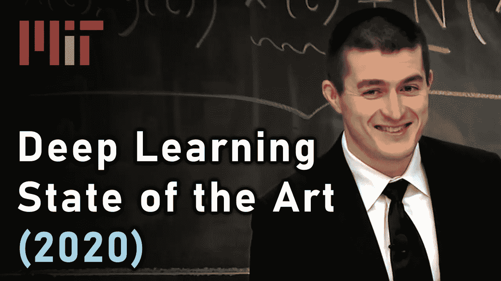
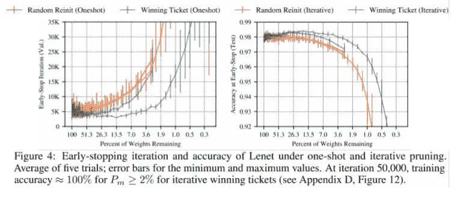
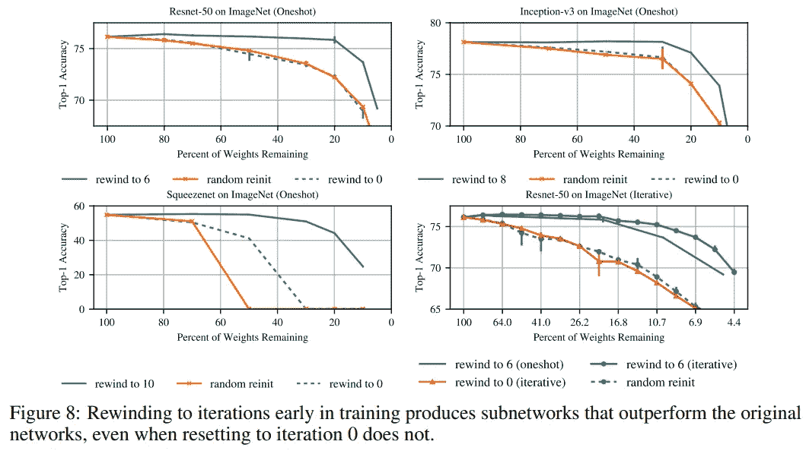
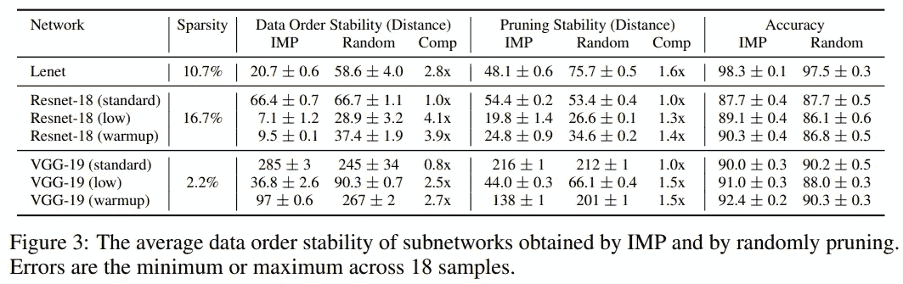
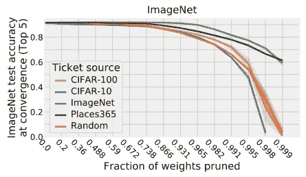

# 一年的彩票研究(浅述)

> 原文：<https://towardsdatascience.com/one-year-of-lottery-ticket-research-a-light-overview-b4d53d430887?source=collection_archive---------32----------------------->

## 获奖门票于 2018 年 3 月被发现，并于同年在 ICRL 颁奖。它引起了很多关注。它揭示了神经网络未知的潜在属性，似乎是更快训练和更小模型的关键之一。我们如何处理神经网络体系结构设计的总体思路？



没错，这就是莱克斯·弗里德曼(Lex Fridman)，他与彩票的研究无关(除了在他的牛逼讲座系列中提到它是 2020 年深度学习的主要研究领域之一)。但是他比任何股票图片更能引起标题中的任何关键词([来源](https://www.youtube.com/watch?v=0VH1Lim8gL8&feature=youtu.be&t=2761))。

Lex Fridman 在他的[深度学习艺术状态 2020](https://youtu.be/0VH1Lim8gL8?t=2761) 讲座中提到，深度学习的获奖门票是 2019 年最重要的话题之一。这篇文章旨在总结我阅读后的理解。希望你会喜欢它。

# 修剪

众所周知，DL 模型通常具有繁重的计算要求，并且在特定设置中可能会阻塞。例如，ResNet 一次推理需要 5000 万次运算。他们一直在努力用[量化](https://pytorch.org/docs/stable/quantization.html)、[知识提炼](/what-is-knowledge-distillation-41bb77a3c6d8)和[修剪](https://github.com/he-y/Awesome-Pruning)来减少参数的数量。

修剪移除最不重要的*权重或通道。最不重要可以意味着具有最小量级或其他启发的一个。这种技术运行良好，可以减少网络中高达 90%的权重，同时保持大部分原始精度。虽然修剪可以帮助减少模型的大小，但它无助于更快地训练它。一般是后处理步骤，训练之后。重新训练一个修剪过的模型不会产生和训练后修剪一样的结果。如果有可能直接训练修剪过的模型，在不牺牲性能的情况下训练得更快。*

但是在他们的论文[中，Jonathan Frankle](https://arxiv.org/search/cs?searchtype=author&query=Frankle%2C+J) ， [Michael Carbin](https://arxiv.org/search/cs?searchtype=author&query=Carbin%2C+M) 通过实验发现，我们可以先训练较小的网络，而不是训练大型网络，然后缩小它们的规模:

> *密集的、随机初始化的前馈网络包含子网(“优胜门票”)，当被隔离训练时，在相似的迭代次数下，达到与原始网络相当的测试精度。*

# 中奖彩票

为了找到中奖的门票，初始化似乎是关键:

> *当它们的参数被随机重新初始化[…]时，我们的中奖彩票不再与原始网络的性能相匹配，这证明这些较小的网络不能有效地训练，除非它们被适当地初始化。*

他们发现，在用原始模型的参数重新初始化权重后，我们可以再次训练一个修剪过的模型。这给出了比随机重新初始化更好的系统结果。多次执行此过程称为迭代修剪(无需重新初始化):

```
1\. Randomly initialize a neural network [with weights θ0] 
2\. Train the network for j iterations, arriving at parameters θj 
3\. Prune [by magnitude] p% of the parameters in θj , creating a mask m 
4\. Reset the remaining parameters to their values in θ0 
5\. Goto 2
```

如果由这种技术产生的子网与原始网络的性能相匹配，它就被称为一张中奖票。下图显示了 MNIST 数据集上 LeNet(全密度)网络上五次运行的平均结果。这种模式以不同的方式进行了删减:

*   [蓝色]完成上面的食谱
*   [橙色]与蓝色相同，但将步骤 4 替换为“随机初始化其余参数”
*   [红色]与没有步骤 5 的橙色线相同
*   [绿色]与蓝色相同，但没有步骤 5



我们可以看到，步骤 4 是关键，因为绿线和蓝线始终表现更好，并且比随机重新初始化的网络训练得更快。他们还在 MNIST 和 CIFAR10 上发现了类似于 VGG 和 ResNet 这样的卷积网络的结果(在[原始论文](https://arxiv.org/abs/1803.03635)中有*许多*更多细节)。

# 提早修剪

但是上面的方法似乎很难对付更深层次的网络。在[后续论文](https://arxiv.org/abs/1903.01611)(2019 年 3 月)中，作者稍微改变了其余参数的重置方式(步骤 4):

> *我们将中奖彩票的权重设置为少量训练迭代后获得的权重，而不是将其设置为初始初始化值(*后期重置*)。使用后期重置，我们在 Imagenet 上确定了 Resnet-50 的第一张中奖彩票。*

下图描绘了深度模型的不同稀疏度水平下的性能，使用不同的值进行重绕(重绕权重的迭代)。我们可以看到，在迭代 0 时重绕并不比原始网络执行得更好，而在更高迭代时重绕则可以:



那些更深入的模型正在抵制上面的获胜秘诀，但是在查看了它们的稳定性之后发现了一些有趣的事情:

*   *修剪的稳定性*:“单独训练的子网络的权重和在更大的网络中训练的相同子网络的权重之间的距离”。它捕捉到了“一个子网在孤立状态下训练并仍能到达与更大网络相同的目的地的能力”。如果一个神经元是稳定的，它就不会受到它的邻居通过掩蔽消失的太大影响。
*   *对数据顺序的稳定性*:“用不同数据顺序训练的子网的两个副本的权重之间的距离”。它捕捉到了“尽管 SGD 存在梯度噪声，子网仍能一致到达同一目的地的内在能力”。

下表显示了不同网络的稳定性。*预热*意味着学习率在训练过程中计划缓慢增加，可能会降低优化器的噪音。 *IMP* 是生成中奖票的原始配方:



我们可以看到，在不改变学习率的情况下，IMP 无法在更深的网络中找到获胜的门票。我们还可以看到，性能和稳定性指标之间存在联系。“中奖票比随机子网更稳定”。

# 其他领域呢？

到目前为止，中奖彩票已经在相同的数据集和计算机视觉任务上进行了测试。有人可能会问，这是否仅仅是严重的过度匹配，或者中奖彩票是否会发生转移。

脸书[发表了一篇论文](https://arxiv.org/abs/1906.02773)(2019 年 6 月)，在六个视觉数据集上测试了获奖门票的评估和转移。例如，在 ImageNet 上测试生成中奖票，并在其他地方进行测试(如 CIFAR-100):



他们观察到，中奖彩票在所有数据集上的表现都(至少)接近原始彩票。而且，在较大数据集上生成的中奖彩票比其他彩票更通用，这可能是由于原始模型中的类别数量。最后，本文还成功测试了跨不同优化器的迁移。

图像分类以外的其他任务呢？脸书[同时发表了一篇论文](https://arxiv.org/abs/1906.02768)(2019 年 6 月)，该论文测试了强化学习和 NLP 任务中的优胜券。

> *对于 NLP，我们发现，对于在语言建模上训练的递归 LSTM 模型和在机器翻译上训练的 Transformer 模型，获胜的票证初始化都优于随机票证。[……]对于 RL，我们发现，在经典控制问题上，以及对于许多(但不是全部)Atari 游戏，赢票初始化大大优于随机票。*

# TLDR

*   许多神经网络是过度参数化的
*   弗兰克尔&卡宾发现了一种简单的算法，可以在较大的网络中找到较小的网络
*   这些子网络是可以从头开始训练的，至少可以表现得一样好，甚至更好
*   是什么让中奖彩票如此特别还不清楚，但这似乎是深入理解神经网络潜在属性的关键一步

# 来源

*   [彩票假说:寻找稀疏、可训练的神经网络](https://arxiv.org/abs/1803.03635)
*   [稳定彩票假说](https://arxiv.org/abs/1903.01611)
*   [一票赢天下:跨数据集和优化器推广彩票初始化](https://arxiv.org/abs/1906.02773)
*   [用奖励和多种语言玩彩票:RL 和 NLP 的彩票](https://arxiv.org/abs/1906.02768)

*最初发表于*[data-soup.github.io/blog/](https://data-soup.github.io/blog/)