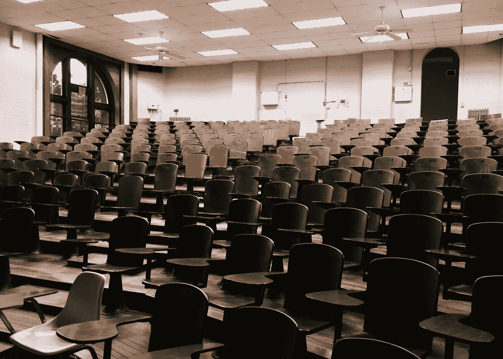

# 在线课程、自动化教育和数字化学位

> 原文：<https://towardsdatascience.com/online-courses-automating-education-and-digitalizing-degrees-at-uc-berkeley-cs-b45dfdd8bcb0?source=collection_archive---------38----------------------->

## 加州大学伯克利分校计算机科学教学的启示。

我们要去哪里。照片由[像素](https://www.pexels.com/photo/auditorium-chairs-classroom-college-356065/?utm_content=attributionCopyText&utm_medium=referral&utm_source=pexels)的[皮克斯拜](https://www.pexels.com/@pixabay?utm_content=attributionCopyText&utm_medium=referral&utm_source=pexels)拍摄

一些学校会冒险，一些会领先，一些会保持现状，一些会失败。教学正在转向数字领域，所以我们将会看到更多的数字效果——而我们的机构并不是围绕它而设计的。 [*这是我免费星期五写的关于机器人学& AI 的文章节选，请看*](https://robotic.substack.com/) *。*

想想加州大学伯克利分校夏季人工智能导论 [CS 188](https://inst.eecs.berkeley.edu/~cs188/su20/) 的**出席情况。我们提供一堂有广泛讨论时间的课，以鼓励世界各地的学生参与，并录制所有的讲座和讨论材料。**

*   入学人数:约 190 人
*   按天计算的听课人数:120，95，87，75，56，…
*   讨论出席率反映了这个数字的总和(低参与度和运行理论是，去听讲座的人去讨论，而不是一半一半)。

60%的学生在干什么？他们只是在看录像吗？作为参考，当我去年春天给 800 名注册者(在 Zoom 上)讲授这门课程时，100 人观看了直播，而录像很少达到 250 次观看。450/800 的学生在决赛前都没见过。这是在我们的学生遍布全球之前，作为一名员工，我们对此一无所知，这是一个教育机构的困境。这就引出了**重大问题**:

*   大多数学生在做什么？
*   学生们是否选择将此作为在线课程，他们是否有时间承诺冲突或时区冲突？
*   大学是否应该在全球课程中适应每个学生的时间偏好？

我想谈三个主题:

1.  网络课程中的行为，
2.  这些课程如何倾向于自动化教育，
3.  以及数字学位的含义。

# 行为和在线课程:

在线课程对学生来说是一个未知领域。这是一种趋势的融合，即课程中的社区减少，而学生个人的数字参与增加。学生通过有机会参与来学习和感受价值。[一篇总结敬业度研究趋势的博客文章切中要害](https://www.nwea.org/blog/2015/research-proof-points-better-student-engagement-improves-student-learning/)(查看它引用的研究):

> *研究历史表明，学生参与度(通常定义为对重点领域的关注、对学习的积极参与以及在任务上的时间)与学生成绩之间有很强的相关性。这些相关性在所有层次的教学、所有学科领域以及各种教学活动中都很强。*

这是我们无意中争论的问题。当前的大学是为面对面交流而构建的(除了巨大的演讲厅)，但这在向在线课程的过渡中没有任何分量。 查看更多关于课堂反应和[辍学率](https://www.researchgate.net/publication/227627311_Adolescent_Behavioral_Affective_and_Cognitive_Engagement_in_School_Relationship_to_Dropout)方面的[参与度和学习之间的联系。](https://www.sciencedirect.com/science/article/abs/pii/S0360131512002473)

([线上课程大概可以借鉴直播流，比如 3blue1brown](https://www.3blue1brown.com/blog/livestream-setup) )。

## 缩放室气氛

毫无疑问，学生通过聊天室提问比面对面提问障碍更小，但我认为这留下了一个断层。学生和教师之间微妙的情感暗示存在反馈回路。在你快速浏览了太多的演讲幻灯片后，你无法复制 100 张困惑的脸抬起头看着你的感觉(从经验来说，这是令人畏惧的)。这种不匹配是有后果的。

考虑一下春季时一位 [Data 100](http://www.ds100.org/sp20/staff/) 讲师(感谢 [Vikram](https://www.vikrams.io/) )的话:

> “我认为助教需要更多的帮助来创造那种(积极参与的)氛围。例如，在教室里，我很容易走到黑板前写出一个例子，但如果我们使用变焦镜头，我就做不到了(即使有 iPad，也不太容易，除非你有 Apple Pencil)。”

这种帮助来自哪里？帮助来自聊天框吗？当考虑面对面提问与缩放聊天提问时，我们会觉得:

> “提一个问题并让学生回答真的很容易👍🏽或者👎🏽它在 Zoom 上——但我不确定这些真的有助于培养大量的参与度"

这又回到了我开始的地方。当我们给学生讲课时，他们是在玩被动的缩放游戏，还是这仍然是一种有用的教学形式。

## 变焦免费下载，学生离开，和平衡

学生们从变焦室进进出出，好像没有社交障碍，这是因为没有——有一个数字按钮。

我想知道的一个问题是:在讨论部分，人们不会离开/不会参与/不会自由浮动的最佳位置是什么？例如，**考虑到离开机制(太空或太满)和搭便车效应，在线讨论的最佳学生人数是多少**。我的假设是 8-12 名学生，这比面对面讨论少得多(放大了已经存在的效应，因为离开很容易，不参与也很容易)。

问题是，这不能扩大到更大的班级——已经没有足够的教师了！那么，如果学生要看录像，我们还应该主持讨论吗？

## 学生同步性与员工覆盖率

如果所有内容都被记录下来，无论是在网上还是在出版的笔记本上，那么在一个章节中重复内容的价值就不大了。课程应该设计成完全同步的(学生们互相学习材料)还是涵盖每个学生的偏好？

设置课程时，员工通常希望每个学生都能参加每个选项。通常，唯一的限制是其他课程，现在最大的限制是全球时区。当在学期初设定讨论时间时，问题是覆盖面是一个访问问题还是一个人员配备问题。

*   访问问题:个别学生是否需要有时间才能参加部分？他们应该有多大的准入压力？
*   人员配备问题:由于新的分配，我们需要更多的员工还是更分散的员工？

一个关于今年夏天为 CS 188《人工智能导论》设计时间的小故事。

> 我们使用 Piazza 来查询时区(没有很好的选项，但这不是我们要用的)。不出所料，这显示出 ***关注太平洋时间，但也有学生认为世界各地的每个时区都是工作时间。*我不认为大学里的任何人会想让讨论时间与偏好完全成比例(因为导师很少，四舍五入会将人排除在外)，但保证每个学生都有机会的任务是艰巨的。**

或者，考虑一下我的朋友、康奈尔大学的大卫·德尔尚教授的方法:他单独录制他的讲座，然后发布，这样那些能赶上讲座时间的学生就没有优势了，现在讲座时间是办公时间。*这些设计决策的实施没有来自部门的开销，也没有可供参考的研究。*

## 最小化基于地位的优势

当我们从学生、教师和教授那里得到稀疏的信号时，每个人都需要问的问题是:这对那些没有麦克风来表达他们的关切的代表性不足的群体有什么影响。我想到了两种机制。

1.  缺乏数字输入的无障碍技术(纽约时报的三篇文章:[渴望上学](https://www.nytimes.com/2020/04/14/us/school-at-home-students-coronavirus.html)，[在线学习对大脑的影响](https://www.nytimes.com/2020/06/13/health/school-learning-online-education.html)，[公立学校与私立学校](https://www.nytimes.com/2020/05/09/us/coronavirus-public-private-school.html))。
2.  课程材料中的互动方法，例如，在聊天中键入问题，而不是在拥挤的大厅中举手(这可能是一个均衡器，但应得到确认)。

## 附加注释

a)如果没有面对面的交流网络，在错过截止日期等之后，如何保持员工的可信度？学生在网上或多或少宽容了吗？这是如何逐学期演变的？

b)学校的走廊效应。随机交互有什么好处，对谁有好处？应该有不和谐的渠道来聊天吗？大学能促进这一点吗？网络效应会在每个班级的基础上衰减吗(表明这种联系是持久的)，更快(表明经常见到人是重要的)，还是更慢(表明有更复杂的效应在起作用)？

照片由[像素](https://www.pexels.com/photo/books-in-black-wooden-book-shelf-159711/?utm_content=attributionCopyText&utm_medium=referral&utm_source=pexels)的[皮克斯拜](https://www.pexels.com/@pixabay?utm_content=attributionCopyText&utm_medium=referral&utm_source=pexels)拍摄

# 自动化教育

行业分析师认为教育是最难自动化的行业[ [来源](https://singularityhub.com/2017/08/13/why-education-is-the-hardest-sector-of-the-economy-to-automate/)，[来源](https://www.mckinsey.com/business-functions/mckinsey-digital/our-insights/where-machines-could-replace-humans-and-where-they-cant-yet#) ]。我提炼出这个:我们可以自动化学习，但我们不能自动化教育。教育是一个系统，学习是一门学科。

谁受益于大规模在线开放课程(MOOC ),谁受益于结构化的增量教育？花一秒钟制定你自己的优先事项。

那些想要了解特定主题的人受益于当今的 MOOCs(想想那些学习计算机科学技能的人)，但我还没有听说过一个人从在线课程中获得他们的科学能力和批判性思维——那些来自允许自由(辩论深度)的结构化(广度)学习。 ***人们利用现有的能力，并将其与快速、可用的在线学习相结合，以改变职业或制造产品。***

## 机器人导师

有些人认为机器人导师可以解决这个问题([阅读关于机器人教学](http://hackeducation.com/2015/10/22/robot-tutors))，但我认为这离真相非常非常远。机器人可以提供信息，但无法处理教学的复杂交互。在线课程很大程度上是机器人试图在狭窄的轨道上教人们——这不太合适。现在 AI 的语言处理能力有限，也没有内容创作的 AI，所以我真的怀疑错综复杂的自动学习系统会有可比性(简单的还是有价值的是的)。

对机器人来说很容易:

*   给作业评分并生成现有问题的排列。
*   基于表现的时间调整材料:将表现分数保持在一个范围内，如果领先就加速，如果落后就减速。
*   作为教育路径的树的分枝。

对机器人来说很难:

*   情感容量和个性化(个人需求)。这将是一个不断积累的问题——[这是我们为什么要让自动化大众化的反向指针。](https://democraticrobots.substack.com/p/democratizing-automation-744bacdc5e97)
*   代表性不足的群体和访问问题(例如，培训集将针对 A 型勤奋学生，而不是有学习障碍的学生或非传统的论点结构)。

**随着大学变得越来越像在线课程，教育系统将更像只是学习东西，而不是产生智能过程。**这是我害怕的滑坡。

更多相关文章:[佛兰德斯的教育/文化权衡](https://journals.sagepub.com/doi/full/10.1177/1474904116668885)，[一项关于非裔美国学生的教育文化研究](https://www.jstor.org/stable/40364321?seq=1)，[《华盛顿邮报》一篇关于教育超越学习的文章](https://www.washingtonpost.com/news/answer-sheet/wp/2015/02/12/whats-the-purpose-of-education-in-the-21st-century/)。

# 数字度数

写这篇文章时，我收到了加州大学伯克利分校的一封电子邮件，称校园内的 COVID19 病例数量从 2020 年 7 月之前的累计 23 例跃升至上周的 47 例新病例(追溯至希腊生活党)。我认为，在未来 12 个月内，大型城市中心的公立学校系统和大学将很难开学。

## 巨人之间的分歧

这是一个简短的部分，因为它大多只是最近发生的事情。许多学校宣布了他们秋季的计划。两个大的例子是[哈佛上线](https://www.fas.harvard.edu/fas-decision-2020-2021-academic-year)和[康奈尔开学](https://covid.cornell.edu/updates/20200630-reactivate-campus.cfm)。康奈尔大学令人惊讶的声明是基于一项调查，该调查显示，如果上网，大多数学生仍然愿意来校园(就校园对他们的意义而言，这是学生的一个重要价值陈述)。康奈尔大学将利用这种物理存在来监测病例并提供医疗帮助，而不是让学生在没有正式开放的情况下呆在校园和周围。

开放的能力来自于一个孤立的位置。像哈佛这样的城市的学校将很难开学(尽管哥伦比亚大学已经说过了，但我认为这是一种风险)。

## 学费价格、有效投诉和教育品牌

你知道，当他们上网时，有很多关于教育价值的笑话，有几个原因让这很难——困难在于消除不同个人接受的不同价值观的歧义。一些学生完全受益于品牌(和关系——典型的哈佛学生运动员),这将保证维持学费(或在某些学校提高学费),但许多学生确实受益于教育(每年价值低于 5 万美元)。

这种差距是无法量化的，但当他们不进入一些学校，一些学校关闭，一些学校被迫创新(可能会削减学费，并以转校为目标以增加收入)时，个人会清楚地表明这一点。

## 数字化大学？

我将带着一个想法离开这篇文章:会有任何中等水平的大学选择以名誉为代价增加数字化招生吗？这个过程是:大幅降低学费(~10%)，使转学接受率高，官僚负担低。**当课堂材料都是数字化的且易于复制时，这会从其他学校偷走学生吗？**

 [## 自动化大众化

### 一个关于机器人和人工智能的博客，让它们对每个人都有益，以及即将到来的自动化浪潮…

robotic.substack.com](https://robotic.substack.com/)