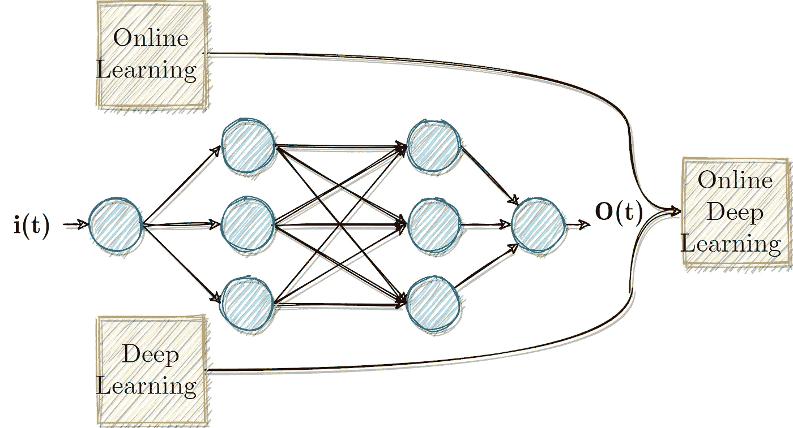
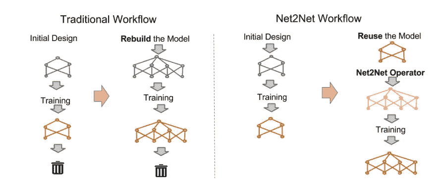
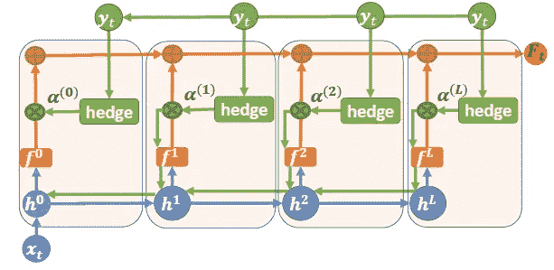
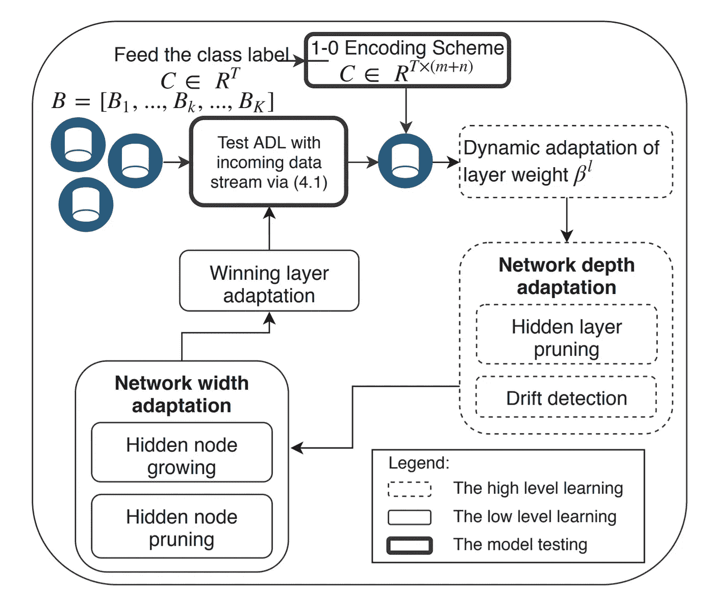
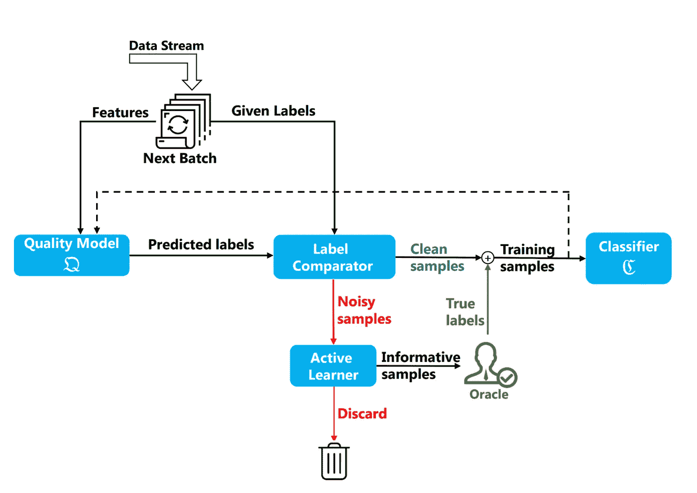

# 在线深度学习(ODL)和对冲反向传播

> 原文：<https://towardsdatascience.com/online-deep-learning-odl-and-hedge-back-propagation-277f338a14b2?source=collection_archive---------27----------------------->

## 在线学习是一种 ML 方法，其中数据是按顺序提供的，我们使用它来预测每个时间步的未来数据。在线深度学习非常具有挑战性，因为它不能使用反向传播。

# **简介**

由于深度神经网络的主要概念是在批量设置中通过反向传播进行训练，因此要求数据在离线设置中可用。因此，该方案对于许多实际情况来说是**不相关的**，在这些情况下，数据按顺序到达并且不能被存储。例如股票、车辆位置等等。ODL 非常具有挑战性，因为它不能使用反向传播。两年前，Sahoo 等人(2018)提出了在线学习和深度学习之间的差距，他们声称“如果没有深度的力量，就很难学习复杂的模式”。他们为 ODL 提出了一个新颖的框架(将在后面讨论)。

作者图片

# **在线学习概述(OL)**

OL 是一种 ML 方法，其中数据是按顺序提供的，我们使用它来预测每个时间步的未来数据。此外，在 OL 中，我们实时更新预测器。Shai Shalev-Shwartz 认为:“OL 是在已知(可能是部分)前面问题的正确答案和可能的额外可用信息的情况下，回答一系列问题的过程”。OL 的家族包括在线凸优化，(这导致了高效的算法)，当系统观察到损失值但没有观察到实际真实值时的有限反馈模型，等等(更多信息我推荐阅读参考文献[2])。

# 深入

***反向传播的局限性和“由浅入深”的概念***

在线学习可以直接应用于深度神经网络(在线反向传播)。然而，他们遭受许多收敛问题(消失梯度等)。).此外，网络的最佳深度(通常)是未知的，这使得问题更加困难。最近有作品改编了“由浅入深”的概念。根据这个概念，浅层模型比深层模型收敛得更快。为了实现这一概念，成本函数控制层数(陈等)。还有许多其他的概念，但让我们坚持这一个。

陈等，“网络 2 网:通过知识转移加速学习”

该体系结构和许多其他体系结构被设计成基于网络输出/最深层来优化成本函数。它们不能总是产生良好的在线性能，因为最深层需要有意义的时间来收敛。对于所讨论的在线学习概念，这种基于反向传播的深度学习技术不是最佳的。

**对冲反向传播(HBP)**

Sahoo 等人提出了一种值得注意的方法。在他们的工作中，他们建议在应用 HBP 时，网络深度会根据数据本身自动调整。这种对冲方法有一些重要的性质，如:1。根据分类器在深度上的表现确定网络深度(专家建议)。2.使用浅层神经网络架构进行初始化——更加鲁棒。3.它允许实时算法不断学习和适应(更多可用数据)。

以下图表摘自 Sahoo 等人的论文，对 HBP 进行了精彩的描述:

D.Sahoo 等人，“在线深度学习:动态学习深度神经网络”

该图描述了对冲反向传播背景下的在线深度学习框架。蓝线代表前馈流，绿线代表反向传播方法。重要的橙色线代表预测时间内套期保值方法遵循的(softmax)输出。更多详细信息，请参考原论文。

# **自主深度学习**

去年 1 月(2020 年)，Ashfahani 和 Pratama 出版了一本名为《自主深度学习:动态环境下的持续学习方法》的巨著。他们提到了许多 DL 方法的静态和离线性质，并提出了一种新的连续学习算法，除了漂移识别机制之外，该算法还可以确定网络深度。他们建议为每一层都包含一个产生局部输出的 softmax 层。然后，使用动态投票计算全局输出。作者在他们的模型中指出了四个主要贡献:1 .不同深度的网络结构(每个隐藏层中的 softmax 层)。2.自动生成新的隐藏节点。3.基于漂移检测的网络适应深度。4.适应新信息，同时重温旧信息。它可能会解决“灾难性遗忘问题”。

学习政策。“自主深度学习:动态环境下的持续学习方法”

总结 ADL 概念，方案宽度的调整基于方差和偏差的估计，而深度根据漂移检测方法确定(如上图所示)。

# **QActor:针对带噪声标签的 Strem 数据的在线主动学习**

我想讨论的最后一个主题是嘈杂的现实生活问题。最近，T. Younesian 等人(2020)的一部作品发表了。它处理在线噪声标记数据的问题，这可能导致任何 ODL 系统的不良性能。在这项工作中，他们专注于带有极其嘈杂标签的流数据，其中超过一半的标签是错误的。主要的挑战是选择信息丰富的数据，以便纳入学习框架。QActor 设计的在线主动学习算法将主动学习与一定的质量模型相结合。该模型基于不同的不确定性度量过滤掉有噪声的标签。这是原始论文工作流程的概述:

QActor:针对带噪声标签的流数据的在线主动学习——概述

# **总结**

总而言之，在线深度学习的领域相当新，并且受到许多非常规问题的困扰，例如我们都熟悉的离线设置中的反向传播，并且应该适合在线设置。我们讨论了一些最近处理这些问题的方法，如自主深度学习、对冲反向传播等。最后，我们提到了在线设置中的噪声标记示例的问题。

更多故事请关注我，别忘了鼓掌！

— — — — — — — — — — — — — — — — — — — — — — — — —

# 关于作者

Barak 获得了以色列理工学院的航空工程学士学位(2016 年)、硕士学位(2018 年)以及经济和管理学士学位(2016 年，成绩优异)。他曾在高通工作(2019-2020)，在那里他主要研究机器学习和信号处理算法。巴拉克目前正在海法大学攻读博士学位。他的研究兴趣包括传感器融合、导航、深度学习和估计理论。

访问我的个人网站:【www.Barakor.com 

领英【https://www.linkedin.com/in/barakor/ 领英

推特:巴拉克 2

— — — — — — — — — — — — — — — — — — — — — — — — —

# 参考文献。

[1] D. Sahoo 等，“在线深度学习:动态学习深度神经网络”。新加坡管理大学信息系统学院。ArXiv，2018。

[2] Shalev-Shwartz，Shai。"在线学习和在线凸优化."*机器学习的基础和趋势*4.2(2012):107–194。

[3]陈等.“网络 2 网:通过知识转移加速学习” *arXiv 预印本 arXiv:1511.05641* (2015)。ICLR (2016 年)。

[4] N. Gravin 等人，“在专家建议下实现预测的最佳算法”。ArXiv，2014。

[5]阿什法哈米和普拉塔马。“自主深度学习:动态环境的持续学习方法”。ArXiv，2020。

[6] B.Bfulb 等《灾难性遗忘:仍是 DNNs 的问题》，ArXiv 2019。

[7] T .尤内西安。“QActor:带噪声标签的流数据的在线主动学习”。ArXiv，2020。