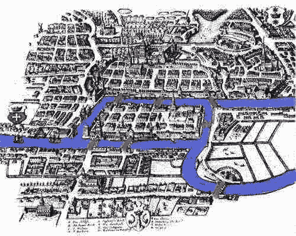
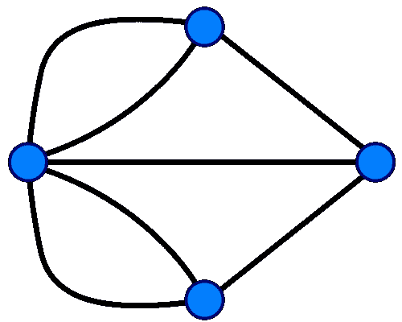
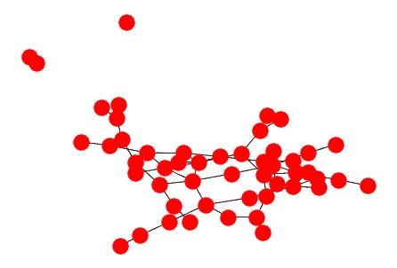
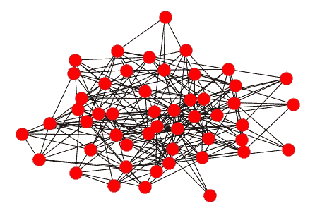
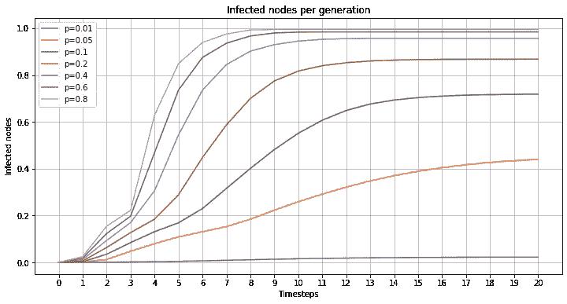

# 只有 R 重要:数学流行病学和感染率

> 原文：<https://towardsdatascience.com/only-r-matters-mathematical-epidemiology-and-infection-rate-2d890386a992?source=collection_archive---------54----------------------->

## Hazy 的数据科学

## 这一简短的时间、死亡和疾病回顾将帮助你理解图论和传染率的重要性。

数学流行病学的历史与现代疫情有什么关系？一切真的。除了我们用图形表示它的方式——也就是用 Graph——以及它处理更大的、影响全球的数据集的能力，没有太大的变化。希望这篇文章能给你一本入门书，帮助你开始理解我们今天在试图[解决像新冠肺炎](https://thenewstack.io/the-challenges-to-building-a-predictive-covid-19-model/)这样的数学问题时所面临的斗争。

## 数学流行病学简史

流行病的数学模型可以追溯到 18 世纪瑞士数学家[丹尼尔·伯努利](https://en.wikipedia.org/wiki/Daniel_Bernoulli#Mathematical_work)，他显然不满足于力学、统计学和经济学的基础工作，还创建了第一个已知的关于流行病传播的[数学模型](https://www.nature.com/articles/35046270)。他的模型根据感染率和死亡率给出了预期寿命，适用于当时在整个欧洲流行的天花爆发。

另一种疾病启发了许多人所认为的流行病学的基础，那就是霍乱。由于基础设施不足、过度拥挤以及缺乏准确的细菌和感染医学模型，霍乱爆发在 19 世纪的伦敦是一种非常常见的现象。现在看来这很了不起，但当时有两种相互竞争的理论:细菌理论和瘴气理论。瘴气理论认为，霍乱和其他疾病是由空气中传播的腐烂有机物引起的——考虑到当时伦敦市中心普遍存在的污染，以及首都许多地区缺乏污水处理系统，这可能不是一个像今天这样奇怪的理论。

从很多方面来说，约翰·斯诺是 T2 的第一位数据科学家。他绘制了一张 1854 年在布罗德街附近的索霍区爆发的[传染病地图。他拒绝了流行的瘴气理论，而是专注于追踪霍乱在供水系统中的传播。他使用现在被称为 Voronoi 图的方法追踪感染。最终，他认定一个特殊的水泵可能是霍乱爆发的源头。他的工作为细菌理论提供了经验证据，并确定水供应是霍乱的主要传播媒介。他的工作还导致了公共卫生立法的重大修改，涉及提供清洁水和安全废物处理。在索霍区](https://en.wikipedia.org/wiki/1854_Broad_Street_cholera_outbreak)有一家[酒吧，靠近水泵，水泵是以他的名字命名的宽街传染病的发源地。](https://www.ph.ucla.edu/epi/snow/snowpub.html)

自从这项开创性的工作以来，许多流行病学模型被开发出来，包括微分方程系统、随机过程和那些基于图形的模型。我们将看看图论如何作为疾病传播的模型来应用。

## 什么是图？

[图论](https://en.wikipedia.org/wiki/Graph_theory)作为数学探究的对象可以追溯到一个被称为[柯尼希斯堡七桥](https://en.wikipedia.org/wiki/Seven_Bridges_of_K%C3%B6nigsberg)的问题。这是一个听起来很简单的问题，但是它的解决方案让莱昂哈德·欧拉发展了一种全新的数学理论，以便得到一个明确的答案。在解决这个问题的同时，欧拉发明了图论；这是欧拉做了相当多的事情，对物理学、天文学、地理学、逻辑学、拓扑学、数论、微积分以及许多其他领域做出了根本性的贡献。

两条河流穿过柯尼斯堡市，七座桥梁横跨其间。欧拉全神贯注的问题，并导致了图论的发现，是创建一个步行穿过每座桥一次，但只有一次。下面是柯尼斯堡的地图，蓝色是河流，红色是桥梁。

柯尼斯堡的桥梁。来源:maa.org

在创立/发现了图论之后，欧拉表明不可能通过穿过每座桥一次来创建一次柯尼斯堡之旅。

图由两个不同的对象组成，*顶点*和*边。*一个顶点可以在一张纸上画成一个点或一个圆。边是可以在两个顶点之间画出的连接它们的线。代表柯尼斯堡桥梁的图表如下所示。

柯尼斯堡桥图: [**GNU 自由文档许可**](https://en.wikipedia.org/wiki/en:GNU_Free_Documentation_License)

图论已被证明是数学问题的丰富来源，对纯数学和应用数学的许多领域做出了贡献，并扩散到许多其他科学和技术领域。

## erdős–rényi 图

1959 年，保罗·ERdős 和阿尔佛雷德·雷尼发表了一个创建随机图的模型，被恰当地称为 Erdős-Rényi 图或 er 图。Erdős 和雷尼研究了几种生成随机图的方法。

在 *G(n，p)* 模型中，通过随机连接顶点来构建图。以概率 *p 在两个顶点之间画一条边。*这个概率随着从 0 增加到 1，给出了图中任意两条边将被连接的可能性。

不同的 *p* 值的效果可以在下图中看到。两者都有 50 个顶点，但是连接它们的边的概率不同。对于上图，我们有 *p=* 0.05，对于下图，我们有 *p=* 0.2。

具有 *n* =50 个顶点并且 *p* =0.05 的 ER 图

ER 图，也是用 *n=50 个顶点，但用* p=0.2

## 图表和流行病

图论的许多应用之一涉及流行病的传播。

让我们看看如何用图表来建立一个原始的流行病学模型。(数学生物学家和流行病学家使用的真实模型比一个简单的 ER 随机图复杂得多；但是，它仍然是许多此类模型的基础)。

让我们考虑由 n 个个体组成的群体。

一个随机的个体——在图论中是一条*边*——被一种传染性媒介感染，例如，这种媒介可能是一种病毒。

如果我们假设这种相互作用的网络可以用 ER 图来描述，那么概率 *p* 表示从一个人到另一个人(一个顶点到另一个顶点)的感染已经发生的可能性。

这将代表一个 SI 模型，来自*易感-感染*。当一个人被感染时，他们可以以一定的概率传递感染、病毒、细菌。

我们创建一个 ER 图，在图中的顶点之间有随机连接(边)。我们也随机选择一个顶点——我们人口中的一个感染者。我们假设随机个体只有在他们有联系的情况下才能将感染传递给另一个个体，并使用相同的 *p* 值来确定他们是否传递感染。

然后，我们允许这个模型运行多个时间步长， *T=* 20。感染在人群中传播，从一个人传播到另一个人，并输出被感染的人群比例。

我们对模型进行多次迭代( *N=* 1000 次试验)，然后对输出进行平均(感染人群的比例)。

下图显示了感染概率*p*∈[0.01，0.05，0.1，0.5]的各种不同值在 ER 图上的传播情况。,2, 0.4, 0.6, 0.8].

具有不同传染概率的 ER 图上传染病的传播。

这类似于最近媒体引用的关于新冠肺炎科拉那病毒的感染率。R 是感染率，即一个人将其感染传给另一个人的概率。

从图中可以看出，很明显，感染率越高，受感染的人口比例就越高。

给定这样一个简单的模型，我们能对感染率和概率之间的关系说些什么？

让我们以稍微不同的侧重点重新审视一下这个模型。我们又有了一个规模为 N. 的人口，人口中的每个人都由图中的一个顶点来表示。如果感染在两个顶点 *i* 和 *j* 之间传播，则可以通过在这两个顶点之间放置一条边来构建该图。图中感染人数可以认为是图的*连通分支*。一个合理的问题是:这个组件会变得多大？

从流行病(或者说全球大流行)的角度来看，坏消息是 ER 随机图模型经常表现出所谓的 [*巨型组件*](https://en.wikipedia.org/wiki/Giant_component)*，其中一个连通组件包含整个图的一个大的、有限的部分！*

*如果我们有 *p ≤ (* 1 — ϵ)/ *N，*其中ϵ > 0，那么很有可能所有的连通分量的大小都是 O(log N)的量级，我们没有一个巨型分量。然而，如果我们有 *p ≥(* 1 +ϵ)/ *N，*那么很有可能，我们将有一个单一的，巨大的组件。*

*从我们的(公认简单的)ER 感染模型来看，我们人口的很大一部分将被感染。实际上，这将是一场流行病，大多数人都会受到感染。*

*由于我们才刚刚开始审视和理解我们当前的疫情，这一历史上的数学、流行病学之旅强调了一个关键事实，即我们真正能控制的只是感染率。如果没有任何降低感染概率的措施，传染病将会以指数速度在人群中传播。*