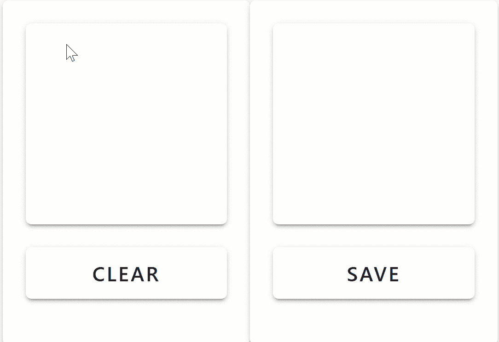

# ONNX:轻松交流深度学习模型

> 原文：<https://towardsdatascience.com/onnx-easily-exchange-deep-learning-models-f3c42100fd77?source=collection_archive---------26----------------------->

## ONNX(开放式神经网络交换格式)及其潜在应用的实践演练


[面条金姆](https://unsplash.com/@noodlekim?utm_source=medium&utm_medium=referral)在 [Unsplash](https://unsplash.com?utm_source=medium&utm_medium=referral) 上的照片

# 介绍

[ONNX(开放式神经网络交换格式)](https://onnx.ai/)是一种旨在表示任何类型的机器学习和深度学习模型的格式。

支持框架的一些例子有:PyTorch、TensorFlow、Keras、SAS、Matlab 等等。这样，ONNX 可以更容易地将模型从一个框架转换到另一个框架。此外，使用 ONNX.js，我们可以轻松地在线部署任何以 ONNX 格式保存的模型。

在图 1 中，使用 ONNX.js 在线部署了一个简单的变型 Autoencoder PyTorch 模型示例，以便按需进行推理。在我的个人网站上的[链接可以找到这种部署模式的完整工作示例。](https://pierpaolo28.github.io/Projects/ONNX/home.html)



图 1:使用 ONNX.js 的在线 VAE

ONNX 的主要目标是将所有不同的人工智能框架聚集在一起，并尽可能容易地使它们相互通信，以便构建可以在任何类型的平台或硬件上支持的更好的模型。

# 将模型转换为 ONNX

将模型转换成 ONNX 格式相对容易。我们所要做的就是，确保我们的训练模型处于评估模式，并创建一个简单的虚拟输入，其形状与我们的模型预期的相同。

下面是 PyTorch 中的一个简单示例。在这个简单的例子中，我们实例化了一个变化的 Autoencoder 模型，加载其预训练的权重，将其置于评估模式并创建一个示例输入。使用这些参数，我们可以创建 ONNX 文件。

```
import torchpre_trained = VAE(encoder, decoder)
pre_trained.load_state_dict(torch.load('trained.pt'))
pre_trained.eval()ex_input = torch.zeros(1, 28, 28)torch.onnx.export(pre_trained, ex_input, "onnx_model.onnx")
```

然后，我们的 ONNX 文件将由我们的模型的图形表示构成，该图形表示可用于将我们的模型转换为其他类型的框架(通过重新创建图形中的指令)或使用我们训练的模型进行在线推断。ONNX 目前的一个局限是，并不是所有的操作(如定制损失函数、特定的神经网络层等)都被所有的框架所支持。PyTorch 支持的所有操作符列表可在[链接中找到。](https://pytorch.org/docs/stable/onnx.html)

在 ONNX 库的开发过程中，开发了不同的操作集版本(***【op set _ version】***)。因此，通过指定我们最喜欢的 ***opset_version*** 作为导出函数的参数，我们可以决定我们想要默认可用的操作集。

# 使用 ONNX.js 部署模型

拥有在线模型的一些好处是:

*   我们减少了延迟，因为数据不必从服务器来回发送。
*   不向服务器发送数据也增加了隐私，因为用户数据不会被远程访问。
*   网站可以只用静态文件来建立，这使得可扩展性不成问题。

有不同的技术可用于在线部署模型，如 Tensorflow.js 和 ONNX.js。使用 Tensorflow.js 的主要优势之一是可以在线训练模型(使用 ONNX.js 则不是可用选项)。另一方面，ONNX.js 比 Tensorflow.js 更高效，因此在进行在线推理时速度更快。

下面显示了一个简单的模板，可以用来开始使用 ONNX.js。在这种情况下，假设存在一个名为 ***getInputs()*** 的函数能够自动为我们的模型创建输入数据。

```
<html>
  <head> </head>
  <body>
    <!-- Loading ONNX.js library -->
    <script      src="https://cdn.jsdelivr.net/npm/onnxjs/dist/onnx.min.js">
    </script>
    <script>
      // Creating a session
      const sess = new onnx.InferenceSession();
      // Loading the created ONNX file
      sess.loadModel("onnx_model.onnx").then(() => {
      // Getting an imput for our model from an example function 
      const input_data = getInputs();
      // Feeding the input to our model and fetching the output
      sess.run(input_data).then((output) => {
      // Storing and displaying the output prediction 
      const outputTensor = output.values().next().value;
      console.log(`Model prediction: ${outputTensor.data}.`);
        });
      });
    </script>
  </body>
</html>
```

从这个示例模板开始，使用标准的 Javascript 功能，可以开发复杂的应用程序。

如果您正在寻找创建模型、将其转换为 ONNX 然后在线部署的完整示例，可以在 [this my Github 资源库中找到。](https://github.com/pierpaolo28/Artificial-Intelligence-Projects/tree/master/Online%20Learning/ONNX)此外，使用 ONNX.js 部署的示例模型集合可在 ONNX.js 官方网站[此链接获得。](https://microsoft.github.io/onnxjs-demo/#/)

# 联系人

如果你想了解我最新的文章和项目[，请通过媒体](https://medium.com/@pierpaoloippolito28?source=post_page---------------------------)关注我，并订阅我的[邮件列表](http://eepurl.com/gwO-Dr?source=post_page---------------------------)。以下是我的一些联系人详细信息:

*   领英
*   [个人博客](https://pierpaolo28.github.io/blog/?source=post_page---------------------------)
*   [个人网站](https://pierpaolo28.github.io/?source=post_page---------------------------)
*   [中型简介](https://towardsdatascience.com/@pierpaoloippolito28?source=post_page---------------------------)
*   [GitHub](https://github.com/pierpaolo28?source=post_page---------------------------)
*   [卡格尔](https://www.kaggle.com/pierpaolo28?source=post_page---------------------------)