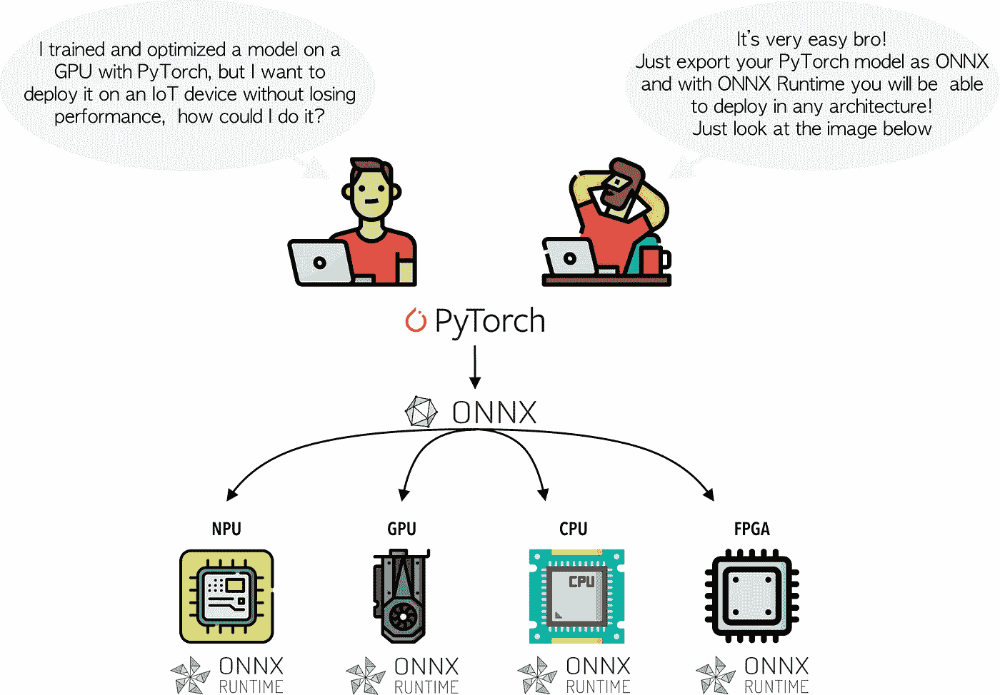
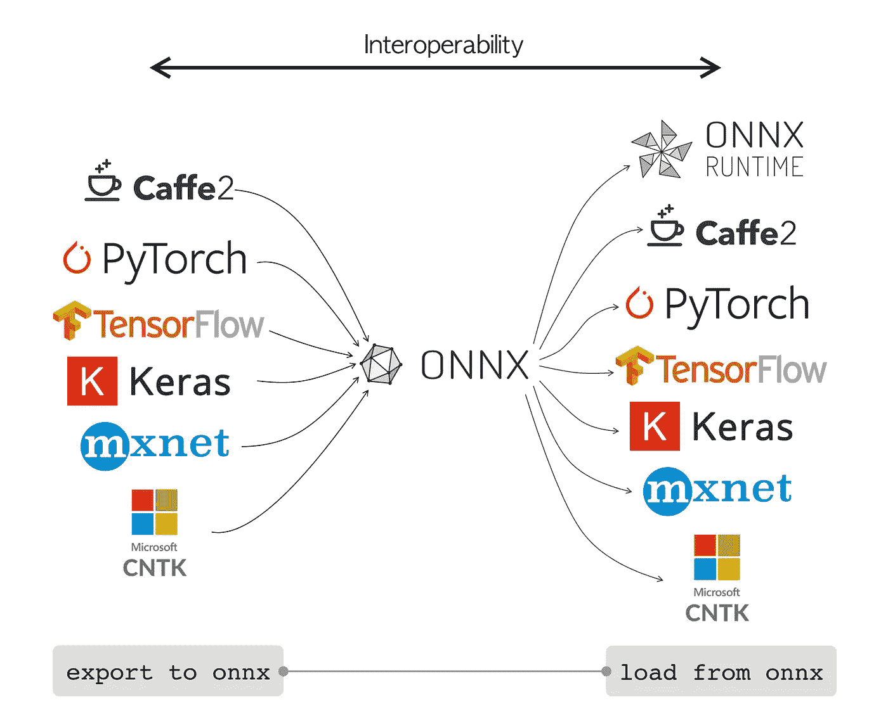
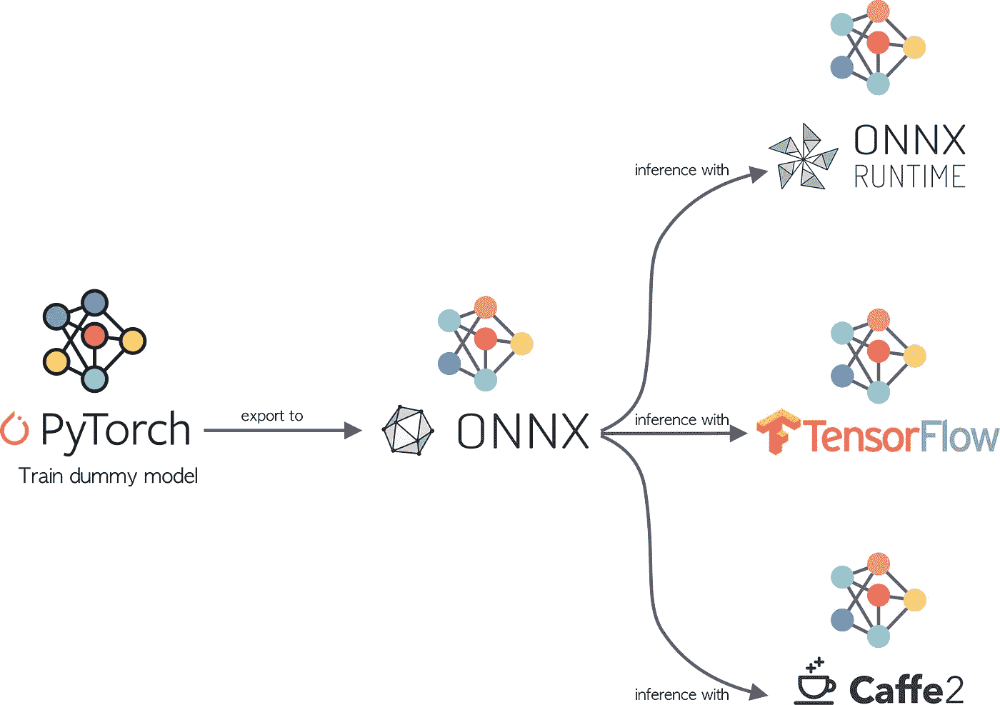

# ONNX:防止框架锁定

> 原文：<https://towardsdatascience.com/onnx-preventing-framework-lock-in-9a798fb34c92?source=collection_archive---------27----------------------->

## 介绍如何使用 ONNX 标准实现深度学习框架之间的互操作性。

里克·梅森在 [Unsplash](https://unsplash.com?utm_source=medium&utm_medium=referral) 上的照片

在这篇博客中，我们将看到什么是 **ONNX** 标准，它的组成部分以及如何在不同的*深度学习框架*之间进行互操作。本博客将讨论以下部分:

*   **简介**
*   **ONNX 是什么？**
*   **什么是 ONNX 运行时？**
*   **互操作性:从 PyTorch 到其他框架**

所以让我们开始吧！

# 介绍

*PyTorch* 、 *Tensorflow* 、 *Caffe2* 、 *MXNet* 等，只是今天开发*深度学习模型*最流行的一些框架。尽管这些框架之间的共同点是*深度学习模型*的培训和调整，但“*它们如何做*”以及它们针对的领域是主要的区别点。一些框架更加面向研究(如 *PyTorch* )，而另一些则主要用于设备部署(如 *Tensorflow* )，同样，一些框架的设计架构基于静态图(如 *Tensorflow* 和 *Caffe2* )，而其他框架则基于动态图(如 *PyTorch* )。

显然，这些框架中的每一个都提供了不同于其他框架的优势，然而，我们如何将这些优势联系起来呢？我们如何互操作不同的框架？我们如何用框架“ *x* ”优化一个模型，并在为框架“ *y* ”优化的架构中部署它？嗯，这种类型的互操作性的实现要感谢 **ONNX** 标准和 **ONNX 运行时**(我们将在后面看到)。在图 1 中，描述了由 **ONNX** 和 **ONNX 运行时解决的问题。**

图一。ONNX 和 ONNX 运行时解决的问题|作者图片|取自[平面图标](https://www.flaticon.com/home)的图标

ONNX 已经开始打破框架和硬件架构之间的依赖。 **ONNX** 寻求成为不同*深度学习框架*之间*可移植性和互操作性*的默认标准。那么，让我们更详细地看看什么是 **ONNX** 和什么是 **ONNX 运行时**。

# ONNX 是什么？

**ONNX** 是首字母缩写，代表 ***开放式神经网络交换*** 。它指的是促进*深度学习框架之间互操作性的标准模型。ONNX 标准始于 2017 年，由微软、脸书和亚马逊三大巨头发起。基本想法是提出一个标准，允许已经众所周知的深度学习框架之间的可移植性和互操作性。*

> [开放神经网络交换(ONNX)](https://onnx.ai/) 是一个开放的生态系统，使人工智能开发者能够随着项目的发展选择正确的工具[1]。

**ONNX** 已经开始简化*机器学习模型*从研究到生产的生命周期，因为一些框架更适合原型化和优化模型，而其他框架则提供加速部署到不同设备的工具，这是很常见的。因此，需要特别提及的是，目前 **ONNX** 已经具备支持推理的能力，即我们可以在框架“ *a* 中训练一个模型，在框架“ *b* 中进行推理。图 2 提供了对*框架互操作性的可视化描述。*

图二。ONNX 互操作性|作者图片|取自原始来源的徽标

> ONNX 规范针对以下三个组件来实现互操作性:
> 1 .一种可扩展计算图模型的定义。
> 2。标准数据类型的定义。
> 3。内置运算符的定义。

到目前为止，已经有几个框架集成了一个扩展，能够在 **ONNX** 规范下导出模型，同样，还没有集成导出模块的框架利用了工作良好的包装器。

好了，到目前为止，我们已经知道为什么框架之间的*互操作性*需要一个标准，同样我们也已经知道 **ONNX** 在这个生态系统中的参与情况，现在我们必须知道" ***ONNX Runtime*** "是什么，以及它在行业中产生的巨大影响，所以让我们开始吧！

# 什么是 ONNX 运行时？

**ONNX Runtime** 是一个多平台加速器，专注于训练和模型推理，与最常见的*机器学习&深度学习框架*【2】兼容。换句话说， **ONNX 运行时**就是 **ONNX** 标准的实现。

**ONNX 运行时**的出现是因为需要一个接口来加速不同硬件架构中的推理。在 **ONNX 运行时**之前，将主要针对*基于 CUDA 的*架构优化的模型部署到*基于 NUPHAR* 、 *nGraph* 、 *OpenVINO* 的架构等是非常昂贵的。换句话说，在框架和硬件架构之间存在着一种依赖关系，模型就是为这种依赖关系而优化的。有了 **ONNX** 标准和 **ONNX 运行时**加速器，框架和硬件架构之间的互操作性的大门就敞开了。

ONNX 运行时的一些主要优势是:

*   推理性能提高，推理时间大大减少。
*   减少培训时间
*   用 Python 开发和训练模型，并在基于 C、C ++或 Java 的应用程序中部署。

很好，现在我们知道了 **ONNX** 和 **ONNX 运行时**在*互操作性和可移植性*方面的影响，让我们来看一个例子！

# 互操作性:从 PyTorch 到其他框架

在下面的例子中，我们将演示如何使用 **ONNX** 标准，以便能够在不同的*深度学习框架*之间进行互操作。

示例的架构给出如下，我们将在 **PyTorch** 中训练一个分类器，然后我们将使用这个训练好的模型在 **Tensorflow** 、 **Caffe2** 和 **ONNX 运行时**中进行推理。该示例的架构如下所示:

图 3。示例架构|作者图片|取自[平面图标](https://www.flaticon.com/)的图标

开始吧！

> 如果你想看看完整的代码，这是实现:[https://github.com/FernandoLpz/ONNX-PyTorch-TF-Caffe2](https://github.com/FernandoLpz/ONNX-PyTorch-TF-Caffe2)。随意克隆或者叉！

首先，我们将创建*通用数据*，其想法是创建一个虚拟模型，因此让我们定义以下生成器，它将返回训练和测试数据:

代码片段 1。数据生成程序

现在，让我们定义我们的虚拟模型的结构以及正向函数。我们基本上定义了两个线性层，这就够了。

代码片段 2。PyTorch 模型定义

完美！到目前为止，我们已经有了通用数据以及我们的虚拟模型，是时候训练模型了！

代码片段 3。PyTorch 培训模式

正如我们所看到的，训练阶段非常简单，不需要太多的解释。那么让我们继续下面的，是时候将我们的模型导出到 **ONNX** 标准了，因为这个 **PyTorch** 已经为我们提供了一个扩展来导出 **ONNX 格式的模型**，让我们看看我们是怎么做的！

代码片段 4。导出到 ONNX

我们先来看第 4 行的 if-else 语句。我们正在定义一个"*虚拟输入*，因为 **ONNX** 需要遍历由 **PyTorch** 定义的整个图形，这样 **ONNX** 将负责跟踪每个图形实例中定义的每个层和参数。在这种情况下，我们使用变量*定义一个通用输入，或者在它的情况下，我们将虚拟输入定义为训练中使用的真实输入。*

稍后，在第 9 行和第 10 行中，我们定义了我们将分配给图中每个层的名称，这些名称将由 **ONNX** 生成，否则 **ONNX** 将使用通用名称。

最后，在第 13 行中，我们使用了 **PyTorch** 的 **ONNX** 扩展，我们将训练好的模型、虚拟输入和分配给图中每个元素的名称作为参数传递。查看第 22 行中传递的参数很重要，因为推理张量在维度大小上可能有一些变化(通常是指批量大小的维度)，我们将这样的维度定义为" *dynamic* "，因此在推理时，我们可以传递任何批量大小，而不是训练原始模型时使用的那个。

嗯，到目前为止，我们已经在 **PyTorch** 中训练了一个模型，并保存在 **ONNX** 标准下，现在我们看看如何用不同的框架加载这个模型来进行推理。

## ONNX 运行时推理

为了用 **ONNX 运行时**执行推理，我们需要导入*ONNX 运行时*库，然后我们只需要用 *onnx 模块*加载 *onnx 模型*并生成预测。

代码片段 5。ONNX 运行时推理

## 咖啡 2 推断

为了使用 **caffe2** 框架进行预测，我们需要为作为后端工作的 *onnx* 导入 *caffe2 扩展*(类似于 tensorflow 中的会话)，然后我们将能够进行预测。

代码片段 6。咖啡 2 推断

## 张量流推理

要使用 **Tensorflow** 进行预测，需要使用 *onnx_tf* 模块，该模块提供一个包装器(模拟会话)，以便进行预测。

代码片段 7。张量流推理

恭喜你！我们到达了博客的结尾。

> 如果你想看看完整的代码，这是 https://github.com/FernandoLpz/ONNX-PyTorch-TF-Caffe2 的实现:。随意克隆或者叉！

# 结论

在这篇博客中，我们解释了 **ONNX** 标准产生的必要性。我们也提出了 **ONNX** 如何帮助防止*框架锁定*的想法。另一方面，我们解释了 **ONNX** 标准与 **ONNX** 运行时如何让我们减少*深度学习生命周期*中的时间，因为它加快了培训阶段和部署阶段之间的联系。
最后，我们看到了一个例子，使用 **ONNX** ，我们可以在给定的框架中训练一个模型，并在其他框架中执行推理。

# 参考

[1]https://github.com/onnx/onnx

[https://microsoft.github.io/onnxruntime/docs/](https://microsoft.github.io/onnxruntime/docs/)