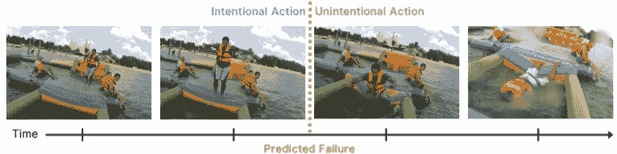
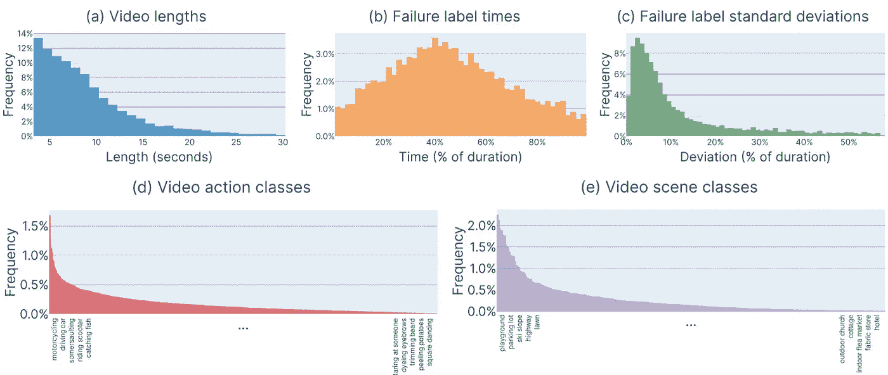
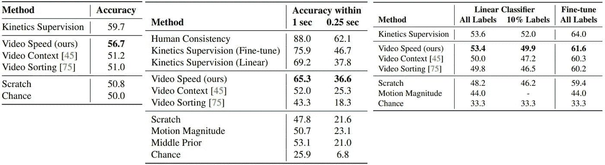
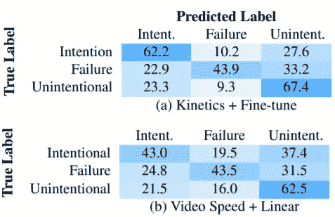
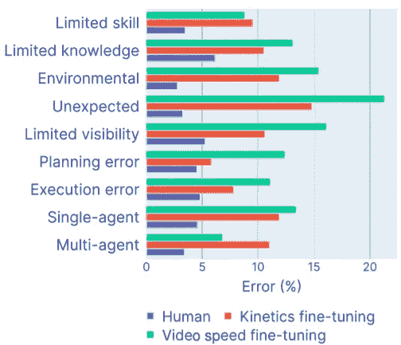

# 哎呀！预测视频中的无意动作

> 原文：<https://towardsdatascience.com/oops-predicting-unintentional-action-in-video-87626aab3da3?source=collection_archive---------41----------------------->

## 理解运动的意向性

有意与无意的行动**【1】**

实际上，人类是不完美的代理人，他们的行为可能是不稳定的和不可预测的。虽然以前的研究主要集中在人类活动识别和预测上，但哥伦比亚大学的研究人员采用了一种新的方法——分析目标导向的人类行动。戴夫·爱泼斯坦、袁波·陈和卡尔·冯德里克在《哎呀！预测视频中的无意动作**【1】**:

1.  提出 3 项新任务:分类、定位和意外行为预测
2.  引入新的基准数据集:大型、公共和(部分)注释的(光流、无意运动的时间戳等)
3.  对比无意动作中级感知线索:视频速度(新)、视频上下文**【2】**、事件顺序**【3】**

**运动的意向性**

许多研究试图模拟人类行为的物理和原子后果，但很少有人试图理解运动背后的意图。本文区分有意运动和无意运动，旨在识别、定位和预测无意运动。

**哎呀！数据集**

哎呀！数据集**【4】**由 20，338 个视频剪辑(3-30 秒长，总计 50 多个小时)组成，这些视频剪辑来自 YouTube fail 汇编，都被证实包含一些无意的“野外”人类行为。由于作者提出了一种自我监督的方法来完成这项任务，该数据集被分成 3 个子集:7，368 个视频作为标记的训练集，6，739 个标记的视频作为测试集，其余的是用于预训练的未标记集。为了分类，视频中的动作被标注为“有意的”、“无意的”或“过渡的”；对于定位，工作人员在故障的时间位置(故障开始的时刻)标注时间戳标记。附加数据集注释包括光流和自然语言描述。在数据集中，270 个视频被指定为诊断集，可以看到更细粒度的手动注释。这些视频被分为 9 种类型的无意行动:“有限的技能”、“有限的知识”、“环境”、“意外”、“有限的可见性”、“计划错误”、“执行错误”、“单代理人”、“多代理人”。

图 1:数据集统计**【1】**

作者还报告了各种数据集统计数据，包括视频剪辑长度和故障时间标签的分布，以说明数据的多样性；来自不同人类注释者的标签的标准偏差，以展示高度的人类(注释者)一致性；动作和场景类别的分布(由它们的完全监督基线预测)。

**来自中级感知线索的自我监督特征**

作者调查了视频中自然存在的自我监督线索(或需要最小限度的注释)，以了解人类行动中意向性的深层、可转移的表征。具体来说，检查视频速度、视频上下文和事件顺序。所有的通讯网络都是通过 ResNet3D-18 模型**【5】**实现的。

**视频速度**

基于之前的研究**【6】**，作者指出，人类对意图的判断在很大程度上受到视频速度的影响。由于视频速度是每个视频固有的，因此通过速度进行推断需要最少的预处理。对于训练，作者综合改变视频的速度，并训练一个自我监督的神经网络来预测真实的帧速率。正如作者所指出的，这种 ConvNet 生成的特征与事件的预期持续时间相关联(鲁棒性来自对具有综合改变的速度的视频的训练)，并对逐帧运动信息进行编码，从而构建了视频速度信息的有用表示。

**视频背景**

作者声明“无意的行动往往是对预期的偏离”，并探讨了作为意向性视觉度量框架的可预测性。在先前研究**【2】**的指导下，他们将帧 *x_{t-1}* 和 *x_{t+1}* 视为周围视频上下文，并激励模型对中间目标帧 *x_t* 的特征图进行插值。值得注意的是，他们利用噪声对比估计**【7】**和对比预测编码**【2，3，8】**的概念来构造要最大化的目标函数:

目标函数**【1】**

以便最大化目标帧特征和上下文嵌入之间的距离，同时最小化目标帧和非上下文剪辑特征之间的距离。

**事件顺序**

作者提出的基本原理是“无意运动往往表现为混乱或不可逆的运动”，导致独特的时间事件顺序。为了生成事件顺序的表示**【3】**，他们对视频中的二次抽样剪辑进行置换和洗牌，并训练一个 ConvNet 来预测所应用的置换序列。这是通过一个 3 部分模型实现的，该模型由片段特征编码器、成对片段关系网络(其中特征表示片段的相似性)和事件顺序预测器组成。

从上述自监督模型中提取的特征然后被用作线性分类器的输入，该线性分类器利用类来执行 3 类分类:“有意的”、“无意的”和“过渡的”运动。

**实验**

绩效以 3 个任务为基准——分类、定位(定位从有意到无意运动的过渡的时间边界)、预测(预测失败的开始)，并进行 3 个层次的比较:首先，在不同的自我监督附带线索(视频速度(新提出的)、视频上下文、事件顺序)之间进行比较；其次，比较自监督模型和全监督基线(在动力学动作识别数据集上的预训练加上微调、细粒度注释:运动幅度、划痕、机会)；最后，比较机器和人的表现(人的同意)。

表 1(分类精度)、表 2(定位精度)、表 3(预测精度)**【1】**

**分类、定位、预测**

在所有 3 个任务中，动力学监督产生了最好的机器性能，而视频速度监督始终优于所有其他自我监督和完全监督的方法。全监督和自监督方法之间的性能差距在分类中最小(表 1)，在时间定位中最大(表 2)。为了量化定位精度，与任何地面实况时间位置(一些视频有多个地面实况)重叠的预测(在 1 秒和 0.25 秒内报告的结果)被认为是正确的。

图 2:分类混淆矩阵**【1】**

特别是，自我监督的模型比完全监督的模型遭受更多的假阳性边界预测，在完全监督的模型中，它们将有意运动与故障的开始混为一谈(图 2)。此外，作者对 9 种无意运动类别中的每一种进行了详细的错误率分析(图 3 )(在上述诊断集中)。他们报告说，由意外因素(“如突然俯冲的鸟”)或环境因素(“如在冰上滑倒”)引起的无意运动最难检测，并假设多智能体场景由于其更明显的视觉线索而记录了最低的错误率。其他挑战包括有限的视频可见性(被遮挡的物体)和有限的知识(“例如理解火是热的”)。从结果可以看出，自我监督和完全监督的方法都明显落后于人的表现。

图 3:性能分解【T6【1】

**结论**

“哎呀！预测视频中的无意行为”介绍了理解人类行为中的意向性的 3 个新任务，并为未来的工作提供了一个大型基准数据集。作者提出了一种自我监督的方法，并报告了使用视频速度作为视频表示的附带线索的有希望的结果。

**参考文献**

[1]戴夫·爱泼斯坦、袁波·陈和卡尔·冯德里克。糟糕！预测视频中的无意动作。2020 年，CVPR。
[2]亚伦·范·登·奥尔德、亚哲·李和奥里奥尔·维尼亚尔斯。对比预测编码的表征学习。 [arXiv 预印本 arXiv:1807.03748](https://arxiv.org/pdf/1807.03748.pdf) ，2018。
[3]徐德静，，，邵剑，，庄悦婷。[通过视频片段顺序预测的自我监督时空学习。](http://openaccess.thecvf.com/content_CVPR_2019/papers/Xu_Self-Supervised_Spatiotemporal_Learning_via_Video_Clip_Order_Prediction_CVPR_2019_paper.pdf)2019 年，CVPR。[4]戴夫·爱泼斯坦、袁波·陈和卡尔·冯德里克。[哎呀！预测视频中的无意动作。](http://oops.cs.columbia.edu/)检索自[https://oops.cs.columbia.edu/](https://oops.cs.columbia.edu/)
【5】原研哉、片冈博胜、佐藤丰。[时空 3d cnns 能否追溯 2d cnns 和 imagenet 的历史？](http://openaccess.thecvf.com/content_cvpr_2018/papers/Hara_Can_Spatiotemporal_3D_CVPR_2018_paper.pdf)2018 年 CVPR。尤金·M·卡鲁索，扎卡里·C·伯恩斯，本杰明·匡威。[慢动作增加感知意图。](https://www.pnas.org/content/pnas/113/33/9250.full.pdf)2016 年 PNAS。
[7] Rafal Jozefowicz、Oriol Vinyals、Mike Schuster、Noam Shazeer 和吴永辉。探索语言建模的极限。 arXiv 预印本 arXiv:1602.02410，2016。
[8]韩腾达、、谢和安德鲁·齐塞曼。[通过密集预测编码的视频表示学习。](https://arxiv.org/pdf/1909.04656.pdf)2019 年 ICCV 研讨会。