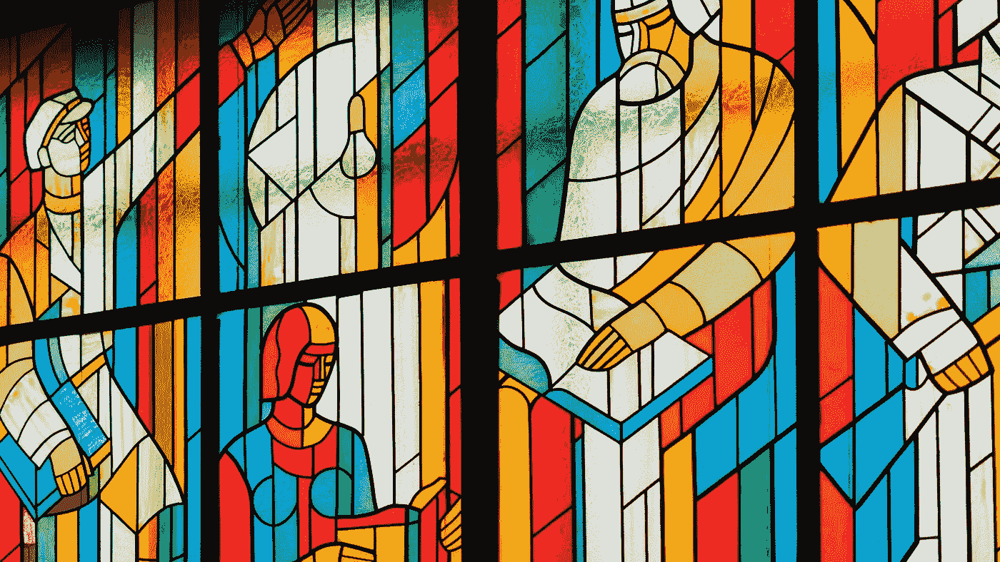
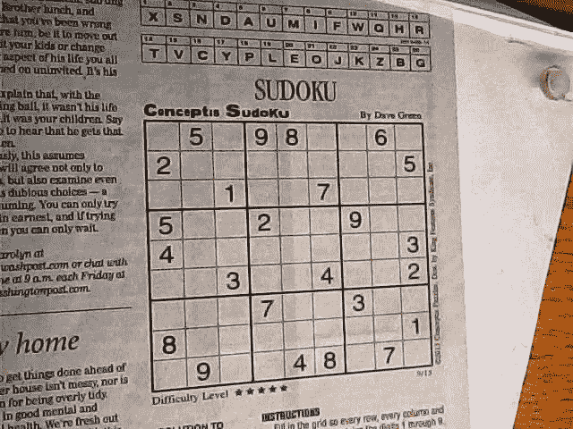
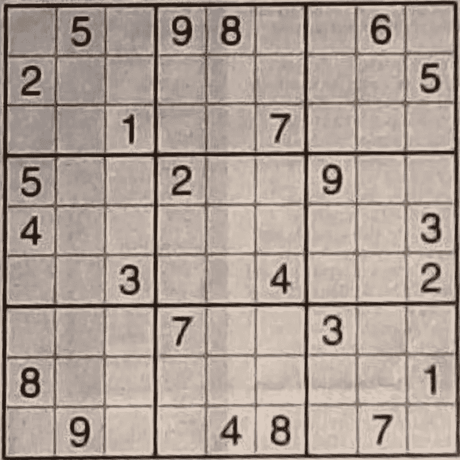
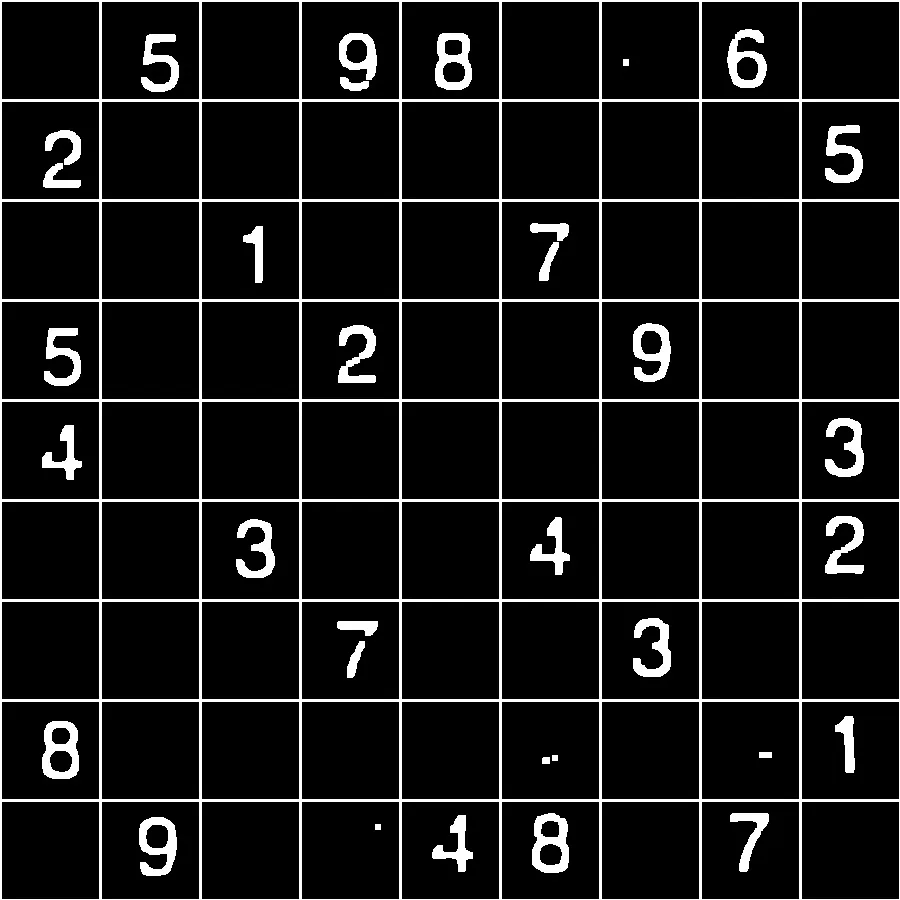
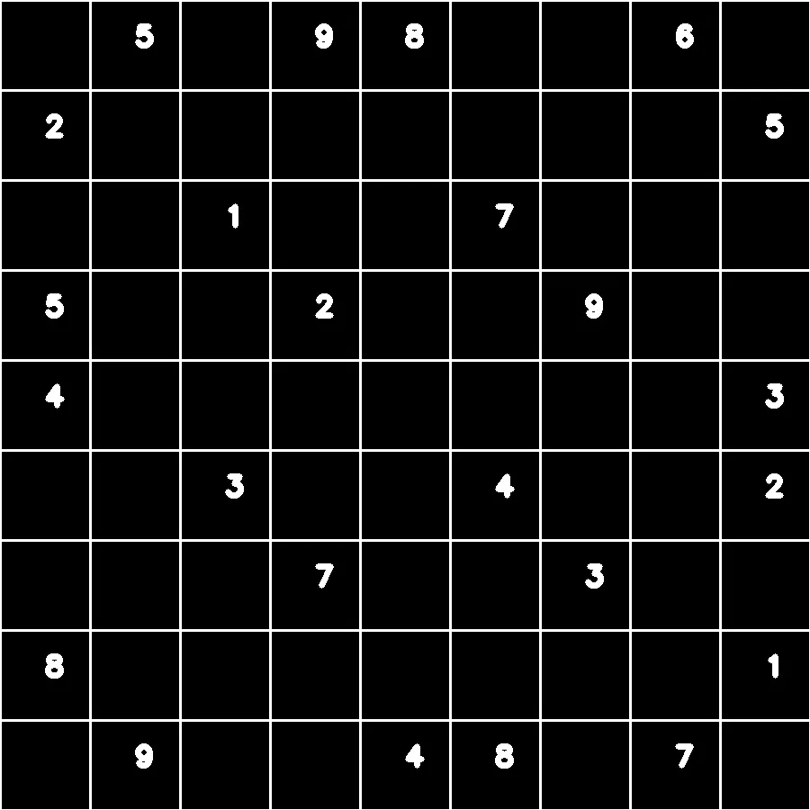
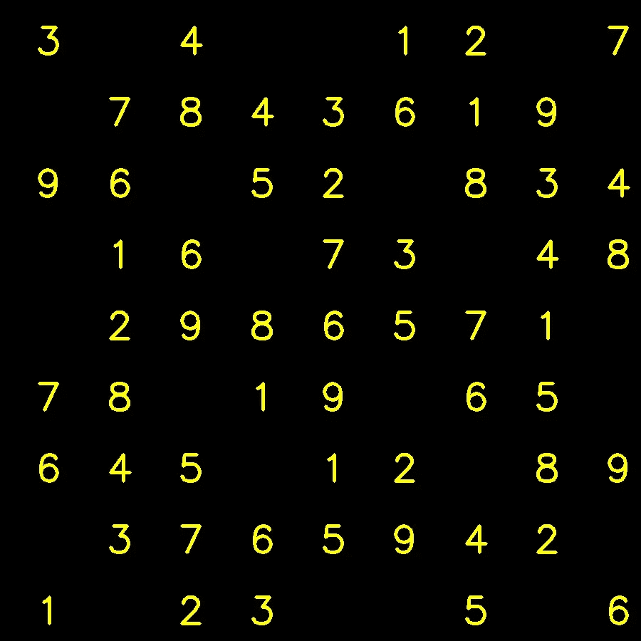
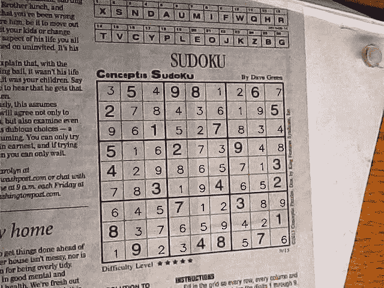

# Rust 支持的基于 Open-CV 的数独求解器

> 原文：<https://towardsdatascience.com/open-cv-based-sudoku-solver-powered-by-rust-df256653d5b3?source=collection_archive---------39----------------------->

## 一个基于图像的锈电池数独解算器



安特·罗泽茨基在 Unsplash[上的照片](https://unsplash.com/?utm_source=unsplash&utm_medium=referral&utm_content=creditCopyText)

# 项目动机

好吧，有一天浏览 Reddit，我发现了一个项目，是一个使用**视频视频流**的数独解算器。这个项目很酷，但有一点我不喜欢:它用来裁剪数独图像，并给出一个已解决的数独图像解决方案。

所以我想为什么不把解决方案投射回原始图像，让它看起来像是在原始图像中解决的？

很酷吧？！

# 关于项目

> 该项目很简单，采取数独图像，解决它，并投射回原始图像的解决方案，仅此而已！！

嗯，这是我最初的计划，但执行是另一回事。

简要项目技术描述:

*   获取图像中的数独块— **Python OPEN CV**
*   裁剪数独图像并改变视角— **Python OPEN CV**
*   以某种有序的方式提取数字— **Python KNN 模型**
*   使用 Rust Sudoku Solver 求解数独—
*   **将解决方案投影回原始图像— **Python OPEN CV****

**我们可以用 python 来解决数独，但出于某种原因，我想尝试给 python 添加 Rust，它解决数独的速度也比 Python 快。**

**如果你觉得有趣，那就开始吧！！**

# **裁剪和变化视角**

**在这一部分之后，我们将把完整的图像转换成裁剪过的数独图像。**

****

**初始图像:**

**好的，基本逻辑是**

1.  **得到图像中最大的盒子，因为它将是*最*T21【大概】T22**数独**盒子。**
2.  **接下来是*沿着数独盒边缘画出线条*。**
3.  **找出这些线的交点。**
4.  **使用交叉点改变图像的视角，得到*裁剪的数独。***

**好了，让我们一步一步来看！**

# **获得最大的盒子:**

**让我们来理解代码！**

**首先，轮廓基本上是任意的**闭合形状****

**我们将使用 **opencv** 库，步骤是:**

*   **将图像转换为**灰色****
*   **使用**自适应阈值**将图像的每个像素转换为黑色或纯白色。**
*   **Opencv 有一个函数`findContours`它返回轮廓( ***闭合形状*** )**
*   **遍历每个轮廓并获得最大面积轮廓。**

**在这之后，我们将拥有最大的轮廓，很可能是数独盒子。**

**由于这只是给出了形状的轮廓，我们不能用它来得到数独盒，我们需要四个角点来改变视角。**

**因此，我们将首先在空白图像上绘制该轮廓，然后在该形状上绘制直线，这将为我们提供四条线，稍后将用于获得四个角点。**

**在这之后，我们将沿着数独游戏的边绘制线条，但事实是，沿着一条边有多条线条，因为`Houghlines`使用大致的线内点来绘制线条，并且由于我们的图像不是非常清晰，也不是正确的透视，因此我们得到的是沿着一条边的多条线条。**

**因此，我们要做的是，我们将消除所有相互靠近的线，但留下一条线，因此我们将剩下 4 条线用于 4 条边。**

**所以现在我们有 4 条线，剩下的就是得到这些线的交点。**

**因为我们的线不平行，所以我们将得到 6 个交点。为了解决这个问题，我们将使用线条的斜率，我们将线条分为两类，**水平**和**垂直**。这样我们只能得到 4 分。**

****注**:线条不是横的竖的，只是两类。**

```
for (rho,theta) in createhor:
        for (rho1,theta1) in createver:
            if (rho,theta)!=(rho1,theta1):
                a=[[np.cos(theta),np.sin(theta)],[np.cos(theta1),np.sin(theta1)]]
                b=[rho,rho1]
                cor=np.linalg.solve(a,b)
                if list(cor) not in points:
                    points.append(list(cor))
```

**现在我们有 4 个角点，是时候施展魔法，得到数独图像了。**

**没什么特别的，我们将使用`warpPerspective`来改变视角并得到图像。**

**最终输出:**

****

# **从数独图像中提取数字**

**这一部分将集中在从数独图像中提取数字。**

**所以首先是一些腐蚀和扩张，以消除噪音。**

**下一步是得到数字的轮廓，并在一个新的空白图像上绘制。之后就是画分割线了。**

**在这之后，我们会得到**

****

> **一个干净的数独图像，没有噪音。**

**接下来很简单，只需遍历每个框并预测数字。第一种方法失败了*非常非常悲惨*是使用 **CNN** 模型并训练它预测数字。但出于某种原因，不管输入是什么，它都只能预测 6。**

**经过一些试验后，我开始使用 KNN 的型号。**

**第*个*个*问题*是创建数据集，尝试过 **kaggle** 但是显然没有简单普通数字的数据集。所以我创建了一个脚本，首先在图像上写数字，添加一些噪声和模糊 T21 使它更真实，然后裁剪它。**

**然后我用了另一个好的库`Augmentor`。它使用当前的图像，并添加随机的倾斜、旋转、T2 等。因此，我得到的是每个数字 10k 的图像。**相当酷！！**至少对我来说，在做完那件*杰作*之后，我无法入睡。好了，在我们考虑完这个问题之后，让我们开始训练这个模型。**

**接下来很简单，只需使用这个模型来预测数字，并创建一个数独的新图像。**

**经历了这一切之后，我们拥有的是:**

****

# **解决数独**

**我们将在本节中使用 *Rust* 解决数独。**

**在我们的最后一节之后，我们有了数独图像中的数字，剩下的是用 rust 编写一个数独解算器，谢天谢地我们可以把它导出到一个可以用 python 导入的库中。**

**有一个库 **sudoku** 提供了一个很好的 sudoku 解算器，所以我用它创建了一个函数，并编写了 *Python 绑定*来导入到 Python 中，另一个杰作 moment lol。**

**在此之后，解决数独和创建一个解决方案的面具是左。**

**最终的解决方案是这样的。**

****

**太好了！！让我们进入下一部分。**

# **将解决方案投影到原始图像**

**最后一部分，它将专注于将解决方案投射到原始图像上。**

**一旦我们将解决方案映射到黑色图像上，只需执行*位非*位非*位和*位就足以移除图像的黑色部分，而且由于我们有了初始点，改变回透视也很容易**

```
M = cv2.getPerspectiveTransform(pts2,pts1)

    img = cv2.warpPerspective(sudoku_image,M,(original.shape[1],original.shape[0]))
    img = cv2.bitwise_not(img)
    img = cv2.bitwise_and(img,original)
```

**仅此而已！！最终的图像是**

****

# **源代码**

**您可以在找到完整的源代码！！**

**[](https://github.com/pr4k/sudoku-solver) [## pr4k/数独求解器

### 所以我的目标是创建一个项目来解决数独难题，只是使用它的图像，并增加解决方案…

github.com](https://github.com/pr4k/sudoku-solver) 

感谢阅读！！**