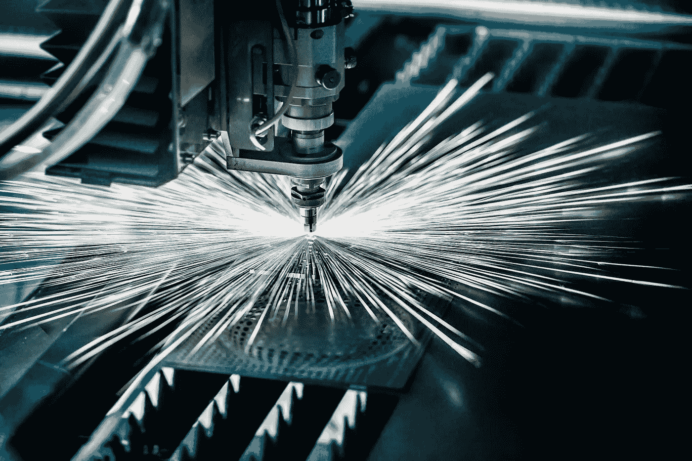

# 面向工业人工智能的开放数据源

> 原文：<https://towardsdatascience.com/open-data-sources-for-industrial-ai-b58cef3ffd0d?source=collection_archive---------25----------------------->

## 将人工智能应用于制造过程

由[安德烈·阿米亚戈夫](https://www.shutterstock.com/g/armyagov)乘坐[穿梭者](https://www.shutterstock.com/image/309013577)

当启动一个新项目来用人工智能增强生产设施的能力时，常见的问题是:“这可行吗？”工业背景下的人工智能需要大量数据来训练底层算法。运行中的系统正在生成数据。但是这些数据通常是封装的，或者数据库没有连接。他们可能无法用于将人工智能引入公司的团队，因为公司自己的数据无法用于构建这样的系统。由于时间和预算的限制，开发团队面临着如何获得训练数据的问题。

# 为什么数据源对于人工智能入门至关重要

预测系统、全自动系统和知识发现系统需要正确训练数据。数据质量定义了人工智能系统提供的操作结果。如果你没有足够的有用数据，你的训练结果往往表现不佳。因此，人工智能无法构建所需的抽象，因此，它无法创建一个提供出色结果的人工智能系统。尽管有一些强化学习方法不需要大量数据，但一般的监督深度学习人工智能需要大量的标记数据。

# 从培训到操作的数据流程

当在工业背景下启动一个 AI 项目时，你需要考虑构建一个可用的 AI 的一般工作流程。第一步，您需要访问相关的历史数据，这些数据可能是包含所需信息的文件或数据库。在数据科学领域，第一步中可用的完整数据集合被称为数据湖。这个数据湖包含非结构化和结构化数据。通常，数据湖中的数据格式是原始格式。这意味着从不同来源进入湖泊的数据没有预处理。从相关传感器或历史记录中检索数据集合。这些数据不仅是测量数据，也是来自图像、视频或音频等来源的数据。

在下一步中，在预处理步骤中处理数据。这里看的是数据。它们是可视化的，因此主题专家可以评估数据的质量。然后它们可以被清理和减少，因此原始数据被转换成更有意义的数据。

这些数据是开发预测模型的基础。机器学习算法通常用于从数据中学习。例如，数据科学家可能会选择神经网络模型，这些模型应该在学习新的未知数据后进行验证，并检查训练。培训阶段包括多轮反馈，以查看培训结果是否符合需求。

**机器学习在工业应用中的工作流程**

最后，现成的人工智能组件应该在企业范围内集成。这种整合是双重的。一方面，有边缘人工智能与嵌入式设备和硬件解决方案，伴随着现场的机器。另一方面，以软件组件的形式集成到企业系统中。这些软件模块应该被修改以适应现有的操作。

由 [nostal6ie](https://www.shutterstock.com/g/nostal6ie) 上 [Shutterstock](https://www.shutterstock.com/image-photo/equipment-cables-piping-found-inside-modern-200710937)

# 问题不是数据太少，而是太多

但是去哪里找这些数据来训练你的神经网络呢？由于数据似乎是当今世界的新石油，您可能会发现自己企业之外的数据源很棘手。工业公司为自己保留他们的价值和数据。然而，也有其他行业，尤其是 IT 公司，经历了为自己保留数据和源代码的相同阶段。甚至有一小部分公司仍在这样做。但是最近几年，开源方法取得了难以想象的成功。甚至像微软这样非常专有的公司也在开发开源软件。分享创造了新的商业机会，并为整个行业增加了价值。因此，行业协会和财团开始倡议共享数据。免费开放数据的另一个来源是公共资助的活动和研究。像 NASA 或 CERN 这样的组织提供了大量有价值的数据。这些数据集用于一般任务和新算法的测试。它们是算法开发的基准。当你在互联网上搜索数据时，你会被大量的可用数据所淹没。

但是伴随着这些海量数据而来的是一个问题。人工智能是一个热门话题，每个人都渴望得到关注。因此，通常很难决定哪些开放数据适合您的项目。有许多非结构化的提议，数据质量差，或只有弱描述的数据集可用。人工智能被用于如此多的不同领域，用于如此多的不同用例，以至于有很多数据集不适合你的需求。

# 工业人工智能的相关开放数据源

当你查看应用工业人工智能的类别时，你会发现你可以将人工智能添加到你的许多产品和服务中。通过这种方式，你可以改善客户的体验。例如，对于制造工具，自我诊断的机器将提高操作设备的整体性能。它提高了机器的效率、可靠性和安全性，并延长了机器的寿命。他们在工具提示上看到自己的磨损迹象，如钻头、锯条、焊接工具或夹子。

您需要数据的第二个应用是自动化。趋势研究者称之为超自动化。它有助于已经存在的工业过程自动化获得另一个推动。它使人变得过时，使变化变得微不足道。在这里，来自自动驾驶和智能机器人标准的数据被用来为工业自动驾驶车辆和机器提供个体培训。

人工智能应用的第三个领域是工程系统的知识发现。这里的目标是在 AI 的帮助下找到问题的根源，消除风险。许多关键区域通过传感器和日志提供大量数据。在这里，人工智能可以创造超越异常检测和简单故障模式感测的真正洞察力。人工智能可以预测不可预料的事情。它发现过去类似事件和当前传感器读数之间的关系。这有助于防患于未然。

# 需要什么数据？

有了这些给定的应用领域，你可以搜索公开可用的相关数据。由于许多工业应用需要大量的传感器数据，这些数据并不总是可以直接下载。有时，您需要通过给定的 API 访问数据。这个 API 创建一个到现有数据库的连接，并允许您提取和分析它们。

可用传感器数据的一个例子是由 [NASA](https://ti.arc.nasa.gov/tech/dash/groups/pcoe/prognostic-data-repository/) 提供的**涡轮风扇发动机**预测维护数据集。它具有来自 100 个相同型号发动机的传感器数据。该数据集包括使用 [C-MAPSS](https://data.nasa.gov/dataset/C-MAPSS-Aircraft-Engine-Simulator-Data/xaut-bemq) 飞机发动机模拟器的四组不同的发动机数据。发动机在不同的操作条件和故障模式下进行测试。

由[东成](https://www.shutterstock.com/g/olsuse)上[梭托](https://www.shutterstock.com/image-photo/metalic-blue-airplane-engine-vortex-turbofan-162866120)

这些涡轮风扇发动机数据来源于美国宇航局卓越预测中心。这个美国宇航局部门甚至[有更多公开的数据集](https://ti.arc.nasa.gov/tech/dash/groups/pcoe/prognostic-data-repository/)可用。它以来自各种大学、机构或公司的数据集为特色。这些时间序列数据有助于创建预测算法。它们显示了从某种名义状态到失败状态的转变。包括了许多不同的工业任务。你会发现铣削数据和轴承测试。你会找到电子产品和电池的数据。

从英国可以获得更自由和公开的存储库。位于 NDR 的**英国石油和天然气国家数据库**提供 [130 万亿字节的海上数据](https://www.offshoreenergytoday.com/uk-oga-launches-130-terabytes-of-offshore-data-in-push-to-unlock-20-billion-barrels-of-oil-gas/)。它覆盖了 12，500 多个井眼、5，000 次地震勘测和 3，000 条管道。这些数据对每个人都是免费的。但是 NRD 并不是英国独有的。这些类型的国家数据仓库在许多国家都有，并提供开放的数据和开放的政府方式。

来自政府的有价值的数据不仅限于石油和天然气行业。英国地质调查局也提供了大量的数据集。它提供全英国 100 多个地震仪站的实时地震图和历史数据。超过 525 个不同地质主题的数据集。

# 开放数据的主要搜索引擎

为你的人工智能项目寻找开放数据源的最佳方式是特定的搜索引擎、目录和聚合器。在这些工具的帮助下，你将能够快速找到一个合适的数据集。他们将在可用的开放数据源的丛林中进行引导。就像传统的搜索引擎一样，你可以输入你要找的东西，搜索引擎会向你展示有趣的数据集。

谷歌数据集搜索、【datasetsearch.research.google.com】和[给了现有的免费数据集一个令人印象深刻的概述。一旦你完成了你的搜索，搜索结果不仅会给你一个到知识库的链接。它还为您提供了有关所提供的数据格式和数据访问方式的直接信息。这个](https://datasetsearch.research.google.com)[新发布的工具](https://www.predictiveanalyticsworld.com/machinelearningtimes/google-just-published-25-million-free-datasets/10875/)拥有大约 2500 万个公开可用的数据集。

研究数据存储库、[re3data.org](https://www.re3data.org/)的**注册表提供了对其链接存储库的全面的基于文本的搜索。它在“按主题搜索”下有一个很好的图形探索工具，可以找到公开的数据。但是对于工程科学来说，结果很少。此外，这个搜索引擎不会直接引导你找到数据。它只是将您发送到继续搜索的存储库。**

最重要的是，值得看看著名的 [Kaggle](https://www.kaggle.com/datasets) 平台，因为它不时举办与行业相关的比赛。还有一个新的平台，叫做[出土](https://unearthed.solutions/)，致力于解决工业 4.0 概念背景下的数据科学挑战。

有了这些起点，您将快速找到正确的开放数据。开放数据帮助您直接启动您的工业人工智能项目，您不必等待您的运营传感器和企业设置被改造。

本文最初发表于 [AiThority](https://www.aithority.com/guest-authors/open-data-sources-for-ai-in-industry/) 。