# 开源 CityGML 3D 语义建筑模型

> 原文：<https://towardsdatascience.com/open-source-3d-semantical-building-models-in-2020-f47c91f6cd97?source=collection_archive---------13----------------------->

## 开源 3D 城市模型的完整列表

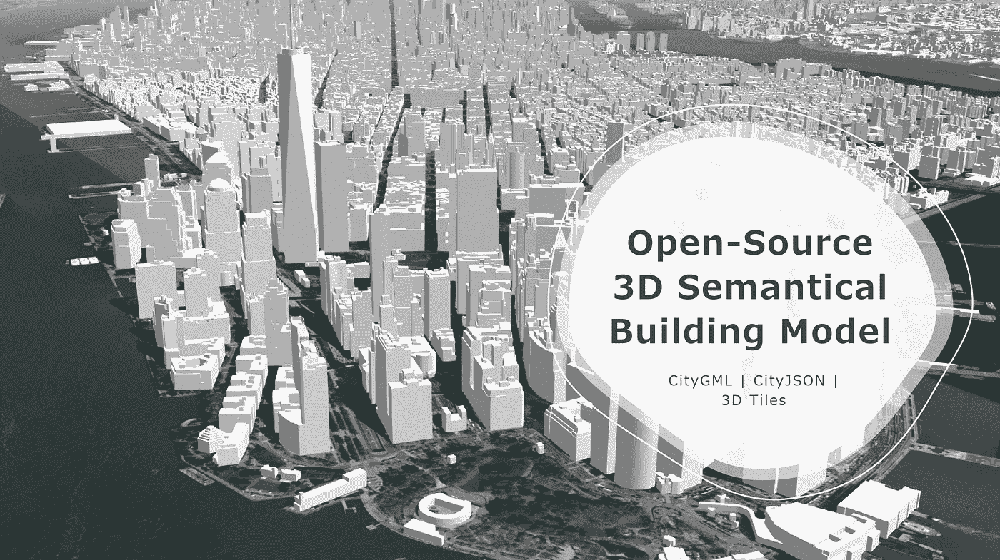

在 CesiumJS 框架中可视化的 3D Tiles 格式的纽约市 3D 城市模型。(作者)

** 2021 年 1 月更新*

## 为什么是语义模型？

在最近的地理数据科学项目中，语义三维城市模型或高级分析和可视化任务越来越多地用于各种应用领域，如城市规划、室内/室外行人导航、环境模拟、文化遗产或设施管理[1]。

最流行的数据模式之一是 OGC 城市 GML。CityGML 是用于描述 3D 地理空间化城市模型的全球数据模型模式；由 OGC(开放地理空间联盟)开发。CityGML 描述了城市对象，如建筑物、道路、桥梁、树木等。在三维地理空间中。CityGML 城市对象数据属性类包括语义、几何、拓扑和外观。CityGML 是一个开放的国际共识标准，经过了超过 15 年的合作开发和使用[2]。

## 示例使用案例:环境建筑能源模拟/分析

例如，基于 CityGML 的语义 3D 建筑模型可用于模拟其全年的供热能源需求。下图显示了我们位于 HFT 斯图加特的研究实验室分别在鹿特丹市、德国路德维希堡和美国布鲁克林计算能源需求的仪表板结果。

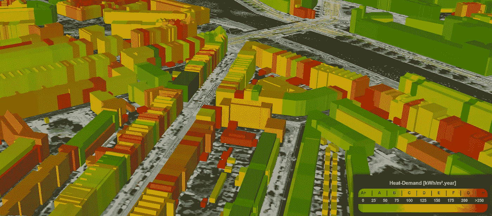

**根据 CityGML 模型计算鹿特丹建筑的热需求。**(作者开发并截图)

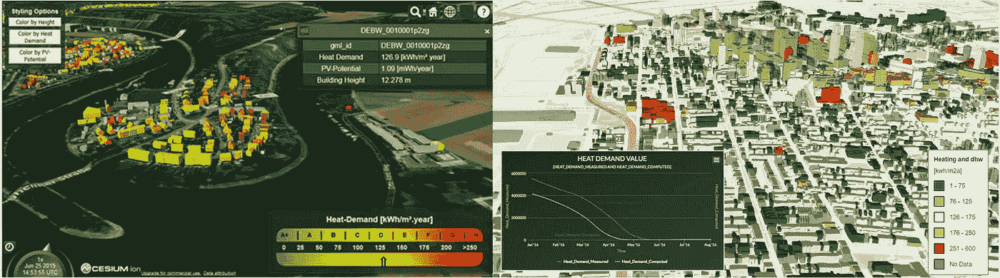

**德国路德维希堡(左)和美国布鲁克林(右)城市能源数据的网络 3D 可视化【5】**(由作者开发并截图)

## 开源 3D 语义建筑模型

世界上越来越多的城市为研究人员和开发者提供了他们的 3D 城市模型。然而，你们中的一些人可能不知道这个现有的有价值的数据来源！

本文包括我所知道的可用的官方开源 3D 语义数据模型的列表。

# 美利坚合众国

## 纽约市(在 LoD2 中)

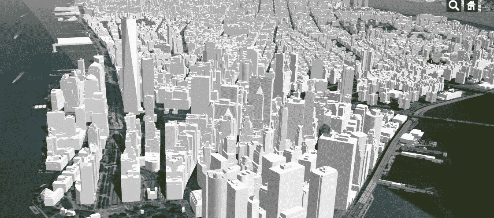

**在 CesiumJS 框架中可视化的 3D Tiles 格式的纽约市 3D 城市模型。**(作者开发并截屏)

纽约市的三维建筑体量模型被开发成一个混合规格的组合元素。它包含屋顶、立面和地平面等属性。所有主要屋顶结构都已建模。模拟倾斜屋顶；然而，圆顶和圆形屋顶不是。不包括所有屋顶附属物，包括但不限于烟囱、女儿墙、主轴和天线。此外，纽约市“标志性”建筑的子集被建模为 LOD 2。详情请访问 [**元数据**](https://github.com/CityOfNewYork/nyc-geo-metadata/blob/master/Metadata/Metadata_3DBuildingModel.md) 页面【3】。

*   【nyc.gov】city GML:[下载](http://maps.nyc.gov/download/3dmodel/DA_WISE_GML.zip)
*   **多面体* : [下载](http://maps.nyc.gov/download/3dmodel/DA_WISE_Multipatch.zip) *(来自 nyc.gov)**
*   **:[下载](http://maps.nyc.gov/download/3dmodel/DA_Wise_DGN.zip) *(来自 nyc.gov)***
*   ***3D 磁贴* : [下载](https://drive.google.com/file/d/1vpSk0KcWbdVSFo47y8qKoS9n6lmbF5rq/view?usp=sharing) *(使用 FME 由 CityGML 转换而来，仅限曼哈顿地区，分享自我的 Google Drive)***

## **美国的所有建筑(LoD1)**

**开放城市模型为美国的所有建筑提供了一个开放的 3D 城市模型数据集。它为美国的每座建筑提供 3D 几何图形；包含大约 1.25 亿栋建筑。**

*   ***CityGML，CityJSON* : [下载](https://github.com/opencitymodel/opencitymodel) ( *来自开放城市模型 Github【2】*)**

# **加拿大**

## **蒙特利尔(在 LoD2)**

**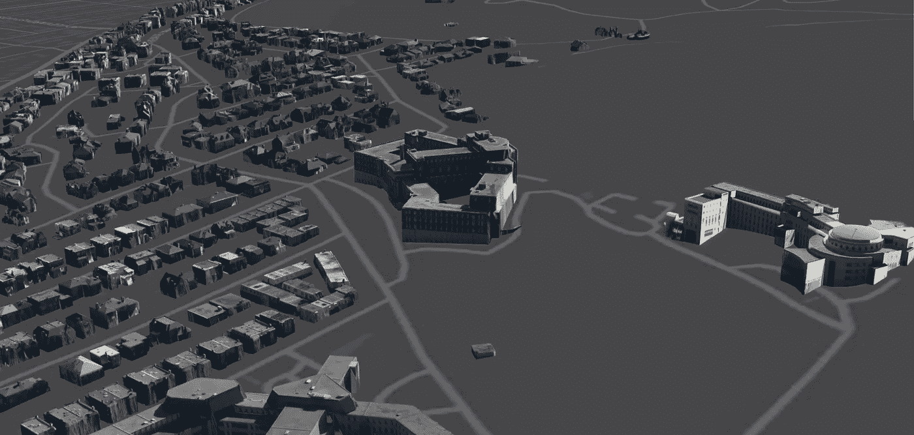**

****在 ArcGIS for JavaScript 应用程序框架中可视化的 i3s 格式的蒙特利尔 3D 城市模型。**(作者开发并截屏)**

**蒙特利尔市已经提供了具有 CityGML 和一些蒙特利尔自治市的 3DM 格式的纹理的 LOD2 3D 建筑物的数字模型。在上面的示例中，我使用 FME 工作台将 CityGML 转换为 i3s 文件格式，然后使用 ArcGIS for JavaScript 可视化模型**

*   **city GML | 3DM:[http://donnes . ville . Montreal . QC . ca/dataset/maquette-numerique-plateau-mont-royal-bati ments-LOD 2-avec-textures](http://donnees.ville.montreal.qc.ca/dataset/maquette-numerique-plateau-mont-royal-batiments-lod2-avec-textures)**

# **瑞士**

## **苏黎世(在 LoD 1 和 2 中)**

**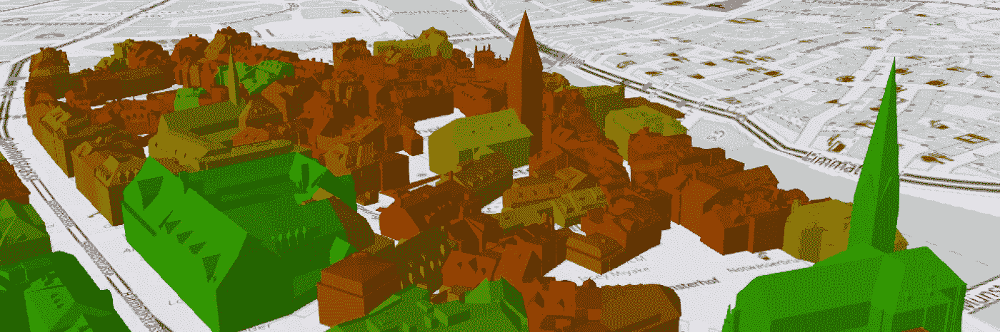**

*   **CityGML: [下载入口](https://data.stadt-zuerich.ch/dataset?q=&tags=3d-stadtmodell)(来自施塔特苏黎世开放数据)**
*   **CityJSON: [下载](https://3d.bk.tudelft.nl/opendata/cityjson/1.0/Zurich_Building_LoD2_V10.json)(来自 TUDelft)**

# **荷兰**

**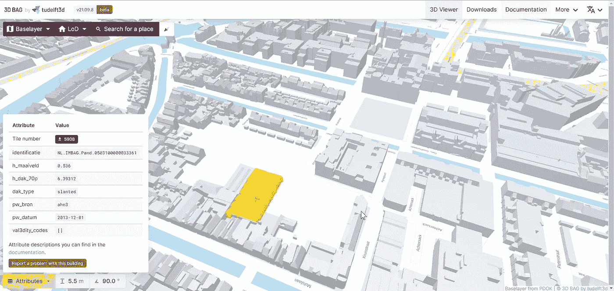**

**您可以从 3D 包项目[下载门户](https://3dbag.nl/en/download)下载整个荷兰的原始 3D 建筑模型数据，包括几何图形和属性。**

# **芬兰**

## **埃斯波**

**Espoo 的城市信息模型涵盖了 CityGML 标准中包含和定义的所有对象类型，但工程结构(桥梁和隧道)除外。**

*   **WFS 服务/ CityGML: [下载门户](https://kartat.espoo.fi/3d/services_en.html)(埃斯波市)**

## **赫尔辛基**

**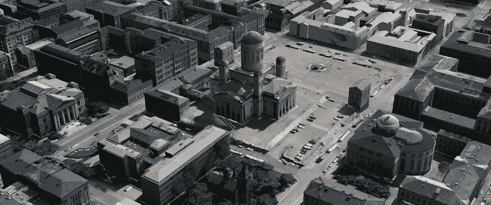**

****赫尔辛基的 3D 城市模型，在 CesiumJS wen 应用程序中以 3D Tiles 格式显示。**(作者开发并截屏)**

**赫尔辛基有两种下一代 3D 城市模型:语义城市信息模型和视觉上高质量的现实网格模型。您可以在[http://kartta.hel.fi/3d/](http://kartta.hel.fi/3d/)查看 3D 城市模型并下载其信息。你可以在这里找到更多信息[https://www . hel . fi/Helsinki/en/administration/information/general/3d/](https://www.hel.fi/helsinki/en/administration/information/general/3d/)。**

*   **CityGML: [下载](http://3d.hel.ninja/data/citygml/)(赫尔辛基市)**

# **德国**

## **北莱茵-威斯特伐利亚州(在 LoD 1 和 2 中)**

**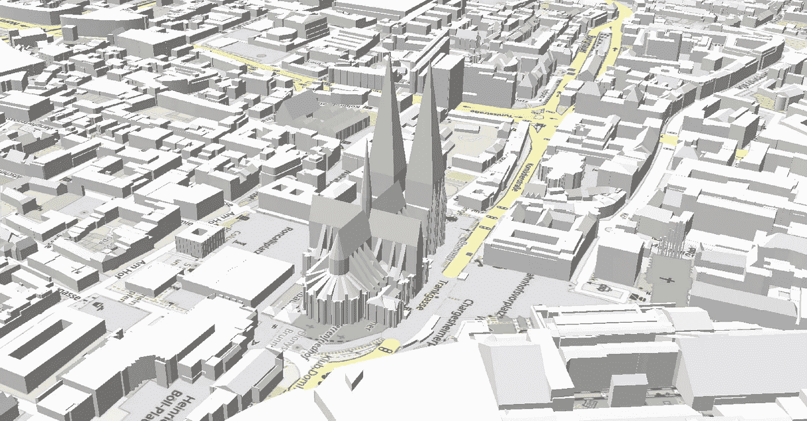**

****科隆市的 3D 城市模型，在 CesiumJS 框架中以 3D Tiles 格式可视化。**(作者开发并截屏)**

**北莱茵-威斯特法伦州位于德国西部，面积超过 34000 平方公里，是德国第四大州。可以按本州城市下载开源的 3D 城市模型(**多特蒙德、杜塞尔多夫、科隆、波恩、埃森**等)。).**

*   **CityGML: [下载入口](https://www.opengeodata.nrw.de/produkte/geobasis/3dg/)**

## **汉堡(在 LoD 1 和 2 中)**

**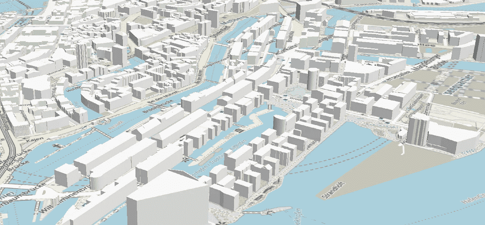**

****汉堡市的 3D 城市模型，在 CesiumJS 框架中以 3D Tiles 格式可视化。**(作者开发并截屏)**

**汉堡的 3D 城市模型有 LoD 1 和 LoD 2 两种版本。**

*   **CityGML: [下载入口](https://suche.transparenz.hamburg.de/dataset/3d-stadtmodell-lod2-de-hamburg2)**

## **柏林(带纹理的 LoD 2)**

**自 2009 年以来，柏林商业定位中心已经成功地将 3D 城市模型用于柏林商业定位的虚拟展示。直到 2018 年，来自柏林的面向对象的 LoD2 模型被用于 3D 演示，自 2019 年以来，3D 网格模型被自动从航班中导出。下面的示例截图是在 3D 环境中探索这些模型的示例可视化平台。**

****

****在 VirtualCitySystems 框架中可视化的 3D Tiles 格式的汉堡 3D 城市模型(****)。****

*   **CityGML: [下载入口](https://www.businesslocationcenter.de/en/economic-atlas/download-portal/)**

# **新加坡**

**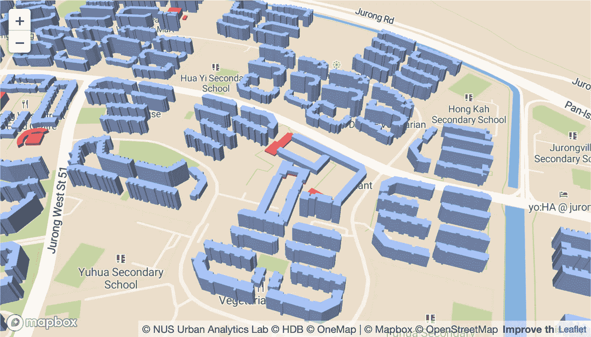**

****在 Mapbox 框架上可视化的新加坡 3D 城市模型**【4】。**

**自 2019 年以来，新加坡所有公共住房(HDB)建筑的开放 3D 城市模型现已可用，并附有关于该模型如何生成的开源代码。新加坡国立大学的[城市分析实验室](https://ual.sg/)用两个数据集生成了这个模型，分别是来自 OpenStreetMap 的 [2D 建筑足迹](https://www.openstreetmap.org/#map=12/1.3649/103.8229)和 [HDB 房产信息](https://data.gov.sg/dataset/hdb-property-information)。**

*   **CityJSON: [下载](https://github.com/ualsg/hdb3d-data) ( *来自*新加坡公屋(HDB)建筑 3D 城市模型 *Github***

# **结论**

**本文以 OGC 城市 GML 模式为例，简要概述了语义三维城市模型，并给出了三维地理数据科学中的一些用例。此外，它还提供了全球可用的最新 3D 城市模型列表。我希望你喜欢这篇文章，并发现它对你的日常工作或项目有用。如果您有任何问题或意见，请随时给我留言。**

**关于我&查看我所有的博客内容:[链接](https://joets.medium.com/about-me-table-of-content-bc775e4f9dde)**

**安全**健康**健康！💪**

**感谢您的阅读。📚**

# **参考**

**[1]格哈德·格罗格；卢茨·普吕默(2012 年):**city GML——对 3D 城市模型的互操作访问**[https://doi.org/10.1016/j.isprsjprs.2012.04.004](https://doi.org/10.1016/j.isprsjprs.2012.04.004)**

**[2]开放城市模型(2020 年):**美国开放城市 gml 数据**https://github.com/opencitymodel/opencitymodel T2**

**[3]纽约市(2020 年):**纽约市 3d 建筑模型**[https://www1 . NYC . gov/site/doit/initiatives/3d-Building . page](https://www1.nyc.gov/site/doitt/initiatives/3d-building.page)**

**[4] Biljecki，F. (2020): **探索东南亚的开放数据以生成 3D 建筑模型**，ISPRS Ann。摄影镜头。遥感空间信息。Sci。，VI-4/W1–2020，37–44，[https://doi.org/10.5194/isprs-annals-VI-4-W1-2020-37-2020](https://doi.org/10.5194/isprs-annals-VI-4-W1-2020-37-2020,)。**

**[5] Würstle，p .，Santhanavanich，t .，Padsala，r .，& Coors，V. (2020 年)。**使用 3D 城市模型的城市能源仪表板概念**。第十一届 ACM 未来能源系统国际会议论文集。提交于 e-Energy '20:第十一届 ACM 未来能源系统国际会议。[https://doi.org/10.1145/3396851.3402650](https://doi.org/10.1145/3396851.3402650)**