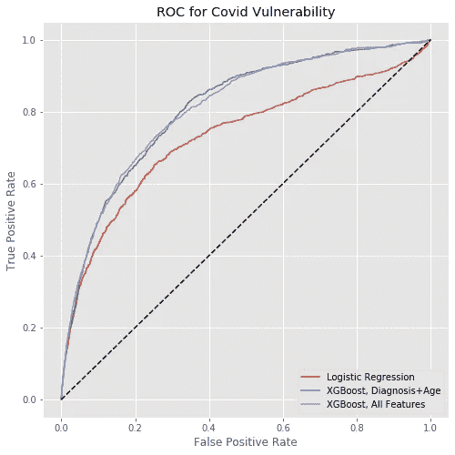

# 开源数据科学抗击新冠肺炎(冠状病毒)

> 原文：<https://towardsdatascience.com/open-source-data-science-to-fight-covid-19-corona-virus-95bf4ebcb52c?source=collection_archive---------26----------------------->

## 建立模型来找出最脆弱的。

随着新冠肺炎在我们生活中变得越来越自信，医疗数据科学界有机会在缓解这种新兴疫情方面发挥重要作用。[历史表明](https://www.history.com/news/spanish-flu-pandemic-response-cities)对此类疾病的反应可以极大地改变此类疾病的最坏影响。许多城市实施了社会距离措施，关闭了任何有大量人群聚集的地方，还可以采取进一步措施来帮助隔离和保护人口中最脆弱的群体。为了做到这一点，我们必须首先确定谁面临的风险最大，这促使我的团队创建了一个开源项目，即[新冠肺炎脆弱性指数](https://github.com/closedloop-ai/cv19index)。

CV19 指数是一个开源的、基于人工智能的预测模型，可以识别出那些很可能对新冠肺炎严重并发症具有高度脆弱性的人。CV19 指数旨在帮助医院、联邦/州/地方公共卫生机构和其他医疗保健组织识别、计划、应对和减少新冠肺炎对其社区的影响。在本帖中，我们将回顾这个开源项目的高级细节。有关数据选择和模型构建的更详细描述，请参见我们的[白皮书](https://arxiv.org/abs/2003.07347)。

**第一步——制作带标签的数据集**

尚不存在新冠肺炎住院治疗的数据。当数据开始出现时，我们可以查看作为真实事件代理的受影响人群和事件。鉴于这种疾病最糟糕的结果集中在老年人身上，我们可以关注医疗保险账单数据。我们可以预测替代医疗事件，特别是由于呼吸道感染导致的住院，而不是预测新冠肺炎住院。例子包括肺炎、流感和急性支气管炎。我们通过解析医疗账单数据和搜索描述这些事件类型的特定 ICD-10 代码来识别这些标签。所有的预测都是在特定的一天做出的。从某一天开始，我们回顾过去 15 个月的特征。由于医疗索赔数据报告的滞后，我们排除了预测日期后三个月内发生的任何事件。去年的任何诊断都会成为我们在所有模型中使用的特征。

**第二步—模型**

这类项目需要考虑大量的模型。最终，我们希望这些模型能够在尽可能有效和医疗数据科学家能够尽快访问之间取得平衡。选择我们使用的数据的原因之一是因为医疗保健数据科学家可以广泛获得医疗保险索赔数据。如果您的组织可以访问额外的数据源，您可以通过合并这些信息来观察性能的提高。权衡这些因素后，我们根据采用的难易程度和模型的有效性创建了 3 个模型。

第一种是使用少量特征的逻辑回归模型。在 ClosedLoop，我们使用标准的 Python 数据科学堆栈。一个非常简单的模型的动机是，它可以移植到像 R 或 SAS 这样的环境中，而不必读写一行 python。在低警报率下，该模型的性能接近更复杂版本的模型。前面提到的白皮书包含了有限特性集的所有权重，因此可以手工移植。

比较所有三种模型性能的 ROC 图。

接下来的两个模型都是使用 XGBoost 制作的。 [XGBoost 始终为对结构良好的数据进行预测提供最佳性能](https://www.kaggle.com/general/25913),只要进行正确的数据转换，医疗账单数据就具有这种结构。第一个 XGBoost 模型出现在我们的开源包中。这个模型有一个简化版本，所以您只需要构建一个数据转换管道，将您的账单数据转换成 repo 中指定的格式。如果您可以构建一个函数来解析特定代码的数据，那么您可以简单地遍历所有代码。这就是我们为开源模型选择有限特性集的原因。这非常有效，同时从数据管道的角度来看，仍然只需要合理的提升水平。我们还让医疗机构能够在平台内访问我们的模型。这个版本的模型使用完整的诊断历史，加上大量的工程特征。请注意，ROC 曲线显示，开源版本与我们平台中包含的版本具有几乎相同的性能。

**结论**

全世界都在参与反对这个疫情的斗争。医疗保健数据科学界可以对抗击这种疾病产生重大影响。已经有很多优秀的努力使用数据可视化和蒙特卡洛模拟来帮助对抗疫情的传播。我们认为，我们的模型解决了健康政策的一个补充性的重要方面，确定了那些风险最大的人群。通过将这些努力和医疗保健技术领域的许多其他优秀努力结合起来，我们希望减轻这种可怕疾病的影响。

如果阅读这篇文章让你有了贡献的想法，我们鼓励你分享我们的知识库。如果你在医疗保健数据科学社区，请使用该工具，如果你想联系，请随时前往 https://closedloop.ai/cv19index[了解更多信息。](https://closedloop.ai/cv19index/)

*原载于 2020 年 3 月 17 日*[*https://closed loop . ai*](https://closedloop.ai/open-source-data-science-to-fight-covid-19-corona-virus/)*。*